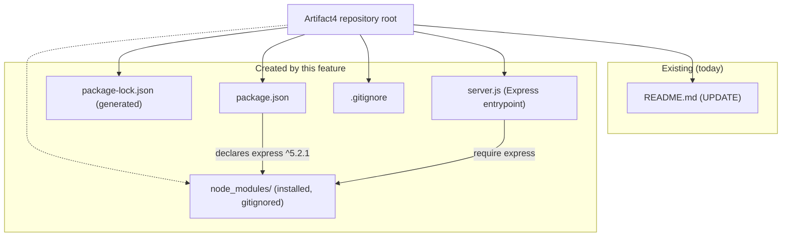
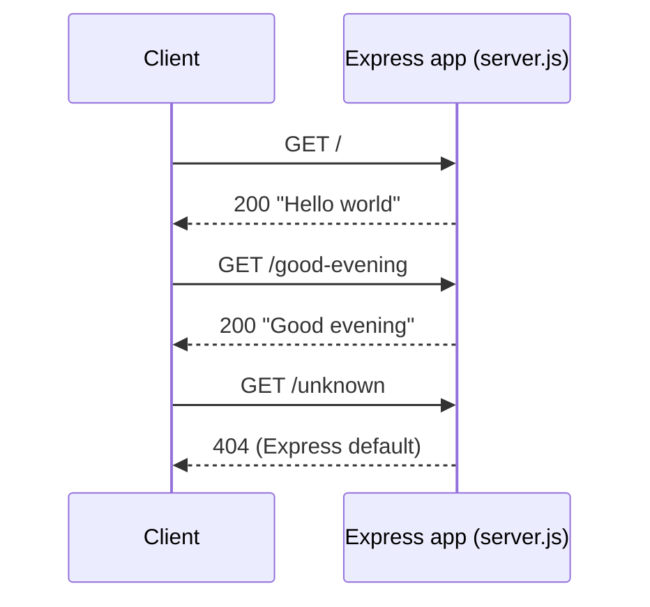

# Technical Specification

# 0. Agent Action Plan

## 0.1 Intent Clarification

### 0.1.1 Core Feature Objective

Based on the prompt, the Blitzy platform understands that the new feature requirement is to **introduce the Express.js web framework into the `Artifact4` project and expose a second HTTP `GET` endpoint that returns the plain-text response `Good evening`, while providing and preserving the baseline endpoint that returns `Hello world`**.

The user's request is preserved verbatim below for traceability:

> **User Example (exact):** "add feature to a existing product. this is a tutorial of node js server hosting one endpoint that returns the response 'Hello world'. Could you add expressjs into the project and add another endpoint that return the reponse of 'Good evening'?"

The request decomposes into the following feature requirements, restated with technical precision:

- **R1 — Framework Integration:** Add Express.js as a first-class runtime dependency of the project and implement the HTTP server on top of it.
- **R2 — Baseline Endpoint:** Provide an HTTP `GET` endpoint that responds with the exact body `Hello world` (the "existing" endpoint the user references).
- **R3 — New Endpoint:** Add an additional HTTP `GET` endpoint that responds with the exact body `Good evening`.

**Critical reconciliation — surfaced implicit requirement.** The prompt frames this as adding a feature to an *existing* Node.js "Hello world" server. Repository inspection contradicts that premise: the repository currently contains only `README.md` (11 bytes, the literal text `# Artifact4`) and Git metadata — there is no `package.json`, no server entrypoint, no route handler, and no `node_modules` directory [README.md:L1]. This is corroborated by the Technical Specification's authoritative baseline, which records exactly one tracked file and a single commit (`4b99931`, "Initial commit") [README.md:L1]. Therefore, the "existing Hello world server" must be **bootstrapped as an implicit prerequisite** before the new "Good evening" endpoint can be added. The Blitzy platform treats the creation of that baseline server (on Express, satisfying R2) as in-scope work implied by the request rather than a pre-existing artifact.

The table below maps each stated requirement to the Blitzy platform's clarified interpretation:

| Req | User's Words | Blitzy Platform's Clarified Interpretation |
|-----|--------------|--------------------------------------------|
| R1 | "add expressjs into the project" | Declare `express` in a new `package.json`, install it (generating `package-lock.json`), and build the server using the Express application object. |
| R2 | "one endpoint that returns the response 'Hello world'" | Register `GET /` returning the exact body `Hello world`. Because no server exists yet, this endpoint is **created**, not merely retained. |
| R3 | "add another endpoint that return the reponse of 'Good evening'" | Register a new `GET` route returning the exact body `Good evening`. |

**Feature dependencies and prerequisites:**

- A Node.js runtime — verified present in the environment as **v22.22.2** (Node 22 LTS line), which satisfies Express 5's engine requirement of `node >= 18`.
- A npm package manifest (`package.json`) — none exists today and must be created; this is the first dependency manifest in the repository.
- A server entrypoint module — none exists today and must be created.

### 0.1.2 Special Instructions and Constraints

- **Exact response strings (CRITICAL):** The response bodies must be exactly `Hello world` and `Good evening`. Casing, spacing, and punctuation are preserved verbatim; no greeting text is reworded.
- **Backward compatibility:** The `Hello world` behavior the user describes must remain reachable. It is mapped to `GET /` so the originally described single-endpoint behavior is preserved alongside the new endpoint.
- **Framework mandate:** The server must be implemented with **Express** (per "add expressjs into the project"), not Node's built-in `http` module. Because no prior `http`-based server exists, Express is adopted directly rather than migrated to.
- **Architectural conventions (greenfield):** No prior code, style guide, lockfile, or convention exists in the repository, so the Blitzy platform establishes minimal, idiomatic conventions: CommonJS module format (`require`), a single entrypoint file `server.js`, and a configurable listen port (`process.env.PORT || 3000`).
- **No user-supplied rules or attachments:** The rules set is empty and no attachments (PDFs, images, or Figma frames) were provided, so no additional mandated files, design system, or visual specifications constrain this work.
- **Web search requirements:** Research into the current Express version, idiomatic routing, and security posture was conducted and is documented in Section 0.2.2.

### 0.1.3 Technical Interpretation

These feature requirements translate to the following technical implementation strategy:

- **To add Express (R1),** we will **create** `package.json` declaring `"express": "^5.2.1"` in `dependencies`, a `start` script (`node server.js`), and an `engines.node` floor of `>=18`; running `npm install` then **creates** `package-lock.json` and populates `node_modules/`.
- **To provide the `Hello world` endpoint (R2),** we will **create** the entrypoint `server.js`, instantiate the Express application, and register `GET /` that responds with `Hello world`.
- **To add the `Good evening` endpoint (R3),** we will **register** a second route, `GET /good-evening`, on the same Express application that responds with `Good evening`, then start the HTTP listener via `app.listen(PORT)`.
- **To make the project runnable and reproducible,** we will **create** `.gitignore` (excluding `node_modules/`) and **update** `README.md` to document install/run steps and the endpoint catalog.

**Flagged ambiguity (requires no blocking clarification):** The user specified the *response* of the new endpoint (`Good evening`) but not its *URL path*. The Blitzy platform assumes `GET /good-evening`. This is a low-risk, easily adjustable assumption; if a different path is desired (for example `/evening`), only the single route string in `server.js` changes.

## 0.2 Repository Scope Discovery

### 0.2.1 Comprehensive File Analysis

A recursive filesystem inspection (including hidden files) and a complete Git index review confirm that the repository contains exactly one tracked, non-Git artifact today:

| Path | Type | Bytes | Current Content | Disposition for This Feature |
|------|------|-------|-----------------|------------------------------|
| `README.md` | File | 11 | Single H1 line `# Artifact4` [README.md:L1] | **UPDATE** — append install/run instructions and the endpoint catalog. |
| `.git/` | Git metadata | — | Single commit `4b99931` ("Initial commit") | Out of scope — internal metadata, never edited. |

No source files, manifests, lockfiles, configuration, or test artifacts of any kind exist (`*.js`, `*.ts`, `*.json`, `*.yaml`, `Dockerfile`, etc. all absent). This is consistent with the Technical Specification's baseline sections, which record no backend framework, no npm manifest, and no declared components.

**Integration Point Discovery.** Because no executable code exists, there are **no pre-existing integration points** to connect into. Every conventional integration category is empty today; the feature *establishes* the project's first inbound HTTP surface rather than wiring into an existing one:

| Integration Category | Exists Today? | Effect of This Feature |
|----------------------|---------------|------------------------|
| API endpoints / route handlers | No | Creates the first two routes (`GET /`, `GET /good-evening`) in `server.js`. |
| Database models / migrations | No | None — no persistence is introduced. |
| Service classes | No | None — business logic is a single-line response per route. |
| Controllers / handlers | No | Inline route handlers in `server.js` (no separate controller layer). |
| Middleware / interceptors | No | None added (no auth/logging/body-parsing required for two static GETs). |

The net effect on the repository's structure is illustrated below:



### 0.2.2 Web Search Research Conducted

The following research informed the implementation strategy:

- **Current Express version and runtime floor:** The npm registry reports the latest stable `express` as **5.2.1**, with an engine requirement of `node >= 18` and route matching backed by `path-to-regexp` v8 in the Express 5 line. Node 22.22.2 in the environment satisfies this floor.
- **Idiomatic routing for a minimal server:** Express routing is defined with HTTP-method functions on the application object — `app.get()` for `GET` requests — and the server is started with `app.listen(PORT)`. For a two-endpoint service, defining routes inline on the app is idiomatic; `express.Router()` (modular, mountable "mini-app" routers) is the recommended pattern only once route count grows.
- **Route-ordering correctness:** Specific/static routes should be declared before any wildcard route, and duplicate path definitions cause only the first handler to run (the rest become dead code) because Express does not raise an error for unreachable routes. Both endpoints here are distinct, static paths, so no ordering hazard exists.
- **Security considerations for Express:** By default Express sends an `X-Powered-By` response header, which can be disabled via `app.disable('x-powered-by')`; for production hardening the Express project documents the `helmet` middleware (which sets a suite of security headers). These are noted as forward-looking options and are deliberately **out of scope** for this minimal two-endpoint tutorial feature (see Section 0.6.2).

### 0.2.3 New File Requirements

The feature requires the following net-new files:

- **`package.json`** — npm manifest declaring the project metadata, the `express` dependency, the `start` script, and the supported Node engine. This is the first dependency manifest in the repository.
- **`package-lock.json`** — generated automatically by `npm install`; pins `express@5.2.1` and its transitive dependency tree for reproducible installs.
- **`server.js`** — the Express application entrypoint that creates the app, registers `GET /` (`Hello world`) and `GET /good-evening` (`Good evening`), and binds the HTTP listener.
- **`.gitignore`** — excludes `node_modules/` (and other transient artifacts) from version control.

There are no new configuration directories, no new test files (no test runner is requested or present), and no new source sub-packages; the two-endpoint scope is satisfied by a single entrypoint module.

## 0.3 Dependency Inventory

This feature introduces the **first dependency** ever declared in the repository; the prior dependency count was zero (no `package.json` or lockfile existed). All entries below are **additions** — there are no dependency updates or removals because there is nothing pre-existing to update or remove.

### 0.3.1 Public Package Additions

| Package | Registry | Version (declared) | Resolved | Type | Purpose |
|---------|----------|--------------------|----------|------|---------|
| `express` | npm (npmjs.com) | `^5.2.1` | `5.2.1` | Direct / production | Minimalist Node.js web framework providing the routing layer (`app.get`) and the HTTP server abstraction (`app.listen`) used to serve both endpoints. |

Notes on the declared versions (verified against the npm registry and a throwaway install):

- `express@5.2.1` is the current latest stable release; its `engines` field requires `node >= 18`, satisfied by the environment's Node v22.22.2. These are real, registry-verified versions — no placeholder such as `latest` or `1.0.0` is used.
- `express` is the **only** direct dependency. Installing it pulls a transitive tree of **65 packages total** (Express declares 28 direct dependencies such as `router`, `body-parser`, `send`, `serve-static`, `qs`, and `finalhandler`). These transitive packages are resolved automatically and **pinned in `package-lock.json`**; they are **not** listed in `package.json` and require no manual management.
- **No development dependencies** are added: the user did not request a test runner, linter, or bundler, and none is mandated by rules. Validation is performed via the runtime and `curl` (see Section 0.5.1).

### 0.3.2 Dependency Updates

- **Import updates:** Not applicable. The repository contains no existing source files, so there are no `require`/`import` statements to rewrite and no import-transformation rules to apply.
- **External reference updates:** Not applicable. No existing configuration (`**/*.config.*`, `**/*.json`), documentation beyond the README, build files, or CI/CD workflow references any internal module, so none require updates as a side effect of this change.

## 0.4 Integration Analysis

### 0.4.1 Existing Code Touchpoints

Because the repository contains no executable code today, there is effectively **one** existing-artifact touchpoint — the README — and all other "wiring" occurs entirely within newly created files. This is stated explicitly to avoid implying integrations that do not exist.

- **Direct modifications to existing files:**
  - `README.md` — update the documentation stub (currently only `# Artifact4` [README.md:L1]) to describe prerequisites, install/run commands, and the two endpoints.
- **Dependency injections / service registration:** None. There is no DI container, service registry, or `app.js`/`container.py`-style composition root to modify; the Express app is constructed inline in the new `server.js`.
- **Database / schema updates:** None. The feature introduces no persistence layer, no migrations, and no schema.

### 0.4.2 New Internal Integration Wiring

The following wiring is created by this feature and lives entirely within new files (no existing file other than the README is affected):

| Producer | Consumer | Integration |
|----------|----------|-------------|
| `package.json` (`dependencies.express`) | `npm install` | Resolves and pins `express@5.2.1`, writing `package-lock.json` and populating `node_modules/`. |
| `node_modules/express` | `server.js` | `const express = require('express')` loads the framework. |
| `server.js` (`app.get`) | Express router | Registers `GET /` → `Hello world` and `GET /good-evening` → `Good evening`. |
| `server.js` (`app.listen`) | Node HTTP layer | Binds the server to `process.env.PORT || 3000`. |
| `package.json` (`scripts.start`) | `npm start` | Launches `node server.js`. |
| `.gitignore` | Git | Excludes `node_modules/` from version control. |

### 0.4.3 Runtime Request Flow



## 0.5 Technical Implementation

### 0.5.1 File-by-File Execution Plan

Every file below will be created or modified. There are no `REFERENCE`-mode files because no external style guides, pattern files, or templates were cited.

| Group | Mode | File | Action |
|-------|------|------|--------|
| 1 — Manifest & Dependencies | CREATE | `package.json` | Declare project metadata, `express` dependency, `start` script, and `engines.node`. |
| 1 — Manifest & Dependencies | CREATE | `package-lock.json` | Generated by `npm install`; pins `express@5.2.1` + transitive tree. |
| 2 — Core Application | CREATE | `server.js` | Express entrypoint: create app, register `GET /` and `GET /good-evening`, start listener. |
| 3 — Hygiene & Docs | CREATE | `.gitignore` | Exclude `node_modules/` from version control. |
| 3 — Hygiene & Docs | UPDATE | `README.md` | Document prerequisites, install/run commands, and the endpoint catalog. |

Representative snippets (illustrative, not the full files):

`package.json` — the dependency and run script:

```json
"scripts": { "start": "node server.js" },
"dependencies": { "express": "^5.2.1" }
```

`server.js` — the two routes and the listener (after `const app = require('express')()`):

```js
app.get('/', (req, res) => res.send('Hello world'));
app.get('/good-evening', (req, res) => res.send('Good evening'));
app.listen(process.env.PORT || 3000);
```

`.gitignore`:

```text
node_modules/
```

### 0.5.2 Implementation Approach per File

- **`package.json` (CREATE):** Establish the project foundation. Set `name` to `artifact4`, `main` to `server.js`, a `start` script of `node server.js`, an `engines.node` floor of `>=18` (matching Express's requirement), and a single dependency `express` at `^5.2.1`. This is the first manifest in the repo and activates dependency pinning.
- **`package-lock.json` (CREATE — generated):** Produced by running `npm install`. It locks `express` to `5.2.1` and records the full resolved transitive tree so installs are reproducible. It is committed, not hand-authored.
- **`server.js` (CREATE):** Integrate with the framework and expose the endpoints. Load Express via CommonJS `require`, instantiate the application, then register two **distinct, static** `GET` routes — `/` returning the exact body `Hello world` and `/good-evening` returning the exact body `Good evening`. Because both paths are static and unique, route declaration order is non-conflicting. Finally, bind the listener to `process.env.PORT || 3000` and log the listening URL. No body-parsing, authentication, or other middleware is required for two static GET responses.
- **`.gitignore` (CREATE):** Add `node_modules/` so the installed dependency tree is not committed; the lockfile guarantees reproducibility instead.
- **`README.md` (UPDATE):** Preserve the existing `# Artifact4` heading [README.md:L1] and add: a one-line project description, prerequisites (Node `>=18`), install (`npm install`) and run (`npm start`) steps, and an endpoint table documenting `GET /` → `Hello world` and `GET /good-evening` → `Good evening`.

**Validation criteria (how each change is proven correct):**

- `node --check server.js` reports no syntax errors.
- `npm install` completes and produces `package-lock.json` with `express` resolved to `5.2.1`.
- With the server started via `npm start`, `curl -s localhost:3000/` returns exactly `Hello world`, and `curl -s localhost:3000/good-evening` returns exactly `Good evening` (both with HTTP `200`).
- An unmapped path (for example `GET /missing`) returns Express's default `404`, confirming routing is selective rather than catch-all.

No file in this plan references a user-provided Figma URL, because none were supplied.

### 0.5.3 User Interface Design

Not applicable. Both endpoints return short plain-text bodies over HTTP via `res.send()`; there is no graphical or visual user interface, no HTML templating engine, no static asset pipeline, and no styling. Consequently, no design system, component library, or Figma reference applies to this feature.

## 0.6 Scope Boundaries

### 0.6.1 Exhaustively In Scope

The complete set of files this feature creates or modifies:

- `package.json` — **CREATE**: npm manifest (express dependency, start script, engines).
- `package-lock.json` — **CREATE (generated)**: pins `express@5.2.1` and the transitive tree.
- `server.js` — **CREATE**: Express entrypoint exposing `GET /` (`Hello world`) and `GET /good-evening` (`Good evening`).
- `.gitignore` — **CREATE**: excludes `node_modules/`.
- `README.md` — **UPDATE**: install/run documentation and endpoint catalog (existing stub at [README.md:L1]).
- `node_modules/**` — installed dependency tree produced by `npm install`; gitignored and **not** committed (listed for completeness only).

Endpoints in scope:

- `GET /` → response body `Hello world`
- `GET /good-evening` → response body `Good evening`

### 0.6.2 Explicitly Out of Scope

- **Security hardening:** `helmet` and other security-header middleware, HTTPS/TLS termination, CORS, rate limiting, and authentication/authorization. (Disabling `X-Powered-By` is noted as an optional, non-mandated nicety only.)
- **Persistence and configuration:** databases, ORMs, migrations, `.env`/secret management, and external service integrations.
- **Operational tooling:** Docker/containerization, CI/CD pipelines, deployment manifests, logging/metrics/tracing frameworks.
- **Testing infrastructure:** test runners and formal test files (e.g., Jest/Supertest). No runner exists and none was requested; correctness is verified via the manual `curl` checks in Section 0.5.2.
- **Structural elaboration:** `express.Router()` modularization, separate controller/service/middleware layers, and additional route files — the two-endpoint scope is intentionally satisfied inline in `server.js`.
- **Additional endpoints or features** beyond the two greeting routes specified, and any performance optimization beyond what the framework provides by default.
- **Repository internals:** `.git/` metadata is never edited.

## 0.7 Rules for Feature Addition

No formal user-specified rules were provided (the rules set is empty and no attachments were supplied). The constraints below are therefore derived directly from the prompt and the greenfield baseline, and they govern this feature addition:

- **Preserve exact response strings.** The endpoint bodies must be exactly `Hello world` and `Good evening` — verbatim casing, spacing, and punctuation. This reflects the user's literal examples.
- **Use Express as the web framework.** The server must be built on Express (`require('express')`), satisfying "add expressjs into the project," rather than Node's built-in `http` module.
- **Preserve the baseline endpoint (backward compatibility).** The `Hello world` response must remain reachable; it is mapped to `GET /` so the single-endpoint behavior the user describes continues to work alongside the new endpoint.
- **Follow repository/runtime conventions established here.** As a greenfield project, this feature sets the conventions: CommonJS modules, a single `server.js` entrypoint referenced by `package.json` `main` and `start`, and a configurable port (`process.env.PORT || 3000`).
- **Pin real, verified versions.** `express` is declared at `^5.2.1` (latest stable, `node >= 18`), and `package-lock.json` is committed so installs are reproducible. No placeholder versions are used.
- **Keep the change minimal and faithful.** Introduce only what the request requires (Express + two endpoints + the scaffolding to run them). Do not add unrequested middleware, persistence, or tooling (see Section 0.6.2).

**Open assumption requiring no blocking clarification:** the new endpoint's URL path is taken to be `/good-evening`; only the user specified the response text, not the path. If a different path is preferred, it is a single-line change in `server.js`.

## 0.8 Attachments

No attachments were provided with this request.

- **Files (PDFs, images, documents):** None.
- **Figma frames / design URLs:** None.

Consequently, there is no design system, visual specification, or external document to reconcile, and no Figma-derived UI work is in scope for this feature.

