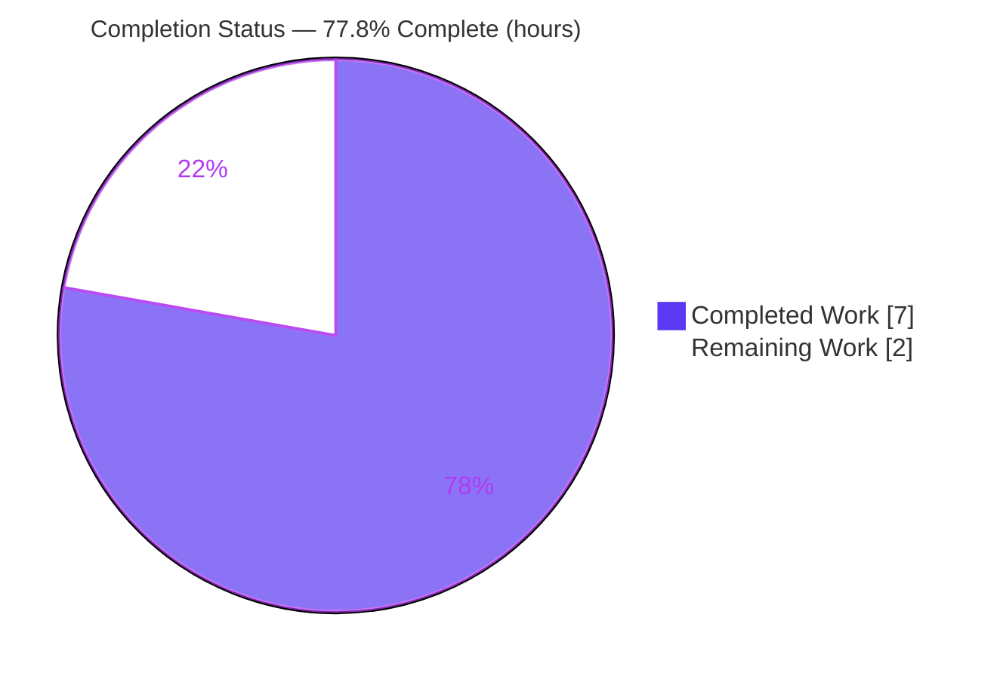
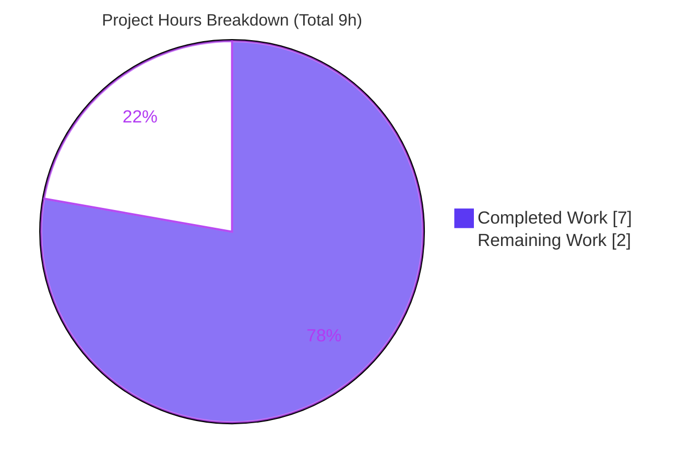
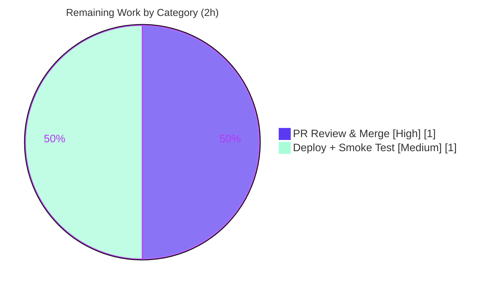

# Blitzy Project Guide — Artifact4 (Node.js + Express)

> **AAP-scoped completion: 77.8%** — 7 of 9 total hours complete. All Agent Action Plan deliverables (R1, R2, R3) are implemented and validated; the remaining 2 hours are path-to-production human handoff (PR review/merge + deployment smoke test).

---

## 1. Executive Summary

### 1.1 Project Overview

Artifact4 is a minimal Node.js HTTP service built on the Express 5 web framework. Starting from a greenfield repository that contained only an 11-byte `README.md`, the project bootstraps a runnable server exposing two static plain-text `GET` endpoints: `GET /` returning `Hello world` and `GET /good-evening` returning `Good evening`. The target users are developers following a Node/Express tutorial; the business impact is a clean, reproducible reference implementation. Technical scope is intentionally narrow: one entrypoint module (`server.js`), an npm manifest plus committed lockfile pinning `express@5.2.1`, a `.gitignore`, and documentation — with a configurable listen port (`process.env.PORT || 3000`).

### 1.2 Completion Status



| Metric | Value |
| --- | --- |
| **Total Hours** | **9** |
| **Completed Hours (AI + Manual)** | **7** (AI: 7 · Manual: 0) |
| **Remaining Hours** | **2** |
| **Percent Complete** | **77.8%** (7 ÷ 9) |

> Completion is computed using the AAP-scoped methodology: `Completed ÷ (Completed + Remaining)`. The work universe consists solely of (a) AAP deliverables and (b) standard path-to-production activities required to deploy them.

### 1.3 Key Accomplishments

- ✅ **R1 — Express integration:** `express ^5.2.1` declared in a new `package.json`; `npm install` generated a committed `package-lock.json` (lockfileVersion 3) pinning `express@5.2.1` and its 67-entry transitive tree.
- ✅ **R2 — Baseline endpoint:** `GET /` returns the exact body `Hello world` (HTTP 200) — verified live.
- ✅ **R3 — New endpoint:** `GET /good-evening` returns the exact body `Good evening` (HTTP 200) — verified live.
- ✅ **Runnable scaffold:** `server.js` entrypoint (CommonJS, `'use strict'`, thorough JSDoc), configurable port, startup log; `.gitignore` excludes `node_modules/`.
- ✅ **Documentation:** `README.md` updated with prerequisites, install/run steps, `PORT` override, and an endpoint catalog matching validated behavior.
- ✅ **Quality gates:** All five autonomous validation gates pass — dependencies, compilation, runtime, functional/endpoints, zero-errors — with `npm audit` reporting **0 vulnerabilities** and a clean working tree.

### 1.4 Critical Unresolved Issues

| Issue | Impact | Owner | ETA |
| --- | --- | --- | --- |
| _None_ — all five validation gates pass; no compilation, runtime, or functional defects | None | — | — |

> No issues block release of the AAP-scoped feature. The only remaining work is the standard human review/merge/deploy handoff (see Sections 1.6 and 2.2).

### 1.5 Access Issues

| System/Resource | Type of Access | Issue Description | Resolution Status | Owner |
| --- | --- | --- | --- | --- |
| _None_ | — | No access issues identified. The repository and npm registry were reachable; dependencies installed cleanly; no credentials, secrets, or third-party APIs are required by this feature. | N/A | — |

### 1.6 Recommended Next Steps

1. **[High]** Review the pull request diff (5 files) against AAP requirements R1/R2/R3, confirming the exact response strings `Hello world` and `Good evening`.
2. **[High]** Approve and merge the feature branch to your main/trunk branch.
3. **[Medium]** Deploy to the target host and run the post-merge smoke test (`npm ci`, `npm start`, then `curl` both endpoints and an unknown path).
4. **[Low]** _(Optional, out of AAP scope)_ If promoting beyond a tutorial, layer in production hardening — `helmet`/`app.disable('x-powered-by')`, HTTPS/TLS, automated tests (Jest + Supertest), a health-check endpoint, and CI/CD.

---

## 2. Project Hours Breakdown

### 2.1 Completed Work Detail

| Component | Hours | Description |
| --- | --- | --- |
| Express dependency integration **[R1]** | 2 | `package.json` declares `express ^5.2.1`, `start` script, `engines.node >=18`; `npm install` generated `package-lock.json` pinning `express@5.2.1` + 67-entry transitive tree; `node_modules/` populated. |
| `server.js` application bootstrap | 2 | `require('express')`, app instantiation, configurable `PORT` (`process.env.PORT || 3000`), `app.listen` with startup log; `'use strict'` CommonJS conventions; comprehensive JSDoc. |
| Greeting endpoints **[R2]** + **[R3]** | 1 | `GET /` → `Hello world` and `GET /good-evening` → `Good evening`; both verified HTTP 200 with byte-exact bodies; unknown paths fall through to Express 404. |
| Project hygiene & documentation | 1 | `.gitignore` (excludes `node_modules/`, logs, `.env`, OS cruft) + `README.md` (prerequisites, install/run, `PORT` override, endpoint catalog table, `curl` examples). |
| Autonomous 5-gate validation | 1 | Dependencies, compilation, runtime (default + PORT override), functional/endpoints (harness 6/6 + live curl), and zero-errors gates. |
| **Total Completed** | **7** | All AAP deliverables implemented and validated. |

### 2.2 Remaining Work Detail

| Category | Hours | Priority |
| --- | --- | --- |
| Human PR review & merge to main (path-to-production) | 1 | High |
| Deployment to target host + post-merge smoke verification (path-to-production) | 1 | Medium |
| **Total Remaining** | **2** | — |

> **Cross-section check:** Section 2.1 (7) + Section 2.2 (2) = **9** total hours, matching Section 1.2.

### 2.3 Hours Methodology Notes

- All completed work was performed autonomously by Blitzy agents (**Manual = 0 h**).
- Items explicitly out of AAP scope (security hardening, persistence, Docker/CI-CD, formal test suites, router modularization) carry **zero counted hours** and do **not** affect the completion percentage. They are listed only as optional future enhancements.
- The denominator (9 h) equals AAP build deliverables (6 h) + autonomous validation (1 h) + path-to-production handoff (2 h).

---

## 3. Test Results

All entries below originate from Blitzy's autonomous validation logs for this project and were independently re-verified during this assessment session.

| Test Category | Framework | Total Tests | Passed | Failed | Coverage % | Notes |
| --- | --- | --- | --- | --- | --- | --- |
| Unit | None configured | 0 | 0 | 0 | N/A | Testing infrastructure is explicitly out of AAP scope (0.6.2); none requested. Zero configured tests ⇒ zero failing, zero blocked. |
| Functional / Endpoint (automated harness) | Ad-hoc Node harness spawning real `server.js` | 6 | 6 | 0 | 100% of endpoint contracts | 6/6 assertions passed (run from `/tmp`, non-committed, deleted after use). |
| Functional / Endpoint (live `curl`) | `curl` | 3 | 3 | 0 | 100% | `GET /` → 200 `Hello world`; `GET /good-evening` → 200 `Good evening`; `GET /missing` → 404. |
| Compilation / Static | `node --check` | 1 | 1 | 0 | N/A | `server.js` syntax valid (exit 0); JSON validity of manifest + lockfile confirmed. |
| Dependency / Security | `npm ci` · `npm ls` · `npm audit` | 3 | 3 | 0 | N/A | `added 66, audited 67`; tree clean (no unmet/extraneous); **0 vulnerabilities**. |
| **Totals** | | **13** | **13** | **0** | — | 100% pass rate across all autonomous checks. |

---

## 4. Runtime Validation & UI Verification

**Runtime health**

- ✅ **Server startup (default):** `npm start` → logs `Server listening on http://localhost:3000`.
- ✅ **Server startup (PORT override):** `PORT=8090 npm start` → logs `Server listening on http://localhost:8090`; default port 3000 is **not** bound (confirms `process.env.PORT || 3000`).
- ✅ **Clean shutdown:** process terminates by exact PID with no lingering processes; port freed.

**Endpoint / API verification**

- ✅ `GET /` → HTTP **200**, body exactly `Hello world`.
- ✅ `GET /good-evening` → HTTP **200**, body exactly `Good evening`.
- ✅ `GET /<unknown>` → HTTP **404** (Express default), confirming selective (non-catch-all) routing.

**UI verification**

- ⚠ **Not applicable** — the feature exposes plain-text HTTP responses via `res.send()`. There is no graphical/visual UI, HTML templating, or static asset pipeline (AAP 0.5.3), so no screenshots or visual regression checks apply.

---

## 5. Compliance & Quality Review

| AAP Deliverable / Benchmark | Requirement | Status | Notes / Fixes Applied |
| --- | --- | --- | --- |
| R1 — Express framework integration | `express` declared & installed; server built on it | ✅ Pass | `express ^5.2.1` in `package.json`; pinned `5.2.1` in `package-lock.json`. No fixes needed. |
| R2 — Baseline endpoint | `GET /` returns exact `Hello world` | ✅ Pass | Verified 200 + exact body. |
| R3 — New endpoint | `GET /good-evening` returns exact `Good evening` | ✅ Pass | Verified 200 + exact body. |
| Exact response strings | Verbatim casing/spacing/punctuation | ✅ Pass | Byte-exact match confirmed via `curl`. |
| Backward compatibility | `Hello world` reachable at `GET /` | ✅ Pass | Baseline preserved alongside the new route. |
| Framework mandate | Express, not Node `http` | ✅ Pass | `const express = require('express')`. |
| Reproducible install | Lockfile committed, real pinned versions | ✅ Pass | `package-lock.json` committed; no placeholder versions. |
| Conventions | CommonJS, single `server.js`, configurable port | ✅ Pass | Matches AAP 0.1.2 conventions. |
| VCS hygiene | `node_modules/` excluded | ✅ Pass | `.gitignore` present; `node_modules` untracked. |
| Documentation | Install/run + endpoint catalog | ✅ Pass | `README.md` matches validated behavior. |
| Zero-placeholder policy | No TODO/stub/dead code | ✅ Pass | `server.js` complete; no stubs/TODOs. |
| Security (npm audit) | No known vulnerabilities | ✅ Pass | `npm audit` → 0 vulnerabilities. |

**Outstanding compliance items:** None within AAP scope. Optional hardening (helmet, HTTPS, tests, CI/CD) is intentionally out of scope per AAP 0.6.2.

---

## 6. Risk Assessment

| Risk | Category | Severity | Probability | Mitigation | Status |
| --- | --- | --- | --- | --- | --- |
| No automated test suite committed (regression risk if extended later) | Technical | Low | Low | Out of AAP scope; correctness verified via functional harness (6/6) + live curl | Accepted (by design) |
| Express 5.x is a recent major release (ecosystem maturity vs Express 4) | Technical | Low | Low | Pinned `express@5.2.1` in lockfile; `npm audit` clean | Mitigated |
| `X-Powered-By: Express` header sent by default (minor framework disclosure) | Security | Low | Low | `app.disable('x-powered-by')` or `helmet` (noted out of scope) | Accepted (by design) |
| No helmet/HTTPS/CORS/rate-limit/auth | Security | Low | Low | Static public responses, no sensitive data; add hardening if promoted | Accepted (by design) |
| No health-check/monitoring/structured logging | Operational | Low | Low | Add `/health` + logging/metrics if run as a service | Accepted (by design) |
| No process manager/restart strategy/containerization | Operational | Low | Low | Use pm2/systemd/Docker at deploy time | Open (deployment task) |
| Port 3000 conflict if already in use (`EADDRINUSE`) | Integration | Low | Low | Configurable `PORT` env (verified with overrides) | Mitigated |
| External integration failure | Integration | None | None | No external integrations exist | N/A |

> **Overall risk posture: LOW.** No HIGH or MEDIUM severity risks; none block release of the AAP-scoped tutorial.

---

## 7. Visual Project Status

**Project hours breakdown** (Completed = Dark Blue `#5B39F3`, Remaining = White `#FFFFFF`):



**Remaining hours by category** (from Section 2.2):



> **Integrity:** "Remaining Work" = **2 h**, identical to Section 1.2 and the sum of Section 2.2.

---

## 8. Summary & Recommendations

**Achievements.** The Artifact4 feature is functionally complete against the Agent Action Plan. All three requirements — Express integration (R1), the `Hello world` baseline endpoint (R2), and the new `Good evening` endpoint (R3) — are implemented and independently verified end-to-end. The repository now contains exactly the AAP's in-scope files (`package.json`, `package-lock.json`, `server.js`, `.gitignore`, updated `README.md`), all five autonomous validation gates pass, and `npm audit` reports zero vulnerabilities.

**Remaining gaps & critical path.** At **77.8% complete (7 of 9 hours)**, the remaining 2 hours are entirely standard path-to-production handoff requiring human action: reviewing and merging the pull request, then deploying and running a post-merge smoke test. There are no autonomous engineering tasks left within AAP scope.

**Success metrics (all met):** byte-exact response bodies; HTTP 200 on both endpoints; 404 on unknown paths; reproducible install via committed lockfile; clean syntax and dependency audit.

**Production readiness.** The deliverable is production-ready **as the tutorial artifact specified by the AAP**. If the project is later promoted to a public-facing production service, consider the optional, out-of-scope enhancements (security hardening, automated tests, health checks, CI/CD) noted in Sections 1.6 and 6 — none of which affect the current AAP-scoped completion percentage.

| Metric | Value |
| --- | --- |
| AAP requirements met | 3 / 3 (R1, R2, R3) |
| Validation gates passed | 5 / 5 |
| Autonomous checks passed | 13 / 13 |
| Completion (AAP-scoped) | 77.8% |
| Overall risk | Low |

---

## 9. Development Guide

> Every command below was executed and verified during this assessment (Node v20.20.2, npm 11.1.0). Run all commands from the repository root.

### 9.1 System Prerequisites

- **Node.js ≥ 18** (matches `engines.node` and the Express 5 floor). Verified on **v20.20.2**.
- **npm** (bundled with Node). Verified on **11.1.0**.
- A POSIX shell and `curl` for verification (optional).

```bash
node --version    # expect v18+ (verified v20.20.2)
npm --version     # verified 11.1.0
```

### 9.2 Environment Setup

No environment variables are required. One optional variable is supported:

- **`PORT`** — overrides the default listen port (`3000`). Example: `PORT=8080`.

No `.env` file, database, cache, or external service is needed.

### 9.3 Dependency Installation

```bash
# Reproducible install from the committed lockfile (recommended):
npm ci
# Expected: "added 66 packages, and audited 67 packages", "found 0 vulnerabilities"

# Alternatively:
npm install
```

Verify the dependency resolved correctly:

```bash
npm ls --depth=0
# Expected:
# artifact4@1.0.0 /path/to/repo
# └── express@5.2.1
```

### 9.4 Application Startup

```bash
# Default port 3000:
npm start
# Logs: Server listening on http://localhost:3000

# Custom port via PORT override:
PORT=8080 npm start
# Logs: Server listening on http://localhost:8080
```

`npm start` runs `node server.js` (a foreground process). Use `Ctrl+C` to stop it.

### 9.5 Verification

With the server running (default port), in a second shell:

```bash
curl -s localhost:3000/                 # -> Hello world
curl -s localhost:3000/good-evening     # -> Good evening
curl -s -o /dev/null -w '%{http_code}\n' localhost:3000/missing   # -> 404
```

Static checks (no running server required):

```bash
node --check server.js   # exit 0, no syntax errors
npm audit                # found 0 vulnerabilities
```

### 9.6 Example Usage

```bash
$ curl -i localhost:3000/
HTTP/1.1 200 OK
Content-Type: text/html; charset=utf-8
Content-Length: 11
...
Hello world

$ curl -i localhost:3000/good-evening
HTTP/1.1 200 OK
Content-Length: 12
...
Good evening
```

### 9.7 Troubleshooting

| Symptom | Cause | Resolution |
| --- | --- | --- |
| `Error: listen EADDRINUSE :::3000` | Port 3000 already in use | Start on another port: `PORT=8080 npm start`. |
| `Cannot find module 'express'` | Dependencies not installed | Run `npm ci` (or `npm install`) from the repo root. |
| Need to find/stop the server, `lsof` not available | Some containers omit `lsof` | List with `ps -eo pid,args \| grep '[s]erver.js'`, then `kill <PID>`; or stop the foreground process with `Ctrl+C`. |
| `curl` returns nothing | Server not running or wrong port | Confirm the startup log line and match the port in your `curl` URL. |

---

## 10. Appendices

### A. Command Reference

| Command | Purpose |
| --- | --- |
| `npm ci` | Reproducible install from `package-lock.json` |
| `npm install` | Install dependencies (updates lockfile if needed) |
| `npm start` | Start the server (`node server.js`) |
| `PORT=8080 npm start` | Start on a custom port |
| `node --check server.js` | Syntax-check the entrypoint |
| `npm ls --depth=0` | Show the top-level dependency tree |
| `npm audit` | Report known vulnerabilities |
| `curl -s localhost:3000/` | Exercise the baseline endpoint |
| `ps -eo pid,args \| grep '[s]erver.js'` | Locate the running server PID |

### B. Port Reference

| Port | Usage | Configurable |
| --- | --- | --- |
| `3000` | Default HTTP listen port | Yes — via `PORT` env var |
| `process.env.PORT` | Overrides the default when set | — |

### C. Key File Locations

| Path | Role |
| --- | --- |
| `server.js` | Express entrypoint; defines both routes and the listener |
| `package.json` | Manifest: `express` dependency, `start` script, `engines` |
| `package-lock.json` | Lockfile pinning `express@5.2.1` + transitive tree |
| `.gitignore` | Excludes `node_modules/`, logs, `.env`, OS cruft |
| `README.md` | Install/run docs + endpoint catalog |
| `node_modules/` | Installed dependencies (gitignored, not committed) |

### D. Technology Versions

| Technology | Version |
| --- | --- |
| Node.js | v20.20.2 (AAP floor: ≥ 18) |
| npm | 11.1.0 |
| Express | 5.2.1 (declared `^5.2.1`) |
| package-lock | lockfileVersion 3 (67 entries) |

### E. Environment Variable Reference

| Variable | Default | Description |
| --- | --- | --- |
| `PORT` | `3000` | HTTP listen port (`process.env.PORT || 3000`). |

### F. Developer Tools Guide

| Tool | Use |
| --- | --- |
| `node --check` | Static syntax validation of `server.js` |
| `npm audit` | Dependency vulnerability scanning |
| `npm ls` | Verify resolved dependency tree health |
| `curl` | Manual endpoint verification |
| `ps` / `kill` | Locate and stop the server by exact PID (use when `lsof` is unavailable) |

### G. Glossary

| Term | Definition |
| --- | --- |
| **Express** | Minimalist Node.js web framework providing routing (`app.get`) and the HTTP server abstraction (`app.listen`). |
| **CommonJS** | Node's module system using `require()`/`module.exports` (as opposed to ESM `import`). |
| **Lockfile** | `package-lock.json` — records exact resolved dependency versions for reproducible installs. |
| **Endpoint** | A routable HTTP path + method pair (e.g., `GET /good-evening`). |
| **Path-to-production** | Standard activities (review, merge, deploy, smoke test) required to ship a validated deliverable. |
| **Greenfield** | A project started from scratch with no pre-existing code or conventions. |