# Technical Specification

# 1. Introduction

## 1.1 EXECUTIVE SUMMARY

### 1.1.1 Project Overview

This Technical Specification documents the `Artifact4` repository hosted at `github.com/Blitzy-Test-01/Artifact4.git`. At the point in time captured by this specification, the repository exists in an initial-commit state and contains a single tracked artifact — a `README.md` file consisting solely of the Markdown level-one heading `# Artifact4`. No source code, configuration, dependency manifests, build descriptors, container definitions, automated tests, continuous integration workflows, or supplemental documentation are present in the repository.

The repository therefore represents a baseline placeholder for a project named `Artifact4`. This Introduction characterizes that baseline state faithfully and establishes the scope boundary for all downstream sections of this Technical Specification.

| Repository Attribute | Value |
|---|---|
| Project Name | `Artifact4` |
| Canonical Remote | `github.com/Blitzy-Test-01/Artifact4.git` |
| Default Branch | `main` |
| Total Commits in History | 1 (hash `4b99931`, message "Initial commit") |
| Initial Commit Author | `Blitzy-Test-01 <blitzytest01@gmail.com>` |
| Initial Commit Date | Thu May 28 16:45:44 2026 +0530 |
| Tracked Files | 1 (`README.md`, 11 bytes) |
| Tracked Directories Below Root | 0 |
| Tags | None |

### 1.1.2 Core Business Problem

No business problem statement, requirements document, user story, design note, or roadmap is currently committed to the repository. The single tracked file contains only a project title and no descriptive prose, links, badges, or structural Markdown beyond the heading. Consequently, the core business problem that `Artifact4` is intended to solve is not declared by the repository contents, and this specification does not infer one.

### 1.1.3 Key Stakeholders and Users

The repository does not define personas, user roles, customer segments, audience descriptions, or organizational stakeholders in any tracked file. The only identifiable human entity associated with the repository at this point is the initial commit author, captured in Git metadata.

| Stakeholder Category | Identified Entity | Evidence Source |
|---|---|---|
| Repository Author of Record | `Blitzy-Test-01 <blitzytest01@gmail.com>` | Git commit metadata for `4b99931` |
| Repository Owner Namespace | `Blitzy-Test-01` | Remote origin URL in `.git/config` |
| End Users / Customer Personas | Not declared | No documentation present |
| Internal Roles (Product, Engineering, Operations) | Not declared | No documentation present |
| External Stakeholders / Partners | Not declared | No documentation present |

### 1.1.4 Expected Business Impact and Value Proposition

No value proposition, business outcome statement, return-on-investment projection, or qualitative impact narrative is committed to the repository. Because no functional capability has been introduced, the repository in its present state produces no measurable business impact. This specification therefore documents the absence of such declarations rather than attributing impact to a system that has not been built.

## 1.2 SYSTEM OVERVIEW

### 1.2.1 Project Context

#### Business Context and Market Positioning

The repository does not contain any artifact that describes a market vertical, industry segment, competitive landscape, target geography, regulatory context, or commercial positioning for `Artifact4`. The sole tracked file (`README.md`) does not contain prose, and no auxiliary documentation directories exist beneath the repository root.

#### Current System Limitations

There is no existing system being replaced, modernized, or upgraded that can be inferred from the repository. No references to legacy platforms, prior versions, deprecated dependencies, migration goals, parallel-run plans, or retirement strategies appear in any tracked file. The "Initial commit" Git history confirms that the repository has never contained prior implementations.

#### Integration with Existing Enterprise Landscape

No integration artifacts are present. The repository contains:

- No API client code, SDK references, or service stubs;
- No vendor configuration files or third-party manifest declarations;
- No environment-variable templates, secret references, or connection-string placeholders;
- No message-broker, database, queue, or external-service descriptors;
- No identity-provider, single-sign-on, or directory-service configurations.

Consequently, no integration with any existing enterprise system is established or planned by the current repository contents.

### 1.2.2 High-Level Description

#### Primary System Capabilities

The repository implements zero runtime capabilities. There is no executable code, script, function, command, or workflow definition in any tracked file. The single `README.md` is a static Markdown placeholder.

#### Major System Components

No modules, services, microservices, libraries, packages, layers, or subsystems are defined. The repository contains exactly one file at the root level and no subdirectories beneath the root other than the Git internal `.git/` directory. The architectural decomposition diagram below reflects this minimal state.

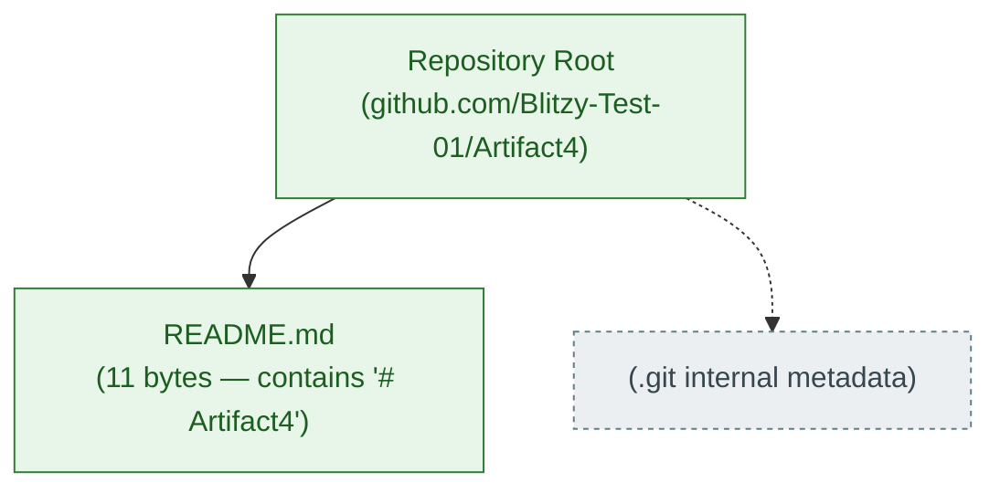

#### Core Technical Approach

No core technical approach is declared in the repository. Specifically, the repository contains none of the following declarative manifests or technology indicators that would normally identify a stack:

| Manifest / Indicator Category | Representative File Looked For | Present in Repository |
|---|---|---|
| JavaScript / Node.js | `package.json`, `package-lock.json`, `yarn.lock` | No |
| Python | `requirements.txt`, `pyproject.toml`, `Pipfile`, `setup.py` | No |
| Java / JVM | `pom.xml`, `build.gradle`, `settings.gradle` | No |
| Ruby | `Gemfile`, `Gemfile.lock` | No |
| Go | `go.mod`, `go.sum` | No |
| Rust | `Cargo.toml`, `Cargo.lock` | No |
| .NET | `*.csproj`, `*.sln` | No |
| Containerization | `Dockerfile`, `docker-compose.yml` | No |
| Build Orchestration | `Makefile`, `Taskfile.yml` | No |
| Continuous Integration | `.github/workflows/`, `.gitlab-ci.yml`, `Jenkinsfile` | No |
| Ignore / Tooling Configuration | `.gitignore`, `.blitzyignore`, `.editorconfig` | No |

Markdown, the format of the lone tracked file, is a content-only notation and does not constitute a technology stack for an executable system.

### 1.2.3 Success Criteria

No measurable objectives, critical success factors, acceptance criteria, objectives-and-key-results (OKRs), service-level objectives (SLOs), or key performance indicators (KPIs) are documented in the repository. The table below captures this status explicitly so that downstream sections may treat the absence as a known baseline rather than an oversight.

| Success Criterion Category | Documented in Repository? | Source of Record |
|---|---|---|
| Measurable Objectives | No | None |
| Critical Success Factors | No | None |
| Key Performance Indicators (KPIs) | No | None |
| Service-Level Objectives (SLOs) | No | None |
| Acceptance Criteria | No | None |

## 1.3 SCOPE

The scope of this Technical Specification is bounded strictly by the artifacts physically present in the `Artifact4` repository at the time of authoring. Because the repository contains only a placeholder `README.md`, the in-scope surface area is necessarily minimal and the out-of-scope surface area is necessarily expansive.

### 1.3.1 In-Scope Elements

#### 1.3.1.1 Core Features and Functionalities

| In-Scope Category | Observed Reality |
|---|---|
| Must-Have Capabilities | None implemented; repository contains no functional code. |
| Primary User Workflows | None defined; no UI, CLI, API, or workflow specification exists. |
| Essential Integrations | None defined or implemented. |
| Key Technical Requirements | None declared; no technology stack, runtime, or platform is specified. |

#### 1.3.1.2 Implementation Boundaries

| Boundary Dimension | Observed Reality |
|---|---|
| System Boundaries | Not defined; there is no operational system to bound. |
| User Groups Covered | None defined. |
| Geographic / Market Coverage | Not declared. |
| Data Domains Included | None defined; no schemas, models, or data dictionaries are present. |

#### 1.3.1.3 Documentation Artifacts Within Scope

The only artifact materially in scope for description by this specification is the `README.md` file. Its complete description is:

| Property | Value |
|---|---|
| Path | `/README.md` |
| Size | 11 bytes |
| Content | Exactly the ASCII characters `# Artifact4` (a single Markdown H1 heading) |
| Trailing Newline | None |
| Additional Prose | None |

### 1.3.2 Out-of-Scope Elements

Because no in-scope functionality has been committed to the repository, every conceivable feature, capability, integration, and operational concern that one might associate with a software product is currently out of scope. The categories below are enumerated explicitly so that future contributors and reviewers have an unambiguous record of what this specification does not address.

| Out-of-Scope Category | Rationale |
|---|---|
| Application Source Code & Business Logic | Not committed to the repository. |
| User Interfaces (Web, Mobile, Desktop, CLI) | No interface code or design assets exist. |
| Application Programming Interfaces (APIs) | No API definitions (REST, GraphQL, gRPC, or otherwise) exist. |
| Persistence Layer (Databases, Caches, Queues) | No data store configuration, schema, or migration is present. |
| Authentication, Authorization, and Identity | No identity, role, permission, or session mechanism is defined. |
| Third-Party and Vendor Integrations | No SDKs, client libraries, or vendor manifests are present. |
| Build, Packaging, and Release Pipelines | No build scripts, package manifests, or release configuration exist. |
| Continuous Integration / Continuous Deployment | No CI/CD workflows are configured. |
| Containerization and Orchestration | No `Dockerfile`, `docker-compose`, or Kubernetes manifest exists. |
| Infrastructure as Code (IaC) | No Terraform, CloudFormation, Pulumi, or equivalent files exist. |
| Observability (Logging, Metrics, Tracing) | No telemetry instrumentation or configuration is present. |
| Security Controls and Compliance Artifacts | No security policy, threat model, or compliance document is committed. |
| Performance, Load, and Resilience Engineering | No benchmarks, load profiles, or resilience patterns are defined. |
| Automated and Manual Test Suites | No tests of any kind are present in the repository. |
| End-User, Operator, or Developer Documentation | Beyond the title-only README, no documentation exists. |
| Localization and Internationalization | No locale data or translation resources exist. |
| Accessibility Conformance Artifacts | No accessibility specifications or audits are present. |

### 1.3.3 Future Phase Considerations

No roadmap document, phased-rollout plan, milestone tracker, `TODO.md`, `CHANGELOG.md`, or issue-reference file is committed to the repository. Consequently, no future phases are formally declared. This Technical Specification treats future phase considerations as undocumented at the source-of-truth level until additional commits introduce them.

### 1.3.4 Unsupported Use Cases and Integration Points

Because no use cases are defined and no integration points are implemented, the repository neither supports nor explicitly disclaims any specific use case or external interface. This specification records this status to prevent inference of unsupported intent from the empty baseline.

## 1.4 BASELINE STATE AND SPECIFICATION POSTURE

### 1.4.1 Authoritative Statement of Repository State

The repository's authoritative state, as verified by recursive filesystem inspection, byte-level file inspection, complete Git history review, and exhaustive semantic search of the indexed corpus, is summarized in the following statement:

> The `Artifact4` repository contains exactly one tracked file (`README.md`, 11 bytes, containing the literal text `# Artifact4`), exactly one Git commit (`4b99931`, "Initial commit"), and no other tracked or indexed content of any kind.

### 1.4.2 Documentation Posture Adopted by This Specification

Given the baseline above, this Technical Specification adopts the following posture for every subsequent section:

| Posture Principle | Application |
|---|---|
| Evidence-Based Statements Only | Every assertion is grounded in an artifact physically present in the repository or in verifiable Git metadata. |
| No Fabrication of Capabilities | The specification does not invent business problems, stakeholders, KPIs, or technology choices that are not declared in the repository. |
| Explicit Documentation of Absence | Categories that are conventionally documented but not present in this repository are explicitly recorded as absent rather than omitted silently. |
| Forward Compatibility | The specification is structured so that future commits introducing source code, manifests, or documentation can be incorporated by extending — rather than rewriting — the existing sections. |

### 1.4.3 Implications for Downstream Sections

All sections of this Technical Specification that follow this Introduction inherit the empty-baseline condition described above. Architecture, technology stack, data model, integration, deployment, security, and operations sections will therefore describe the absence of declared artifacts in their respective domains and will mark every conventionally-expected element as "not present in the repository" until such artifacts are introduced in subsequent commits.

## 1.5 REFERENCES

### 1.5.1 Files Examined

- `README.md` — The sole tracked file in the repository. Verified via recursive filesystem scan and byte-level inspection to contain exactly the 11 ASCII characters `# Artifact4` with no additional content, prose, links, badges, or trailing whitespace. Source of the project name used throughout this Introduction.

### 1.5.2 Folders Explored

- `/` (repository root) — Confirmed to contain exactly one direct child file (`README.md`) and zero subdirectories other than the Git internal `.git/` metadata directory. Depth of exploration is bounded at zero because no deeper directory structure exists.

### 1.5.3 Repository Metadata Sources

- `.git/config` — Source of the canonical remote URL `github.com/Blitzy-Test-01/Artifact4.git`.
- `.git/refs/heads/main` — Source confirming `main` as the default branch.
- Git commit `4b99931` ("Initial commit") — Source of author identity (`Blitzy-Test-01 <blitzytest01@gmail.com>`) and commit timestamp (Thu May 28 16:45:44 2026 +0530). This is the only commit in the repository's history.

### 1.5.4 Verification Activities Performed

- Recursive file enumeration excluding `.git/` — returned exactly one file (`./README.md`).
- Recursive directory enumeration excluding `.git/` — returned only the repository root.
- Byte-level content inspection of `README.md` — confirmed 11 ASCII characters, no trailing newline, no additional content.
- Full Git history review (`git log --all --stat`) — confirmed a single commit adding one line to one file.
- Tag enumeration (`git tag -l`) — returned no tags.
- Semantic searches for source code, configuration files, build manifests, documentation, READMEs, modules, entry points, tests, and API definitions — all returned empty result sets, corroborating the filesystem evidence.
- Search for `.blitzyignore` and other ignore files — returned no results.

# 2. Product Requirements

## 2.1 BASELINE CONDITION AND DOCUMENTATION POSTURE

This Product Requirements section is authored under the empty-baseline condition established in Section 1.4 of this Technical Specification. The `Artifact4` repository contains exactly one tracked file (`README.md`, 11 bytes, containing the literal text `# Artifact4`), exactly one Git commit (`4b99931`, "Initial commit"), and no other tracked or indexed content of any kind. Because there is no executable code, no requirements document, no user-story corpus, no design note, and no roadmap artifact committed to the repository, this section explicitly documents the absence of product features and functional requirements rather than fabricating them.

### 2.1.1 Repository State Affecting Product Requirements

The complete inventory of artifacts that could legitimately serve as inputs to a Product Requirements catalog has been verified as empty. The following table records the verification status of each conventionally-expected source for product requirements information.

| Requirements Input Source | Searched For | Present in Repository |
|---|---|---|
| Requirements Specification Documents | `*.requirements.md`, `prd.md`, `requirements/` | No |
| User Stories and Acceptance Tests | `stories/`, `features/`, `*.feature` (Gherkin) | No |
| Design Notes and Architecture Decision Records | `docs/`, `adr/`, `decisions/` | No |
| Source Code Implementing Features | Any `.py`, `.js`, `.ts`, `.java`, `.go`, `.rs`, or other source files | No |
| API Definitions Declaring Capabilities | OpenAPI, GraphQL schema, gRPC `.proto` files | No |
| Test Suites Documenting Behavior | Any unit, integration, contract, or end-to-end test | No |
| Issue Tracker Exports or Roadmaps | `TODO.md`, `CHANGELOG.md`, `ROADMAP.md` | No |
| README Prose Describing Features | Descriptive text beyond the title heading | No |

### 2.1.2 Evidence-Based Posture

Per Section 1.4.2 of this Technical Specification, four posture principles govern every assertion made in this Product Requirements section.

| Posture Principle | Application to Product Requirements |
|---|---|
| Evidence-Based Statements Only | No feature, capability, or requirement is asserted that is not grounded in a tracked artifact or verifiable Git metadata. |
| No Fabrication of Capabilities | Feature identifiers (`F-XXX`), requirement identifiers (`F-XXX-RQ-YYY`), acceptance criteria, and priority assignments are not invented. |
| Explicit Documentation of Absence | Every conventional Product Requirements category is enumerated and marked as "not declared in the repository" rather than silently omitted. |
| Forward Compatibility | The section's structure (catalog, requirements tables, relationship maps, traceability matrix) is preserved as scaffolding so that future commits can populate it without restructuring. |

### 2.1.3 Forward-Compatibility Framework

This section is organized so that future contributors introducing the first feature can populate the catalog by appending a new row to the Feature Catalog (Section 2.2), the Functional Requirements table (Section 2.3), the Feature Relationships map (Section 2.4), the Implementation Considerations table (Section 2.5), and the Traceability Matrix (Section 2.6) — all without altering the existing structural headings. The identifier allocation conventions defined in Section 2.2.2 and Section 2.3.2 reserve the format space for future use and establish unambiguous rules for assigning the first `F-XXX` and `F-XXX-RQ-YYY` identifiers when functionality is committed.

---

## 2.2 FEATURE CATALOG

### 2.2.1 Enumerated Features

The repository declares **zero product features**. No feature can be enumerated, named, categorized, prioritized, or assigned status because no functional artifact, design document, or capability description is committed to `Artifact4`. This finding is consistent with Section 1.2.2 ("Primary System Capabilities") of this Technical Specification, which records that the repository implements zero runtime capabilities, and with Section 1.3.1.1, which records that no Must-Have Capabilities are implemented.

The Feature Catalog table below is presented in its empty state to preserve the documentation contract while accurately reflecting the repository's content.

| Unique ID | Feature Name | Category | Status |
|---|---|---|---|
| — | No features declared in repository | — | — |

### 2.2.2 Feature Metadata Inventory

The metadata fields prescribed by the Product Requirements specification (Unique ID, Feature Name, Feature Category, Priority Level, Status) currently have no instances. The table below records, for each prescribed metadata field, the absence of any value and the reservation rule that will apply when the first feature is committed.

| Metadata Field | Current Value(s) | Reservation Rule for Future Use |
|---|---|---|
| Unique ID | None assigned | First feature shall be assigned `F-001`; subsequent features increment sequentially. |
| Feature Name | None assigned | Names shall be drawn from the artifact (source file, design document, or specification) that first introduces the feature. |
| Feature Category | None assigned | Categories shall reflect functional domain (e.g., Authentication, Data Access, Reporting) only when such domains are established by committed code. |
| Priority Level | None assigned | Values from {Critical, High, Medium, Low} shall be assigned only when prioritization evidence (issue label, design note, or stakeholder decision) is committed. |
| Status | None assigned | Values from {Proposed, Approved, In Development, Completed} shall be assigned only when status-bearing evidence exists in the repository. |

### 2.2.3 Feature Descriptions and Dependencies

The descriptive fields (Overview, Business Value, User Benefits, Technical Context) and the dependency fields (Prerequisite Features, System Dependencies, External Dependencies, Integration Requirements) have no instances to document. The table below records the absence explicitly.

#### Description Fields

| Description Field | Documented in Repository? | Source of Record |
|---|---|---|
| Overview | No | No prose beyond the README title heading. |
| Business Value | No | No value proposition is committed (see Section 1.1.4). |
| User Benefits | No | No personas or user roles are declared (see Section 1.1.3). |
| Technical Context | No | No technology stack or runtime is specified (see Section 1.2.2). |

#### Dependency Fields

| Dependency Field | Documented in Repository? | Source of Record |
|---|---|---|
| Prerequisite Features | No | No features exist to have prerequisites. |
| System Dependencies | No | No system is defined (see Section 1.3.1.2). |
| External Dependencies | No | No third-party manifest declares external dependencies (see Section 1.2.2). |
| Integration Requirements | No | No integration artifacts are present (see Section 1.2.1). |

---

## 2.3 FUNCTIONAL REQUIREMENTS

### 2.3.1 Requirement Inventory

The repository declares **zero functional requirements**. Because no feature has been catalogued in Section 2.2, no requirement can be associated with a parent feature, and consequently no `F-XXX-RQ-YYY` identifier has been allocated. This is consistent with Section 1.2.3 of this Technical Specification, which records that no measurable objectives, critical success factors, acceptance criteria, OKRs, SLOs, or KPIs are documented in the repository.

The Functional Requirements table below is presented in its empty state.

| Requirement ID | Description | Priority | Complexity |
|---|---|---|---|
| — | No requirements declared in repository | — | — |

### 2.3.2 Requirement Identifier Allocation

To preserve unambiguous future use, the identifier-allocation convention is reserved here even though no identifiers have been issued.

| Identifier Component | Format | Allocation Rule |
|---|---|---|
| Feature Identifier | `F-XXX` | Three-digit zero-padded integer starting from `F-001`; assigned by Section 2.2 when first feature is committed. |
| Requirement Identifier | `F-XXX-RQ-YYY` | Three-digit zero-padded `YYY` suffix starting from `RQ-001` per parent feature; reset for each new `F-XXX`. |
| Priority Token | One of {Must-Have, Should-Have, Could-Have} | Assigned only when prioritization evidence exists in the committing artifact. |
| Complexity Token | One of {High, Medium, Low} | Assigned only when complexity evidence (estimate, design note, or task breakdown) exists in the committing artifact. |

### 2.3.3 Technical Specifications and Validation Rules

The Technical Specifications fields (Input Parameters, Output/Response, Performance Criteria, Data Requirements) and the Validation Rules fields (Business Rules, Data Validation, Security Requirements, Compliance Requirements) have no instances to document. The tables below record the absence explicitly and identify the artifact category that would, in the future, supply each field's content.

#### Technical Specifications Fields

| Technical Specification Field | Documented in Repository? | Future Source Artifact |
|---|---|---|
| Input Parameters | No | API definition, CLI argument parser, or function signature in committed source. |
| Output / Response | No | API response schema, return-type annotation, or test fixture. |
| Performance Criteria | No | SLO document, benchmark suite, or load-test specification (see Section 1.2.3). |
| Data Requirements | No | Database schema, ORM model, or data dictionary (see Section 1.3.1.2). |

#### Validation Rules Fields

| Validation Rule Field | Documented in Repository? | Future Source Artifact |
|---|---|---|
| Business Rules | No | Domain model, policy document, or rules-engine configuration. |
| Data Validation | No | Schema-validation code, JSON Schema, or input-sanitization layer. |
| Security Requirements | No | Threat model, authentication/authorization design, or security policy (see Section 1.3.2). |
| Compliance Requirements | No | Compliance attestation, audit checklist, or regulatory mapping (see Section 1.3.2). |

---

## 2.4 FEATURE RELATIONSHIPS

### 2.4.1 Feature Dependency Map

Because no features have been catalogued in Section 2.2, no dependency map can be constructed. The diagram below illustrates the current empty-baseline state of the dependency graph and reserves the structural slot for future population.

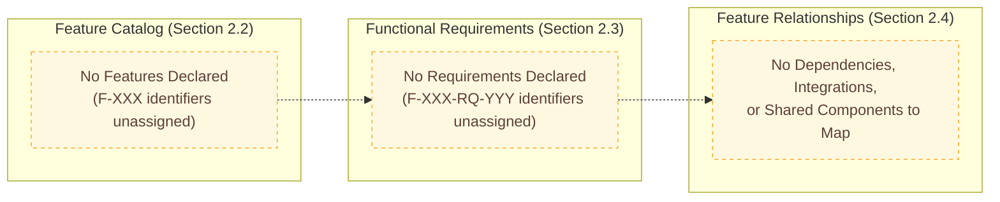

### 2.4.2 Integration Points

The repository declares no integration points. This finding is corroborated by Section 1.2.1 ("Integration with Existing Enterprise Landscape"), which records that the repository contains no API client code, SDK references, service stubs, vendor configuration files, third-party manifest declarations, environment-variable templates, message-broker descriptors, or identity-provider configurations.

| Integration Point Category | Declared in Repository? | Source of Record |
|---|---|---|
| Inbound API Integrations | No | No API definitions are committed (see Section 1.3.2). |
| Outbound Service Calls | No | No client SDKs or service stubs are committed (see Section 1.2.1). |
| Message-Broker / Queue Integrations | No | No broker descriptors are committed (see Section 1.2.1). |
| Identity-Provider Integrations | No | No SSO or directory-service configurations are committed (see Section 1.2.1). |

### 2.4.3 Shared Components and Common Services

The repository declares no shared components and no common services. This finding is corroborated by Section 1.2.2 ("Major System Components"), which records that no modules, services, microservices, libraries, packages, layers, or subsystems are defined.

| Shared Asset Category | Declared in Repository? | Source of Record |
|---|---|---|
| Shared Libraries / Packages | No | No package manifest declares libraries (see Section 1.2.2). |
| Common Service Endpoints | No | No service definition exists. |
| Cross-Cutting Concerns (Logging, Auth, Config) | No | No infrastructure code or configuration is committed (see Section 1.3.2). |
| Reusable UI / API Components | No | No UI assets or API contracts are committed (see Section 1.3.2). |

---

## 2.5 IMPLEMENTATION CONSIDERATIONS

Because no feature is catalogued and no requirement is declared, no per-feature implementation considerations can be documented. The subsections below preserve the framework and record, for each consideration category, the absence of declared constraints and the future source artifact that would supply each field's content.

### 2.5.1 Technical Constraints

| Constraint Category | Declared in Repository? | Future Source Artifact |
|---|---|---|
| Language / Runtime Constraints | No | Dependency manifest (`package.json`, `pyproject.toml`, etc.) — none present per Section 1.2.2. |
| Platform / OS Constraints | No | Build descriptor, container definition, or deployment manifest — none present per Section 1.2.2. |
| Library / Framework Constraints | No | Lockfile or dependency declaration — none present per Section 1.2.2. |
| Interface / Protocol Constraints | No | API definition or protocol schema — none present per Section 1.3.2. |

### 2.5.2 Performance and Scalability Considerations

Section 1.3.2 of this Technical Specification records that performance, load, and resilience engineering artifacts are out of scope because no benchmarks, load profiles, or resilience patterns are defined in the repository. Section 1.2.3 records that no SLOs or KPIs are documented. The table below preserves the consideration categories.

| Consideration Category | Declared in Repository? | Future Source Artifact |
|---|---|---|
| Performance Requirements (Latency, Throughput) | No | SLO document or benchmark suite. |
| Scalability Targets (Concurrent Users, Volumes) | No | Capacity plan or load profile. |
| Resource Constraints (CPU, Memory, Storage) | No | Container resource specification or infrastructure manifest. |
| Resilience Patterns (Retry, Circuit-Breaker) | No | Code or configuration implementing such patterns. |

### 2.5.3 Security and Maintenance Considerations

Section 1.3.2 records that security controls, compliance artifacts, observability instrumentation, and test suites are all out of scope for the current repository contents. The table below preserves the consideration categories.

| Consideration Category | Declared in Repository? | Future Source Artifact |
|---|---|---|
| Security Implications (Threats, Controls) | No | Threat model or security policy. |
| Authentication / Authorization Model | No | Identity, role, or session mechanism — none present per Section 1.3.2. |
| Maintenance Requirements (Upgrades, Patching) | No | Operational runbook or maintenance schedule. |
| Observability and Telemetry | No | Logging, metrics, or tracing instrumentation — none present per Section 1.3.2. |

---

## 2.6 TRACEABILITY MATRIX

### 2.6.1 Matrix Structure

A traceability matrix conventionally links Features (`F-XXX`) to Requirements (`F-XXX-RQ-YYY`) to Acceptance Criteria to verifying Test Cases. Because no features, requirements, acceptance criteria, or test cases are declared in the `Artifact4` repository, the matrix is presented in its empty state with the column structure preserved for forward compatibility.

### 2.6.2 Current Matrix State

| Feature ID | Requirement ID | Acceptance Criterion | Verifying Test Case |
|---|---|---|---|
| — | — | No requirements to trace | No tests committed to repository |

### 2.6.3 Cross-References to Other Sections

| Cross-Reference Target | Relevance to Product Requirements |
|---|---|
| Section 1.1 (Executive Summary) | Confirms absence of business problem, stakeholders, and value proposition that would seed features. |
| Section 1.2.2 (High-Level Description) | Confirms zero runtime capabilities and zero major system components. |
| Section 1.2.3 (Success Criteria) | Confirms absence of measurable objectives, KPIs, SLOs, and acceptance criteria. |
| Section 1.3.1 (In-Scope Elements) | Confirms that no Must-Have Capabilities, user workflows, integrations, or technical requirements are implemented. |
| Section 1.3.2 (Out-of-Scope Elements) | Enumerates every conventionally-expected capability category as currently out of scope. |
| Section 1.4.1 (Authoritative Statement of Repository State) | Provides the verified baseline that justifies the empty Product Requirements catalog. |

No process flowcharts are referenced because no processes are defined in the repository; no related technical specifications are linked because none exist beyond this document.

---

## 2.7 ASSUMPTIONS, CONSTRAINTS, AND VERSIONING

### 2.7.1 Documented Assumptions

The Product Requirements section operates under exactly one explicit assumption: that the repository state captured in Section 1.4.1 of this Technical Specification is authoritative at the time of authoring. No other assumptions about business intent, technology preference, target users, or future deliverables are made, in adherence to the "No Fabrication of Capabilities" posture principle.

| Assumption ID | Assumption | Source |
|---|---|---|
| A-2-001 | The `Artifact4` repository contains exactly one tracked file (`README.md`, 11 bytes) and exactly one Git commit (`4b99931`). | Section 1.4.1 (Authoritative Statement of Repository State). |
| A-2-002 | No undeclared features, requirements, or capabilities exist outside the tracked artifact set. | Verified by exhaustive semantic search and recursive filesystem inspection per Section 1.4.1. |

### 2.7.2 Constraints Affecting Requirements

The constraints below derive directly from the verified baseline and govern what can legitimately be documented in this section.

| Constraint ID | Constraint | Implication |
|---|---|---|
| C-2-001 | No feature identifiers (`F-XXX`) may be allocated until a feature is committed to the repository. | The Feature Catalog (Section 2.2) remains empty. |
| C-2-002 | No requirement identifiers (`F-XXX-RQ-YYY`) may be allocated until a parent feature exists. | The Functional Requirements table (Section 2.3) remains empty. |
| C-2-003 | No traceability links may be drawn between features, requirements, and tests until any of these artifacts exist. | The Traceability Matrix (Section 2.6) remains empty. |
| C-2-004 | No process flowchart reference may be made because no processes are defined in the repository. | Section 2.6.3 omits process-flowchart links. |

### 2.7.3 Requirement Versioning Approach

No requirements exist to be versioned. When the first requirement is introduced, the versioning approach defined below shall apply. This convention is reserved here to support forward compatibility.

| Versioning Element | Convention |
|---|---|
| Initial Version | Each new requirement (`F-XXX-RQ-YYY`) shall be introduced at version `v1.0`. |
| Revision Trigger | Material changes to description, acceptance criteria, or priority shall increment the minor version. |
| Breaking Change Trigger | Changes that invalidate prior acceptance criteria or remove the requirement shall increment the major version. |
| Version Source of Truth | Git commit history attached to the file declaring the requirement shall be the version-history source. |

---

## 2.8 REFERENCES

### 2.8.1 Files Examined

- `README.md` — The sole tracked file in the repository; 11 bytes containing the literal ASCII text `# Artifact4`. Provides definitive evidence that no feature descriptions, user stories, or requirements prose exist in the repository.

### 2.8.2 Folders Explored

- `/` (repository root, depth 0) — Confirmed to contain exactly one direct child (`README.md`) and no subdirectories other than the Git internal `.git/` metadata directory. No nested structure exists to host requirements artifacts.

### 2.8.3 Technical Specification Sections Cross-Referenced

- **Section 1.1 (Executive Summary)** — Establishes the empty-baseline state, project name, and the absence of stakeholders, business problem, and value proposition that would seed product features.
- **Section 1.2 (System Overview)** — Confirms zero runtime capabilities, no major system components, no integration with enterprise systems, and no success criteria.
- **Section 1.3 (Scope)** — Enumerates the in-scope reality (no Must-Have Capabilities, no user workflows, no integrations, no technical requirements) and the out-of-scope categories (application code, UI, API, persistence, auth, integrations, build pipelines, CI/CD, IaC, observability, security, performance, testing, documentation, localization, accessibility).
- **Section 1.4 (Baseline State and Specification Posture)** — Provides the authoritative statement of repository state and the four posture principles (Evidence-Based Statements Only, No Fabrication of Capabilities, Explicit Documentation of Absence, Forward Compatibility) governing this section.
- **Section 1.5 (References)** — Confirms the exhaustive verification activities (recursive filesystem inspection, byte-level file inspection, Git history review, semantic search of the indexed corpus) that established the empty-baseline finding.

### 2.8.4 Search and Verification Activities

- Semantic search of the indexed repository corpus for product requirements, features, user stories, and specifications — returned empty result sets.
- Semantic search of the indexed repository corpus for application source code, feature implementation modules, and entry points — returned empty result sets.
- Recursive directory inspection of the repository root — confirmed exactly one tracked file (`README.md`) and no subdirectories beyond `.git/`.
- Byte-level inspection of `README.md` — confirmed content is exactly the 11 ASCII bytes `# Artifact4` with no additional prose, links, badges, or structural Markdown.

# 3. Technology Stack

## 3.1 BASELINE POSTURE AND DOCUMENTATION APPROACH

### 3.1.1 Authoritative Restatement of Repository State

This Technology Stack section is authored under the empty-baseline condition established in Section 1.4.1 of this Technical Specification. The authoritative statement of repository state — verified by recursive filesystem inspection, byte-level file inspection, complete Git history review, and exhaustive semantic search of the indexed corpus — is reproduced here verbatim for unambiguous reference:

> The `Artifact4` repository contains exactly one tracked file (`README.md`, 11 bytes, containing the literal text `# Artifact4`), exactly one Git commit (`4b99931`, "Initial commit"), and no other tracked or indexed content of any kind.

Because the repository contains no source code, no dependency manifests, no build descriptors, no container definitions, no continuous-integration workflows, and no infrastructure-as-code artifacts, this section documents the **absence of declared technologies** rather than fabricating them. Every conventionally-expected technology category enumerated below is recorded as "not declared in the repository" with the originating evidence cross-referenced to other sections of this Technical Specification.

### 3.1.2 Governing Posture Principles

The four binding posture principles established in Section 1.4.2 govern every assertion made in this Technology Stack section. The table below maps each principle to its concrete application within the technology-stack domain.

| Posture Principle | Application to Technology Stack |
|---|---|
| Evidence-Based Statements Only | Every technology assertion in this section is grounded in a tracked artifact (`README.md`) or verifiable Git metadata. No inferred, anticipated, or aspirational technology is named. |
| No Fabrication of Capabilities | Technology selections — including languages, frameworks, libraries, third-party services, databases, and deployment tooling — are not invented when they are not declared in the repository. |
| Explicit Documentation of Absence | Each conventional technology category (languages, frameworks, dependencies, services, databases, dev/deploy tooling) is enumerated and marked as "not present in the repository." |
| Forward Compatibility | The subsection scaffolding (3.2 through 3.7) is preserved so that future commits introducing manifests, source code, or deployment artifacts can be incorporated by extending — rather than rewriting — the existing structure. |

### 3.1.3 Declination of the Default Technology Stack

A "Default Technology Stack" containing prospective technology choices (e.g., AWS, Docker, Terraform, GitHub Actions, Python, Flask, Auth0, MongoDB, Langchain, React, TypeScript, TailwindCSS, React-Native, Swift, Kotlin, Objective-C, ElectronJS) is referenced in this section's authoring brief. In strict adherence to the "No Fabrication of Capabilities" and "Evidence-Based Statements Only" principles, **none of these technologies are recorded as part of this Technical Specification's Technology Stack**. The following table records the disposition of each candidate technology against the verified repository state.

| Candidate Technology (from Default Stack) | Tracked Artifact Declaring It? | Disposition in This Specification |
|---|---|---|
| AWS (Cloud Platform) | None | Not recorded; no infrastructure-as-code, account, or service descriptor present (per Section 1.3.2). |
| Docker (Containerization) | None | Not recorded; no `Dockerfile` or `docker-compose.yml` present (per Section 1.2.2). |
| Terraform (Infrastructure as Code) | None | Not recorded; no `*.tf` files or equivalent IaC artifacts present (per Section 1.3.2). |
| GitHub Actions (CI/CD) | None | Not recorded; no `.github/workflows/` directory present (per Section 1.2.2). |
| Python (Backend Language) | None | Not recorded; no `.py` files, `requirements.txt`, `pyproject.toml`, `Pipfile`, or `setup.py` present (per Section 1.2.2). |
| Flask (Backend Framework) | None | Not recorded; no dependency manifest declares a framework (per Section 2.5.1). |
| Auth0 (Authentication) | None | Not recorded; no identity-provider configuration present (per Section 1.2.1). |
| MongoDB (Database) | None | Not recorded; no database descriptor, connection string, schema, or migration file present (per Section 1.3.2). |
| Langchain (AI Framework) | None | Not recorded; no Python source or dependency manifest exists (per Section 1.2.2). |
| React with TypeScript (Web Frontend) | None | Not recorded; no `package.json`, `*.jsx`, `*.tsx`, `*.ts`, or `tsconfig.json` present (per Section 1.2.2). |
| TailwindCSS (CSS Framework) | None | Not recorded; no `tailwind.config.js`, `postcss.config.js`, or stylesheet present (per Section 1.2.2). |
| React-Native with TypeScript | None | Not recorded; no mobile project scaffolding present (per Section 1.2.2). |
| Swift (iOS) | None | Not recorded; no Xcode project, `Package.swift`, or `*.swift` files present (per Section 1.2.2). |
| Kotlin (Android) | None | Not recorded; no Gradle build, `*.kt`, or Android manifest present (per Section 1.2.2). |
| Objective-C (MacOS) | None | Not recorded; no `*.m`, `*.h`, or Xcode workspace present (per Section 1.2.2). |
| ElectronJS (Desktop) | None | Not recorded; no `electron-builder.json`, `package.json`, or Electron entry point present (per Section 1.2.2). |

This declination is preserved here so that future readers and reviewers have an unambiguous audit trail explaining why the Default Technology Stack inputs were excluded from the verified specification.

---

## 3.2 PROGRAMMING LANGUAGES

### 3.2.1 Declared Languages by Platform/Component

No programming language is declared, implemented, or referenced in any tracked artifact of the `Artifact4` repository. The sole tracked file, `README.md`, contains exactly the eleven-byte literal text `# Artifact4` — a single Markdown H1 heading with no executable semantics. Per Section 1.2.2, Markdown is a content-only notation and does not constitute a programming language for an executable system.

| Platform / Component | Declared Language(s) | Version | Source of Record |
|---|---|---|---|
| Backend Service(s) | None | N/A | No source files of any backend language present in repository. |
| Web Frontend | None | N/A | No `.js`, `.ts`, `.jsx`, `.tsx`, `.html`, or `.css` files present. |
| Mobile / Cross-Platform Client | None | N/A | No mobile project scaffolding present. |
| Desktop Client | None | N/A | No desktop project scaffolding present. |
| Native iOS | None | N/A | No `.swift`, `.m`, or `.h` files present. |
| Native Android | None | N/A | No `.kt` or `.java` files present. |
| Native MacOS | None | N/A | No `.m` or `.h` files present. |
| Automation / Scripting | None | N/A | No `.sh`, `.ps1`, `.py`, or scripting files present. |
| Infrastructure / Configuration | None | N/A | No `.tf`, `.yaml`, `.yml`, `.json`, `.toml`, or `.ini` configuration files present. |
| Documentation Notation | Markdown (informational only) | Not versioned | `README.md` (11 bytes), the single tracked file. |

### 3.2.2 Selection Criteria and Rationale

No programming-language selection has been made by the repository owners or contributors, and no selection rationale is documented. Per Section 1.3.1.1, the in-scope Key Technical Requirements are recorded as "None declared; no technology stack, runtime, or platform is specified." Consequently, no rationale can be derived from the repository at the time of authoring.

When a programming language is first introduced in a future commit, the following criteria should be documented at that time:

| Criterion | Future Documentation Source |
|---|---|
| Functional Fit (problem domain alignment) | Source code and an accompanying README or design note. |
| Runtime / Performance Characteristics | Benchmark suite or SLO document. |
| Ecosystem and Library Availability | Dependency manifest declaring third-party libraries. |
| Team Familiarity and Hiring Profile | Contributor documentation or hiring guidelines. |
| Long-Term Support and Vendor Stability | Language runtime documentation referenced from a pinning file. |

### 3.2.3 Constraints and Dependencies

Per Section 2.5.1, no Language / Runtime Constraints are declared in the repository. The future source artifact that would supply such constraints is identified as a "Dependency manifest (`package.json`, `pyproject.toml`, etc.)" — none of which are present per Section 1.2.2. The table below preserves the constraint scaffolding for forward compatibility.

| Constraint Category | Declared in Repository? | Future Source Artifact |
|---|---|---|
| Minimum Runtime Version | No | Dependency manifest or `.tool-versions` / `.nvmrc` / `.python-version` file. |
| Maximum / Pinned Runtime Version | No | Lockfile or container base-image specification. |
| Cross-Platform Compatibility (OS / Architecture) | No | Build descriptor or container definition. |
| Polyglot Boundaries (Multi-Language Constraints) | No | Project structure with multiple manifests. |

---

## 3.3 FRAMEWORKS & LIBRARIES

### 3.3.1 Core Frameworks and Versions

No application framework — web, mobile, desktop, AI/ML, data-processing, or otherwise — is declared in the `Artifact4` repository. Per Section 2.5.1, Library / Framework Constraints are recorded as "No — Lockfile or dependency declaration — none present." Per Section 2.4.3, no shared libraries or packages are declared, corroborated by Section 1.2.2's record that "no modules, services, microservices, libraries, packages, layers, or subsystems are defined."

| Framework Tier | Declared Framework(s) | Version | Lockfile / Manifest |
|---|---|---|---|
| Backend Web / API Framework | None | N/A | No backend manifest present. |
| Frontend Web Framework | None | N/A | No frontend manifest present. |
| Mobile Cross-Platform Framework | None | N/A | No mobile manifest present. |
| Desktop Framework | None | N/A | No desktop manifest present. |
| Data / ORM Framework | None | N/A | No persistence manifest present. |
| AI / ML / LLM Framework | None | N/A | No AI/ML manifest present. |
| Testing Framework | None | N/A | No test runner manifest present. |
| Build / Bundling Framework | None | N/A | No build configuration present. |

### 3.3.2 Supporting Libraries

No supporting libraries — utility, networking, serialization, validation, logging, or otherwise — are declared in the repository. This finding is corroborated by Section 2.4.3, which records "Shared Libraries / Packages — No — No package manifest declares libraries." The placeholder table below preserves the scaffolding for forward compatibility.

| Supporting Library Category | Declared in Repository? | Future Source Artifact |
|---|---|---|
| Utility / Helper Libraries | No | Dependency manifest with `dependencies` section. |
| HTTP / Networking Clients | No | Dependency manifest. |
| Serialization / Validation Libraries | No | Dependency manifest. |
| Logging / Telemetry Libraries | No | Dependency manifest plus observability configuration. |
| Cryptography / Security Libraries | No | Dependency manifest. |
| Localization / Internationalization Libraries | No | Dependency manifest. |

### 3.3.3 Compatibility Requirements and Justification

Because no frameworks or libraries are declared, no compatibility matrices, peer-dependency requirements, or selection justifications can be documented. Per Section 1.4.2's "No Fabrication of Capabilities" principle, this section refrains from naming a framework or library and from constructing a compatibility narrative around it. Future commits introducing a framework should populate the following scaffold at that time:

| Compatibility Dimension | Future Documentation Trigger |
|---|---|
| Language / Runtime Compatibility Range | First framework introduced in dependency manifest. |
| Operating-System Compatibility | First container base image or platform target declared. |
| Browser Compatibility (Web Frontend Only) | First frontend manifest with browser-target configuration. |
| Mobile-OS Compatibility (iOS / Android) | First mobile project scaffold. |
| Peer-Dependency Resolution | First lockfile committed. |
| Selection Justification | Architecture Decision Record (ADR) accompanying the introduction. |

---

## 3.4 OPEN SOURCE DEPENDENCIES

### 3.4.1 Third-Party Libraries

No third-party or open-source libraries are declared in the repository. Per Section 2.4.3, the dependency status is recorded explicitly: external dependencies are not present because "no third-party manifest declares external dependencies." The exhaustive search for manifest files documented in Section 1.2.2 covered every conventional ecosystem and returned a negative result for all of them.

| Package Ecosystem | Representative Manifest Searched | Manifest Present? | Lockfile Present? |
|---|---|---|---|
| JavaScript / Node.js (npm / pnpm / yarn) | `package.json`, `package-lock.json`, `yarn.lock`, `pnpm-lock.yaml` | No | No |
| Python (pip / Poetry / Pipenv) | `requirements.txt`, `pyproject.toml`, `Pipfile`, `setup.py` | No | No |
| Java / JVM (Maven / Gradle) | `pom.xml`, `build.gradle`, `settings.gradle` | No | No |
| Ruby (Bundler) | `Gemfile`, `Gemfile.lock` | No | No |
| Go (Go Modules) | `go.mod`, `go.sum` | No | No |
| Rust (Cargo) | `Cargo.toml`, `Cargo.lock` | No | No |
| .NET (NuGet / MSBuild) | `*.csproj`, `*.sln` | No | No |
| iOS / Swift (SwiftPM / CocoaPods) | `Package.swift`, `Podfile`, `Podfile.lock` | No | No |
| Android / Kotlin (Gradle) | `build.gradle`, `build.gradle.kts` | No | No |
| PHP (Composer) | `composer.json`, `composer.lock` | No | No |
| Elixir (Hex / Mix) | `mix.exs`, `mix.lock` | No | No |

### 3.4.2 Package Manifests, Registries, and Lockfiles

No package registry — public (npmjs.com, PyPI, Maven Central, crates.io, RubyGems, Packagist, Hex, NuGet Gallery, Docker Hub) or private — is referenced by any tracked artifact. No registry-authentication file (`.npmrc`, `pip.conf`, `.cargo/config.toml`, `~/.gradle/init.gradle`, `nuget.config`) is present. Because there is no manifest, there is no lockfile to pin transitive dependencies, no checksum file (e.g., `go.sum`, `Cargo.lock`, `package-lock.json`), and no supply-chain attestation artifact (e.g., SBOM, in-toto attestation, SLSA provenance).

### 3.4.3 Version Pinning Status

Because no dependencies are declared, no version-pinning policy applies. The reservation table below records the pinning conventions that would normally accompany a dependency manifest and shall be applied when the first dependency is committed.

| Pinning Convention | Status | Activation Trigger |
|---|---|---|
| Exact-Version Pinning (`x.y.z`) | Not applicable | First production dependency declared. |
| Range-Pinning (`^x.y.z`, `~x.y.z`) | Not applicable | First development dependency declared. |
| Lockfile Commit Policy | Not applicable | First lockfile generated. |
| Renovate / Dependabot Configuration | Not applicable | First automated-update tool configured. |
| Vulnerability Scanning Policy | Not applicable | First SCA tool integrated. |

---

## 3.5 THIRD-PARTY SERVICES

### 3.5.1 External APIs and Integrations

No external API client, SDK reference, service stub, or vendor integration is declared in the repository. This finding is corroborated by Section 1.2.1 ("Integration with Existing Enterprise Landscape"), which records the absence of "API client code, SDK references, or service stubs," "vendor configuration files or third-party manifest declarations," "environment-variable templates, secret references, or connection-string placeholders," "message-broker, database, queue, or external-service descriptors," and "identity-provider, single-sign-on, or directory-service configurations." Section 2.4.2 reinforces this with explicit "No" entries for inbound API integrations, outbound service calls, message-broker integrations, and identity-provider integrations.

| Integration Category | Declared in Repository? | Source of Record |
|---|---|---|
| Inbound API Integrations | No | Section 2.4.2; no OpenAPI / GraphQL / gRPC schema present. |
| Outbound REST / GraphQL Calls | No | Section 1.2.1; no client SDKs or HTTP-client code committed. |
| Message-Broker / Queue Producers | No | Section 1.2.1; no broker descriptors present. |
| Message-Broker / Queue Consumers | No | Section 1.2.1; no broker descriptors present. |
| Webhook Receivers | No | Section 1.3.2; no API endpoints declared. |
| Webhook Senders | No | Section 1.2.1; no outbound integration code present. |

### 3.5.2 Authentication, Identity, and Directory Services

No authentication, identity, single-sign-on, or directory service is declared. Per Section 2.5.3, the Authentication / Authorization Model is recorded as "No — Identity, role, or session mechanism — none present per Section 1.3.2." Section 1.3.2 explicitly records "Authentication, Authorization, and Identity" as out of scope because "no identity, role, permission, or session mechanism is defined."

| Identity / Auth Service Category | Declared in Repository? | Source of Record |
|---|---|---|
| OAuth 2.0 / OpenID Connect Provider | No | Section 1.3.2; no auth code or configuration present. |
| SAML / Enterprise SSO | No | Section 1.2.1; no SSO descriptors present. |
| LDAP / Active Directory Integration | No | Section 1.2.1; no directory-service configuration present. |
| Service-to-Service Authentication (mTLS, JWT, API Keys) | No | Section 1.3.2; no security configuration present. |
| Secrets Management Vendor (Vault, AWS Secrets Manager, etc.) | No | Section 1.2.1; no secret references present. |

### 3.5.3 Monitoring, Observability, and Cloud Services

No monitoring, observability, or cloud-platform service is declared. Per Section 2.5.3, Observability and Telemetry are recorded as "No — Logging, metrics, or tracing instrumentation — none present per Section 1.3.2." Section 1.3.2 explicitly records "Observability (Logging, Metrics, Tracing)" as out of scope because "no telemetry instrumentation or configuration is present."

| Service Category | Declared in Repository? | Source of Record |
|---|---|---|
| Application Performance Monitoring (APM) | No | Section 2.5.3; no APM agent or configuration present. |
| Log Aggregation Service | No | Section 1.3.2; no log forwarder configured. |
| Metrics Backend (Prometheus, Datadog, CloudWatch, etc.) | No | Section 1.3.2; no metrics endpoint declared. |
| Distributed Tracing Backend (Jaeger, Tempo, X-Ray, etc.) | No | Section 1.3.2; no tracing instrumentation present. |
| Error-Reporting Service (Sentry, Bugsnag, Rollbar, etc.) | No | Section 1.3.2; no error reporter configured. |
| Public Cloud Platform (AWS, GCP, Azure, etc.) | No | Section 1.3.2; no IaC, account, or service descriptor present. |
| Edge / CDN Service | No | Section 1.3.2; no CDN configuration present. |
| Email / Notification Service | No | Section 1.2.1; no SMTP, transactional-email, or push-notification configuration present. |
| Payment / Billing Service | No | Section 1.2.1; no payment-gateway configuration present. |

---

## 3.6 DATABASES & STORAGE

### 3.6.1 Primary and Secondary Data Stores

No primary or secondary data store is declared in the repository. Per Section 1.3.2, the "Persistence Layer (Databases, Caches, Queues)" is recorded as out of scope because "no data store configuration, schema, or migration is present." Per Section 2.3.3 (cross-referenced from Section 2.3), Data Requirements are recorded as "No — Database schema, ORM model, or data dictionary."

| Data Store Tier | Declared Engine | Version | Schema / Model Source |
|---|---|---|---|
| Primary Relational Database | None | N/A | No schema, migration, or ORM model committed. |
| Primary Document / NoSQL Database | None | N/A | No collection schema or document model committed. |
| Secondary / Analytical Data Store | None | N/A | No warehouse / lakehouse descriptor committed. |
| Search Index (Elasticsearch, OpenSearch, etc.) | None | N/A | No index template or mapping committed. |
| Time-Series Database | None | N/A | No time-series schema committed. |
| Graph Database | None | N/A | No graph schema committed. |

### 3.6.2 Caching Solutions

No caching tier — in-memory (Redis, Memcached), application-level (LRU caches in code), HTTP-level (Varnish, Nginx microcache), or CDN-level — is declared. Per Section 1.3.2, caches are explicitly part of the out-of-scope persistence layer.

| Cache Tier | Declared in Repository? | Future Source Artifact |
|---|---|---|
| In-Memory Cache (Redis, Memcached) | No | Cache client dependency plus connection configuration. |
| Application-Level Cache | No | Source code declaring cache abstraction. |
| HTTP Response Cache | No | Reverse-proxy configuration. |
| Database Query Cache | No | ORM or database configuration. |
| CDN / Edge Cache | No | Edge configuration file (e.g., `cloudfront.json`, `cloudflare.toml`). |

### 3.6.3 Object/Blob Storage and Persistence Strategies

No object storage, blob storage, file-system mount, or persistence strategy is declared. Per Section 1.3.1.2, "Data Domains Included" is recorded as "None defined; no schemas, models, or data dictionaries are present." No backup, retention, replication, or disaster-recovery policy can therefore be referenced.

| Storage / Persistence Category | Declared in Repository? | Future Source Artifact |
|---|---|---|
| Object Storage (S3, GCS, Azure Blob) | No | IaC manifest or SDK client. |
| Block / Volume Storage | No | Container or orchestrator volume specification. |
| File-System Persistence | No | Application configuration declaring file paths. |
| Backup Strategy | No | Operational runbook or scheduled job. |
| Replication Strategy | No | Database configuration or IaC manifest. |
| Retention Policy | No | Policy document or lifecycle rule. |
| Disaster Recovery Plan | No | Operational runbook. |

---

## 3.7 DEVELOPMENT & DEPLOYMENT

### 3.7.1 Development Tools and Build System

No development tooling is configured in the repository. Per Section 1.2.2's manifest inventory, no build orchestration files (`Makefile`, `Taskfile.yml`) and no tooling configuration files (`.gitignore`, `.blitzyignore`, `.editorconfig`) are present. Per Section 1.3.2, "Build, Packaging, and Release Pipelines" are recorded as out of scope because "no build scripts, package manifests, or release configuration exist."

| Development Tool Category | Declared in Repository? | Source of Record |
|---|---|---|
| Source-Editor Configuration (`.editorconfig`) | No | Section 1.2.2. |
| Version-Control Ignore Rules (`.gitignore`) | No | Section 1.2.2. |
| Pre-Commit Hooks (`.pre-commit-config.yaml`, Husky) | No | Section 1.2.2 (no tooling configs present). |
| Linter Configuration (ESLint, Pylint, RuboCop, etc.) | No | Section 1.2.2 (no language-specific configs present). |
| Formatter Configuration (Prettier, Black, gofmt rules) | No | Section 1.2.2. |
| Build Orchestrator (`Makefile`, `Taskfile.yml`, `justfile`) | No | Section 1.2.2. |
| Package-Manager Configuration | No | Section 3.4.2 of this Specification. |
| Local Development Environment (`devcontainer.json`, `Vagrantfile`) | No | Section 1.2.2 (no environment descriptors present). |

### 3.7.2 Containerization and Orchestration

No containerization or orchestration artifact is declared. Per Section 1.2.2's manifest inventory, neither `Dockerfile` nor `docker-compose.yml` is present. Per Section 1.3.2, "Containerization and Orchestration" is recorded as out of scope because "no `Dockerfile`, `docker-compose`, or Kubernetes manifest exists."

| Container / Orchestration Category | Declared in Repository? | Source of Record |
|---|---|---|
| Container Image Definition (`Dockerfile`) | No | Section 1.2.2. |
| Multi-Service Composition (`docker-compose.yml`) | No | Section 1.2.2. |
| Container Registry Reference | No | Section 1.3.2. |
| Kubernetes Manifests (`*.yaml` under `k8s/` or `manifests/`) | No | Section 1.3.2. |
| Helm Chart (`Chart.yaml`, `values.yaml`) | No | Section 1.3.2. |
| Kustomize Overlay | No | Section 1.3.2. |
| Service-Mesh Configuration (Istio, Linkerd) | No | Section 1.3.2. |

### 3.7.3 CI/CD and Infrastructure as Code

No continuous-integration / continuous-deployment workflow and no infrastructure-as-code artifact is declared. Per Section 1.2.2's manifest inventory, the directories `.github/workflows/`, `.gitlab-ci.yml`, and `Jenkinsfile` are all absent. Per Section 1.3.2, "Continuous Integration / Continuous Deployment" and "Infrastructure as Code (IaC)" are both recorded as out of scope because no workflow files and no Terraform / CloudFormation / Pulumi files exist.

| CI/CD or IaC Category | Declared in Repository? | Source of Record |
|---|---|---|
| GitHub Actions Workflows (`.github/workflows/*.yml`) | No | Section 1.2.2. |
| GitLab CI (`.gitlab-ci.yml`) | No | Section 1.2.2. |
| Jenkins Pipeline (`Jenkinsfile`) | No | Section 1.2.2. |
| CircleCI / Travis / Other CI Vendor Configs | No | Section 1.2.2. |
| Release Automation (`release-please`, `semantic-release`) | No | Section 1.3.2. |
| Terraform Configuration (`*.tf`, `*.tfvars`) | No | Section 1.3.2. |
| AWS CloudFormation Template (`*.cfn.yaml`, `*.template`) | No | Section 1.3.2. |
| Pulumi Project (`Pulumi.yaml`, `Pulumi.<stack>.yaml`) | No | Section 1.3.2. |
| Ansible Playbook (`playbook.yml`, `roles/`) | No | Section 1.3.2. |
| Environment-Variable Templates (`.env.example`) | No | Section 1.2.1. |

---

## 3.8 TECHNOLOGY STACK BASELINE DIAGRAM

### 3.8.1 Current-State Diagram

The following diagram represents the verified current state of the `Artifact4` technology stack. It mirrors the architectural decomposition diagram in Section 1.2.2 and adds explicit reservation slots for the technology-stack tiers documented in this section. Solid green nodes indicate artifacts physically present in the repository; dashed amber nodes indicate reserved structural slots awaiting future declarations.

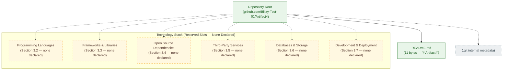

### 3.8.2 Forward-Compatibility Diagram

The diagram below illustrates the expected progression as future commits introduce technology artifacts. Each reserved slot becomes a populated node only when a corresponding manifest, configuration file, or source-code module is committed to the repository.

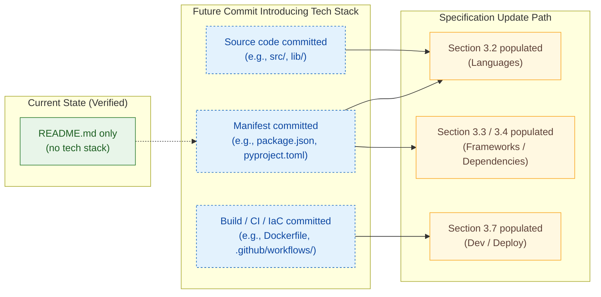

---

## 3.9 FORWARD-COMPATIBILITY SCAFFOLDING

### 3.9.1 Reservation Rules for Future Technology Declarations

To preserve forward compatibility per the principle established in Section 1.4.2, the following reservation rules govern how this Technology Stack section will be extended when the first technology artifact is committed.

| Rule ID | Reservation Rule | Activation Trigger |
|---|---|---|
| R-3-001 | The subsection headings (3.2 through 3.7) shall not be renumbered when first populated. | First technology artifact committed. |
| R-3-002 | A new technology entry shall append a row to the relevant subsection's table; existing "None declared" rows shall be replaced inline. | First entry in a given subsection. |
| R-3-003 | Every newly declared technology must cite the tracked artifact (file path and commit SHA) that introduced it. | Each technology declaration. |
| R-3-004 | Version numbers must be sourced from a manifest or lockfile committed to the repository; no version may be inferred. | Each technology declaration. |
| R-3-005 | The Default Technology Stack provided in the original authoring brief shall not be retroactively imported; only artifacts actually committed shall be recorded. | All future updates. |
| R-3-006 | The current-state diagram (Section 3.8.1) shall be updated to convert reserved (amber/dashed) nodes into populated (green/solid) nodes as artifacts are committed. | Each diagram-affecting commit. |

### 3.9.2 Update Triggers by Subsection

The table below maps each Technology Stack subsection to the specific repository event that should trigger an update.

| Subsection | Update Trigger Event | Required Source Artifact |
|---|---|---|
| 3.2 Programming Languages | First source file in any executable language committed. | Source file (`.py`, `.js`, `.ts`, `.go`, `.rs`, `.java`, `.kt`, `.swift`, `.m`, `.cs`, etc.) plus a runtime descriptor when available. |
| 3.3 Frameworks & Libraries | First framework dependency declared in a manifest. | Dependency manifest (`package.json`, `pyproject.toml`, `Gemfile`, `go.mod`, `Cargo.toml`, `pom.xml`, `build.gradle`, etc.). |
| 3.4 Open Source Dependencies | First dependency entry in a manifest plus the corresponding lockfile commit. | Manifest and lockfile pair. |
| 3.5 Third-Party Services | First SDK reference, vendor-specific configuration file, environment-variable template, or service descriptor committed. | SDK import in source code, vendor config (e.g., `auth0.config.json`), or `.env.example`. |
| 3.6 Databases & Storage | First schema, migration, ORM model, or connection-string template committed. | Migration file, schema file, ORM model, or connection descriptor. |
| 3.7 Development & Deployment | First `Dockerfile`, CI workflow, IaC file, or build script committed. | `Dockerfile`, `.github/workflows/*.yml`, `*.tf`, `Makefile`, etc. |

### 3.9.3 Cross-Reference Map

The following cross-references corroborate the empty-baseline finding documented throughout this section and provide an audit trail to other parts of this Technical Specification.

| Cross-Reference | Subject Confirmed |
|---|---|
| Section 1.1.1 | Authoritative baseline statement of repository state (one tracked file, one commit). |
| Section 1.2.1 | No integration artifacts, vendor configurations, SDK references, environment templates, or identity-provider configurations. |
| Section 1.2.2 | Exhaustive manifest-inventory table confirming absence of every conventional dependency / build / container / CI / tooling manifest. |
| Section 1.3.1.1 | "Key Technical Requirements — None declared; no technology stack, runtime, or platform is specified." |
| Section 1.3.2 | Persistence, IaC, CI/CD, containerization, observability, and security all marked out of scope due to absence. |
| Section 1.4.2 | Four governing posture principles (Evidence-Based, No Fabrication, Explicit Absence, Forward Compatibility). |
| Section 1.4.3 | Explicit instruction that the technology stack section "will therefore describe the absence of declared artifacts." |
| Section 2.1.2 | Reiteration of the four posture principles in the Product Requirements context. |
| Section 2.4.2 | Integration-points table confirming no inbound APIs, outbound calls, message brokers, or identity providers. |
| Section 2.4.3 | Shared-components table confirming no libraries, services, cross-cutting concerns, or reusable assets. |
| Section 2.5.1 | Technical-constraints table confirming no language, platform, library, or interface constraints. |
| Section 2.5.3 | Security and maintenance considerations confirming no auth model and no observability. |
| Section 2.7.1 | Assumption A-2-001: "The `Artifact4` repository contains exactly one tracked file (`README.md`, 11 bytes) and exactly one Git commit (`4b99931`)." |

---

## 3.10 REFERENCES

### 3.10.1 Files Examined

- `README.md` — The single tracked file in the repository (11 bytes, containing the literal text `# Artifact4`). Verified to contain no technology-stack indicators, no shebang lines, no dependency directives, and no language-specific syntax beyond a Markdown H1 heading.

### 3.10.2 Folders Explored

- `/` (repository root, depth 0) — Confirmed to contain exactly one direct child (`README.md`) and zero subdirectories beyond the Git internal `.git/` metadata directory.

### 3.10.3 Manifest / Indicator Categories Verified Absent

The following file-name patterns were searched for across the entire repository and confirmed absent. This enumeration is reproduced from Section 1.2.2 and corroborated by the per-section searches documented in this specification:

- JavaScript / Node.js: `package.json`, `package-lock.json`, `yarn.lock`, `pnpm-lock.yaml`
- Python: `requirements.txt`, `pyproject.toml`, `Pipfile`, `setup.py`
- Java / JVM: `pom.xml`, `build.gradle`, `settings.gradle`
- Ruby: `Gemfile`, `Gemfile.lock`
- Go: `go.mod`, `go.sum`
- Rust: `Cargo.toml`, `Cargo.lock`
- .NET: `*.csproj`, `*.sln`
- Containerization: `Dockerfile`, `docker-compose.yml`
- Build Orchestration: `Makefile`, `Taskfile.yml`
- Continuous Integration: `.github/workflows/`, `.gitlab-ci.yml`, `Jenkinsfile`
- Ignore / Tooling Configuration: `.gitignore`, `.blitzyignore`, `.editorconfig`

### 3.10.4 Technical Specification Sections Cross-Referenced

- **Section 1.1 EXECUTIVE SUMMARY** — Established baseline repository state (one commit, one tracked file).
- **Section 1.2 SYSTEM OVERVIEW** — Provided the authoritative manifest-inventory table and confirmed Markdown is a content notation, not a technology stack.
- **Section 1.3 SCOPE** — Enumerated out-of-scope items including containerization, IaC, CI/CD, persistence, observability, and security.
- **Section 1.4 BASELINE STATE AND SPECIFICATION POSTURE** — Established the four binding posture principles (Evidence-Based Statements Only, No Fabrication of Capabilities, Explicit Documentation of Absence, Forward Compatibility) governing this section.
- **Section 2.1 BASELINE CONDITION AND DOCUMENTATION POSTURE** — Reiterated the four posture principles and the empty-baseline finding.
- **Section 2.4 FEATURE RELATIONSHIPS** — Confirmed no integration points, no shared libraries / packages, and no cross-cutting concerns.
- **Section 2.5 IMPLEMENTATION CONSIDERATIONS** — Provided the canonical technical-constraints table identifying Language/Runtime, Platform/OS, Library/Framework, and Interface/Protocol constraints as not declared.
- **Section 2.7 ASSUMPTIONS, CONSTRAINTS, AND VERSIONING** — Established Assumption A-2-001 declaring repository state authoritative.

# 4. Process Flowchart

## 4.1 BASELINE CONDITION AND DOCUMENTATION POSTURE

### 4.1.1 Repository State Affecting Process Definitions

This Process Flowchart section inherits the verified empty-baseline state of the `Artifact4` repository as established by Section 1.4.1 of this Technical Specification. The authoritative repository state is restated below for self-contained reference:

| Property | Verified Value | Source |
|---|---|---|
| Tracked Files (count) | 1 | Recursive filesystem inspection |
| Tracked File Path | `/README.md` | Filesystem inspection |
| Tracked File Size | 11 bytes | Byte-level inspection |
| Tracked File Content | Exactly `# Artifact4` (single Markdown H1 heading, no trailing newline) | Byte-level inspection |
| Subdirectories (excluding `.git/`) | 0 | Recursive filesystem inspection |
| Git Commits (total) | 1 (`4b99931`, "Initial commit") | Git history review |
| Git Tags | None | `git tag -l` |
| Remote Origin | `github.com/Blitzy-Test-01/Artifact4.git` | `git remote -v` |
| Tooling Manifests (`.gitignore`, `.blitzyignore`, CI/CD, IaC, container) | None present | Filesystem inspection |

Because the repository implements zero runtime capabilities — as enumerated in Section 1.2.2 ("There is no executable code, script, function, command, or workflow definition in any tracked file") — there are no processes to flowchart, no decision points to diamond, no states to transition between, no integrations to sequence, and no errors to handle. Every conventional element of a Process Flowchart section is therefore documented in this section as absent rather than fabricated.

### 4.1.2 Posture Principles Applied to Process Flowcharts

This section adheres to the four binding documentation principles enumerated in Section 1.4.2 of this Technical Specification, applied to the process-flowchart domain:

| Posture Principle | Application to Section 4 |
|---|---|
| Evidence-Based Statements Only | Every assertion in this section is grounded in the single tracked artifact (`README.md`) or in verifiable Git metadata. No process, workflow, sequence, state, or error path is asserted without a corresponding tracked artifact. |
| No Fabrication of Capabilities | This section does not invent user journeys, decision points, system boundaries, integration endpoints, state machines, retry policies, or SLA values that are not declared in the repository. |
| Explicit Documentation of Absence | Each conventional process-flowchart category requested by the section prompt — core business processes, integration workflows, validation rules, state management, error handling — is enumerated and explicitly recorded as absent. |
| Forward Compatibility | The section is structured so that future commits introducing source code, manifests, or workflow definitions can be incorporated by extending — rather than rewriting — the subsections, tables, and diagrams below. |

### 4.1.3 Authoritative Constraint Governing This Section

Section 2.7.2 of this Technical Specification establishes Constraint **C-2-004**, which directly governs the present section:

> **C-2-004**: No process flowchart reference may be made because no processes are defined in the repository.

Constraint C-2-004 prohibits this section from referencing flowcharted processes that do not exist. It does not, however, prohibit (a) the structural enumeration of the conventional categories that a Process Flowchart section would contain when populated, (b) empty-state diagrams that visually represent the absent slots, or (c) forward-compatibility scaffolding that prepares the section for future population. Subsections 4.2 through 4.6 operate strictly within these allowances.

---

## 4.2 SYSTEM WORKFLOWS

### 4.2.1 Core Business Processes

The section prompt requests documentation of end-to-end user journeys, system interactions, decision points, and error handling paths constituting the core business processes of the system. Because no features have been catalogued (Section 2.2, "The repository declares zero product features"), no functional requirements exist (Section 2.3, "The repository declares zero functional requirements"), and no user workflows have been defined (Section 1.3.1.1, "Primary User Workflows — None defined; no UI, CLI, API, or workflow specification exists"), there are no core business processes to document. The table below records this status for each conventionally-expected element.

| Core Business Process Element | Declared in Repository? | Source of Record |
|---|---|---|
| End-to-End User Journeys | No | No UI, CLI, API, or workflow specification exists (Section 1.3.1.1). |
| System Interactions Between Components | No | No modules, services, microservices, libraries, packages, layers, or subsystems are defined (Section 1.2.2). |
| Decision Points / Conditional Branches | No | No executable logic of any kind is present in the repository (Section 1.2.2). |
| Error Handling Paths (Business-Level) | No | No source code, no error handlers, no exception flows are committed (Sections 1.2.2, 1.3.2). |
| Happy-Path Sequences | No | No primary user workflow has been declared (Section 1.3.1.1). |
| Alternative-Path Sequences | No | No primary user workflow has been declared (Section 1.3.1.1). |

### 4.2.2 Integration Workflows

The section prompt requests documentation of data flow between systems, API interactions, event processing flows, and batch processing sequences constituting the integration workflows of the system. Section 1.2.1 ("Integration with Existing Enterprise Landscape") and Section 2.4.2 ("Integration Points") together establish that no integration artifacts of any kind exist in the repository. The table below records this status for each conventionally-expected integration workflow element.

| Integration Workflow Element | Declared in Repository? | Source of Record |
|---|---|---|
| Data Flow Between Internal Systems | No | No modules or subsystems exist (Section 1.2.2). |
| Data Flow to/from External Systems | No | No API client code, SDK references, or service stubs are present (Section 1.2.1). |
| Inbound API Interactions | No | No API definitions (REST, GraphQL, gRPC, or otherwise) exist (Section 1.3.2). |
| Outbound API Interactions | No | No client SDKs or service stubs are committed (Section 2.4.2). |
| Event Processing Flows | No | No message-broker, database, queue, or external-service descriptors are present (Section 1.2.1). |
| Batch Processing Sequences | No | No scripts, schedulers, cron specifications, or job definitions exist (Section 1.2.2). |
| Webhook / Callback Flows | No | No webhook handlers or callback endpoints are committed (Section 1.3.2). |
| File-Transfer Integration Flows | No | No file-watcher, SFTP, or batch-export configuration exists (Section 1.3.2). |

### 4.2.3 Current-State Process Topology Diagram

The diagram below mirrors the architectural decomposition style established in Sections 1.2.2 and 3.8.1 of this Technical Specification. Solid green nodes indicate artifacts physically present in the repository; dashed amber nodes indicate reserved structural slots awaiting future declarations of processes, workflows, or sequences.

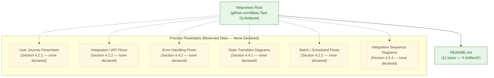

---

## 4.3 FLOWCHART REQUIREMENTS

### 4.3.1 Required Flowchart Elements

The section prompt enumerates a set of elements that every major workflow diagram must include. Because no workflows exist in the repository, none of these elements can be drawn from observed evidence. The table below records the status of each conventionally-required element so that future contributors can populate it without restructuring the section.

| Required Flowchart Element | Declared in Repository? | Source of Record |
|---|---|---|
| Start Points (Entry Points / Triggers) | No | No `main()` functions, CLI commands, HTTP routes, message handlers, or scheduled triggers exist (Section 1.2.2). |
| End Points (Terminal States) | No | No terminal states are defined because no workflows exist (Section 1.3.1.1). |
| Process Steps | No | No executable logic is committed (Section 1.2.2). |
| Decision Diamonds (Branches) | No | No conditional logic exists in any tracked file (Section 1.2.2). |
| System Boundaries | No | "System Boundaries — Not defined; there is no operational system to bound." (Section 1.3.1.2). |
| User Touchpoints | No | "User Groups Covered — None defined." (Section 1.3.1.2). |
| Error States | No | No error states, exception classes, or error codes are declared (Section 1.3.2). |
| Recovery Paths | No | No recovery procedures, runbooks, or compensating actions are committed (Section 1.3.2). |
| Timing / SLA Annotations | No | No SLOs, SLAs, timeout configurations, or performance budgets are documented (Sections 1.2.3 and 2.5.2). |
| Swim Lanes (Actors / Systems) | No | No actors, roles, or system components are defined (Sections 1.2.2 and 1.3.1.2). |

### 4.3.2 Validation Rules

The section prompt requests documentation of validation rules applied at each step of a workflow, including business rules, data-validation requirements, authorization checkpoints, and regulatory-compliance checks. Section 2.3.3 of this Technical Specification has already recorded that all four validation-rule categories are absent from the repository. The table below summarizes this status for the present section.

| Validation Rule Category | Declared in Repository? | Source of Record |
|---|---|---|
| Business Rules at Each Workflow Step | No | "Business Rules — No — Domain model, policy document, or rules-engine configuration." (Section 2.3.3). |
| Data Validation Requirements (Input / Output) | No | "Data Validation — No — Schema-validation code, JSON Schema, or input-sanitization layer." (Section 2.3.3). |
| Authorization Checkpoints | No | "No identity, role, permission, or session mechanism is defined." (Sections 1.3.2 and 2.5.3). |
| Regulatory Compliance Checks | No | "Compliance Requirements — No — Compliance attestation, audit checklist, or regulatory mapping." (Section 2.3.3). |
| Pre-Conditions / Post-Conditions | No | No acceptance criteria or contract specifications are committed (Section 1.2.3). |
| Invariants Across Workflow Steps | No | No formal contracts or assertions are committed (Section 2.3.3). |

---

## 4.4 TECHNICAL IMPLEMENTATION

### 4.4.1 State Management

The section prompt requests documentation of state transitions, data-persistence points, caching requirements, and transaction boundaries. Section 3.6 of this Technical Specification has already established that no data stores, caches, or storage configurations are present in the repository. The table below records this status for state-management elements specifically.

| State Management Element | Declared in Repository? | Source of Record |
|---|---|---|
| State Transitions / State Machines | No | No state-bearing code, finite-state-machine definitions, or workflow engines exist (Section 1.2.2). |
| Data Persistence Points | No | "No data store configuration, schema, or migration is present." (Section 1.3.2; Section 3.6.1). |
| Caching Requirements | No | No cache client dependencies, cache configurations, or cache invalidation logic are committed (Section 3.6.2). |
| Transaction Boundaries (ACID / SAGA) | No | No database, message-broker, or transaction-manager configuration exists (Sections 3.6.1 and 1.2.1). |
| Idempotency Keys / Mechanisms | No | No idempotency middleware, deduplication tables, or replay logs are committed (Section 2.5.2). |
| Distributed-Transaction Coordination | No | No services or brokers exist that would participate in distributed transactions (Section 2.4.2). |

### 4.4.2 Error Handling

The section prompt requests documentation of retry mechanisms, fallback processes, error-notification flows, and recovery procedures. Sections 2.5.2 ("Resilience Patterns — No"), 3.5.3 (no observability or APM services declared), and 3.6.3 ("Disaster Recovery Plan — No — Operational runbook") together establish that no error-handling infrastructure exists in the repository. The table below records this status for each conventional error-handling element.

| Error Handling Element | Declared in Repository? | Source of Record |
|---|---|---|
| Retry Mechanisms (Exponential Backoff, Circuit Breaker, etc.) | No | "No — Code or configuration implementing such patterns." (Section 2.5.2). |
| Fallback Processes (Graceful Degradation) | No | No fallback handlers, default responses, or feature flags are committed (Section 2.5.2). |
| Error Notification Flows (Alerts, Pages, Tickets) | No | No alerting, paging, or incident-management integration is configured (Section 3.5.3). |
| Recovery Procedures (Runbooks, Playbooks) | No | "Disaster Recovery Plan — No — Operational runbook." (Section 3.6.3). |
| Dead-Letter Queues / Poison-Message Handling | No | No message broker or queue is configured (Sections 1.2.1 and 2.4.2). |
| Compensating Transactions / Saga Rollback | No | No transaction coordinator or saga orchestrator exists (Section 4.4.1). |
| Timeout Policies | No | No timeout configurations exist in any tracked file (Sections 2.5.2 and 4.3.1). |
| Bulkhead / Resource-Isolation Policies | No | No resource-isolation code or configuration is committed (Section 2.5.2). |

---

## 4.5 REQUIRED DIAGRAMS

This subsection responds directly to the five Mermaid diagrams enumerated in the section prompt. In every case, because no processes, features, errors, integrations, or states are defined in the repository, the diagrams are presented as empty-state placeholders using the same colour-coded convention established in Sections 2.4.1, 3.8.1, and 3.8.2: amber-dashed nodes represent reserved slots awaiting future declarations.

### 4.5.1 High-Level System Workflow

The diagram below represents the high-level system workflow in its empty-baseline state. Every conventional element (start, process, decision, end) is shown as a reserved slot to be populated when corresponding artifacts are committed.

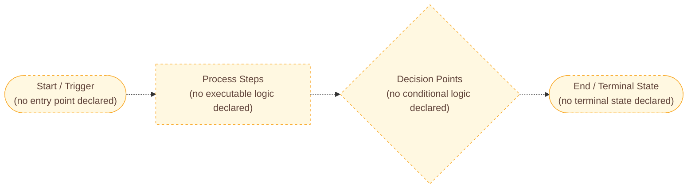

### 4.5.2 Detailed Process Flows per Core Feature

The section prompt requests one detailed process flow per core feature. Section 2.2 of this Technical Specification confirms that the repository declares zero product features. Consequently, the per-feature process-flow catalogue is empty. The diagram below preserves the structural slot for this catalogue, following the same empty-state convention used in Section 2.4.1.

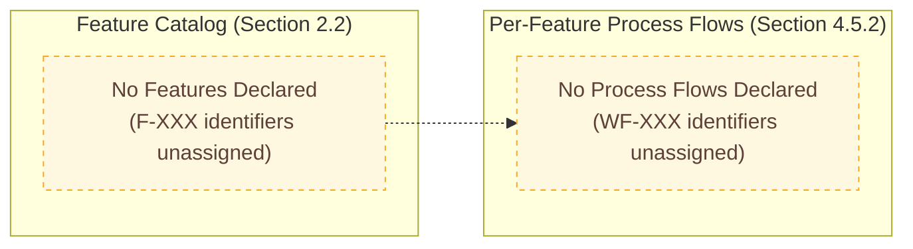

### 4.5.3 Error Handling Flowchart

The diagram below represents the error-handling flowchart in its empty-baseline state. The conventional stages — trigger, classify, retry, fallback, notify, recover — are shown as reserved slots so that future error-handling code can be mapped onto them without restructuring the diagram.

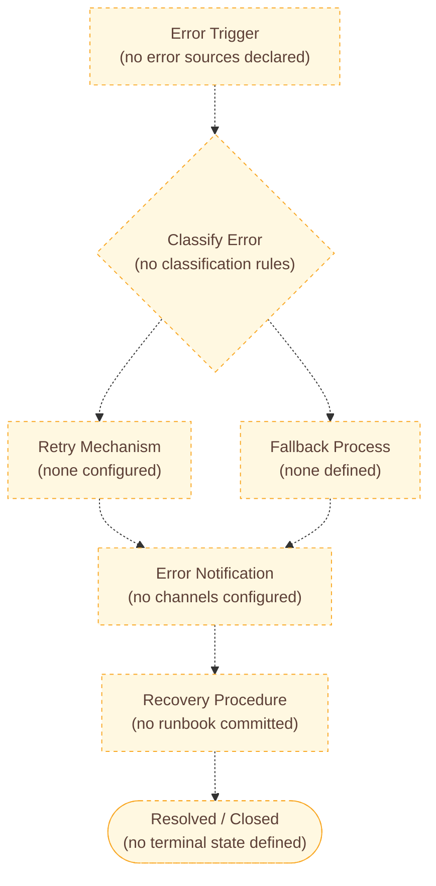

### 4.5.4 Integration Sequence Diagram

The diagram below represents the integration sequence diagram in its empty-baseline state. No participants, messages, or interactions are drawn because none exist in the repository (Section 1.2.1, Section 2.4.2). The participants are labelled as undeclared to convey the reserved-slot semantics consistent with Section 4.2.3.

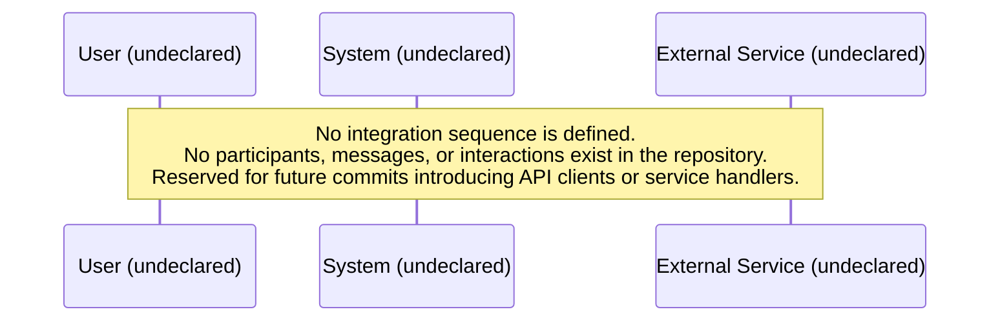

### 4.5.5 State Transition Diagram

The diagram below represents the state-transition diagram in its empty-baseline state. A single placeholder state is shown to preserve the diagram skeleton; no real transitions are declared because no state-bearing entities exist in the repository (Section 4.4.1).

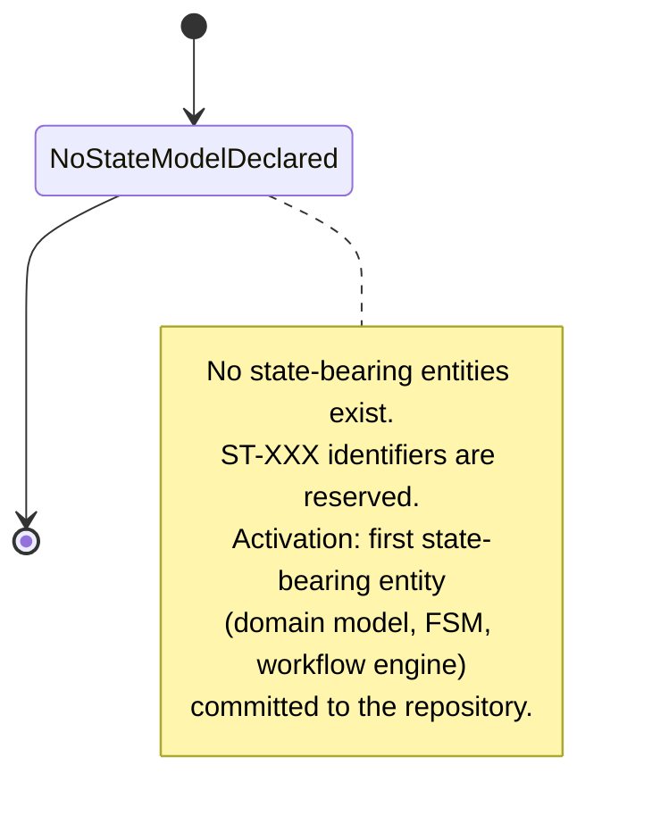

---

## 4.6 FORWARD-COMPATIBILITY SCAFFOLDING

This subsection establishes the structural conventions by which Section 4 will be extended when the first process-bearing artifact is committed to the repository. The conventions follow the pattern established in Section 3.9 (Reservation Rules R-3-001 through R-3-006).

### 4.6.1 Reservation Rules for Future Process Declarations

| Rule ID | Reservation Rule | Activation Trigger |
|---|---|---|
| R-4-001 | The subsection headings (4.2 through 4.5) shall not be renumbered when first populated. | First process-bearing artifact committed. |
| R-4-002 | A new workflow entry shall append a row to the relevant subsection's table; existing "No" rows shall be replaced inline. | First workflow declared in a given subsection. |
| R-4-003 | Every newly declared process, workflow, or state transition must cite the tracked artifact (file path and commit SHA) that introduced it. | Each process declaration. |
| R-4-004 | Mermaid empty-state diagrams (Sections 4.5.1 through 4.5.5) shall be incrementally converted: amber-dashed nodes become solid green nodes as the corresponding tracked artifacts are committed. | Each diagram-affecting commit. |
| R-4-005 | No process flowchart reference may be made in this section or in cross-referencing sections (e.g., Section 2.6.3) until the corresponding process is committed to the repository. This rule reinforces Constraint C-2-004 from Section 2.7.2. | All updates. |
| R-4-006 | Identifier allocation (workflow `WF-XXX`, sequence diagram `SD-XXX`, state transition `ST-XXX`, error flow `EF-XXX`) shall begin at `001` and increment monotonically; identifiers shall not be retroactively reused. | Each first-of-kind declaration. |
| R-4-007 | SLA, timing, and timeout annotations shall be added to flowcharts only when supported by a committed configuration file, SLO document, or performance budget; no SLA may be inferred. | Each timing-affecting commit. |
| R-4-008 | Swim lanes shall be introduced only when the actors or systems they represent are declared in the repository (e.g., as services, user roles, or external systems in a manifest or source file). | First multi-actor workflow declared. |

### 4.6.2 Activation Triggers by Subsection

The table below maps each subsection of Section 4 to the specific repository event that should trigger an update. This mirrors the structure of Section 3.9.2.

| Subsection | Update Trigger Event | Required Source Artifact |
|---|---|---|
| 4.2.1 Core Business Processes | First user-facing workflow defined in source code, design document, or workflow-engine configuration. | Source file containing a handler, controller, command, or workflow definition. |
| 4.2.2 Integration Workflows | First SDK reference, API client, message-broker configuration, webhook handler, or batch-job specification committed. | SDK import, vendor config, `.env.example`, broker descriptor, or scheduler config. |
| 4.3.1 Required Flowchart Elements | First entry point (HTTP route, CLI command, message handler, scheduled job) committed. | Source file with declared entry point and at least one downstream call. |
| 4.3.2 Validation Rules | First validation library, schema file, authorization middleware, or compliance check committed. | Source file with validation logic, JSON Schema file, IAM policy, or compliance attestation. |
| 4.4.1 State Management | First state-bearing entity (domain model, ORM model, FSM, workflow engine) committed. | Source file defining states and/or transitions, or migration introducing a state column. |
| 4.4.2 Error Handling | First `try`/`catch`, retry decorator, circuit-breaker, fallback handler, or error-notification integration committed. | Source file implementing error handling, or configuration of an APM/incident-management service. |
| 4.5.1 High-Level System Workflow | First end-to-end flow committed (entry point + processing + persistence or response). | Source files spanning the end-to-end flow. |
| 4.5.2 Detailed Process Flows per Feature | First feature (`F-001`) catalogued in Section 2.2 with associated source code. | Feature record in Section 2.2 plus implementing source files. |
| 4.5.3 Error Handling Flowchart | First error-handling code path committed. | Source file with error-handling logic. |
| 4.5.4 Integration Sequence Diagram | First service-to-service call, API endpoint, or webhook interaction committed. | API client/server source files, OpenAPI spec, or message-handler source. |
| 4.5.5 State Transition Diagram | First state machine or state-bearing model committed. | Source file defining states and transitions. |

### 4.6.3 Identifier Allocation Plan

To preserve forward compatibility, the following identifier namespaces are reserved for use when Section 4 is first populated. No identifier in any of these namespaces is currently allocated, in compliance with Constraint C-2-004 (Section 2.7.2).

| Identifier Namespace | Purpose | Format | Currently Allocated |
|---|---|---|---|
| `WF-XXX` | Workflow / business-process identifier | Three-digit zero-padded numeric suffix, starting `WF-001`. | None |
| `SD-XXX` | Sequence diagram identifier | Three-digit zero-padded numeric suffix, starting `SD-001`. | None |
| `ST-XXX` | State transition / state-machine identifier | Three-digit zero-padded numeric suffix, starting `ST-001`. | None |
| `EF-XXX` | Error-handling flow identifier | Three-digit zero-padded numeric suffix, starting `EF-001`. | None |
| `IF-XXX` | Integration / batch flow identifier | Three-digit zero-padded numeric suffix, starting `IF-001`. | None |
| `R-4-XXX` | Reservation rule identifier within this section | Major-section prefix followed by three-digit suffix, starting `R-4-001` (already allocated R-4-001 through R-4-008 above). | R-4-001 through R-4-008 |

### 4.6.4 Forward-Compatibility Progression Diagram

The diagram below illustrates how the empty-baseline Section 4 will progress to a populated state as future commits introduce process-bearing artifacts. It mirrors the forward-compatibility diagram in Section 3.8.2.

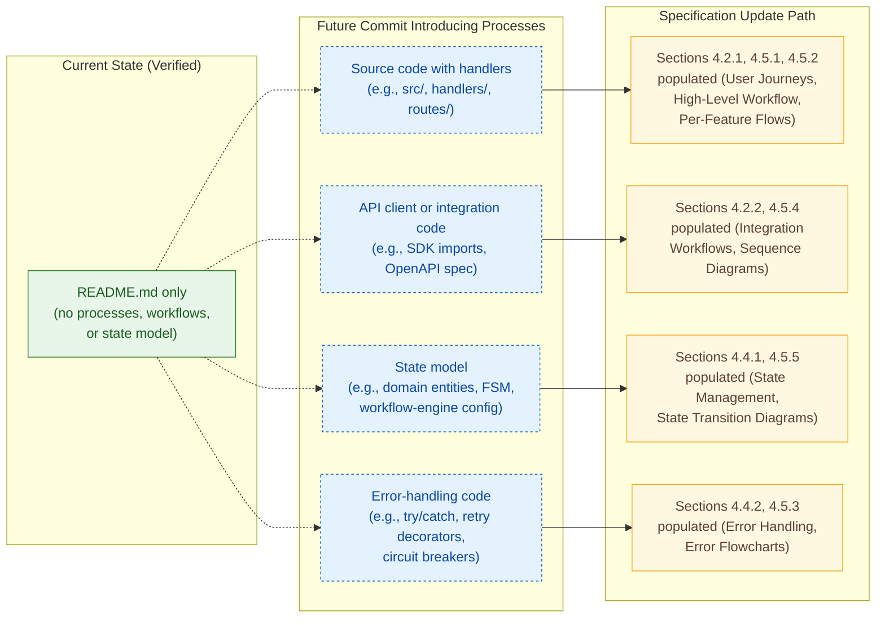

---

## 4.7 REFERENCES

### 4.7.1 Files Examined

| File | Description of Relevance |
|---|---|
| `/README.md` | Sole 11-byte tracked file containing only the literal text `# Artifact4`. Byte-level inspection confirmed that no process definitions, workflow scripts, business logic, integration descriptors, state machines, or error handlers exist in the repository. |

### 4.7.2 Folders Explored

| Folder | Depth | Description of Relevance |
|---|---|---|
| `/` (repository root) | 0 | Confirmed exactly one direct child (`README.md`) and zero subdirectories beyond `.git/`. No deeper structure exists to explore for process-bearing artifacts. |

### 4.7.3 Technical Specification Sections Cross-Referenced

| Section | Relevance to Section 4 |
|---|---|
| Section 1.1 (Executive Summary) | Establishes authoritative repository state (one tracked file, one commit). |
| Section 1.2.1 (Project Context — Integration with Existing Enterprise Landscape) | Confirms absence of API clients, SDKs, vendor configurations, message brokers, and identity providers — the conventional source of integration workflows. |
| Section 1.2.2 (High-Level Description) | Confirms zero runtime capabilities, zero modules, and zero subsystems — the conventional source of system interactions and decision points. |
| Section 1.2.3 (Success Criteria) | Confirms absence of measurable objectives, KPIs, and SLOs — the conventional source of timing and SLA annotations. |
| Section 1.3.1.1 (Core Features and Functionalities) | Confirms that no primary user workflows are defined. |
| Section 1.3.1.2 (Implementation Boundaries) | Confirms that no system boundaries, user groups, or data domains are defined. |
| Section 1.3.2 (Out-of-Scope Elements) | Enumerates authentication, persistence, integrations, IaC, CI/CD, observability, and security as out of scope — the conventional sources of authorization checkpoints, error notifications, and compliance checks. |
| Section 1.4.1 (Authoritative Statement of Repository State) | Provides the verified baseline that grounds every "Not declared" assertion in Section 4. |
| Section 1.4.2 (Documentation Posture Adopted by This Specification) | Defines the four posture principles applied throughout Section 4. |
| Section 1.4.3 (Implications for Downstream Sections) | Establishes that all downstream sections, including Section 4, inherit the empty-baseline condition. |
| Section 2.2 (Feature Catalog) | Confirms that zero product features are declared, justifying the empty per-feature process-flow catalogue in Section 4.5.2. |
| Section 2.3 (Functional Requirements) | Confirms that zero functional requirements are declared. |
| Section 2.3.3 (Validation Rules) | Confirms that business rules, data validation, security requirements, and compliance requirements are all undeclared, justifying Section 4.3.2. |
| Section 2.4.1 (Feature Dependency Map) | Establishes the empty-state Mermaid diagram pattern reused in Sections 4.2.3 and 4.5.2. |
| Section 2.4.2 (Integration Points) | Confirms absence of inbound APIs, outbound calls, message brokers, and identity providers, justifying Section 4.2.2 and Section 4.5.4. |
| Section 2.4.3 (Shared Components and Common Services) | Confirms absence of shared libraries, common services, and cross-cutting concerns. |
| Section 2.5.2 (Performance & Scalability and Resilience Patterns) | Confirms absence of resilience patterns, retry mechanisms, and SLA targets, justifying Section 4.4.2. |
| Section 2.5.3 (Authentication / Authorization and Observability) | Confirms absence of identity, authorization, and observability mechanisms, justifying Section 4.3.2 (authorization checkpoints) and Section 4.4.2 (error notification flows). |
| Section 2.6.3 (Cross-References to Other Sections) | Establishes the explicit statement that "No process flowcharts are referenced because no processes are defined in the repository," anchoring the present section's posture. |
| Section 2.7.1 (Documented Assumptions) | Provides Assumption A-2-001 confirming the authoritative repository state. |
| Section 2.7.2 (Constraints Affecting Requirements) | Provides Constraint C-2-004, the direct authoritative constraint governing Section 4. |
| Section 3.5.1 (Third-Party Services — Inbound and Outbound) | Confirms absence of external APIs, inbound integrations, outbound integrations, and webhooks. |
| Section 3.5.3 (Third-Party Services — Observability and APM) | Confirms absence of alerting, paging, and incident-management integrations, justifying Section 4.4.2 (error notification flows). |
| Section 3.6.1 (Primary and Secondary Data Stores) | Confirms absence of data stores, schemas, and migrations, justifying Section 4.4.1 (data persistence points and transaction boundaries). |
| Section 3.6.2 (Caching) | Confirms absence of cache clients and cache configuration, justifying Section 4.4.1 (caching requirements). |
| Section 3.6.3 (Backup, Recovery, and Operational Runbooks) | Confirms absence of disaster recovery plans and operational runbooks, justifying Section 4.4.2 (recovery procedures). |
| Section 3.8.1 (Current-State Diagram) | Establishes the colour-coded Mermaid diagram convention reused in Section 4.2.3. |
| Section 3.8.2 (Forward-Compatibility Diagram) | Establishes the three-subgraph (Today / Future Commit / Specification Update Path) progression diagram convention reused in Section 4.6.4. |
| Section 3.9.1 (Reservation Rules for Future Technology Declarations) | Establishes the reservation-rule pattern (R-3-001 through R-3-006) reused in Section 4.6.1 as R-4-001 through R-4-008. |
| Section 3.9.2 (Update Triggers by Subsection) | Establishes the activation-trigger pattern reused in Section 4.6.2. |

### 4.7.4 Verification Activities

| Verification Activity | Outcome | Relevance to Section 4 |
|---|---|---|
| Recursive filesystem inspection of repository root | One file (`README.md`); zero subdirectories beyond `.git/` | Confirmed no process-bearing artifacts exist at any path. |
| Byte-level inspection of `README.md` | 11 bytes; literal content `# Artifact4`; no trailing newline | Confirmed no workflow definitions, no embedded process descriptions. |
| Git history review (`git log --all --stat`) | Single commit `4b99931` titled "Initial commit"; no later commits | Confirmed no historical process artifacts have been added and later removed. |
| Git tag enumeration (`git tag -l`) | No tags | Confirmed no release milestones marking workflow completion. |
| Git branch enumeration (`git branch -a`) | `main` only | Confirmed no feature branches contain unmerged process artifacts. |
| Git remote inspection (`git remote -v`) | `github.com/Blitzy-Test-01/Artifact4.git` | Confirmed canonical repository identity. |
| Semantic search: "workflow process business logic implementation" | Zero relevant results | Confirmed no workflow code, business-logic modules, or process definitions are indexed. |
| Semantic search: "configuration file dependency manifest source code" | Zero relevant results | Confirmed no manifests or configuration files exist that could imply workflow infrastructure. |
| Semantic search: "application source code workflow process" (folder scope) | Zero relevant folders | Confirmed no source-code folders exist that could contain processes. |
| Semantic search: "README documentation project description" | Zero relevant results beyond the 11-byte placeholder | Confirmed no narrative documentation describes any process. |
| `.blitzyignore` presence check | Not present | Confirmed no ignore rules are masking process-bearing artifacts. |
| `.gitignore` presence check | Not present | Confirmed no ignore rules are masking process-bearing artifacts. |

# 5. System Architecture

This section is authored under the empty-baseline condition established in Section 1.4.1 of this Technical Specification and inherits the four binding posture principles formalized in Section 1.4.2 (Evidence-Based Statements Only, No Fabrication of Capabilities, Explicit Documentation of Absence, Forward Compatibility). As stated explicitly in Section 1.4.3, the System Architecture section "will therefore describe the absence of declared artifacts in [its] respective domain and will mark every conventionally-expected element as 'not present in the repository' until such artifacts are introduced in subsequent commits."

The remainder of this section enumerates every conventional architectural category (system style, components, data flow, external integrations, technical decisions, cross-cutting concerns) and records the verified status of each against the repository's tracked artifacts. Structural scaffolding (tables, diagrams, identifier namespaces) is preserved so that future commits can extend — rather than rewrite — this section.

## 5.1 BASELINE CONDITION AND DOCUMENTATION POSTURE

### 5.1.1 Authoritative Restatement of Repository State

The architectural analysis below is authored under the verified baseline established in Section 1.4.1 and reproduced here verbatim for unambiguous reference:

> The `Artifact4` repository contains exactly one tracked file (`README.md`, 11 bytes, containing the literal text `# Artifact4`), exactly one Git commit (`4b99931`, "Initial commit"), and no other tracked or indexed content of any kind.

Because the repository contains no source code, no module structure, no service definitions, no dependency manifests, no integration descriptors, no data-store schemas, no caching configurations, no observability instrumentation, and no security configurations, this section documents the **absence of architectural artifacts** rather than fabricating an architecture. Every conventionally-expected architectural element enumerated below is recorded as "not declared in the repository" with originating evidence cross-referenced to other sections of this Technical Specification.

### 5.1.2 Governing Posture Principles Applied to System Architecture

The table below maps each of the four governing posture principles established in Section 1.4.2 to its concrete application within the System Architecture domain.

| Posture Principle | Application to System Architecture |
|---|---|
| Evidence-Based Statements Only | Every architectural assertion is grounded in a tracked artifact (`README.md`) or verifiable Git metadata. No inferred component, service, interface, data flow, or interaction is named. |
| No Fabrication of Capabilities | Architectural style selections, component decompositions, communication patterns, data stores, caches, authentication mechanisms, and SLA targets are not invented when they are not declared in the repository. |
| Explicit Documentation of Absence | Each conventional architectural category (high-level architecture, components, data flow, external integrations, technical decisions, cross-cutting concerns) is enumerated and marked as "not declared in the repository." |
| Forward Compatibility | The subsection scaffolding (5.2 through 5.6) — including component tables, integration tables, decision matrices, and diagram skeletons — is preserved so that future commits can be incorporated by extending, rather than rewriting, the existing structure. |

### 5.1.3 Constraints Governing This Section

The constraints listed below — derived from Sections 2.7.1 and 2.7.2 of this Technical Specification — directly govern the legitimate scope of this System Architecture section.

| Constraint Reference | Statement | Implication for Section 5 |
|---|---|---|
| A-2-001 (Section 2.7.1) | The `Artifact4` repository contains exactly one tracked file (`README.md`, 11 bytes) and exactly one Git commit (`4b99931`). | No architectural artifact exists from which to derive a system architecture description. |
| A-2-002 (Section 2.7.1) | No undeclared features, requirements, or capabilities exist outside the tracked artifact set. | The architecture must not document features, components, or capabilities not present in the repository. |
| C-2-001 (Section 2.7.2) | No feature identifiers (`F-XXX`) may be allocated until a feature is committed. | No per-feature architectural decomposition can be drawn. |
| C-2-002 (Section 2.7.2) | No requirement identifiers (`F-XXX-RQ-YYY`) may be allocated until a parent feature exists. | No requirement-driven architectural elements can be documented. |
| C-2-003 (Section 2.7.2) | No traceability links may be drawn between features, requirements, and tests until any of these artifacts exist. | No traceability between architecture, code, and tests can be expressed. |
| C-2-004 (Section 2.7.2) | No process flowchart reference may be made because no processes are defined in the repository. | No process-driven sequence diagrams or component interactions can be drawn. |
| R-3-005 (Section 3.9.1) | The Default Technology Stack provided in the original authoring brief shall not be retroactively imported; only artifacts actually committed shall be recorded. | The architecture must not reference AWS, Docker, Python, Flask, MongoDB, React, etc. as part of this system (per Section 3.1.3). |
| R-4-007 (Section 4.6.1) | SLA, timing, and timeout annotations shall be added to flowcharts only when supported by a committed configuration file, SLO document, or performance budget; no SLA may be inferred. | No SLA / latency / throughput target may be asserted in this section. |

## 5.2 HIGH-LEVEL ARCHITECTURE

### 5.2.1 System Overview

#### Overall Architectural Style

No overall architectural style (monolith, layered, hexagonal, microservices, event-driven, serverless, modular monolith, micro-frontends, CQRS, or any hybrid) is declared in the repository. As recorded in Section 1.2.2 ("Major System Components"), "No modules, services, microservices, libraries, packages, layers, or subsystems are defined." As recorded in Section 1.2.2 ("Primary System Capabilities"), "The repository implements zero runtime capabilities. There is no executable code, script, function, command, or workflow definition in any tracked file."

Consequently, no architectural style can be observed, named, or justified. The repository contains a single static Markdown placeholder (`README.md`, 11 bytes) and Git metadata; these artifacts do not constitute an executable system architecture.

#### Key Architectural Principles and Patterns

No architectural principles (e.g., separation of concerns, single responsibility, dependency inversion, twelve-factor app), patterns (e.g., MVC, MVVM, repository, mediator, saga, event sourcing, ports-and-adapters), or design idioms are declared in the repository. No design-notes directory, ADR directory (`decisions/`, `docs/adr/`), architectural overview file (`ARCHITECTURE.md`), or principle catalogue is present, as confirmed by recursive filesystem inspection (Section 1.4.1) and the exhaustive manifest inventory in Section 1.2.2.

#### System Boundaries and Major Interfaces

System boundaries are formally undefined. Section 1.3.1.2 of this Technical Specification records "System Boundaries — Not defined; there is no operational system to bound." No inbound interfaces (HTTP APIs, message-broker consumers, scheduled jobs, file watchers, CLI entry points), outbound interfaces (HTTP client calls, SDK invocations, message-broker producers), or shared interfaces (libraries, cross-cutting middleware) are declared. This finding is corroborated by Section 2.4.2 (all four integration-point categories marked "No"), Section 3.5.1 (all six integration categories marked "No"), and Section 1.2.1, which records the absence of "API client code, SDK references, or service stubs," "vendor configuration files or third-party manifest declarations," "environment-variable templates, secret references, or connection-string placeholders," "message-broker, database, queue, or external-service descriptors," and "identity-provider, single-sign-on, or directory-service configurations."

### 5.2.2 Core Components Table

The section prompt requires a Core Components Table enumerating Component Name, Primary Responsibility, Key Dependencies, Integration Points, and Critical Considerations. Section 1.2.2 ("Major System Components") and Section 2.4.3 ("Shared Components and Common Services") together establish that no components exist in the repository. The table below preserves the structural slot for this catalogue using the consistent three-column "Declared in Repository?" pattern established in prior sections (e.g., Sections 2.4.2, 2.4.3, 3.5.1, 4.4.1, 4.4.2).

| Component Category | Declared in Repository? | Source of Record |
|---|---|---|
| Presentation / UI Components | No | No UI assets, templates, view layers, or front-end source files exist (Section 1.2.2; Section 1.3.2). |
| API / Interface Components | No | No API definitions, controllers, route handlers, or interface contracts are committed (Section 2.4.2). |
| Application / Service Components | No | "No modules, services, microservices, libraries, packages, layers, or subsystems are defined." (Section 1.2.2). |
| Domain / Business Logic Components | No | No source code defining business rules, domain entities, or workflows is committed (Section 1.2.2). |
| Integration / Adapter Components | No | No SDK references, API clients, broker adapters, or vendor integrations are committed (Section 1.2.1; Section 3.5.1). |
| Persistence / Data Access Components | No | No ORM models, repositories, schemas, or data-access code is committed (Section 3.6.1). |
| Shared / Cross-Cutting Components | No | "Cross-Cutting Concerns (Logging, Auth, Config) — No — No infrastructure code or configuration is committed." (Section 2.4.3). |
| Observability / Telemetry Components | No | No logging, metrics, or tracing instrumentation is committed (Section 3.5.3; Section 2.5.3). |

The prompt-required columns (Component Name, Primary Responsibility, Key Dependencies, Integration Points, Critical Considerations) are preserved as a reserved schema in Section 5.6.3 below for activation when the first component-bearing artifact is committed.

### 5.2.3 Data Flow Description

#### Primary Data Flows Between Components

No data flows between components exist because no components exist (Sections 1.2.2 and 2.4.3) and no executable logic is committed (Section 1.2.2 — "The repository implements zero runtime capabilities."). Section 4.2.1 of this Technical Specification records that there are "No system interactions between components" and "No decision points / conditional branches." Consequently, no source, sink, transformer, or intermediate processing node can be identified, and no data-flow graph can be drawn.

#### Integration Patterns and Protocols

No integration patterns (request/response, publish/subscribe, request/reply, fire-and-forget, polling, long-polling, server-sent events, webhook callbacks, batch ETL/ELT, change-data-capture) are declared. No wire protocols (HTTP/REST, GraphQL, gRPC, WebSocket, AMQP, MQTT, Kafka protocol, JDBC, ODBC, SOAP) are declared. This finding is corroborated by Section 3.5.1 of this Technical Specification, where every integration category — inbound APIs, outbound REST/GraphQL, message-broker producers, message-broker consumers, webhook receivers, webhook senders — is recorded as "No."

#### Data Transformation Points

No data transformation points (serializers, deserializers, mappers, validators, normalizers, enrichers, aggregators) are declared. Section 4.3.2 of this Technical Specification (Validation Rules) records the absence of validation libraries, schema files, authorization middleware, and compliance checks; Section 4.4.1 records the absence of state-bearing entities and persistence boundaries that would otherwise host transformation logic.

#### Key Data Stores and Caches

No data stores and no caches are declared. Section 3.6.1 of this Technical Specification records the absence of all primary and secondary data stores; Section 3.6.2 records the absence of any caching tier (Redis, Memcached, application-level cache, HTTP cache, CDN cache); Section 3.6.3 records the absence of object/blob storage and the absence of a disaster-recovery plan. Section 4.4.1 confirms that there are no data-persistence points, caching requirements, transaction boundaries, idempotency mechanisms, or distributed-transaction coordination patterns in the repository.

### 5.2.4 External Integration Points

The section prompt requires an External Integration Points table enumerating System Name, Integration Type, Data Exchange Pattern, Protocol/Format, and SLA Requirements. Section 2.4.2 (Integration Points), Section 3.5.1 (External APIs and Integrations), Section 3.5.2 (Authentication, Identity, and Directory Services), and Section 3.5.3 (Monitoring, Observability, and Cloud Services) together establish that no external integration of any kind is declared in the repository.

| Integration Category | Declared in Repository? | Source of Record |
|---|---|---|
| Inbound API Integrations | No | "No API definitions are committed." (Section 2.4.2; Section 1.3.2). |
| Outbound REST / GraphQL Calls | No | "No client SDKs or HTTP-client code committed." (Section 3.5.1; Section 1.2.1). |
| Message-Broker / Queue Producers | No | No broker descriptors are present (Section 3.5.1; Section 1.2.1). |
| Message-Broker / Queue Consumers | No | No broker descriptors are present (Section 3.5.1; Section 1.2.1). |
| Webhook Receivers | No | No API endpoints declared (Section 3.5.1; Section 1.3.2). |
| Webhook Senders | No | No outbound integration code present (Section 3.5.1; Section 1.2.1). |
| Identity-Provider / SSO Integrations | No | No identity-provider configurations are committed (Section 2.4.2; Section 3.5.2). |
| Email / Notification Services | No | No SMTP, transactional-email, or push-notification configuration present (Section 3.5.3). |
| Payment / Billing Services | No | No payment-gateway configuration present (Section 3.5.3). |
| Cloud Platform Services | No | "No IaC, account, or service descriptor present." (Section 3.5.3; Section 1.3.2). |

Per Reservation Rule R-4-007 (Section 4.6.1), the **SLA Requirements** dimension of the prompt-required schema cannot be populated — even speculatively — because no SLO document, performance budget, or timing-configuration file is committed to the repository (Section 1.2.3; Section 2.5.2). The prompt-required columns (System Name, Integration Type, Data Exchange Pattern, Protocol/Format, SLA Requirements) are preserved as a reserved schema in Section 5.6.3 for activation upon the first integration-artifact commit.

### 5.2.5 Current-State High-Level Architecture Diagram

The diagram below renders the verified current state of the `Artifact4` system architecture. It follows the colour convention established in Sections 1.2.2, 3.8.1, and 4.5: solid green nodes represent artifacts physically present in the repository; gray-dashed nodes represent Git internal metadata; amber-dashed nodes represent reserved structural slots awaiting future declarations.

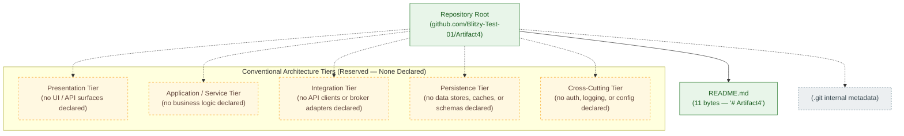

## 5.3 COMPONENT DETAILS

The section prompt requests, for each major component: purpose and responsibilities, technologies and frameworks used, key interfaces and APIs, data persistence requirements, and scaling considerations. Because no components are declared in the repository (Sections 1.2.2 and 2.4.3), and because no technologies or frameworks are declared (Sections 3.2 and 3.3), and because no interfaces, persistence layers, or scaling targets are declared (Sections 2.4.2, 3.5.1, 3.6.1, 2.5.2), the per-component analysis is structurally empty. The reserved-slot table below preserves the prompt's required structure for forward compatibility.

### 5.3.1 Component Inventory and Reserved Attribute Schema

| Component Attribute (per prompt) | Currently Declared? | Source of Record / Future Source Artifact |
|---|---|---|
| Purpose and Responsibilities | No | Module documentation, service specification, or in-code docstrings — none present (Section 1.2.2). |
| Technologies and Frameworks Used | No | Dependency manifest (`package.json`, `pyproject.toml`, `go.mod`, etc.) — none present (Section 3.3; Section 1.2.2). |
| Key Interfaces and APIs | No | API definition (OpenAPI / GraphQL SDL / protobuf), controller, or route handler — none present (Section 3.5.1; Section 2.4.2). |
| Data Persistence Requirements | No | Schema file, migration, ORM model, or connection descriptor — none present (Section 3.6.1; Section 4.4.1). |
| Scaling Considerations | No | Capacity plan, load profile, autoscaling policy, or resource specification — none present (Section 2.5.2). |

### 5.3.2 Component Interaction Diagram

No component interaction can be drawn because no components are declared in the repository (Section 1.2.2; Section 2.4.3). The diagram below preserves the conventional layered structure (inbound interfaces → core components → outbound interfaces) as reserved slots so that future component declarations can be incrementally populated without restructuring the diagram. All edges are dashed and all nodes are amber-styled to indicate reserved-state semantics.

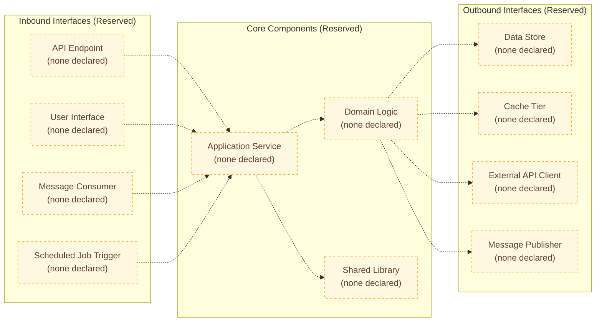

### 5.3.3 Component State Transition Diagram

No state-bearing components, lifecycle states, or transitions are declared. Section 4.4.1 of this Technical Specification records the absence of state transitions, state machines, data persistence points, transaction boundaries, idempotency mechanisms, and distributed-transaction coordination. The diagram below mirrors the empty-state convention established in Section 4.5.5.

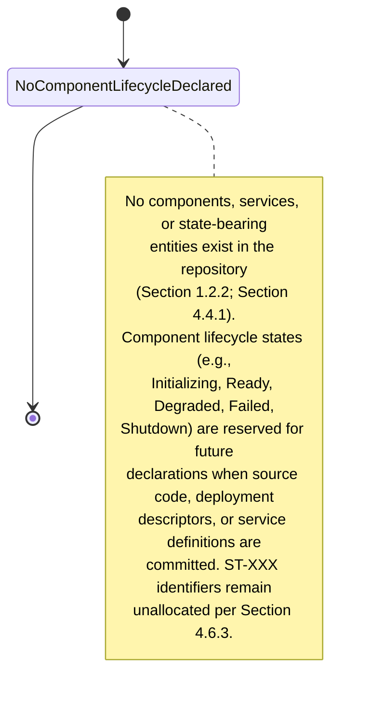

### 5.3.4 Component Sequence Diagram for Key Flows

No component-to-component sequence can be drawn because no components, services, message handlers, API clients, or external systems are declared (Sections 1.2.2, 2.4.2, 3.5.1). The diagram below mirrors the empty-state convention established in Section 4.5.4, preserving the conventional participant set (client, application component, data store, external system) as undeclared.

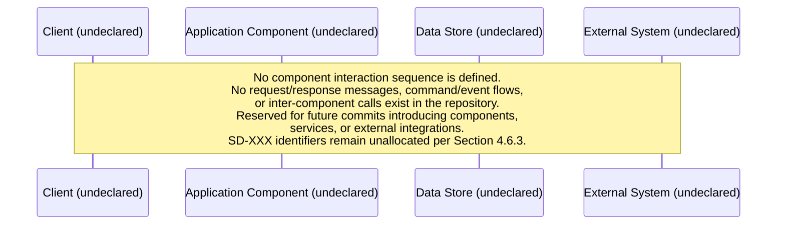

## 5.4 TECHNICAL DECISIONS

The section prompt requests documentation and justification of architecture style decisions, communication pattern choices, data storage solution rationale, caching strategy justification, and security mechanism selection. The repository contains no architecture decision records (ADRs), no `decisions/` directory, no `docs/adr/` directory, no `ARCHITECTURE.md` document, no design-notes file, and no commit messages other than the single "Initial commit" entry. Consequently, no architectural decisions have been recorded, no tradeoffs have been documented, and no rationale exists to be captured. The subsections below preserve the prompt's decision categories as reserved slots.

### 5.4.1 Architecture Style Decisions and Tradeoffs

| Decision Domain | Decision Recorded? | Source of Record |
|---|---|---|
| Architecture Style (Monolith / Layered / Hexagonal / Microservices / Serverless / Event-Driven) | No | No source code, deployment descriptor, or design document records any style selection (Section 1.2.2). |
| Component Decomposition Strategy | No | No modules, services, or packages are defined (Section 1.2.2; Section 2.4.3). |
| Deployment Topology (Single Process / Multi-Service / Mesh) | No | No `Dockerfile`, container manifest, or orchestration descriptor is committed (Section 3.7; Section 1.2.2). |
| Tradeoff Analysis (Cost / Complexity / Operability / Performance) | No | No design memo, ADR, or analysis document is committed. |

### 5.4.2 Communication Pattern Choices

| Decision Domain | Decision Recorded? | Source of Record |
|---|---|---|
| Synchronous vs. Asynchronous Messaging | No | No API definitions or broker descriptors are committed (Section 2.4.2; Section 3.5.1). |
| Request/Response vs. Publish/Subscribe | No | No HTTP client / server code or message-broker code is committed (Section 3.5.1). |
| Protocol Selection (REST / GraphQL / gRPC / AMQP / Kafka / WebSocket) | No | No protocol-specific schema or library reference is committed (Section 3.5.1). |
| Service-Discovery / Routing Mechanism | No | No service registry, load balancer, or routing manifest is committed (Section 3.7). |

### 5.4.3 Data Storage Solution Rationale

| Decision Domain | Decision Recorded? | Source of Record |
|---|---|---|
| Primary Database Selection (Relational / Document / Key-Value / Graph / Time-Series) | No | "Primary and Secondary Data Stores — none declared." (Section 3.6.1). |
| Persistence Strategy (Single-Store / Polyglot / Event-Sourced) | No | No schema, migration, or ORM model is committed (Section 3.6.1; Section 4.4.1). |
| Object / Blob Storage Selection | No | "Object/Blob Storage and Persistence Strategies — none declared." (Section 3.6.3). |
| Backup, Retention, and Archival Policy | No | "Disaster Recovery Plan — No — Operational runbook." (Section 3.6.3). |

### 5.4.4 Caching Strategy Justification

| Decision Domain | Decision Recorded? | Source of Record |
|---|---|---|
| Cache Tier Presence (Application / Distributed / HTTP / CDN) | No | "Caching Solutions — none declared." (Section 3.6.2; Section 4.4.1). |
| Cache Engine Selection (In-Memory / Redis / Memcached / CDN Vendor) | No | No cache-client dependency or configuration is committed (Section 3.6.2). |
| Cache Invalidation Strategy (TTL / Event-Driven / Write-Through / Write-Behind) | No | No cache-invalidation code or configuration is committed (Section 4.4.1). |
| Cache Coherency Across Replicas | No | No replication or coherency configuration is committed. |

### 5.4.5 Security Mechanism Selection

| Decision Domain | Decision Recorded? | Source of Record |
|---|---|---|
| Authentication Mechanism (OAuth 2.0 / OIDC / SAML / mTLS / API Keys / JWT) | No | "Identity, role, or session mechanism — none present." (Section 2.5.3; Section 3.5.2). |
| Authorization Model (RBAC / ABAC / ReBAC / Policy-as-Code) | No | "No identity, role, permission, or session mechanism is defined." (Section 1.3.2; Section 3.5.2). |
| Secrets Management Strategy | No | "Secrets Management Vendor (Vault, AWS Secrets Manager, etc.) — No." (Section 3.5.2). |
| Transport-Layer Security and Encryption-at-Rest Policies | No | No TLS configuration, certificate, or encryption descriptor is committed (Section 3.7; Section 3.5.2). |

### 5.4.6 Architecture Decision Record (ADR) Scaffold

No architecture decision records exist in the repository. The reserved ADR template below establishes the structural convention that future ADRs shall follow when first committed. This convention mirrors the identifier-allocation discipline used for `R-3-XXX` (Section 3.9) and `R-4-XXX` (Section 4.6).

| ADR Template Field | Reserved Content (To Be Populated) |
|---|---|
| ADR Identifier | `AD-001` and subsequent (zero-padded, monotonic; see Section 5.6.3). |
| Title | One-line decision statement. |
| Status | Proposed / Accepted / Superseded / Deprecated. |
| Context | Forces, constraints, and stakeholder concerns motivating the decision. |
| Decision | The specific architectural choice made. |
| Consequences | Positive, negative, and neutral implications. |
| Source Artifact | File path and commit SHA of the artifact that introduced the decision (per Reservation Rule R-5-003 in Section 5.6.1). |

### 5.4.7 Decision Tree Diagram

The diagram below illustrates the reserved decision-tree structure for the five technical-decision categories enumerated in this subsection. All decision nodes and outcome nodes are amber-dashed to indicate reserved-slot semantics.

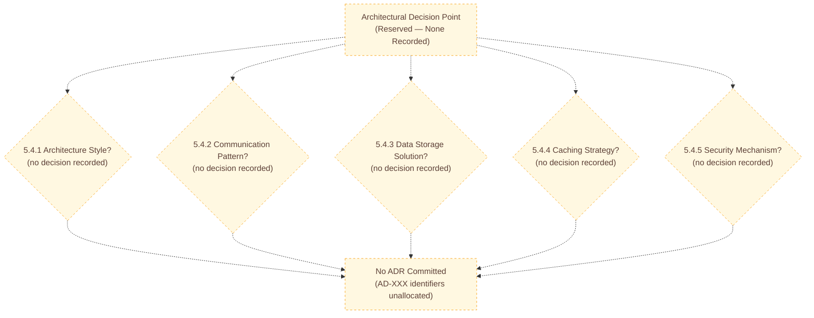

## 5.5 CROSS-CUTTING CONCERNS

The section prompt requests documentation of monitoring/observability, logging/tracing, error handling, authentication/authorization, performance/SLAs, and disaster recovery. Section 2.4.3 of this Technical Specification records that "Cross-Cutting Concerns (Logging, Auth, Config) — No — No infrastructure code or configuration is committed." Each conventional cross-cutting concern is documented as absent below with cross-references to the originating source-of-record sections.

### 5.5.1 Monitoring and Observability Approach

No monitoring or observability instrumentation is declared. Section 3.5.3 of this Technical Specification records "No" for Application Performance Monitoring (APM), Log Aggregation Service, Metrics Backend (Prometheus, Datadog, CloudWatch, etc.), Distributed Tracing Backend (Jaeger, Tempo, X-Ray, etc.), and Error-Reporting Service (Sentry, Bugsnag, Rollbar, etc.). Section 2.5.3 reinforces this with "Observability and Telemetry — No — Logging, metrics, or tracing instrumentation — none present."

| Observability Pillar | Declared in Repository? | Source of Record |
|---|---|---|
| Metrics (RED / USE / Golden Signals) | No | No metrics endpoint, exporter, or backend is declared (Section 3.5.3). |
| Logs (Structured / Unstructured, Aggregation Pipeline) | No | No log emission code, log shipper, or log backend is declared (Section 3.5.3). |
| Traces (Distributed Tracing Spans, Propagation) | No | No tracing instrumentation or backend is declared (Section 3.5.3). |
| Events (Audit Trail, Domain Events) | No | No event emitter or sink is declared (Section 1.2.1; Section 3.5.1). |
| Synthetic / Real-User Monitoring | No | No monitoring agent or probe is committed. |
| Service-Level Indicators (SLIs) | No | No SLI definitions exist (Section 1.2.3). |

### 5.5.2 Logging and Tracing Strategy

No logging or tracing strategy is declared. Section 2.5.3 of this Technical Specification records that no logging, metrics, or tracing instrumentation is present. The conventional dimensions of a logging/tracing strategy — log levels, structured formats, correlation IDs, sampling policies, retention windows, and propagation protocols — are all reserved slots awaiting first-commit activation.

| Logging / Tracing Dimension | Declared in Repository? | Source of Record |
|---|---|---|
| Log Format (JSON / Logfmt / Plain Text) | No | No log emission code committed (Section 3.5.3). |
| Log Levels and Filtering Policy | No | No logging configuration committed (Section 2.5.3). |
| Correlation / Trace ID Propagation | No | No middleware or propagation library committed (Section 3.5.3). |
| Sampling and Retention Policy | No | No sampling configuration or retention policy committed. |
| Sensitive-Data Redaction Rules | No | No redaction middleware or policy file committed (Section 3.5.2). |

### 5.5.3 Error Handling Patterns

No error-handling patterns are declared. Section 4.4.2 of this Technical Specification records "No" for retry mechanisms (exponential backoff, circuit breaker), fallback processes (graceful degradation), error-notification flows (alerts, pages, tickets), recovery procedures (runbooks, playbooks), dead-letter queues / poison-message handling, compensating transactions / saga rollback, timeout policies, and bulkhead / resource-isolation policies. Section 2.5.2 reinforces this with "Resilience Patterns — No — Code or configuration implementing such patterns."

| Error-Handling Pattern | Declared in Repository? | Source of Record |
|---|---|---|
| Try/Catch / Result-Type Discipline | No | No source code committed (Section 4.4.2). |
| Retry with Backoff and Jitter | No | No retry decorator or library reference committed (Section 4.4.2). |
| Circuit Breaker / Bulkhead | No | No resilience-library configuration committed (Section 4.4.2; Section 2.5.2). |
| Fallback / Graceful Degradation | No | No fallback handler or feature flag committed (Section 4.4.2). |
| Dead-Letter Queue / Poison-Message Handling | No | No message broker or queue is configured (Section 4.4.2). |
| Compensating Transactions / Saga Rollback | No | No transaction coordinator or saga orchestrator exists (Section 4.4.2). |
| Timeout Policies | No | No timeout configurations exist in any tracked file (Section 4.4.2; Section 4.3.1). |
| Error Notification / Alerting | No | "No alerting, paging, or incident-management integration is configured." (Section 4.4.2; Section 3.5.3). |

#### Error Handling Flow Diagram

The diagram below illustrates the reserved error-handling flow structure. All stages — error source, classification, retry, circuit-breaking, fallback, dead-letter handling, notification, recovery — are presented as amber-dashed reserved slots. This diagram mirrors and extends the empty-state convention established in Section 4.5.3.

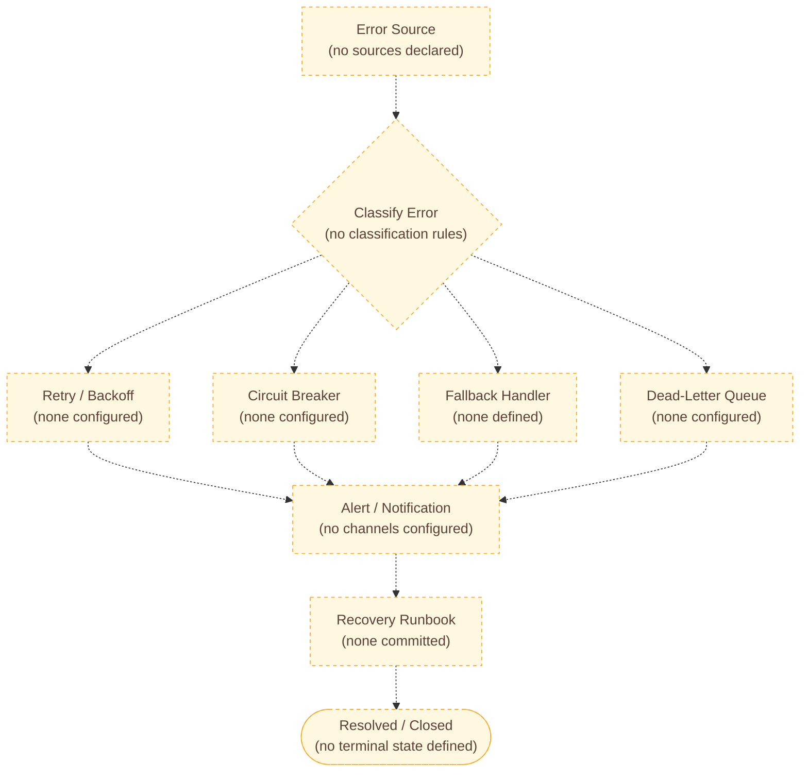

### 5.5.4 Authentication and Authorization Framework

No authentication or authorization framework is declared. Section 3.5.2 of this Technical Specification records "No" for OAuth 2.0 / OpenID Connect Provider, SAML / Enterprise SSO, LDAP / Active Directory Integration, Service-to-Service Authentication (mTLS, JWT, API Keys), and Secrets Management Vendor. Section 2.5.3 reinforces this with "Authentication / Authorization Model — No — Identity, role, or session mechanism — none present."

| Authentication / Authorization Element | Declared in Repository? | Source of Record |
|---|---|---|
| Identity Provider Integration | No | No SSO descriptors present (Section 3.5.2; Section 1.2.1). |
| Session Management Mechanism | No | No session middleware or token store committed (Section 2.5.3). |
| Role / Permission Model | No | "No identity, role, permission, or session mechanism is defined." (Section 1.3.2). |
| Service-to-Service Authentication | No | No mTLS certificate, JWT issuer, or API-key store committed (Section 3.5.2). |
| Secrets Management | No | "Secrets Management Vendor — No." (Section 3.5.2). |
| Audit Logging for Auth Events | No | No log emission for auth events committed (Section 3.5.3). |

### 5.5.5 Performance Requirements and SLAs

No performance requirements or SLAs are declared. Section 1.2.3 of this Technical Specification records that "no measurable objectives, critical success factors, acceptance criteria, OKRs, service-level objectives (SLOs), or key performance indicators (KPIs) are documented in the repository." Section 2.5.2 records "No" for Performance Requirements (Latency, Throughput), Scalability Targets (Concurrent Users, Volumes), Resource Constraints (CPU, Memory, Storage), and Resilience Patterns (Retry, Circuit-Breaker).

Per Reservation Rule R-4-007 (Section 4.6.1), no SLA, timing, timeout, latency target, throughput target, concurrency limit, or capacity figure may be inferred or asserted in this section.

| Performance / SLA Element | Declared in Repository? | Source of Record |
|---|---|---|
| Latency Targets (p50 / p95 / p99) | No | No SLO document or performance budget committed (Section 1.2.3; Section 2.5.2). |
| Throughput Targets (RPS / TPS) | No | No capacity plan committed (Section 2.5.2). |
| Concurrency / User-Volume Targets | No | No load profile committed (Section 2.5.2). |
| Resource Budgets (CPU / Memory / Storage / Network) | No | No container resource specification or infrastructure manifest committed (Section 2.5.2; Section 3.7). |
| Availability / Uptime Targets | No | No SLA / SLO document committed (Section 1.2.3). |
| Error-Budget Policy | No | No SRE policy document committed (Section 1.2.3). |

### 5.5.6 Disaster Recovery Procedures

No disaster-recovery procedures are declared. Section 3.6.3 of this Technical Specification records "Disaster Recovery Plan — No — Operational runbook." The conventional dimensions of disaster recovery — backup procedures, restore procedures, RTO/RPO targets, failover topology, and runbook automation — are all reserved slots.

| Disaster-Recovery Element | Declared in Repository? | Source of Record |
|---|---|---|
| Backup Procedures and Schedules | No | No backup script, policy, or storage configuration committed (Section 3.6.3). |
| Restore / Recovery Procedures | No | No restore runbook or automation committed (Section 3.6.3). |
| Recovery Time Objective (RTO) | No | No SLO / DR document committed (Section 1.2.3; Section 3.6.3). |
| Recovery Point Objective (RPO) | No | No SLO / DR document committed (Section 1.2.3; Section 3.6.3). |
| Failover Topology / Multi-Region Strategy | No | No IaC, multi-region descriptor, or replication configuration committed (Section 3.7; Section 3.6.3). |
| Business-Continuity / Crisis-Communication Plan | No | No operational documentation committed (Section 3.6.3). |

## 5.6 FORWARD-COMPATIBILITY SCAFFOLDING

This subsection establishes the structural conventions by which Section 5 will be extended when the first architecture-bearing artifact is committed to the repository. The conventions follow the pattern established in Section 3.9 (`R-3-XXX`) and Section 4.6 (`R-4-XXX`), introducing a new `R-5-XXX` namespace for reservation rules specific to System Architecture.

### 5.6.1 Reservation Rules for Future Architecture Declarations

| Rule ID | Reservation Rule | Activation Trigger |
|---|---|---|
| R-5-001 | The subsection headings (5.2 through 5.5) shall not be renumbered when first populated. | First architecture-bearing artifact committed. |
| R-5-002 | A new component entry shall append a row to the relevant subsection's table; existing "No" or "None declared" rows shall be replaced inline. | First component, integration, decision, or cross-cutting concern declared. |
| R-5-003 | Every newly declared component, integration, decision, or concern must cite the tracked artifact (file path and commit SHA) that introduced it. | Each architecture declaration. |
| R-5-004 | Architecture style claims (monolith, microservices, layered, hexagonal, event-driven, serverless, etc.) shall not be asserted in this section until corroborated by a committed source artifact (e.g., service boundary, deployment manifest, ADR). | All future updates. |
| R-5-005 | The Default Technology Stack referenced in Section 3.1.3 (AWS, Docker, Terraform, GitHub Actions, Python, Flask, Auth0, MongoDB, Langchain, React, TypeScript, TailwindCSS, React-Native, Swift, Kotlin, Objective-C, ElectronJS) shall not be retroactively imported into this Architecture section; only artifacts actually committed shall be recorded. This rule reinforces R-3-005. | All future updates. |
| R-5-006 | The empty-state Mermaid diagrams (Sections 5.2.5, 5.3.2, 5.3.3, 5.3.4, 5.4.7, 5.5.3, 5.6.4) shall be incrementally converted: amber-dashed reserved nodes become solid green populated nodes as the corresponding tracked artifacts are committed. | Each diagram-affecting commit. |
| R-5-007 | SLA, latency, throughput, RTO, and RPO annotations shall be added to architecture tables and diagrams only when supported by a committed SLO document, performance budget, or DR plan; no SLA may be inferred. This rule reinforces R-4-007. | Each SLO-affecting commit. |
| R-5-008 | Architecture Decision Records (`AD-XXX`) shall be authored as separate files under a `decisions/` or `docs/adr/` directory; each ADR shall be referenced from Section 5.4 with its identifier and file path. | First ADR committed. |
| R-5-009 | Identifier allocation (component `C-5-XXX`, ADR `AD-XXX`, reservation rule `R-5-XXX`) shall begin at `001` and increment monotonically; identifiers shall not be retroactively reused. | Each first-of-kind declaration. |

### 5.6.2 Activation Triggers by Subsection

The table below maps each subsection of Section 5 to the specific repository event that should trigger an update. This mirrors the structure of Section 3.9.2 and Section 4.6.2.

| Subsection | Update Trigger Event | Required Source Artifact |
|---|---|---|
| 5.2.1 System Overview | First source module, service descriptor, or `ARCHITECTURE.md` document committed that declares an architectural style. | Source file or design document describing the system's overall structure. |
| 5.2.2 Core Components Table | First component, module, service, or package declared in source code or a manifest. | Source file, package manifest, or service descriptor. |
| 5.2.3 Data Flow Description | First data-producing or data-consuming code path committed. | Source files with traceable input → process → output flows. |
| 5.2.4 External Integration Points | First SDK reference, API client, vendor configuration, broker descriptor, or webhook handler committed. | SDK import, vendor config, `.env.example`, broker descriptor, or webhook source file. |
| 5.3 Component Details | First component with declared purpose, dependencies, and interface committed. | Component source files plus accompanying documentation or manifest entry. |
| 5.4 Technical Decisions | First ADR file or design memo committed. | ADR file under `decisions/` or `docs/adr/`. |
| 5.5.1 Monitoring and Observability | First metrics exporter, log emitter, or tracing instrumentation committed. | APM agent configuration, exporter library, log-shipper config, or tracing SDK reference. |
| 5.5.2 Logging and Tracing | First log emission code or trace propagation middleware committed. | Source file with structured-logging usage or trace-context propagation. |
| 5.5.3 Error Handling | First try/catch, retry decorator, circuit-breaker, or DLQ configuration committed. | Source file with error-handling logic or resilience-library configuration. |
| 5.5.4 Authentication and Authorization | First identity-provider configuration, auth middleware, JWT issuer, or secrets-manager reference committed. | Auth library configuration, IAM policy, or identity descriptor. |
| 5.5.5 Performance and SLAs | First SLO document, performance budget, load profile, or resource specification committed. | SLO file, performance test suite, or container resource specification. |
| 5.5.6 Disaster Recovery | First backup script, DR runbook, or multi-region IaC committed. | Backup configuration, DR runbook (e.g., `RUNBOOK.md`), or IaC declaring replicated infrastructure. |

### 5.6.3 Identifier Allocation Plan and Reserved Attribute Schemas

To preserve forward compatibility, the following identifier namespaces are reserved for use when Section 5 is first populated. No identifier in any of these namespaces is currently allocated, in compliance with Constraint C-2-004 (Section 2.7.2) and the cross-section identifier discipline established in Section 4.6.3.

| Identifier Namespace | Purpose | Format | Currently Allocated |
|---|---|---|---|
| `C-5-XXX` | Component identifier (Section 5.3) | Three-digit zero-padded numeric suffix, starting `C-5-001`. | None |
| `AD-XXX` | Architecture Decision Record identifier (Section 5.4) | Three-digit zero-padded numeric suffix, starting `AD-001`. | None |
| `R-5-XXX` | Reservation rule identifier within this section | Three-digit zero-padded numeric suffix, starting `R-5-001`. | R-5-001 through R-5-009 |

The prompt-required Core Components Table columns (Section 5.2.2) are reserved here as a future-population schema; the same applies to the External Integration Points columns (Section 5.2.4).

| Reserved Table | Reserved Column | Future Source Artifact |
|---|---|---|
| Core Components Table (Section 5.2.2) | Component Name | Source module, service descriptor, or package manifest entry. |
| Core Components Table | Primary Responsibility | Module docstring, service specification, or design document. |
| Core Components Table | Key Dependencies | Dependency manifest (`package.json`, `go.mod`, etc.) plus inter-module import graph. |
| Core Components Table | Integration Points | API definitions, broker descriptors, or SDK references. |
| Core Components Table | Critical Considerations | ADR (`AD-XXX`), runbook, or design memo. |
| External Integration Points (Section 5.2.4) | System Name | Vendor configuration file or SDK reference. |
| External Integration Points | Integration Type | API client code, broker producer/consumer code, or webhook handler. |
| External Integration Points | Data Exchange Pattern | API schema, message schema, or broker descriptor. |
| External Integration Points | Protocol / Format | OpenAPI / GraphQL SDL / protobuf / AsyncAPI specification. |
| External Integration Points | SLA Requirements | SLO document or vendor contract (governed by R-5-007 and R-4-007). |

### 5.6.4 Forward-Compatibility Progression Diagram

The diagram below illustrates how the empty-baseline Section 5 will progress to a populated state as future commits introduce architecture-bearing artifacts. It mirrors the forward-compatibility diagrams in Section 3.8.2 and Section 4.6.4 and uses the same colour convention: solid green for the current verified state, blue-dashed for future commits, and amber-styled for specification update paths.

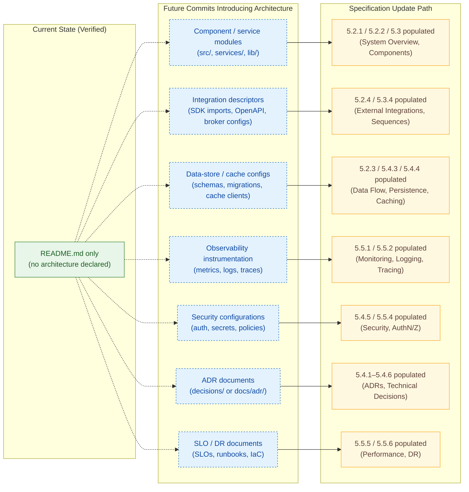

## 5.7 REFERENCES

### 5.7.1 Files Examined

- `/README.md` — Sole tracked file in the repository (11 bytes, content `# Artifact4`). Confirmed to contain no architectural description, component definition, integration declaration, technology reference, decision record, observability instrumentation, security configuration, performance target, or disaster-recovery procedure.

### 5.7.2 Folders Explored

- `` (repository root, depth 0) — Confirmed to contain exactly one direct child (`README.md`) and zero subdirectories beyond Git internal `.git/`. No `src/`, `lib/`, `services/`, `components/`, `modules/`, `infra/`, `deploy/`, `docs/`, `decisions/`, `adr/`, `architecture/`, `config/`, `migrations/`, or any other architecture-bearing directory exists.

### 5.7.3 Technical Specification Sections Cross-Referenced

- **Section 1.1.1** — Authoritative repository attribute table (one tracked file, one commit).
- **Section 1.2.1** — Absence of integration artifacts, vendor configurations, SDK references, environment templates, broker descriptors, and identity-provider configurations.
- **Section 1.2.2** — Manifest inventory table; statement that "no modules, services, microservices, libraries, packages, layers, or subsystems are defined"; statement that "the repository implements zero runtime capabilities."
- **Section 1.2.3** — Absence of measurable objectives, KPIs, SLOs, OKRs, and acceptance criteria.
- **Section 1.3.1.2** — "System Boundaries — Not defined; there is no operational system to bound."
- **Section 1.3.2** — Comprehensive enumeration of out-of-scope categories (persistence, IaC, CI/CD, containerization, observability, security, performance).
- **Section 1.4.1** — Authoritative statement of repository state.
- **Section 1.4.2** — Four binding posture principles (Evidence-Based, No Fabrication, Explicit Absence, Forward Compatibility).
- **Section 1.4.3** — Explicit instruction that downstream sections "will describe the absence of declared artifacts."
- **Section 2.4.2** — Integration Points table (all "No").
- **Section 2.4.3** — Shared Components and Common Services table (all "No").
- **Section 2.5.1** — Technical Constraints table (all "No").
- **Section 2.5.2** — Performance / Scalability / Resilience table (all "No").
- **Section 2.5.3** — Security / Authentication / Maintenance / Observability table (all "No").
- **Section 2.7.1** — Assumptions A-2-001 and A-2-002.
- **Section 2.7.2** — Constraints C-2-001 through C-2-004.
- **Section 3.1.3** — Declination of the Default Technology Stack (AWS, Docker, Terraform, GitHub Actions, Python, Flask, Auth0, MongoDB, Langchain, React, TypeScript, TailwindCSS, React-Native, Swift, Kotlin, Objective-C, ElectronJS).
- **Section 3.2 / 3.3** — Absence of declared programming languages and frameworks.
- **Section 3.5.1** — External APIs and Integrations table (all "No").
- **Section 3.5.2** — Authentication, Identity, and Directory Services table (all "No").
- **Section 3.5.3** — Monitoring, Observability, and Cloud Services table (all "No").
- **Section 3.6.1** — Primary and Secondary Data Stores (none).
- **Section 3.6.2** — Caching Solutions (none).
- **Section 3.6.3** — Object/Blob Storage and Persistence Strategies (none; Disaster Recovery Plan "No").
- **Section 3.7** — Development & Deployment (no `Dockerfile`, CI/CD, or IaC).
- **Section 3.8.1 / 3.8.2** — Established Mermaid colour convention (green / amber-dashed / gray-dashed / blue-dashed) and forward-compatibility diagram pattern.
- **Section 3.9** — Reservation Rules `R-3-001` through `R-3-006`; activation triggers; cross-reference map.
- **Section 4.2.1** — Core Business Processes table (all "No"; "no system interactions between components"; "no decision points / conditional branches").
- **Section 4.3.1 / 4.3.2** — Required Flowchart Elements and Validation Rules (all "No").
- **Section 4.4.1** — State Management table (all "No").
- **Section 4.4.2** — Error Handling table (all "No").
- **Section 4.5.1 through 4.5.5** — Empty-state Mermaid examples for high-level flow, per-feature flows, error handling, integration sequence, and state transitions.
- **Section 4.6.1** — Reservation Rules `R-4-001` through `R-4-008` (notably R-4-007 governing SLA annotations).
- **Section 4.6.3** — Identifier allocation namespaces (`WF-XXX`, `SD-XXX`, `ST-XXX`, `EF-XXX`, `IF-XXX`).
- **Section 4.6.4** — Forward-compatibility progression diagram pattern.

### 5.7.4 Verification Activities Underpinning This Section

The architectural absence documented throughout Section 5 is grounded in the verification activities formally recorded in Section 1.4.1, Section 1.5, and Section 4.7 of this Technical Specification:

- Recursive filesystem inspection of the repository tree confirming a single tracked file at depth 0 and no subdirectories beyond `.git/`.
- Byte-level inspection of `README.md` confirming 11 bytes containing the literal text `# Artifact4`.
- Complete Git history review confirming exactly one commit (`4b99931`, "Initial commit") with one file changed and one insertion.
- Exhaustive semantic search of the indexed corpus for architectural terms (components, services, modules, APIs, middleware, caching, authentication, observability, logging, tracing, error handling, monitoring) yielding zero matches.
- Verification of the absence of `.gitignore`, `.blitzyignore`, and `.editorconfig` configuration files at the repository root.

# 6. SYSTEM COMPONENTS DESIGN

## 6.1 Core Services Architecture

### 6.1.1 Applicability Determination

#### 6.1.1.1 Definitive Finding

**Core Services Architecture is not applicable for this system in its current state.**

The `Artifact4` repository is documented authoritatively in Section 1.4.1 as containing exactly one tracked file (`README.md`, 11 bytes, containing the literal text `# Artifact4`), exactly one Git commit (`4b99931`, "Initial commit"), and no other tracked or indexed content of any kind. Because the repository contains no executable code, no service modules, no deployment manifests, no orchestration descriptors, no message-broker or RPC configurations, and no infrastructure-as-code artifacts, none of the structural prerequisites for a "core services architecture" — service boundaries, inter-service communication, service discovery, load balancing, circuit breaking, retry/fallback policies, scalability mechanisms, or resilience patterns — exists in the repository at this time.

This finding is consistent with, and inherits from, the empty-baseline posture established in Section 1.4 and reinforced throughout Sections 2, 3, 4, and 5 of this Technical Specification. The remainder of this section documents the absence of each conventionally-expected element of Core Services Architecture, organizes those elements into structurally-reserved slots, and defines the activation triggers and reservation rules that will govern their first population in future commits.

#### 6.1.1.2 Justification Summary

The justification for the not-applicable determination is consolidated below. Each premise cites the originating source-of-record subsection within this Technical Specification.

| Premise | Status | Source of Record |
|---|---|---|
| No services, microservices, modules, libraries, packages, layers, or subsystems are defined. | Confirmed | Section 1.2.2; Section 5.2.1; Section 5.2.2. |
| No architectural style (monolith, layered, hexagonal, microservices, event-driven, serverless, modular monolith, micro-frontends, CQRS, hybrid) is declared. | Confirmed | Section 5.2.1; reinforced by Reservation Rule R-5-004 (Section 5.6.1). |
| No inter-service communication mechanisms (synchronous, asynchronous, REST, GraphQL, gRPC, AMQP, MQTT, Kafka, WebSocket) are declared. | Confirmed | Section 5.2.3; Section 3.5.1. |
| No service discovery, load balancing, or service-mesh artifacts are committed. | Confirmed | Section 3.7.2; Section 5.2.4. |
| No resilience patterns (retry, circuit breaker, bulkhead, fallback, DLQ, timeouts, compensating transactions) are committed. | Confirmed | Section 4.4.2; Section 5.5.3; Section 2.5.2. |
| No performance, scalability, or capacity-planning artifacts (SLOs, load profiles, resource budgets, autoscaling policies) are committed. | Confirmed | Section 2.5.2; Section 5.5.5. |
| No disaster-recovery artifacts (backup, restore, RTO, RPO, multi-region failover, business-continuity plan) are committed. | Confirmed | Section 5.5.6; Section 3.6.3. |

#### 6.1.1.3 Documentation Posture Inherited by This Section

This section adheres to the four posture principles established in Section 1.4.2 — Evidence-Based Statements Only, No Fabrication of Capabilities, Explicit Documentation of Absence, and Forward Compatibility — and to the reservation discipline established in Section 5.6.1 (rules `R-5-001` through `R-5-009`). In particular:

- Per **R-5-004**, no architecture style is asserted in this section (microservices, monolith, modular monolith, serverless, event-driven, hexagonal, layered, CQRS, etc.) because none is corroborated by a committed source artifact.
- Per **R-5-005**, the Default Technology Stack inventoried in Section 3.1.3 (AWS, Docker, Terraform, GitHub Actions, Python, Flask, Auth0, MongoDB, Langchain, React, TypeScript, TailwindCSS, React-Native, Swift, Kotlin, Objective-C, ElectronJS) is **not** retroactively imported into this section's tables or diagrams.
- Per **R-5-007** (which reinforces **R-4-007** in Section 4.6.1), no SLA, SLO, latency target, throughput target, RTO, RPO, concurrency limit, capacity figure, or scaling threshold is inferred or asserted. All performance-related cells remain "No" until a committed SLO document, performance budget, or DR plan supports population.
- Per **R-5-006**, the Mermaid diagrams in this section render reserved structural slots in amber-dashed style; these slots become solid green when their corresponding artifacts are committed.

---

### 6.1.2 Service Components (Reserved — None Declared)

The repository declares no service components. Every category required by the section prompt is preserved below as a structurally-reserved slot using the three-column "Declared in Repository?" pattern established by Sections 2.4.2, 2.4.3, 3.5.1, 4.4.1, 4.4.2, 5.2.2, 5.2.4, 5.5.3, and 5.5.4.

#### 6.1.2.1 Service Boundaries and Responsibilities

No service boundaries are defined. Section 1.2.2 records that "no modules, services, microservices, libraries, packages, layers, or subsystems are defined." Section 5.2.1 records that no overall architectural style is declared. Section 5.2.2 enumerates the eight conventional component categories — Presentation/UI, API/Interface, Application/Service, Domain/Business Logic, Integration/Adapter, Persistence/Data Access, Shared/Cross-Cutting, and Observability/Telemetry — and confirms "No" for every one of them.

| Service-Boundary Dimension | Declared in Repository? | Source of Record |
|---|---|---|
| Distinct Service Units (Process / Container / Function Boundaries) | No | No source modules, container images, or function definitions are committed (Section 1.2.2; Section 5.2.2). |
| Primary Responsibility per Service | No | No service descriptor, design document, or `ARCHITECTURE.md` is committed (Section 5.2.1). |
| Bounded-Context Decomposition (Domain-Driven Design) | No | No domain model, context map, or aggregate definition is committed (Section 5.2.1). |
| Service Ownership / Team Allocation | No | No CODEOWNERS file, ownership manifest, or team directory is committed (Section 1.2.2). |
| Public vs. Internal Service Designation | No | No API surface or interface contract is declared (Section 2.4.2; Section 5.2.4). |

#### 6.1.2.2 Inter-Service Communication Patterns

No inter-service communication patterns are declared. Section 5.2.3 records that "no integration patterns (request/response, publish/subscribe, request/reply, fire-and-forget, polling, long-polling, server-sent events, webhook callbacks, batch ETL/ELT, change-data-capture) are declared" and "no wire protocols (HTTP/REST, GraphQL, gRPC, WebSocket, AMQP, MQTT, Kafka protocol, JDBC, ODBC, SOAP) are declared." Section 3.5.1 corroborates this with all six integration categories marked "No."

| Communication-Pattern Dimension | Declared in Repository? | Source of Record |
|---|---|---|
| Synchronous Request/Response (REST, gRPC, GraphQL) | No | No API client code, server framework, or schema file is committed (Section 5.2.3; Section 3.5.1). |
| Asynchronous Messaging (Publish/Subscribe, Event Bus) | No | No broker descriptor, producer, or consumer code is committed (Section 3.5.1). |
| Streaming / Long-Polling / Server-Sent Events / WebSocket | No | No streaming endpoint or client is committed (Section 5.2.3). |
| Webhook Callbacks (Inbound or Outbound) | No | No webhook handler or sender code is committed (Section 3.5.1; Section 5.2.4). |
| Batch / ETL / Change-Data-Capture | No | No batch job, scheduler, or CDC connector is committed (Section 5.2.3). |
| Wire Format (JSON, Protobuf, Avro, XML, MessagePack) | No | No schema file, IDL, or serializer is committed (Section 5.2.3). |

#### 6.1.2.3 Service Discovery Mechanisms

No service discovery mechanism is committed. Section 5.2.4 records that no integration descriptors are present, and Section 3.7.2 records "No" for Kubernetes manifests, Helm charts, and Service-Mesh configuration (Istio, Linkerd, Consul Connect).

| Discovery-Mechanism Dimension | Declared in Repository? | Source of Record |
|---|---|---|
| Client-Side Discovery (Service Registry Lookup) | No | No registry client library or configuration is committed (Section 3.7.2). |
| Server-Side Discovery (API Gateway / Load-Balancer-Based) | No | No gateway or LB descriptor is committed (Section 3.7.2). |
| DNS-Based Service Discovery | No | No DNS zone file or service-DNS manifest is committed (Section 3.7.2). |
| Service-Mesh Sidecar Discovery (Istio, Linkerd, Consul) | No | No mesh control-plane or sidecar configuration is committed (Section 3.7.2). |
| Static Configuration (Hardcoded Endpoints, `.env`) | No | No environment-variable template or static endpoint table is committed (Section 1.2.1). |

#### 6.1.2.4 Load Balancing Strategy

No load-balancing strategy is committed. Section 3.7.2 records "No" for all containerization and orchestration artifacts; Section 3.7.3 records "No" for all CI/CD and IaC artifacts; Section 3.5.3 records "No" for any Public Cloud Platform (AWS, GCP, Azure) and any Edge/CDN service.

| Load-Balancing Dimension | Declared in Repository? | Source of Record |
|---|---|---|
| Layer-4 (TCP/UDP) Load Balancing | No | No L4 LB descriptor (cloud LB, HAProxy, IPVS) is committed (Section 3.7.2). |
| Layer-7 (HTTP) Load Balancing (Reverse Proxy, Ingress) | No | No Ingress / Nginx / Envoy / Traefik configuration is committed (Section 3.7.2). |
| Algorithm Selection (Round Robin, Least Connections, IP Hash, Weighted) | No | No LB algorithm choice can be observed (Section 3.7.2). |
| Health-Check / Readiness-Probe Configuration | No | No probe or health endpoint is committed (Section 3.7.2). |
| Sticky Sessions / Affinity Policy | No | No affinity configuration is committed (Section 3.7.2). |
| Geo / Latency-Based Routing | No | No global LB or DNS routing policy is committed (Section 3.5.3). |

#### 6.1.2.5 Circuit Breaker Patterns

No circuit breaker patterns are committed. Section 5.5.3 records "Circuit Breaker / Bulkhead — No — No resilience-library configuration committed." Section 4.4.2 records "Retry Mechanisms (Exponential Backoff, Circuit Breaker, etc.) — No." Section 2.5.2 records "Resilience Patterns (Retry, Circuit-Breaker) — No — Code or configuration implementing such patterns."

| Circuit-Breaker Dimension | Declared in Repository? | Source of Record |
|---|---|---|
| Circuit Breaker Library or Implementation (e.g., Hystrix, Resilience4j, Polly, opossum) | No | No resilience-library dependency is committed (Section 5.5.3; Section 3.4). |
| Failure-Threshold Configuration (Error Rate, Consecutive Failures) | No | No threshold configuration is committed (Section 4.4.2). |
| Half-Open / Recovery Probe Policy | No | No recovery configuration is committed (Section 5.5.3). |
| Bulkhead / Resource-Isolation Policy | No | No bulkhead policy is committed (Section 4.4.2; Section 5.5.3). |
| Per-Dependency Breaker Granularity | No | No dependency catalogue or per-dependency policy is committed (Section 3.5.1). |

#### 6.1.2.6 Retry and Fallback Mechanisms

No retry or fallback mechanisms are committed. Section 4.4.2 enumerates eight error-handling patterns — try/catch discipline, retry with backoff, circuit breaker, fallback/graceful degradation, dead-letter queue handling, compensating transactions, timeout policies, and bulkhead isolation — and confirms "No" for every one of them. Section 5.5.3 reinforces this with identical findings.

| Retry / Fallback Dimension | Declared in Repository? | Source of Record |
|---|---|---|
| Retry with Exponential Backoff and Jitter | No | No retry decorator, middleware, or library reference is committed (Section 5.5.3). |
| Maximum Retry Count / Retry Budget | No | No retry policy configuration is committed (Section 4.4.2). |
| Idempotency-Key / Replay-Safe Operation Discipline | No | No idempotency middleware or key store is committed (Section 4.4.1). |
| Fallback Handler / Default-Response Strategy | No | No fallback handler or feature flag is committed (Section 5.5.3). |
| Dead-Letter Queue / Poison-Message Handling | No | No message broker or queue is configured (Section 4.4.2; Section 5.5.3). |
| Timeout Policy (per Call, per Operation, per Tenant) | No | No timeout configuration exists in any tracked file (Section 4.4.2; Section 4.3.1). |
| Compensating Transaction / Saga Rollback | No | No transaction coordinator or saga orchestrator exists (Section 4.4.2; Section 5.5.3). |

#### 6.1.2.7 Service Interaction Diagram (Reserved — Empty-State)

The diagram below renders the reserved structure for the service-interaction landscape. All nodes are presented as amber-dashed reserved slots in keeping with the colour convention established in Sections 1.2.2, 3.8.1, 4.5, 5.2.5, and 5.5.3, and in accordance with Reservation Rule R-5-006 (Section 5.6.1). When the first component, integration, or service descriptor is committed, the corresponding node(s) will transition to solid green and be replaced with the declared service name, responsibility, and protocol.

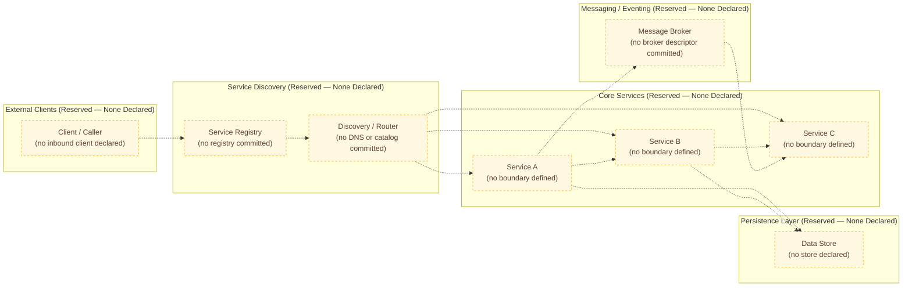

---

### 6.1.3 Scalability Design (Reserved — None Declared)

The repository declares no scalability strategy, no scaling targets, and no resource specifications. Section 2.5.2 records "No" for Performance Requirements (Latency, Throughput), Scalability Targets (Concurrent Users, Volumes), Resource Constraints (CPU, Memory, Storage), and Resilience Patterns. Section 5.5.5 confirms the absence of every Performance / SLA element. Per Reservation Rule **R-5-007** (Section 5.6.1) and **R-4-007** (Section 4.6.1), no SLA, latency target, throughput target, concurrency limit, RTO, RPO, or capacity figure may be inferred or asserted in this section.

#### 6.1.3.1 Horizontal and Vertical Scaling Approach

No horizontal or vertical scaling approach is committed. Without source modules (Section 1.2.2), container images (Section 3.7.2), orchestration manifests (Section 3.7.2), or IaC files (Section 3.7.3), neither replica-based horizontal scaling nor resource-based vertical scaling can be observed.

| Scaling-Approach Dimension | Declared in Repository? | Source of Record |
|---|---|---|
| Horizontal Scaling (Replica Count, Stateless Pods) | No | No deployment manifest, replica controller, or stateless service is committed (Section 3.7.2). |
| Vertical Scaling (CPU / Memory Sizing Profiles) | No | No container resource specification or VM-size descriptor is committed (Section 2.5.2; Section 3.7.2). |
| Sharding / Partitioning Strategy | No | No partitioning logic, shard key, or distributed coordination code is committed (Section 5.2.3). |
| Read Replica / Write-Primary Topology | No | No database descriptor or replication configuration is committed (Section 3.6.3). |
| Stateless vs. Stateful Service Designation | No | No service descriptor exists to classify (Section 5.2.2). |

#### 6.1.3.2 Auto-Scaling Triggers and Rules

No auto-scaling triggers or rules are committed. Section 3.7.2 records "No" for all Kubernetes manifests and Helm charts; Section 3.7.3 records "No" for all CI/CD and IaC artifacts (Terraform, CloudFormation, Pulumi, Ansible). Autoscaling is therefore not declarable.

| Auto-Scaling Dimension | Declared in Repository? | Source of Record |
|---|---|---|
| CPU-Based Scaling Threshold (e.g., HPA CPU Target) | No | No HPA manifest or equivalent committed (Section 3.7.2). |
| Memory-Based Scaling Threshold | No | No HPA / VPA manifest committed (Section 3.7.2). |
| Custom-Metric / Queue-Depth Trigger | No | No custom-metrics adapter or queue configuration committed (Section 3.7.2; Section 3.5.1). |
| Schedule-Based Scaling (Cron / Predictive) | No | No cron schedule or scheduled-action descriptor committed (Section 3.7.3). |
| Min / Max Replica Bounds | No | No replica policy committed (Section 3.7.2). |
| Cooldown / Stabilization Window | No | No stabilization policy committed (Section 3.7.2). |

#### 6.1.3.3 Resource Allocation Strategy

No resource allocation strategy is committed. Section 5.5.5 records "No" for Resource Budgets (CPU / Memory / Storage / Network), and Section 2.5.2 records "No" for Resource Constraints (CPU, Memory, Storage).

| Resource-Allocation Dimension | Declared in Repository? | Source of Record |
|---|---|---|
| CPU Requests and Limits per Workload | No | No container resource specification committed (Section 5.5.5; Section 3.7.2). |
| Memory Requests and Limits per Workload | No | No container resource specification committed (Section 5.5.5; Section 3.7.2). |
| Storage Volume Sizing and IOPS Class | No | No persistent-volume claim or storage class committed (Section 3.6.3). |
| Network Bandwidth Allocation / Egress Caps | No | No network policy or QoS descriptor committed (Section 3.7.2). |
| Quality-of-Service / Priority Class | No | No priority-class or pod-disruption-budget committed (Section 3.7.2). |

#### 6.1.3.4 Performance Optimization Techniques

No performance optimization techniques are committed. Section 3.6.2 records "No" for every caching tier (Application-Level Cache, Distributed Cache, HTTP Cache, CDN Cache, Database Query Cache). Section 4.4.1 records "Caching Requirements — No — No cache client dependencies, cache configurations, or cache invalidation logic are committed." Section 5.4.4 records "No" for every caching decision domain.

| Performance-Optimization Dimension | Declared in Repository? | Source of Record |
|---|---|---|
| In-Process / Application-Level Caching | No | No cache library reference or cache configuration committed (Section 3.6.2; Section 4.4.1). |
| Distributed Cache (Redis, Memcached, Hazelcast) | No | No distributed-cache client or descriptor committed (Section 3.6.2). |
| HTTP / CDN / Edge Caching | No | No CDN configuration or HTTP cache header policy committed (Section 3.5.3; Section 3.6.2). |
| Database Query Optimization (Indexes, Materialized Views) | No | No schema, migration, or index definition committed (Section 3.6.1). |
| Read-Through / Write-Through / Write-Behind Strategy | No | No cache-coherence strategy committed (Section 5.4.4). |
| Connection Pooling / Keep-Alive Tuning | No | No client library or pool configuration committed (Section 3.4). |
| Asynchronous / Batched Processing | No | No background worker, batch job, or queue consumer committed (Section 3.5.1). |

#### 6.1.3.5 Capacity Planning Guidelines

No capacity planning guidelines are committed. Section 1.2.3 records that "no measurable objectives, critical success factors, acceptance criteria, OKRs, service-level objectives (SLOs), or key performance indicators (KPIs) are documented in the repository." Section 5.5.5 confirms the absence of Latency Targets, Throughput Targets, Concurrency Targets, Resource Budgets, Availability Targets, and Error-Budget Policies. Per **R-5-007** and **R-4-007**, no capacity figure may be inferred.

| Capacity-Planning Dimension | Declared in Repository? | Source of Record |
|---|---|---|
| Baseline Load Profile (RPS / TPS / Concurrent Users) | No | No load profile or performance test suite committed (Section 5.5.5). |
| Peak / Burst Load Headroom | No | No capacity plan committed (Section 2.5.2). |
| Growth Forecast and Reservation Strategy | No | No forecast document committed (Section 1.2.3). |
| Cost-per-Transaction / Cost Model | No | No cost or FinOps document committed (Section 3.5.3). |
| Capacity-Review Cadence and Owner | No | No operational runbook or owner manifest committed (Section 3.6.3). |

#### 6.1.3.6 Scalability Architecture Diagram (Reserved — Empty-State)

The diagram below renders the reserved structure for the scalability architecture. All nodes are amber-dashed reserved slots per the colour convention established in Sections 1.2.2, 3.8.1, 4.5, 5.2.5, and 5.5.3, and per Reservation Rule R-5-006 (Section 5.6.1). The activation triggers for each node are catalogued in Section 6.1.5 below.

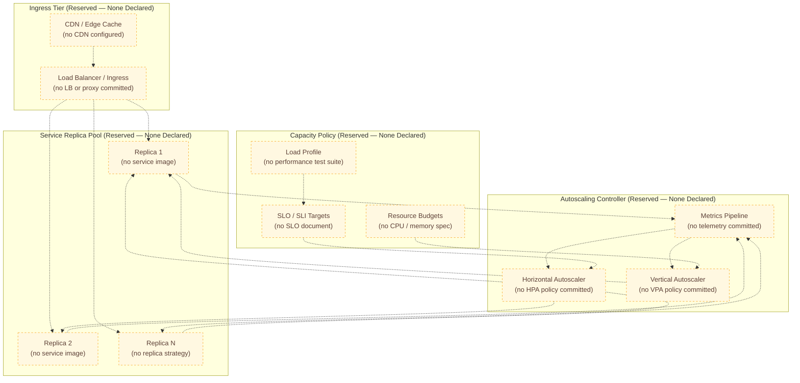

---

### 6.1.4 Resilience Patterns (Reserved — None Declared)

The repository declares no resilience patterns. Section 5.5.3 enumerates eight conventional patterns — try/catch discipline, retry with backoff, circuit breaker/bulkhead, fallback/graceful degradation, DLQ handling, compensating transactions, timeouts, error notification — and confirms "No" for every one of them. Section 5.5.6 enumerates six disaster-recovery dimensions and confirms "No" for every one of them. Section 4.4.2 corroborates both findings.

#### 6.1.4.1 Fault Tolerance Mechanisms

No fault-tolerance mechanisms are committed. The eight error-handling patterns from Section 5.5.3 and the resilience-pattern entries from Section 2.5.2 collectively confirm complete absence.

| Fault-Tolerance Dimension | Declared in Repository? | Source of Record |
|---|---|---|
| Try/Catch / Result-Type Discipline | No | No source code committed (Section 5.5.3; Section 4.4.2). |
| Retry with Backoff and Jitter | No | No retry library reference committed (Section 5.5.3). |
| Circuit Breaker / Bulkhead | No | No resilience-library configuration committed (Section 5.5.3; Section 2.5.2). |
| Timeout Policies (per Call / per Operation) | No | No timeout configuration committed (Section 5.5.3; Section 4.4.2). |
| Idempotency / Replay-Safe Operations | No | No idempotency mechanism committed (Section 4.4.1). |
| Dead-Letter Queue / Poison-Message Handling | No | No message broker or queue configured (Section 5.5.3; Section 4.4.2). |
| Compensating Transactions / Saga Rollback | No | No transaction coordinator or saga orchestrator committed (Section 5.5.3). |
| Error Notification / Alerting Channel | No | No alerting, paging, or incident-management integration committed (Section 5.5.3; Section 3.5.3). |

#### 6.1.4.2 Disaster Recovery Procedures

No disaster recovery procedures are committed. Section 5.5.6 records "No" for all six DR dimensions. Section 3.6.3 records "Disaster Recovery Plan — No — Operational runbook." Per Reservation Rule **R-5-007**, no RTO or RPO value may be inferred or asserted.

| Disaster-Recovery Dimension | Declared in Repository? | Source of Record |
|---|---|---|
| Backup Procedures and Schedules | No | No backup script, policy, or storage configuration committed (Section 5.5.6; Section 3.6.3). |
| Restore / Recovery Procedures (Runbook) | No | No restore runbook or automation committed (Section 5.5.6; Section 3.6.3). |
| Recovery Time Objective (RTO) | No | No SLO or DR document committed (Section 5.5.6; Section 1.2.3). |
| Recovery Point Objective (RPO) | No | No SLO or DR document committed (Section 5.5.6; Section 1.2.3). |
| Multi-Region / Cross-AZ Failover Topology | No | No IaC, multi-region descriptor, or replication config committed (Section 5.5.6; Section 3.7). |
| Business-Continuity / Crisis-Communication Plan | No | No operational documentation committed (Section 5.5.6; Section 3.6.3). |

#### 6.1.4.3 Data Redundancy Approach

No data redundancy approach is committed. Section 3.6.3 records "No" for Object Storage, Block/Volume Storage, File-System Persistence, Backup Strategy, Replication Strategy, Retention Policy, and Disaster Recovery Plan. Without any data store (Section 3.6.1), there is no data subject to redundancy.

| Data-Redundancy Dimension | Declared in Repository? | Source of Record |
|---|---|---|
| Primary Data Store (Relational / NoSQL / Object) | No | No data-store dependency or schema committed (Section 3.6.1). |
| Synchronous Replication (e.g., Multi-Primary, Quorum) | No | No replication descriptor committed (Section 3.6.3). |
| Asynchronous Replication (Read Replicas, Geo-Replication) | No | No replication descriptor committed (Section 3.6.3). |
| Backup Retention Policy (Daily / Weekly / Monthly) | No | No retention policy committed (Section 3.6.3). |
| Point-in-Time Recovery / Snapshot Configuration | No | No snapshot or PITR configuration committed (Section 3.6.3). |
| Cross-Region Backup / Cold Storage | No | No object-storage or cold-storage descriptor committed (Section 3.6.3). |

#### 6.1.4.4 Failover Configurations

No failover configurations are committed. Section 5.5.6 records "Failover Topology / Multi-Region Strategy — No — No IaC, multi-region descriptor, or replication configuration committed."

| Failover-Configuration Dimension | Declared in Repository? | Source of Record |
|---|---|---|
| Active-Active Topology | No | No multi-region IaC or routing config committed (Section 5.5.6). |
| Active-Passive Topology with Standby | No | No standby descriptor committed (Section 5.5.6). |
| DNS-Based Failover / Health-Check Switchover | No | No DNS health-check policy committed (Section 5.5.6). |
| Database Failover Promotion Procedure | No | No database-cluster descriptor committed (Section 3.6.3). |
| Failover-Drill / Game-Day Schedule | No | No operational runbook committed (Section 3.6.3). |

#### 6.1.4.5 Service Degradation Policies

No service-degradation policies are committed. Section 5.5.3 records "Fallback / Graceful Degradation — No — No fallback handler or feature flag committed."

| Degradation-Policy Dimension | Declared in Repository? | Source of Record |
|---|---|---|
| Graceful Degradation Handler / Default Response | No | No fallback handler committed (Section 5.5.3). |
| Feature Flag / Kill-Switch Mechanism | No | No feature-flag library or config committed (Section 5.5.3). |
| Load Shedding / Rate-Limit-Based Degradation | No | No rate limiter or load shedder committed (Section 5.5.3). |
| Read-Only Mode / Maintenance Mode | No | No maintenance-mode toggle committed (Section 4.4.1). |
| Priority Queues / Premium-vs-Best-Effort Tiers | No | No tiering policy committed (Section 5.5.5). |

#### 6.1.4.6 Resilience Pattern Diagram (Reserved — Empty-State)

The diagram below renders the reserved resilience pattern landscape — fault-tolerance, disaster recovery, and degradation paths — using the amber-dashed empty-state convention. It complements (and extends) the Error Handling Flow Diagram already established in Section 5.5.3 by adding the DR and failover dimensions required by the section prompt. All nodes will transition to solid green when their respective artifacts are committed (Reservation Rule R-5-006).

```mermaid
flowchart LR
    subgraph CallerPath["Caller Path (Reserved — None Declared)"]
        Caller["Calling Component<br/>(no caller declared)"]
    end
    subgraph ResiliencePatterns["Resilience Patterns (Reserved — None Declared)"]
        TimeoutNode["Timeout Policy<br/>(none configured)"]
        RetryNode["Retry + Backoff + Jitter<br/>(none configured)"]
        BreakerNode["Circuit Breaker<br/>(none configured)"]
        BulkheadNode["Bulkhead Isolation<br/>(none configured)"]
        FallbackNode["Fallback Handler<br/>(none defined)"]
    end
    subgraph Primary["Primary Service (Reserved — None Declared)"]
        PrimarySvc["Primary Service<br/>(no service committed)"]
    end
    subgraph Degradation["Degradation Path (Reserved — None Declared)"]
        DLQNode["Dead-Letter Queue<br/>(none configured)"]
        DegradeNode["Graceful Degradation<br/>(no policy committed)"]
        FlagNode["Feature Flag / Kill Switch<br/>(none committed)"]
    end
    subgraph DRTopology["Disaster Recovery (Reserved — None Declared)"]
        BackupNode["Backup Procedure<br/>(no schedule committed)"]
        RestoreNode["Restore Procedure<br/>(no runbook committed)"]
        FailoverNode["Failover Topology<br/>(no multi-region IaC)"]
        RTONode["RTO / RPO Targets<br/>(no SLO / DR document)"]
    end

    Caller -.-> TimeoutNode
    TimeoutNode -.-> RetryNode
    RetryNode -.-> BreakerNode
    BreakerNode -.-> BulkheadNode
    BulkheadNode -.-> PrimarySvc
    PrimarySvc -.-> FallbackNode
    FallbackNode -.-> DegradeNode
    DegradeNode -.-> FlagNode
    PrimarySvc -.-> DLQNode
    PrimarySvc -.-> BackupNode
    BackupNode -.-> RestoreNode
    RestoreNode -.-> RTONode
    PrimarySvc -.-> FailoverNode
    FailoverNode -.-> RTONode

    classDef reserved fill:#fff8e1,stroke:#f9a825,color:#5d4037,stroke-dasharray: 4 4
    class Caller,TimeoutNode,RetryNode,BreakerNode,BulkheadNode,FallbackNode,PrimarySvc,DLQNode,DegradeNode,FlagNode,BackupNode,RestoreNode,FailoverNode,RTONode reserved
```

---

### 6.1.5 Forward-Compatibility Activation Triggers

This subsection inherits Reservation Rules **R-5-001 through R-5-009** from Section 5.6.1 and maps each Core Services Architecture topic to the specific repository event that should trigger its conversion from an empty-state slot to a populated declaration. This mirrors the structure of Section 5.6.2 and applies directly to the reserved tables and diagrams in Sections 6.1.2, 6.1.3, and 6.1.4.

#### 6.1.5.1 Activation Triggers for Service Components

| Reserved Slot | Activation Trigger | Required Source Artifact |
|---|---|---|
| Service Boundaries (Section 6.1.2.1) | First service module, container image, or function definition committed. | Source module under `src/` / `services/` / `lib/`, container image manifest, or function descriptor. |
| Inter-Service Communication (Section 6.1.2.2) | First API client, server framework, broker descriptor, or RPC stub committed. | OpenAPI / gRPC `.proto` / GraphQL SDL / broker config file. |
| Service Discovery (Section 6.1.2.3) | First service-registry configuration, mesh manifest, or DNS-service descriptor committed. | Consul / Eureka / Istio / Linkerd configuration or Kubernetes Service manifest. |
| Load Balancing (Section 6.1.2.4) | First ingress descriptor, reverse-proxy configuration, or cloud-LB IaC committed. | Nginx / Envoy / Traefik configuration, Kubernetes Ingress, or Terraform LB resource. |
| Circuit Breaker (Section 6.1.2.5) | First resilience-library reference (Resilience4j, Polly, opossum, Hystrix) committed. | Dependency manifest entry plus configuration file. |
| Retry / Fallback (Section 6.1.2.6) | First retry decorator, fallback handler, DLQ configuration, or timeout policy committed. | Source file with retry/timeout logic or library configuration. |

#### 6.1.5.2 Activation Triggers for Scalability Design

| Reserved Slot | Activation Trigger | Required Source Artifact |
|---|---|---|
| Horizontal / Vertical Scaling (Section 6.1.3.1) | First deployment manifest, replica controller, or VM-size descriptor committed. | Kubernetes Deployment / StatefulSet, Helm values, or Terraform autoscaling group. |
| Auto-Scaling Triggers (Section 6.1.3.2) | First HPA, VPA, KEDA, or cloud-autoscaler policy committed. | HPA / VPA manifest or cloud autoscaling configuration. |
| Resource Allocation (Section 6.1.3.3) | First container resource requests/limits or persistent-volume claim committed. | Pod spec with `resources:` block or PVC manifest. |
| Performance Optimization (Section 6.1.3.4) | First cache client, CDN configuration, or query-optimization artifact committed. | Cache library import, CDN IaC, or schema/index migration. |
| Capacity Planning (Section 6.1.3.5) | First SLO document, performance budget, or load-profile artifact committed. | SLO YAML, performance test suite, or capacity-plan document. |

#### 6.1.5.3 Activation Triggers for Resilience Patterns

| Reserved Slot | Activation Trigger | Required Source Artifact |
|---|---|---|
| Fault Tolerance (Section 6.1.4.1) | First try/catch, retry, circuit-breaker, or DLQ configuration committed. | Source file with error-handling logic or resilience-library configuration. |
| Disaster Recovery (Section 6.1.4.2) | First backup script, DR runbook, or multi-region IaC committed. | Backup config, `RUNBOOK.md`, or IaC declaring replicated infrastructure. |
| Data Redundancy (Section 6.1.4.3) | First database descriptor, replication policy, or snapshot configuration committed. | Database manifest, replication configuration, or backup IaC. |
| Failover Configuration (Section 6.1.4.4) | First multi-region descriptor, DNS health-check policy, or standby manifest committed. | Multi-region Terraform module or Route53 / Cloud DNS failover policy. |
| Service Degradation (Section 6.1.4.5) | First fallback handler, feature-flag descriptor, or kill-switch artifact committed. | Source file with degradation logic or feature-flag library configuration. |

#### 6.1.5.4 Governing Reservation Rules

The following reservation rules from Section 5.6.1 apply with full force to this section. No new `R-6-XXX` namespace is introduced; the existing `R-5-XXX` rules govern all future updates to Section 6.1.

| Rule ID | Applicability to Section 6.1 |
|---|---|
| R-5-001 | The subsection headings 6.1.1–6.1.5 shall not be renumbered when first populated. |
| R-5-002 | New entries shall append rows to the existing reserved tables; "No" rows shall be replaced inline. |
| R-5-003 | Every newly declared service, integration, scaling rule, or resilience pattern must cite the tracked artifact (file path and commit SHA) that introduced it. |
| R-5-004 | No architecture style claim (microservices, monolith, serverless, event-driven, etc.) shall be asserted in this section until corroborated by a committed source artifact. |
| R-5-005 | The Default Technology Stack referenced in Section 3.1.3 shall not be retroactively imported into Section 6.1 tables or diagrams. |
| R-5-006 | The empty-state Mermaid diagrams in Sections 6.1.2.7, 6.1.3.6, and 6.1.4.6 shall be incrementally converted: amber-dashed reserved nodes become solid green populated nodes as the corresponding tracked artifacts are committed. |
| R-5-007 | SLA, latency, throughput, RTO, RPO, and capacity annotations shall be added to Section 6.1 only when supported by a committed SLO document, performance budget, or DR plan; no SLA may be inferred. |

---

### 6.1.6 References

#### 6.1.6.1 Repository Artifacts Examined

- `README.md` — The only tracked file in the repository (11 bytes, content `# Artifact4`); examined to confirm the absence of any service, scalability, or resilience artifact.
- `""` (repository root) — Examined via recursive folder listing to confirm zero subdirectories below root (other than `.git/` internal metadata) and the absence of any source, configuration, manifest, or documentation directories that would imply service components, deployment infrastructure, or operational tooling.

#### 6.1.6.2 Technical Specification Sections Cross-Referenced

- **Section 1.2.2** — Authoritative statement that no modules, services, microservices, libraries, packages, layers, or subsystems are defined and that the repository implements zero runtime capabilities.
- **Section 1.2.3** — Confirms no measurable objectives, SLOs, KPIs, or acceptance criteria are documented.
- **Section 1.4.1** — Authoritative repository state statement (single `README.md`, single commit `4b99931`).
- **Section 1.4.2** — Four documentation posture principles (Evidence-Based, No Fabrication, Explicit Absence, Forward Compatibility) inherited by this section.
- **Section 1.4.3** — Establishes that all downstream sections inherit the empty-baseline condition.
- **Section 2.4.2** — Integration Points: all four categories marked "No."
- **Section 2.4.3** — Shared Components and Common Services: all four categories marked "No."
- **Section 2.5.2** — Performance / scalability / resilience considerations: all marked "No."
- **Section 3.4** — Open-source dependencies: none committed (relevant to absence of resilience libraries).
- **Section 3.5.1** — External APIs and Integrations: all six categories marked "No."
- **Section 3.5.3** — Monitoring, Observability, and Cloud Services: all marked "No."
- **Section 3.6.1, 3.6.2, 3.6.3** — Databases, Caches, Storage, and DR: all categories marked "No."
- **Section 3.7.2** — Containerization and Orchestration (Docker, Kubernetes, Helm, service mesh): all categories marked "No."
- **Section 3.7.3** — CI/CD and IaC (Terraform, CloudFormation, Pulumi, Ansible, GitHub Actions): all marked "No."
- **Section 4.3.1** — Confirms absence of timeout configurations.
- **Section 4.4.1** — State management, persistence, caching, idempotency, distributed transactions: all marked "No."
- **Section 4.4.2** — Eight error-handling patterns (retry, circuit breaker, fallback, error notification, recovery procedures, DLQ, compensating transactions, timeout, bulkhead): all marked "No."
- **Section 4.6.1** — Reservation Rule R-4-007 prohibiting inference of SLAs, timing, latency, throughput, concurrency, or capacity figures.
- **Section 5.2.1** — Confirms no architectural style is declared.
- **Section 5.2.2** — Core Components Table: all eight component categories marked "No."
- **Section 5.2.3** — Confirms no integration patterns and no wire protocols are declared.
- **Section 5.2.4** — External Integration Points: all ten integration categories marked "No."
- **Section 5.2.5** — Current-State High-Level Architecture Diagram; establishes the colour convention reused in this section's diagrams.
- **Section 5.3.1** — Component Inventory: all five attributes (Purpose, Technologies, Interfaces, Persistence, Scaling) marked "No."
- **Section 5.4.4** — Caching Strategy Justification: all four caching decision domains marked "No."
- **Section 5.5.3** — Error Handling Patterns: all eight patterns marked "No"; provides the Error Handling Flow Diagram template referenced by this section's Resilience Pattern Diagram.
- **Section 5.5.5** — Performance Requirements and SLAs: all six elements marked "No."
- **Section 5.5.6** — Disaster Recovery Procedures: all six elements marked "No."
- **Section 5.6.1** — Reservation Rules R-5-001 through R-5-009 governing this section.
- **Section 5.6.2** — Activation Triggers by Subsection; mirrored by Section 6.1.5 above.
- **Section 5.6.3** — Identifier allocation discipline confirming no `C-5-XXX`, `AD-XXX`, or new `R-6-XXX` identifiers are allocated at this time.

## 6.2 Database Design

### 6.2.1 Applicability Determination

#### 6.2.1.1 Definitive Finding

**Database Design is not applicable to this system in its current state.**

The `Artifact4` repository is documented authoritatively in Section 1.4.1 as containing exactly one tracked file (`README.md`, 11 bytes, containing the literal text `# Artifact4`), exactly one Git commit (`4b99931`, "Initial commit"), and no other tracked or indexed content of any kind. Because the repository contains no schema files, no migration scripts, no Object-Relational Mapping (ORM) models, no database client libraries, no connection-string templates, no data-dictionary documents, no cache configurations, no object-storage manifests, and no Infrastructure-as-Code (IaC) descriptors that would declare a persistence resource, none of the structural prerequisites for a "database design" — entity definitions, relationships, indexes, partitions, replication topology, backup architecture, migration tooling, retention policy, or query-optimization configuration — exists in the repository at this time.

This finding is consistent with, and inherits from, the empty-baseline posture established in Section 1.4 and is corroborated by every persistence-bearing subsection elsewhere in this Technical Specification, including:

- Section 1.3.2, which records the "Persistence Layer (Databases, Caches, Queues)" as out of scope because "No data store configuration, schema, or migration is present."
- Section 2.3.3 (Data Requirements), which records "No — Database schema, ORM model, or data dictionary."
- Section 3.6.1, which records every primary and secondary data-store tier — Primary Relational Database, Primary Document / NoSQL Database, Secondary / Analytical Data Store, Search Index, Time-Series Database, and Graph Database — as "None" with version "N/A."
- Section 3.6.2, which records every cache tier — In-Memory Cache, Application-Level Cache, HTTP Response Cache, Database Query Cache, and CDN / Edge Cache — as "No."
- Section 3.6.3, which records Object Storage, Block / Volume Storage, File-System Persistence, Backup Strategy, Replication Strategy, Retention Policy, and Disaster Recovery Plan as "No."
- Section 4.4.1, which records the absence of State Transitions, Data Persistence Points, Caching Requirements, Transaction Boundaries (ACID / SAGA), Idempotency Keys, and Distributed-Transaction Coordination.
- Section 5.2.3, which confirms "No data stores and no caches are declared" and "No data transformation points … are declared."
- Section 5.4.3 (Data Storage Solution Rationale), which records every domain — Primary Database Selection, Persistence Strategy, Object / Blob Storage Selection, and Backup/Retention/Archival Policy — as "No."
- Section 5.4.4 (Caching Strategy Justification), which records every caching decision domain as "No."
- Section 5.5.6 (Disaster Recovery Procedures), which records Backup Procedures, Restore Procedures, RTO, RPO, Failover Topology, and Business-Continuity Plan as "No."

The remainder of this section documents the absence of each conventionally-expected element of Database Design, organizes those elements into structurally-reserved slots, and defines the activation triggers and reservation rules that will govern their first population in future commits. This approach mirrors the precedent set by Section 6.1 Core Services Architecture, which made an analogous "not applicable" determination on the same evidentiary basis.

#### 6.2.1.2 Justification Summary

The justification for the not-applicable determination is consolidated below. Each premise cites the originating source-of-record subsection within this Technical Specification.

| Premise | Status | Source of Record |
|---|---|---|
| No primary or secondary data store (relational, document, key-value, graph, time-series, search) is declared. | Confirmed | Section 3.6.1; Section 5.4.3. |
| No schema file, migration script, ORM model, collection schema, or data dictionary is committed. | Confirmed | Section 2.3.3; Section 3.6.1; Section 4.4.1. |
| No caching tier (in-memory, application-level, HTTP, query, CDN) is declared. | Confirmed | Section 3.6.2; Section 5.4.4; Section 4.4.1. |
| No object/blob storage, block volume, or file-system persistence is declared. | Confirmed | Section 3.6.3; Section 5.4.3. |
| No backup, replication, retention, or disaster-recovery configuration is committed. | Confirmed | Section 3.6.3; Section 5.5.6. |
| No transaction boundary (ACID / SAGA), idempotency mechanism, or distributed-transaction coordinator is committed. | Confirmed | Section 4.4.1. |
| No identity, role, permission, or session mechanism that could underpin data access control is committed. | Confirmed | Section 1.3.2; Section 5.5.4. |
| No SLO / DR document supports RTO, RPO, latency, or throughput annotations for any data resource. | Confirmed | Section 1.2.3; Section 5.5.5; Section 5.5.6. |
| No Architecture Decision Record (ADR) selects a database engine, storage strategy, or caching engine. | Confirmed | Section 5.4.3; Section 5.4.4; Section 5.4.6. |

#### 6.2.1.3 Documentation Posture Inherited by This Section

This section adheres to the four posture principles established in Section 1.4.2 — Evidence-Based Statements Only, No Fabrication of Capabilities, Explicit Documentation of Absence, and Forward Compatibility — and to the reservation discipline established in Section 5.6.1 (rules `R-5-001` through `R-5-009`). Section 6.1.1.3 has already inherited and applied these same rules to Core Services Architecture; Section 6.2 inherits them with identical effect. In particular:

- Per **R-5-004**, no architecture-style claim about the persistence layer (single-store, polyglot, event-sourced, CQRS, lakehouse, etc.) is asserted in this section because none is corroborated by a committed source artifact.
- Per **R-5-005**, the Default Technology Stack inventoried in Section 3.1.3 — which lists MongoDB among other components (AWS, Docker, Terraform, GitHub Actions, Python, Flask, Auth0, Langchain, React, TypeScript, TailwindCSS, React-Native, Swift, Kotlin, Objective-C, ElectronJS) — is **not** retroactively imported into this section's tables or diagrams. No database engine, ORM, migration tool, or cache engine is named here on the basis of the default-stack list alone.
- Per **R-5-007** (which reinforces **R-4-007** in Section 4.6.1), no SLA, SLO, latency target, throughput target, RTO, RPO, IOPS class, queries-per-second figure, or storage-capacity figure is inferred or asserted. All performance-related cells remain "No" until a committed SLO document, performance budget, or DR plan supports population.
- Per **R-5-006**, the Mermaid diagrams in this section render reserved structural slots in amber-dashed style; these slots become solid green when their corresponding artifacts are committed. The colour convention is identical to that established in Sections 1.2.2, 3.8.1, 4.5, 5.2.5, 5.5.3, and applied in Sections 6.1.2.7, 6.1.3.6, and 6.1.4.6.
- Per **R-5-008**, any future ADR that selects a database engine, storage tier, or cache engine shall be authored as a separate file under `decisions/` or `docs/adr/` and referenced from Section 5.4 with its identifier and file path; it is not authored inline within Section 6.2.
- Per **R-5-009**, no new `R-6-XXX` namespace is introduced for Section 6.2; the existing `R-5-XXX` reservation rules govern all future updates to this section.

---

## 6.2 Schema Design (Reserved — None Declared)

The repository declares no schema. Every category required by the section prompt is preserved below as a structurally-reserved slot using the consistent three-column "Declared in Repository?" pattern established by Sections 2.4.2, 2.4.3, 3.5.1, 4.4.1, 4.4.2, 5.2.2, 5.2.4, 5.5.3, 5.5.4, 6.1.2, 6.1.3, and 6.1.4. The originating authority for the empty status of each Schema Design dimension is the Databases & Storage inventory in Section 3.6.

> Note: To preserve the prompt's "SCHEMA DESIGN" grouping while remaining within the document's heading-hierarchy convention, the six prompt items (entity relationships, data models and structures, indexing strategy, partitioning approach, replication configuration, backup architecture) are documented in subsections 6.2.2.1 through 6.2.2.6 below, followed by the reserved ERD diagram in 6.2.2.7.

#### 6.2.2.1 Entity Relationships

No entities and no relationships are declared. Section 3.6.1 records every primary and secondary data-store tier as "None"; Section 5.2.3 records "No data stores and no caches are declared" and confirms that there are "No data transformation points … declared"; Section 4.4.1 confirms the absence of State Transitions and Data Persistence Points; Section 2.3.3 records "Data Requirements — No — Database schema, ORM model, or data dictionary." Consequently, no entity catalogue, no Entity-Relationship Diagram (ERD), no aggregate boundary, and no cardinality declaration can be constructed.

| Entity-Relationship Dimension | Declared in Repository? | Source of Record |
|---|---|---|
| Entity Catalogue (Tables / Collections / Aggregates) | No | No schema file, ORM model, or data dictionary committed (Section 3.6.1; Section 2.3.3). |
| Primary-Key Definitions per Entity | No | No DDL, migration, or model class committed (Section 3.6.1; Section 4.4.1). |
| Foreign-Key / Reference Definitions | No | No relational constraint or document-reference field committed (Section 3.6.1). |
| Cardinality (1:1, 1:N, N:M) Declarations | No | No ERD, schema, or join-table descriptor committed (Section 5.2.3). |
| Aggregate / Bounded-Context Boundaries | No | No domain model or context map committed (Section 5.2.1). |

#### 6.2.2.2 Data Models and Structures

No data models or structures are declared. Section 3.6.1 records "No schema, migration, or ORM model committed" and "No collection schema or document model committed." Section 5.4.3 records Primary Database Selection (Relational / Document / Key-Value / Graph / Time-Series), Persistence Strategy (Single-Store / Polyglot / Event-Sourced), and Object / Blob Storage Selection as "No." Section 5.2.3 confirms the absence of data transformation points, serializers, deserializers, mappers, validators, normalizers, enrichers, and aggregators.

| Data-Model Dimension | Declared in Repository? | Source of Record |
|---|---|---|
| Relational Schema (Tables, Columns, Types, Constraints) | No | No DDL or migration committed (Section 3.6.1). |
| Document / NoSQL Model (Collections, Documents, Field Types) | No | No collection schema or document model committed (Section 3.6.1). |
| Key-Value / Graph / Time-Series Model | No | No schema for any non-relational store committed (Section 3.6.1; Section 5.4.3). |
| Value Objects / Embedded Structures | No | No source code with structured types committed (Section 5.2.2). |
| Validation / Type-Annotation Schemas (JSON Schema, Pydantic, Zod, etc.) | No | No validation library reference or schema file committed (Section 4.4.1; Section 5.2.3). |

#### 6.2.2.3 Indexing Strategy

No indexing strategy is committed. Section 6.1.3.4 records "Database Query Optimization (Indexes, Materialized Views) — No — No schema, migration, or index definition committed (Section 3.6.1)." Without any database engine or schema declaration in the repository, neither primary-key indexes, secondary indexes, composite indexes, full-text indexes, nor materialized views can be observed.

| Indexing-Strategy Dimension | Declared in Repository? | Source of Record |
|---|---|---|
| Primary-Key / Clustered Index Definitions | No | No DDL or migration committed (Section 3.6.1; Section 6.1.3.4). |
| Secondary / Non-Clustered Index Definitions | No | No DDL or migration committed (Section 3.6.1). |
| Composite / Multi-Column Indexes | No | No schema or migration committed (Section 3.6.1). |
| Full-Text / Inverted Indexes | No | No search-index template or mapping committed (Section 3.6.1). |
| Materialized Views / Pre-Aggregated Indexes | No | No view definition or aggregation pipeline committed (Section 6.1.3.4). |
| Index-Tuning Rationale (covered queries, selectivity analyses) | No | No design memo or ADR committed (Section 5.4.3; Section 5.4.6). |

#### 6.2.2.4 Partitioning Approach

No partitioning approach is committed. Section 6.1.3.1 records "Sharding / Partitioning Strategy — No — No partitioning logic, shard key, or distributed coordination code is committed (Section 5.2.3)." Section 5.2.3 confirms the absence of data flows, transformation points, data stores, and caches. Per Reservation Rule **R-5-004**, no partitioning model (horizontal, vertical, hash-based, range-based, directory-based) shall be asserted until corroborated.

| Partitioning Dimension | Declared in Repository? | Source of Record |
|---|---|---|
| Horizontal Sharding (Hash / Range / Directory) | No | No shard-key definition or routing logic committed (Section 6.1.3.1). |
| Vertical Partitioning (Column-Family / Table-Split) | No | No schema split or column-family descriptor committed (Section 3.6.1). |
| Time-Based / Tenant-Based Partition Keys | No | No partition-key declaration in any tracked file (Section 5.2.3). |
| Shard-Rebalancing / Resharding Procedure | No | No operational runbook or automation committed (Section 3.6.3). |
| Cross-Partition Query / Scatter-Gather Strategy | No | No query-router or distributed-execution descriptor committed (Section 5.2.3). |

#### 6.2.2.5 Replication Configuration

No replication configuration is committed. Section 3.6.3 records "Replication Strategy — No — Database configuration or IaC manifest." Section 6.1.4.3 records every Data-Redundancy Dimension — Primary Data Store, Synchronous Replication, Asynchronous Replication, Backup Retention Policy, Point-in-Time Recovery, Cross-Region Backup — as "No." Section 6.1.3.1 confirms "Read Replica / Write-Primary Topology — No — No database descriptor or replication configuration is committed."

| Replication-Configuration Dimension | Declared in Repository? | Source of Record |
|---|---|---|
| Synchronous Replication (Multi-Primary / Quorum) | No | No replication descriptor or coordination configuration committed (Section 3.6.3; Section 6.1.4.3). |
| Asynchronous Replication (Read Replicas, Geo-Replication) | No | No replication descriptor committed (Section 3.6.3; Section 6.1.4.3). |
| Replica Topology (Star / Chain / Mesh) | No | No multi-node descriptor committed (Section 6.1.3.1). |
| Replication Lag / Staleness Tolerance Policy | No | No SLO or DR document committed (Section 5.5.5; Section 5.5.6). |
| Conflict-Resolution Strategy (Last-Writer-Wins, CRDT, Vector Clocks) | No | No coordination algorithm or library committed (Section 6.1.4.3). |

#### 6.2.2.6 Backup Architecture

No backup architecture is committed. Section 3.6.3 records "Backup Strategy — No — Operational runbook or scheduled job." Section 5.5.6 records "Backup Procedures and Schedules — No — No backup script, policy, or storage configuration committed." Section 6.1.4.2 corroborates these findings across all six DR dimensions. Per **R-5-007**, no RTO, RPO, snapshot frequency, or retention-window figure may be asserted in this section.

| Backup-Architecture Dimension | Declared in Repository? | Source of Record |
|---|---|---|
| Full-Backup Schedule (Daily / Weekly / Monthly) | No | No backup script, scheduled job, or IaC backup resource committed (Section 3.6.3; Section 5.5.6). |
| Incremental / Differential Backup Strategy | No | No backup script or IaC backup resource committed (Section 3.6.3). |
| Point-in-Time Recovery (PITR) Configuration | No | No PITR descriptor committed (Section 6.1.4.3). |
| Snapshot Storage Tier (Hot / Warm / Cold) | No | No object-storage or cold-storage descriptor committed (Section 3.6.3; Section 6.1.4.3). |
| Cross-Region Backup / Air-Gapped Copy | No | No multi-region IaC committed (Section 5.5.6; Section 6.1.4.4). |
| Backup Verification / Restore-Drill Cadence | No | No operational runbook or drill schedule committed (Section 3.6.3; Section 6.1.4.4). |

#### 6.2.2.7 Reserved ERD / Schema Diagram (Empty-State)

The diagram below renders the reserved structure for the schema and Entity-Relationship landscape. All nodes are presented as amber-dashed reserved slots in keeping with the colour convention established in Sections 1.2.2, 3.8.1, 4.5, 5.2.5, 5.5.3, and applied in Sections 6.1.2.7, 6.1.3.6, and 6.1.4.6, and in accordance with Reservation Rule **R-5-006**. When the first schema file, migration script, or ORM model is committed, the corresponding entity, relationship, index, and constraint nodes will transition to solid green and be replaced with the declared entity names, primary keys, foreign keys, indexes, and check constraints.

```mermaid
flowchart LR
    subgraph EntityLayer["Reserved Entity Catalogue (None Declared)"]
        EntA["Entity A<br/>(no PK / no fields declared)"]
        EntB["Entity B<br/>(no PK / no fields declared)"]
        EntC["Entity C<br/>(no PK / no fields declared)"]
    end
    subgraph RelLayer["Reserved Relationship Catalogue (None Declared)"]
        RelAB["A &lt;-&gt; B<br/>(no cardinality declared)"]
        RelBC["B &lt;-&gt; C<br/>(no cardinality declared)"]
    end
    subgraph IdxLayer["Reserved Index Catalogue (None Declared)"]
        IdxA["Indexes on Entity A<br/>(none defined)"]
        IdxB["Indexes on Entity B<br/>(none defined)"]
        IdxC["Indexes on Entity C<br/>(none defined)"]
    end
    subgraph ConstraintLayer["Reserved Constraint Catalogue (None Declared)"]
        PkSlot["Primary-Key Constraints<br/>(none declared)"]
        FkSlot["Foreign-Key Constraints<br/>(none declared)"]
        UqSlot["Unique Constraints<br/>(none declared)"]
        ChkSlot["Check Constraints<br/>(none declared)"]
    end

    EntA -.-> RelAB
    RelAB -.-> EntB
    EntB -.-> RelBC
    RelBC -.-> EntC
    EntA -.-> IdxA
    EntB -.-> IdxB
    EntC -.-> IdxC
    EntA -.-> PkSlot
    RelAB -.-> FkSlot
    EntB -.-> UqSlot
    EntC -.-> ChkSlot

    classDef reserved fill:#fff8e1,stroke:#f9a825,color:#5d4037,stroke-dasharray: 4 4
    class EntA,EntB,EntC,RelAB,RelBC,IdxA,IdxB,IdxC,PkSlot,FkSlot,UqSlot,ChkSlot reserved
```

---

### 6.2.3 Data Management (Reserved — None Declared)

The repository declares no data-management procedures. Every prompt-required Data-Management dimension is preserved below using the three-column "Declared in Repository?" pattern. The originating authority is the Databases & Storage inventory in Section 3.6, supplemented by Section 4.4.1 (State Management) and Section 5.4.4 (Caching Strategy Justification).

#### 6.2.3.1 Migration Procedures

No migration procedures are committed. Section 3.6.1 records "No schema, migration, or ORM model committed." Section 2.3.3 records "Data Requirements — No — Database schema, ORM model, or data dictionary." No migration tool (e.g., Alembic, Flyway, Liquibase, Knex, Prisma Migrate, Django Migrations, ActiveRecord Migrations, Goose, Atlas) is referenced in any tracked file, nor is any baseline DDL or seed-data script present.

| Migration-Procedure Dimension | Declared in Repository? | Source of Record |
|---|---|---|
| Migration Tool Selection (Alembic, Flyway, Liquibase, Knex, Prisma, etc.) | No | No dependency manifest committed (Section 3.4; Section 3.6.1). |
| Forward Migration Scripts (Up Migrations) | No | No migration directory or script committed (Section 3.6.1). |
| Backward Migration Scripts (Down Migrations) | No | No reversible migration committed (Section 3.6.1). |
| Migration Execution Order / Dependency Graph | No | No migration manifest committed (Section 3.6.1). |
| Pre-Deployment Migration Gating in CI/CD | No | No CI/CD workflow committed (Section 3.7.3). |

#### 6.2.3.2 Versioning Strategy

No schema-versioning strategy is committed. Section 1.3.3 records that no roadmap, `CHANGELOG.md`, or phased-rollout document is committed. Section 2.7 (referenced from Section 5.6) constrains versioning to physically committed artifacts. Without any schema baseline (Section 3.6.1) or migration tool (above), there is no schema version to track and no semantic-versioning or evolutionary-versioning policy to record.

| Versioning-Strategy Dimension | Declared in Repository? | Source of Record |
|---|---|---|
| Schema Version Identifier (Semantic / Monotonic / Hash-Based) | No | No schema or migration committed (Section 3.6.1). |
| Migration Version Tracking Table / Ledger | No | No migration tool committed (Section 3.6.1). |
| Compatibility Policy (Backward / Forward / Bidirectional) | No | No ADR or design memo committed (Section 5.4.3). |
| Deprecation Window for Old Schema Versions | No | No policy document committed (Section 5.4.3). |
| Contract / API Versioning Coordinated with Schema | No | No API definition committed (Section 5.2.4; Section 3.5.1). |

#### 6.2.3.3 Archival Policies

No archival policies are committed. Section 3.6.3 records "Retention Policy — No — Policy document or lifecycle rule." Section 5.4.3 records "Backup, Retention, and Archival Policy — No." Without any data store (Section 3.6.1) or object-storage lifecycle rule (Section 3.6.3), no archival cadence, no cold-storage promotion rule, and no archive-recall procedure can be referenced.

| Archival-Policy Dimension | Declared in Repository? | Source of Record |
|---|---|---|
| Hot-to-Warm-to-Cold Tier Promotion Rules | No | No object-storage lifecycle rule committed (Section 3.6.3). |
| Archival Cadence (Daily / Weekly / Monthly / Event-Driven) | No | No policy document committed (Section 3.6.3; Section 5.4.3). |
| Archive Format (Parquet / Avro / Native Dump) | No | No archive descriptor committed (Section 3.6.3). |
| Archive Encryption-at-Rest Policy | No | No encryption descriptor committed (Section 5.4.5). |
| Archive Recall / Re-Hydration Procedure | No | No operational runbook committed (Section 3.6.3). |

#### 6.2.3.4 Data Storage and Retrieval Mechanisms

No data storage and no data retrieval mechanisms are committed. Section 3.6 enumerates every storage tier (relational, document, search index, time-series, graph, object, block, file-system) as "No." Section 4.4.1 records "Data Persistence Points — No." Section 5.2.3 records "No data stores and no caches are declared." Consequently, neither read-path code (queries, repositories, projections) nor write-path code (commands, transactions, event-sourcing appends) is present.

| Storage / Retrieval Dimension | Declared in Repository? | Source of Record |
|---|---|---|
| Read-Path Implementation (Queries, Repositories, Projections) | No | No data-access code committed (Section 5.2.2; Section 4.4.1). |
| Write-Path Implementation (Commands, Transactions, Appends) | No | No write logic or transaction boundary committed (Section 4.4.1). |
| Driver / Client-Library Choice (JDBC, ODBC, Native SDK) | No | No dependency manifest committed (Section 3.4). |
| Object-Mapping Layer (ORM / ODM / Active Record) | No | No model file or ORM dependency committed (Section 3.6.1). |
| Streaming / Cursor-Based Retrieval Pattern | No | No streaming code committed (Section 5.2.3). |

#### 6.2.3.5 Caching Policies

No caching policies are committed. Section 3.6.2 records every cache tier as "No." Section 4.4.1 records "Caching Requirements — No — No cache client dependencies, cache configurations, or cache invalidation logic are committed." Section 5.4.4 records every Caching Decision Domain — Cache Tier Presence, Cache Engine Selection, Cache Invalidation Strategy, Cache Coherency Across Replicas — as "No."

| Caching-Policy Dimension | Declared in Repository? | Source of Record |
|---|---|---|
| Cache-Aside / Read-Through / Write-Through / Write-Behind Selection | No | No cache abstraction or configuration committed (Section 4.4.1; Section 5.4.4). |
| Time-to-Live (TTL) and Time-to-Idle (TTI) Settings | No | No cache configuration committed (Section 3.6.2). |
| Eviction Algorithm (LRU / LFU / FIFO / TinyLFU) | No | No cache library or configuration committed (Section 3.6.2). |
| Invalidation Trigger (Event-Driven / Manual / TTL-Only) | No | No invalidation code committed (Section 5.4.4). |
| Cache Coherency Across Multiple Replicas / Regions | No | No replication or coherency configuration committed (Section 5.4.4). |

#### 6.2.3.6 Reserved Data Flow Diagram (Empty-State)

The diagram below renders the reserved data-flow landscape for write-path and read-path interactions with the (currently undeclared) persistence tier. All nodes are amber-dashed reserved slots per **R-5-006** and the colour convention established in Sections 1.2.2, 3.8.1, 4.5, 5.2.5, 5.5.3, and applied in Sections 6.1.2.7, 6.1.3.6, and 6.1.4.6. When the first producer, transformer, store, cache, or consumer is committed, the corresponding node will transition to solid green and be replaced with the declared component name and protocol.

```mermaid
flowchart LR
    subgraph SourceTier["Data Producers (Reserved — None Declared)"]
        ProdSrc["Producer / Caller<br/>(no source declared)"]
    end
    subgraph IngressTier["Ingress and Transformation (Reserved — None Declared)"]
        Validator["Validator / Deserializer<br/>(no schema committed)"]
        TransformNode["Mapper / Enricher<br/>(no mapping logic committed)"]
    end
    subgraph WritePath["Write Path (Reserved — None Declared)"]
        WritePool["Write Connection Pool<br/>(no client library)"]
        PrimaryStore["Primary Data Store<br/>(no engine declared)"]
        WriteCache["Write-Through / Write-Behind Cache<br/>(none declared)"]
    end
    subgraph ReadPath["Read Path (Reserved — None Declared)"]
        ReadReplica["Read Replica / Projection<br/>(no replication descriptor)"]
        ReadPool["Read Connection Pool<br/>(no client library)"]
        ReadCache["Read-Aside / Edge Cache<br/>(none declared)"]
    end
    subgraph SinkTier["Data Consumers (Reserved — None Declared)"]
        ConsumerNode["Consumer / Reader<br/>(no consumer declared)"]
    end

    ProdSrc -.-> Validator
    Validator -.-> TransformNode
    TransformNode -.-> WritePool
    WritePool -.-> PrimaryStore
    PrimaryStore -.-> WriteCache
    PrimaryStore -.-> ReadReplica
    ReadReplica -.-> ReadPool
    ReadPool -.-> ReadCache
    ReadCache -.-> ConsumerNode

    classDef reserved fill:#fff8e1,stroke:#f9a825,color:#5d4037,stroke-dasharray: 4 4
    class ProdSrc,Validator,TransformNode,WritePool,PrimaryStore,WriteCache,ReadReplica,ReadPool,ReadCache,ConsumerNode reserved
```

---

### 6.2.4 Compliance Considerations (Reserved — None Declared)

The repository declares no compliance artifacts and no data-governance controls. Section 1.3.2 records "Security Controls and Compliance Artifacts — No security policy, threat model, or compliance document is committed." Section 5.5.4 records every Authentication / Authorization Element — Identity Provider Integration, Session Management, Role / Permission Model, Service-to-Service Authentication, Secrets Management, Audit Logging for Auth Events — as "No." This subsection records, for each prompt-required Compliance dimension, the consequent reserved-slot status.

#### 6.2.4.1 Data Retention Rules

No data retention rules are committed. Section 3.6.3 records "Retention Policy — No — Policy document or lifecycle rule." Section 5.4.3 records "Backup, Retention, and Archival Policy — No." No legal-hold mechanism, GDPR/CCPA "right-to-be-forgotten" implementation, regulatory-retention floor, or tenant-defined retention override is declared.

| Retention-Rule Dimension | Declared in Repository? | Source of Record |
|---|---|---|
| Default Retention Period per Data Class | No | No policy document committed (Section 3.6.3; Section 5.4.3). |
| Legal-Hold / Litigation-Hold Override Mechanism | No | No compliance descriptor committed (Section 1.3.2). |
| Right-to-Be-Forgotten / Data-Erasure Procedure | No | No erasure handler or runbook committed (Section 1.3.2). |
| Regulatory Minimum-Retention Floors (e.g., financial / healthcare) | No | No regulatory mapping committed (Section 1.3.2). |
| Tenant-Configurable Retention Overrides | No | No multi-tenant descriptor committed (Section 5.2.4). |

#### 6.2.4.2 Backup and Fault Tolerance Policies

No backup or fault-tolerance policy is committed. Section 5.5.6 records every Disaster-Recovery Element — Backup Procedures, Restore Procedures, RTO, RPO, Failover Topology, Business-Continuity Plan — as "No." Section 6.1.4.1 records every Fault-Tolerance Dimension — Try/Catch Discipline, Retry with Backoff, Circuit Breaker / Bulkhead, Timeout Policies, Idempotency, Dead-Letter Queue, Compensating Transactions, Error Notification — as "No." Per **R-5-007**, no RTO or RPO figure may be inferred or asserted.

| Backup / Fault-Tolerance Dimension | Declared in Repository? | Source of Record |
|---|---|---|
| Backup Procedures and Schedules | No | No backup script, policy, or IaC backup resource committed (Section 5.5.6; Section 6.1.4.2). |
| Restore / Recovery Procedures (Runbook) | No | No restore runbook or automation committed (Section 5.5.6). |
| RTO / RPO Targets | No | No SLO / DR document committed (Section 5.5.6); inference prohibited by R-5-007. |
| Multi-Region / Cross-AZ Failover Topology | No | No IaC, multi-region descriptor, or replication configuration committed (Section 5.5.6; Section 6.1.4.4). |
| Database-Level Fault Tolerance (Quorum, Consensus, Replication) | No | No database-cluster descriptor committed (Section 3.6.3; Section 6.1.4.3). |

#### 6.2.4.3 Privacy Controls

No privacy controls are committed. Section 1.3.2 records "Security Controls and Compliance Artifacts — No security policy, threat model, or compliance document is committed." Section 5.5.2 records "Sensitive-Data Redaction Rules — No — No redaction middleware or policy file committed." No PII (Personally Identifiable Information) classification, encryption-at-rest configuration, tokenization scheme, pseudonymization layer, or data-residency policy is declared.

| Privacy-Control Dimension | Declared in Repository? | Source of Record |
|---|---|---|
| Data Classification (PII / PHI / PCI / Public / Confidential) | No | No data dictionary or classification scheme committed (Section 2.3.3; Section 1.3.2). |
| Encryption-at-Rest Configuration (Engine-Level / Volume-Level) | No | No encryption descriptor committed (Section 5.4.5; Section 3.6.3). |
| Encryption-in-Transit (TLS to Database / mTLS) | No | No TLS configuration or certificate committed (Section 5.4.5; Section 5.5.4). |
| Tokenization / Pseudonymization Layer | No | No tokenization library or vault reference committed (Section 5.5.4; Section 3.5.2). |
| Data-Residency / Geo-Fencing Policy | No | No multi-region descriptor or data-residency manifest committed (Section 5.5.6). |
| Field-Level Redaction / Masking Rules | No | No redaction middleware committed (Section 5.5.2). |

#### 6.2.4.4 Audit Mechanisms

No audit mechanisms are committed. Section 5.5.4 records "Audit Logging for Auth Events — No — No log emission for auth events committed." Section 5.5.1 records every Observability Pillar — including "Events (Audit Trail, Domain Events) — No" — as absent. Section 5.5.2 records the absence of structured logging, correlation IDs, and retention policy for any log stream that could carry an audit record. Per **R-5-007**, no audit-completeness SLA may be inferred.

| Audit-Mechanism Dimension | Declared in Repository? | Source of Record |
|---|---|---|
| Data-Access Audit Log (Read / Write / Delete Events) | No | No log emission code committed (Section 5.5.1; Section 5.5.2). |
| Schema-Change / DDL Audit Log | No | No migration tool or DDL log committed (Section 3.6.1). |
| Administrative-Action Audit Log (Grants, Role Changes) | No | No identity-management or RBAC descriptor committed (Section 5.5.4). |
| Tamper-Evident / Append-Only Audit Storage | No | No immutable-log or WORM descriptor committed (Section 5.5.1). |
| Audit-Log Retention Window | No | No retention policy committed (Section 3.6.3; Section 5.5.2). |
| Audit-Log Forwarding to SIEM / External System | No | No log-shipper, SIEM connector, or external destination committed (Section 3.5.3). |

#### 6.2.4.5 Access Controls

No access controls are committed. Section 5.5.4 records every Authentication / Authorization Element as "No," including Identity Provider Integration, Session Management, Role / Permission Model, Service-to-Service Authentication, Secrets Management, and Audit Logging for Auth Events. Section 1.3.2 records "Authentication, Authorization, and Identity — No identity, role, permission, or session mechanism is defined." Section 5.4.5 records every Security Mechanism Selection — Authentication Mechanism, Authorization Model, Secrets Management Strategy, Transport-Layer Security and Encryption-at-Rest Policies — as "No."

| Access-Control Dimension | Declared in Repository? | Source of Record |
|---|---|---|
| Database User / Role Model (DBA, App-Role, Read-Only, Audit) | No | No identity, role, or session mechanism declared (Section 1.3.2; Section 5.5.4). |
| Row-Level Security (RLS) / Tenant Isolation | No | No RLS policy or tenant-discriminator descriptor committed (Section 5.4.5). |
| Column-Level Permissions / View-Based Restrictions | No | No GRANT or view definition committed (Section 3.6.1). |
| Credential Storage and Rotation (Secrets Manager, Vault) | No | "Secrets Management Vendor — No." (Section 3.5.2; Section 5.5.4). |
| IAM Integration for Data Resources (e.g., IAM-DB Auth, Workload Identity) | No | No IAM policy or workload-identity descriptor committed (Section 5.4.5). |
| Network-Level Access Controls (Private Subnet, VPC Endpoint, Firewall) | No | No IaC or network descriptor committed (Section 3.7.3; Section 5.5.6). |

---

### 6.2.5 Performance Optimization (Reserved — None Declared)

The repository declares no performance-optimization configuration for any data resource. Section 6.1.3.4 enumerates every Performance-Optimization Dimension — In-Process Caching, Distributed Cache, HTTP/CDN/Edge Caching, Database Query Optimization (Indexes / Materialized Views), Read-Through / Write-Through / Write-Behind Strategy, Connection Pooling / Keep-Alive Tuning, Asynchronous / Batched Processing — as "No." Section 5.5.5 confirms the absence of every Performance / SLA Element. Per **R-5-007** and **R-4-007**, no SLA, latency, throughput, QPS, IOPS, queue-depth, or capacity figure may be inferred or asserted in this section.

#### 6.2.5.1 Query Optimization Patterns

No query-optimization patterns are committed. Section 6.1.3.4 records "Database Query Optimization (Indexes, Materialized Views) — No — No schema, migration, or index definition committed (Section 3.6.1)." Without any schema (Section 3.6.1), driver (Section 3.4), or ORM (Section 3.6.1), neither query plans, prepared statements, hint directives, nor materialized-view refresh cadences are observable.

| Query-Optimization Dimension | Declared in Repository? | Source of Record |
|---|---|---|
| Index-Based Query Tuning (Covered / Partial / Expression Indexes) | No | No schema or migration committed (Section 6.1.3.4; Section 3.6.1). |
| Materialized View / Pre-Computed Projection | No | No view definition committed (Section 6.1.3.4). |
| Query-Plan Caching / Prepared-Statement Reuse | No | No driver or client library committed (Section 3.4). |
| Denormalization / Read-Model Strategy | No | No CQRS / read-model descriptor committed (Section 5.4.3). |
| Approximate / Sampled-Aggregate Strategy | No | No analytics or approximation library committed (Section 6.1.3.4). |

#### 6.2.5.2 Caching Strategy

No caching strategy is committed. The full set of caching findings from Sections 3.6.2, 4.4.1, 5.4.4, and 6.1.3.4 — covering tier presence, engine selection, invalidation strategy, and cache coherency — collectively confirm complete absence. This subsection cross-references those findings without restating their tables.

| Caching-Strategy Dimension | Declared in Repository? | Source of Record |
|---|---|---|
| Cache Tier Presence (Application / Distributed / HTTP / CDN) | No | "Caching Solutions — none declared." (Section 3.6.2; Section 5.4.4). |
| Cache Engine Selection (In-Memory / Redis / Memcached / CDN Vendor) | No | No cache-client dependency committed (Section 3.6.2; Section 5.4.4). |
| Cache Invalidation Strategy (TTL / Event-Driven / Write-Through / Write-Behind) | No | No invalidation code committed (Section 5.4.4; Section 4.4.1). |
| Cache Coherency Across Replicas / Regions | No | No coherency configuration committed (Section 5.4.4). |
| Cache Warming / Pre-Loading Strategy | No | No startup or warm-up code committed (Section 4.4.1). |

#### 6.2.5.3 Connection Pooling

No connection-pooling configuration is committed. Section 6.1.3.4 records "Connection Pooling / Keep-Alive Tuning — No — No client library or pool configuration committed (Section 3.4)." Without any database client library in any dependency manifest (Section 3.4) and without any environment-variable template or connection-string placeholder (Section 1.2.1), no pool can be observed, sized, or tuned.

| Connection-Pooling Dimension | Declared in Repository? | Source of Record |
|---|---|---|
| Pool Library / Driver (HikariCP, pgbouncer, c3p0, SQLAlchemy QueuePool, etc.) | No | No dependency manifest committed (Section 3.4; Section 6.1.3.4). |
| Minimum / Maximum Pool Size | No | No configuration file committed (Section 6.1.3.4). |
| Connection Lifetime / Idle-Timeout Configuration | No | No timeout configuration in any tracked file (Section 4.4.2; Section 6.1.2.6). |
| Keep-Alive / TCP-Tuning Parameters | No | No network or driver configuration committed (Section 6.1.3.4). |
| Pool Multiplexing Strategy (Per-Tenant, Per-Service, Shared) | No | No multi-tenant or service descriptor committed (Section 5.2.4). |

#### 6.2.5.4 Read/Write Splitting

No read/write splitting is committed. Section 6.1.3.1 records "Read Replica / Write-Primary Topology — No — No database descriptor or replication configuration is committed (Section 3.6.3)." Without any replica topology, no routing rule (driver-level, proxy-level, or application-level) for separating reads from writes can be observed.

| Read/Write-Splitting Dimension | Declared in Repository? | Source of Record |
|---|---|---|
| Replica Topology (Primary + N Replicas) | No | No database descriptor or replication configuration committed (Section 6.1.3.1; Section 3.6.3). |
| Driver-Level Read/Write Routing (Replica Set, JDBC Read Preference, etc.) | No | No driver or client configuration committed (Section 3.4). |
| Proxy-Level Routing (ProxySQL, PgBouncer in transaction mode, RDS Proxy) | No | No proxy descriptor committed (Section 3.7.2; Section 5.5.6). |
| Application-Level Read/Write Routing | No | No source code or repository pattern committed (Section 5.2.2). |
| Replica-Lag Awareness / Stale-Read Tolerance Policy | No | No SLO or DR document committed (Section 5.5.5; Section 5.5.6). |

#### 6.2.5.5 Batch Processing Approach

No batch-processing approach is committed. Section 6.1.3.4 records "Asynchronous / Batched Processing — No — No background worker, batch job, or queue consumer committed (Section 3.5.1)." Section 3.5.1 confirms all six integration categories — including Message-Broker Producers/Consumers — are "No." Without any scheduled job, worker process, ETL/ELT framework, or queue consumer, neither micro-batch nor bulk-batch ingestion can be observed.

| Batch-Processing Dimension | Declared in Repository? | Source of Record |
|---|---|---|
| Scheduled Batch Jobs (Cron / Airflow / Argo Workflows) | No | No scheduler descriptor committed (Section 3.7.3; Section 6.1.3.4). |
| Stream-Processing Framework (Kafka Streams, Flink, Spark Structured Streaming) | No | No streaming dependency committed (Section 3.5.1). |
| Bulk-Load / COPY / Bulk-Insert Configuration | No | No data-loading script committed (Section 3.6.1). |
| Background-Worker Pool (Celery, Sidekiq, BullMQ, etc.) | No | No worker dependency committed (Section 3.4; Section 6.1.3.4). |
| Idempotent-Job / Replay-Safe Batch Pattern | No | No idempotency mechanism committed (Section 4.4.1). |

#### 6.2.5.6 Reserved Replication Architecture Diagram (Empty-State)

The diagram below renders the reserved replication and disaster-recovery topology for the (currently undeclared) persistence tier. It complements the Data Flow Diagram in Section 6.2.3.6 by adding the cross-replica, snapshot, and cross-region dimensions required by the section prompt. All nodes are amber-dashed reserved slots per **R-5-006**; they will transition to solid green when their respective artifacts are committed. The diagram inherits the colour convention established in Sections 1.2.2, 3.8.1, 4.5, 5.2.5, 5.5.3, and applied in Sections 6.1.2.7, 6.1.3.6, and 6.1.4.6.

```mermaid
flowchart TB
    subgraph PrimaryRegion["Primary Region (Reserved — None Declared)"]
        PrimaryNode["Primary / Write Node<br/>(no engine declared)"]
        WALNode["Transaction Log / WAL / Oplog<br/>(no log driver committed)"]
    end
    subgraph ReplicaTier["Replica Tier (Reserved — None Declared)"]
        ReplicaA["Read Replica A<br/>(no replication mode)"]
        ReplicaB["Read Replica B<br/>(no replication mode)"]
        StandbyNode["Hot Standby<br/>(no failover policy)"]
    end
    subgraph BackupTier["Backup and Archival Tier (Reserved — None Declared)"]
        SnapshotNode["Snapshot / PITR Store<br/>(no schedule committed)"]
        ArchiveNode["Cold-Storage Archive<br/>(no lifecycle rule)"]
        RestoreNode["Restore Procedure<br/>(no runbook committed)"]
    end
    subgraph DRTier["Disaster Recovery Tier (Reserved — None Declared)"]
        SecondaryNode["Secondary-Region Copy<br/>(no multi-region IaC)"]
        RPORTONode["RTO / RPO Targets<br/>(no SLO / DR document)"]
    end

    PrimaryNode -.-> WALNode
    WALNode -.-> ReplicaA
    WALNode -.-> ReplicaB
    WALNode -.-> StandbyNode
    PrimaryNode -.-> SnapshotNode
    SnapshotNode -.-> ArchiveNode
    SnapshotNode -.-> RestoreNode
    StandbyNode -.-> SecondaryNode
    SecondaryNode -.-> RPORTONode
    RestoreNode -.-> RPORTONode

    classDef reserved fill:#fff8e1,stroke:#f9a825,color:#5d4037,stroke-dasharray: 4 4
    class PrimaryNode,WALNode,ReplicaA,ReplicaB,StandbyNode,SnapshotNode,ArchiveNode,RestoreNode,SecondaryNode,RPORTONode reserved
```

---

### 6.2.6 Forward-Compatibility Activation Triggers

This subsection inherits Reservation Rules **R-5-001 through R-5-009** from Section 5.6.1 — applied without modification, identifier reuse, or namespace extension — and maps each Database Design topic to the specific repository event that should trigger its conversion from an empty-state slot to a populated declaration. This mirrors the structure of Sections 5.6.2 and 6.1.5 and applies directly to the reserved tables and diagrams in Sections 6.2.2, 6.2.3, 6.2.4, and 6.2.5.

#### 6.2.6.1 Activation Triggers for Schema Design

| Reserved Slot | Activation Trigger | Required Source Artifact |
|---|---|---|
| Entity Relationships (Section 6.2.2.1) | First schema file, migration script, or ORM model class committed. | DDL file under `db/`, `schema/`, or `migrations/`; ORM model module; or document-database collection schema. |
| Data Models and Structures (Section 6.2.2.2) | First validation schema or domain-type module committed. | JSON Schema / Pydantic / Zod / Protobuf / Avro file plus accompanying dependency manifest entry. |
| Indexing Strategy (Section 6.2.2.3) | First explicit index, materialized view, or covered-query annotation committed. | Migration containing `CREATE INDEX`, index annotation in ORM model, or search-mapping file. |
| Partitioning Approach (Section 6.2.2.4) | First shard-key declaration, partition descriptor, or distributed-table directive committed. | Migration with `PARTITION BY` clause, sharding-config file, or distributed-database descriptor. |
| Replication Configuration (Section 6.2.2.5) | First replication descriptor in database configuration or IaC manifest. | Replica-set config, streaming-replication descriptor, or Terraform replica resource. |
| Backup Architecture (Section 6.2.2.6) | First backup script, scheduled job, or IaC backup resource committed. | Backup script under `scripts/`, scheduled-job descriptor, or IaC backup resource. |

#### 6.2.6.2 Activation Triggers for Data Management

| Reserved Slot | Activation Trigger | Required Source Artifact |
|---|---|---|
| Migration Procedures (Section 6.2.3.1) | First migration-tool configuration plus first migration script committed. | Alembic / Flyway / Liquibase / Knex / Prisma Migrate / Goose / Atlas configuration plus a `*.sql` or `*.py` migration. |
| Versioning Strategy (Section 6.2.3.2) | First schema-version manifest, `CHANGELOG.md`, or migration ledger committed. | `CHANGELOG.md`, schema-version table descriptor, or migration tool's version-tracking output. |
| Archival Policies (Section 6.2.3.3) | First object-storage lifecycle rule or archival-job descriptor committed. | S3 / GCS / Azure Blob lifecycle configuration, retention-rule descriptor, or archive-job script. |
| Data Storage and Retrieval (Section 6.2.3.4) | First data-access code path (repository / DAO / query function) committed. | Source module under `repositories/`, `dao/`, `db/`, or `queries/`. |
| Caching Policies (Section 6.2.3.5) | First cache-client library reference plus configuration committed. | Cache library dependency (Redis / Memcached / Hazelcast SDK) plus connection or eviction configuration. |

#### 6.2.6.3 Activation Triggers for Compliance Considerations

| Reserved Slot | Activation Trigger | Required Source Artifact |
|---|---|---|
| Data Retention Rules (Section 6.2.4.1) | First retention-policy document, legal-hold descriptor, or erasure handler committed. | `RETENTION.md`, lifecycle-rule manifest, or right-to-erasure source module. |
| Backup and Fault Tolerance (Section 6.2.4.2) | First backup script, restore runbook, or multi-region replication IaC committed. | Backup config, `RUNBOOK.md`, or IaC declaring replicated infrastructure. |
| Privacy Controls (Section 6.2.4.3) | First encryption-at-rest configuration, field-redaction policy, or PII-tagging descriptor committed. | KMS / CMK configuration, redaction middleware, or data-classification manifest. |
| Audit Mechanisms (Section 6.2.4.4) | First audit-log emitter, tamper-evident-storage descriptor, or SIEM connector committed. | Source module emitting audit events plus log-shipper or SIEM connector configuration. |
| Access Controls (Section 6.2.4.5) | First database-role definition, IAM policy bound to a data resource, or RLS policy committed. | Migration containing `CREATE ROLE` / `GRANT`, IAM-policy file, or RLS policy file. |

#### 6.2.6.4 Activation Triggers for Performance Optimization

| Reserved Slot | Activation Trigger | Required Source Artifact |
|---|---|---|
| Query Optimization (Section 6.2.5.1) | First index, materialized view, or query-plan annotation committed. | Migration containing `CREATE INDEX` or `CREATE MATERIALIZED VIEW`, or ORM-model index annotation. |
| Caching Strategy (Section 6.2.5.2) | First cache-client library reference plus configuration committed. | Cache library dependency plus connection / eviction / TTL configuration. |
| Connection Pooling (Section 6.2.5.3) | First database-driver dependency plus pool-sizing configuration committed. | Driver entry in dependency manifest plus pool configuration (e.g., HikariCP properties, SQLAlchemy `pool_size`). |
| Read/Write Splitting (Section 6.2.5.4) | First replica topology plus routing configuration committed. | Replica-set descriptor plus driver / proxy / application-level routing configuration. |
| Batch Processing (Section 6.2.5.5) | First scheduled job, stream-processor descriptor, or background-worker module committed. | Cron / Airflow / Argo descriptor, streaming-framework dependency, or worker module. |

#### 6.2.6.5 Governing Reservation Rules

The following reservation rules from Section 5.6.1 apply with full force to this section. No new `R-6-XXX` namespace is introduced; the existing `R-5-XXX` rules govern all future updates to Section 6.2, consistent with the precedent established in Section 6.1.5.4.

| Rule ID | Applicability to Section 6.2 |
|---|---|
| R-5-001 | The subsection headings 6.2.1–6.2.7 shall not be renumbered when first populated. |
| R-5-002 | New entries shall append rows to the existing reserved tables; "No" rows shall be replaced inline. |
| R-5-003 | Every newly declared schema element, index, migration, replication descriptor, backup policy, retention policy, audit emitter, access-control rule, or performance-tuning artifact must cite the tracked file path and commit SHA that introduced it. |
| R-5-004 | No data-architecture style claim (single-store, polyglot persistence, event-sourced, CQRS, lakehouse, etc.) shall be asserted in this section until corroborated by a committed source artifact (e.g., schema, ADR, broker descriptor). |
| R-5-005 | The Default Technology Stack referenced in Section 3.1.3 — which includes MongoDB among other components — shall not be retroactively imported into Section 6.2 tables or diagrams. Only artifacts actually committed shall be recorded; the MongoDB listing in Section 3.1.3 does not, by itself, populate any Section 6.2 row. |
| R-5-006 | The empty-state Mermaid diagrams in Sections 6.2.2.7, 6.2.3.6, and 6.2.5.6 shall be incrementally converted: amber-dashed reserved nodes become solid green populated nodes as the corresponding tracked artifacts are committed. |
| R-5-007 | SLA, latency, throughput, IOPS, queue-depth, RTO, RPO, retention-window, and capacity annotations shall be added to Section 6.2 only when supported by a committed SLO document, performance budget, or DR plan; no SLA may be inferred. |
| R-5-008 | Any future ADR selecting a database engine, storage tier, caching engine, migration tool, or replication strategy shall be authored as a separate file under `decisions/` or `docs/adr/` and referenced from Section 5.4; it shall not be authored inline within Section 6.2. |
| R-5-009 | Identifier allocation (component `C-5-XXX`, ADR `AD-XXX`, reservation rule `R-5-XXX`) shall begin at `001` and increment monotonically; no new `R-6-XXX` identifier namespace is introduced for Section 6.2. |

---

### 6.2.7 References

#### 6.2.7.1 Repository Artifacts Examined

- `README.md` — The only tracked file in the repository (11 bytes, content `# Artifact4`); examined to confirm the absence of any schema, migration, ORM model, cache configuration, backup descriptor, replication policy, retention policy, audit emitter, access-control rule, or performance-tuning artifact.
- `""` (repository root) — Examined via recursive folder listing to confirm zero subdirectories below root (other than `.git/` internal metadata) and the absence of any persistence-bearing directory such as `db/`, `schema/`, `migrations/`, `models/`, `repositories/`, `dao/`, `decisions/`, `docs/adr/`, or `scripts/`. Repository-wide searches for "database schema configuration" and "database persistence data storage" returned empty result sets, corroborating the empty-baseline finding.

#### 6.2.7.2 Technical Specification Sections Cross-Referenced

- **Section 1.2.1** — Project Context; records that no message-broker, database, queue, or external-service descriptor is present, and no connection-string placeholder exists.
- **Section 1.2.2** — High-Level Description; records zero runtime capabilities and the architectural decomposition diagram showing only `README.md` and `.git/`.
- **Section 1.2.3** — Success Criteria; records the absence of measurable objectives, SLOs, and KPIs that could underpin any RTO / RPO / latency / throughput target.
- **Section 1.3.1.2** — Implementation Boundaries; records "Data Domains Included — None defined; no schemas, models, or data dictionaries are present."
- **Section 1.3.2** — Out-of-Scope Elements; records the Persistence Layer (Databases, Caches, Queues), Authentication/Authorization, and Security Controls and Compliance Artifacts as out of scope.
- **Section 1.4.1** — Authoritative Statement of Repository State (single `README.md`, single commit `4b99931`).
- **Section 1.4.2** — Four documentation posture principles (Evidence-Based, No Fabrication, Explicit Absence, Forward Compatibility) inherited by this section.
- **Section 2.3.3** — Functional Requirements / Data Requirements; records "No — Database schema, ORM model, or data dictionary."
- **Section 2.5.2** — Implementation Considerations; records Performance Requirements, Scalability Targets, Resource Constraints, and Resilience Patterns as "No."
- **Section 3.1.3** — Default Technology Stack inventory (subject to R-5-005 prohibition on retroactive import).
- **Section 3.4** — Open-Source Dependencies; records the absence of every dependency manifest, including any database driver, ORM, migration tool, or cache client library.
- **Section 3.5.1** — External APIs and Integrations; records all six integration categories as "No."
- **Section 3.5.2** — Authentication, Identity, and Directory Services; records "Secrets Management Vendor — No."
- **Section 3.5.3** — Monitoring, Observability, and Cloud Services; records all categories as "No."
- **Section 3.6.1** — Primary and Secondary Data Stores; authoritative source for every "None" / "N/A" data-store declaration.
- **Section 3.6.2** — Caching Solutions; authoritative source for every "No" cache-tier declaration.
- **Section 3.6.3** — Object/Blob Storage and Persistence Strategies; authoritative source for every "No" storage, backup, replication, retention, and DR declaration.
- **Section 3.7.2** — Containerization and Orchestration; records the absence of Docker, Kubernetes, Helm, and service-mesh artifacts that would normally host data resources.
- **Section 3.7.3** — CI/CD and Infrastructure as Code; records the absence of IaC artifacts that would normally declare database, replication, or backup resources.
- **Section 4.4.1** — State Management; records State Transitions, Data Persistence Points, Caching Requirements, Transaction Boundaries, Idempotency, and Distributed-Transaction Coordination as "No."
- **Section 4.4.2** — Error Handling; records Retry, Fallback, Error Notification, Recovery Procedures, DLQ, Compensating Transactions, Timeout Policies, and Bulkhead as "No."
- **Section 4.6.1** — Reservation Rule R-4-007 prohibiting inference of SLAs, timing, latency, throughput, concurrency, or capacity figures.
- **Section 5.2.1** — System Overview; confirms no architectural style is declared and no design-notes file, ADR directory, or `ARCHITECTURE.md` exists.
- **Section 5.2.2** — Core Components Table; records every component category, including Persistence / Data Access Components, as "No."
- **Section 5.2.3** — Data Flow Description; records "No data stores and no caches are declared" and "No data transformation points … are declared."
- **Section 5.2.4** — External Integration Points; records every integration category as "No," including those that would carry data into and out of a persistence tier.
- **Section 5.2.5** — Current-State High-Level Architecture Diagram; establishes the colour convention reused in this section's diagrams.
- **Section 5.4.3** — Data Storage Solution Rationale; records every decision domain (Primary Database Selection, Persistence Strategy, Object/Blob Storage, Backup/Retention/Archival) as "No."
- **Section 5.4.4** — Caching Strategy Justification; records every caching decision domain as "No."
- **Section 5.4.5** — Security Mechanism Selection; records Authentication Mechanism, Authorization Model, Secrets Management Strategy, and TLS / Encryption-at-Rest Policies as "No."
- **Section 5.4.6** — ADR Scaffold; confirms no ADR has been authored.
- **Section 5.5.1** — Monitoring and Observability; records "Events (Audit Trail, Domain Events) — No" along with the absence of metrics, logs, traces, and SLIs.
- **Section 5.5.2** — Logging and Tracing; records "Sensitive-Data Redaction Rules — No" and the absence of structured logging that could carry audit records.
- **Section 5.5.4** — Authentication and Authorization; records every element, including Audit Logging for Auth Events, as "No."
- **Section 5.5.5** — Performance Requirements and SLAs; records every element, including Latency, Throughput, and Availability Targets, as "No."
- **Section 5.5.6** — Disaster Recovery Procedures; records every element (Backup, Restore, RTO, RPO, Failover, Business-Continuity) as "No."
- **Section 5.6.1** — Reservation Rules R-5-001 through R-5-009 governing this section.
- **Section 5.6.2** — Activation Triggers by Subsection; mirrored by Section 6.2.6 above.
- **Section 5.6.3** — Identifier allocation discipline confirming no new `R-6-XXX` namespace is introduced and no `C-5-XXX` or `AD-XXX` identifier is currently allocated for any data resource.
- **Section 6.1** — Core Services Architecture; provides the direct precedent for Section 6.2's "not applicable" determination pattern, including section structure (Applicability / Reserved / Activation Triggers / References), three-column reserved-table format, amber-dashed empty-state diagram convention, and inheritance of `R-5-XXX` rules without introduction of a new namespace. Specifically, Sections 6.1.2.7, 6.1.3.6, and 6.1.4.6 establish the diagram-styling baseline reused by Sections 6.2.2.7, 6.2.3.6, and 6.2.5.6.

## 6.3 Integration Architecture

### 6.3.1 Applicability Determination

#### 6.3.1.1 Definitive Finding

**Integration Architecture is not applicable for this system in its current state.**

The `Artifact4` repository is documented authoritatively in Section 1.4.1 as containing exactly one tracked file (`README.md`, 11 bytes, containing the literal text `# Artifact4`), exactly one Git commit (`4b99931`, "Initial commit"), and no other tracked or indexed content of any kind. Because the repository contains no API definitions (OpenAPI, GraphQL SDL, gRPC `.proto`, AsyncAPI, SOAP WSDL), no authentication or authorization configurations, no rate-limiting middleware, no API-versioning artifacts, no message-broker descriptors, no queue or stream-processing client libraries, no batch-job schedulers, no third-party SDK references, no API-gateway configurations, no webhook handlers, no legacy-system adapters, and no external-service contracts, none of the structural prerequisites for an "integration architecture" — API protocol selection, authentication and authorization frameworks, rate-limiting policies, versioning strategy, documentation standards, event-processing patterns, queue topologies, stream processors, batch flows, third-party integration patterns, legacy-system interfaces, API-gateway configuration, or external-service contracts — exists in the repository at this time.

This finding is consistent with, and inherits from, the empty-baseline posture established in Section 1.4 and is corroborated by every integration-bearing subsection elsewhere in this Technical Specification. It mirrors the precedent set by Section 6.1 Core Services Architecture and Section 6.2 Database Design, both of which made analogous "not applicable" determinations on the same evidentiary basis. The remainder of this section documents the absence of each conventionally-expected element of Integration Architecture, organizes those elements into structurally-reserved slots, and defines the activation triggers and reservation rules that will govern their first population in future commits.

#### 6.3.1.2 Justification Summary

The justification for the not-applicable determination is consolidated below. Each premise cites the originating source-of-record subsection within this Technical Specification.

| Premise | Status | Source of Record |
|---|---|---|
| No inbound or outbound API integration (REST, GraphQL, gRPC, SOAP, WebSocket) is declared. | Confirmed | Section 3.5.1; Section 5.2.4; Section 2.4.2. |
| No API client code, SDK reference, or service stub is committed. | Confirmed | Section 1.2.1; Section 3.5.1. |
| No vendor configuration file or third-party manifest declaration is committed. | Confirmed | Section 1.2.1; Section 3.5.1. |
| No environment-variable template, secret reference, or connection-string placeholder exists. | Confirmed | Section 1.2.1; Section 3.5.2. |
| No message-broker, queue, stream-processor, or external-service descriptor is committed. | Confirmed | Section 1.2.1; Section 3.5.1; Section 5.2.4. |
| No identity-provider, single-sign-on, or directory-service configuration is committed. | Confirmed | Section 1.2.1; Section 3.5.2; Section 5.5.4. |
| No authentication, authorization, session, role, or permission mechanism is declared. | Confirmed | Section 1.3.2; Section 5.5.4; Section 2.5.3. |
| No webhook handler, callback receiver, or callback sender is committed. | Confirmed | Section 3.5.1; Section 4.2.2. |
| No batch processing flow, ETL/ELT pipeline, or scheduled-job descriptor is committed. | Confirmed | Section 4.2.2; Section 5.2.3. |
| No retry, fallback, dead-letter queue, compensating transaction, timeout, or bulkhead policy is committed. | Confirmed | Section 4.4.2; Section 5.5.3; Section 6.1.4.1. |
| No API gateway, ESB, service mesh, or integration broker is declared. | Confirmed | Section 3.7.2; Section 5.2.4; Section 6.1.2.3. |
| No SLO, performance budget, or rate-limit policy supports inference of integration-level rate limits, timeouts, or capacity figures. | Confirmed | Section 1.2.3; Section 5.5.5; Section 5.5.6. |

#### 6.3.1.3 Documentation Posture Inherited by This Section

This section adheres to the four posture principles established in Section 1.4.2 — Evidence-Based Statements Only, No Fabrication of Capabilities, Explicit Documentation of Absence, and Forward Compatibility — and to the reservation discipline established in Section 5.6.1 (rules `R-5-001` through `R-5-009`). Section 6.1.1.3 and Section 6.2.1.3 have already inherited and applied these same rules to Core Services Architecture and Database Design respectively; Section 6.3 inherits them with identical effect. In particular:

- Per **R-5-004**, no integration-architecture style claim (microservices, event-driven, hub-and-spoke, point-to-point, API gateway, Enterprise Service Bus, choreographed, orchestrated, publish-subscribe, request-reply, etc.) is asserted in this section because none is corroborated by a committed source artifact.
- Per **R-5-005**, the Default Technology Stack inventoried in Section 3.1.3 — which includes Auth0 (Authentication), AWS (Cloud Platform), Flask (Backend Framework), MongoDB (Database), and other candidates (Docker, Terraform, GitHub Actions, Python, Langchain, React, TypeScript, TailwindCSS, React-Native, Swift, Kotlin, Objective-C, ElectronJS) — is **not** retroactively imported into this section's tables or diagrams. No authentication provider, API framework, message broker, or external-service vendor is named here on the basis of the default-stack list alone; in particular, Auth0 is **not** recorded as the authentication mechanism, AWS API Gateway is **not** recorded as the gateway, and no Flask-based protocol is inferred.
- Per **R-5-007** (which reinforces **R-4-007** in Section 4.6.1), no SLA, SLO, latency target, throughput target, requests-per-second figure, rate-limit value (e.g., "1,000 requests/minute"), retry budget, timeout duration, RTO, RPO, or capacity figure is inferred or asserted. All performance-related cells in Section 6.3 remain "No" until a committed SLO document, performance budget, or rate-limit policy supports population.
- Per **R-5-006**, the Mermaid diagrams in this section render reserved structural slots in amber-dashed style; these slots become solid green when their corresponding artifacts are committed. The colour convention is identical to that established in Sections 1.2.2, 3.8.1, 4.5, 5.2.5, 5.5.3, and applied in Sections 6.1.2.7, 6.1.3.6, 6.1.4.6, 6.2.2.7, 6.2.3.6, and 6.2.5.6.
- Per **R-5-008**, any future ADR that selects an API protocol (REST / GraphQL / gRPC / SOAP / AsyncAPI), an authentication scheme (OAuth 2.0 / OIDC / SAML / mTLS / JWT / API keys), a message broker (Kafka / RabbitMQ / NATS / SQS / Service Bus / Pulsar), a stream processor, an API gateway, or a third-party integration vendor shall be authored as a separate file under `decisions/` or `docs/adr/` and referenced from Section 5.4 with its identifier and file path; it is not authored inline within Section 6.3.
- Per **R-5-009**, no new `R-6-XXX` namespace is introduced for Section 6.3; the existing `R-5-XXX` reservation rules govern all future updates to this section, consistent with the precedent established in Section 6.1.5.4 and Section 6.2.6.5.

---

### 6.3.2 API Design (Reserved — None Declared)

The repository declares no API design. Every category required by the section prompt — protocol specifications, authentication methods, authorization framework, rate-limiting strategy, versioning approach, and documentation standards — is preserved below as a structurally-reserved slot using the three-column "Declared in Repository?" pattern established by Sections 2.4.2, 2.4.3, 3.5.1, 4.4.1, 4.4.2, 5.2.2, 5.2.4, 5.5.3, 5.5.4, 6.1.2, 6.1.3, 6.1.4, 6.2.2, 6.2.3, 6.2.4, and 6.2.5. The originating authority for the empty status of each API Design dimension is the External APIs and Integrations inventory in Section 3.5.1, supplemented by Section 5.2.4 (External Integration Points) and Section 5.5.4 (Authentication and Authorization).

#### 6.3.2.1 Protocol Specifications

No API protocol is declared. Section 5.2.3 records that "no wire protocols (HTTP/REST, GraphQL, gRPC, WebSocket, AMQP, MQTT, Kafka protocol, JDBC, ODBC, SOAP) are declared." Section 3.5.1 corroborates this with explicit "No" entries for Inbound API Integrations, Outbound REST/GraphQL Calls, Message-Broker Producers, Message-Broker Consumers, Webhook Receivers, and Webhook Senders. Section 1.3.2 records APIs as out of scope because "No API definitions (REST, GraphQL, gRPC, or otherwise) exist."

| Protocol-Specification Dimension | Declared in Repository? | Source of Record |
|---|---|---|
| HTTP / REST (JSON over HTTP) | No | No OpenAPI document, route handler, or HTTP server framework committed (Section 3.5.1; Section 5.2.3). |
| GraphQL (SDL / Schema) | No | No GraphQL SDL file or resolver module committed (Section 5.2.3). |
| gRPC (Protocol Buffers / `.proto`) | No | No `.proto` file or generated stub committed (Section 5.2.3). |
| SOAP / WSDL | No | No WSDL document or SOAP-binding manifest committed (Section 3.5.1). |
| WebSocket (RFC 6455) | No | No WebSocket endpoint or client handler committed (Section 5.2.3). |
| AsyncAPI / Event Schema | No | No AsyncAPI document or event-schema file committed (Section 3.5.1). |

#### 6.3.2.2 Authentication Methods

No authentication method is declared. Section 5.5.4 records every Authentication / Authorization element — Identity Provider Integration, Session Management, Role/Permission Model, Service-to-Service Authentication, Secrets Management, and Audit Logging for Auth Events — as "No." Section 3.5.2 records every Identity / Auth Service category — OAuth 2.0 / OpenID Connect Provider, SAML / Enterprise SSO, LDAP / Active Directory Integration, Service-to-Service Authentication (mTLS, JWT, API Keys), and Secrets Management Vendor — as "No." Section 1.3.2 records the absence of "any identity, role, permission, or session mechanism." Per Reservation Rule **R-5-005**, the Auth0 listing in the Default Technology Stack (Section 3.1.3) is **not** retroactively imported into this row; the disposition recorded in Section 3.1.3 stands as "Not recorded; no identity-provider configuration present."

| Authentication-Method Dimension | Declared in Repository? | Source of Record |
|---|---|---|
| OAuth 2.0 / OpenID Connect (OIDC) | No | No identity-provider configuration committed (Section 3.5.2; Section 5.5.4). |
| SAML 2.0 / Enterprise SSO | No | No SSO descriptor committed (Section 3.5.2). |
| Mutual TLS (mTLS) | No | No certificate, trust store, or TLS configuration committed (Section 5.5.4). |
| JSON Web Tokens (JWT) | No | No JWT issuer, validator, or middleware committed (Section 5.5.4). |
| API Keys / Bearer Tokens | No | No key issuance, storage, or validation mechanism committed (Section 3.5.2; Section 5.5.4). |
| HTTP Basic / Digest Authentication | No | No auth middleware or credential store committed (Section 1.3.2). |

#### 6.3.2.3 Authorization Framework

No authorization framework is declared. Section 5.5.4 records "Role / Permission Model — No — No RBAC, ABAC, or policy descriptor committed." Section 1.3.2 records that "no identity, role, permission, or session mechanism is defined." Section 5.4.5 (Security Mechanism Selection) records the Authorization Model as "No." Per **R-5-004**, no authorization-style claim (RBAC, ABAC, ReBAC, PBAC, policy-as-code, etc.) is asserted in this section.

| Authorization-Framework Dimension | Declared in Repository? | Source of Record |
|---|---|---|
| Role-Based Access Control (RBAC) | No | No role definition, role-assignment, or permission table committed (Section 5.5.4; Section 5.4.5). |
| Attribute-Based Access Control (ABAC) | No | No attribute schema or policy engine committed (Section 1.3.2). |
| Access Control Lists (ACLs) | No | No ACL descriptor or resource-permission file committed (Section 1.3.2). |
| Policy-as-Code (OPA / Rego, Cedar, Casbin) | No | No policy engine library reference or policy file committed (Section 3.4; Section 5.5.4). |
| Resource-Scoped Permissions / Capabilities | No | No capability or scope definition committed (Section 5.5.4). |

#### 6.3.2.4 Rate Limiting Strategy

No rate-limiting strategy is committed. Section 5.5.3 records "Load Shedding / Rate-Limit-Based Degradation — No — No rate limiter or load shedder committed" (referenced from Section 6.1.4.5). Section 1.2.3 records the absence of "measurable objectives, critical success factors, acceptance criteria, OKRs, service-level objectives (SLOs), or key performance indicators (KPIs)" that could underpin a rate-limit value. Per **R-5-007** and **R-4-007**, no rate-limit number (e.g., requests-per-second, tokens-per-bucket, burst capacity, or quota window) may be inferred or asserted in this section, even speculatively.

| Rate-Limiting Dimension | Declared in Repository? | Source of Record |
|---|---|---|
| Token Bucket Algorithm | No | No rate-limiter library reference or configuration committed (Section 5.5.3). |
| Leaky Bucket Algorithm | No | No rate-limiter library reference or configuration committed (Section 5.5.3). |
| Fixed Window Counter | No | No rate-limiter library reference or configuration committed (Section 5.5.3). |
| Sliding Window Counter / Log | No | No rate-limiter library reference or configuration committed (Section 5.5.3). |
| Per-Client / Per-API-Key Quota | No | No identity, key issuance, or quota descriptor committed (Section 3.5.2; Section 5.5.4). |
| Per-Endpoint / Per-Operation Throttle | No | No API endpoint declared (Section 3.5.1; Section 5.2.4). |
| Burst Capacity / Surge Allowance | No | No SLO / performance budget committed (Section 5.5.5); inference prohibited by R-5-007. |

#### 6.3.2.5 Versioning Approach

No API versioning approach is committed. Section 3.5.1 records every integration category as "No," meaning there is no API surface to version. Section 6.2.3.2 records "Contract / API Versioning Coordinated with Schema — No — No API definition committed." Section 1.3.3 records the absence of any roadmap, `CHANGELOG.md`, or phased-rollout document that could underpin a versioning strategy.

| Versioning-Approach Dimension | Declared in Repository? | Source of Record |
|---|---|---|
| URI-Path Versioning (e.g., `/v1/`, `/v2/`) | No | No API surface declared (Section 3.5.1; Section 5.2.4). |
| HTTP-Header Versioning (e.g., `Accept-Version`) | No | No HTTP server or middleware committed (Section 3.5.1). |
| Query-Parameter Versioning (e.g., `?version=`) | No | No HTTP endpoint declared (Section 3.5.1). |
| Content-Negotiation Versioning (e.g., `Accept: application/vnd.example.v2+json`) | No | No content-type registry or negotiation middleware committed (Section 5.2.3). |
| Semantic Versioning of API Contracts (`MAJOR.MINOR.PATCH`) | No | No API contract or versioned schema committed (Section 6.2.3.2). |
| Deprecation Policy / Sunset Header (RFC 8594) | No | No deprecation manifest, policy document, or sunset header configuration committed (Section 1.3.3). |

#### 6.3.2.6 Documentation Standards

No API documentation standard is committed. Section 3.5.1 records "No OpenAPI / GraphQL / gRPC schema present." Section 5.2.4 records the absence of every External Integration Point. Section 1.2.2 confirms that the repository contains only `README.md` (11 bytes); no `docs/` directory, no `api/` directory, no `openapi.yaml`, no `swagger.json`, no `*.graphql`, no `*.proto`, and no Postman collection exists.

| Documentation-Standard Dimension | Declared in Repository? | Source of Record |
|---|---|---|
| OpenAPI / Swagger (2.0 / 3.x) | No | No OpenAPI document committed (Section 3.5.1; Section 5.2.4). |
| GraphQL SDL / Introspection Schema | No | No `*.graphql` or `*.gql` file committed (Section 5.2.3). |
| gRPC Protocol Buffers (`.proto`) | No | No `.proto` file or generated stub committed (Section 5.2.3). |
| AsyncAPI Specification | No | No AsyncAPI document committed (Section 3.5.1). |
| Postman Collection / Insomnia Workspace | No | No tooling-specific collection committed (Section 1.2.2). |
| JSON Schema / OpenRPC Document | No | No schema file committed (Section 6.2.2.2; Section 5.2.3). |

#### 6.3.2.7 Reserved API Architecture Diagram (Empty-State)

The diagram below renders the reserved structure for the API architecture landscape — from external clients through the gateway, authentication, authorization, versioning/routing, API endpoints, and onward to backend services. All nodes are presented as amber-dashed reserved slots in keeping with the colour convention established in Sections 1.2.2, 3.8.1, 4.5, 5.2.5, and 5.5.3, and applied in Sections 6.1.2.7, 6.1.3.6, 6.1.4.6, 6.2.2.7, 6.2.3.6, and 6.2.5.6, in accordance with Reservation Rule **R-5-006**. When the first OpenAPI document, GraphQL SDL, gRPC `.proto`, or authentication descriptor is committed, the corresponding node will transition to solid green and be replaced with the declared protocol, mechanism, and endpoint catalogue.

```mermaid
flowchart LR
    subgraph ClientTier["External Clients (Reserved — None Declared)"]
        WebClient["Web / Mobile Client<br/>(no client declared)"]
        ServiceClient["Service-to-Service Caller<br/>(no caller declared)"]
        PartnerClient["Partner / Third-Party Caller<br/>(no partner declared)"]
    end
    subgraph EdgeTier["Edge / Gateway Tier (Reserved — None Declared)"]
        GatewayNode["API Gateway<br/>(no gateway committed)"]
        RateLimiter["Rate Limiter<br/>(no policy committed)"]
        VersionRouter["Version Router<br/>(no versioning policy)"]
    end
    subgraph AuthTier["Authentication and Authorization Tier (Reserved — None Declared)"]
        AuthNNode["Authentication Middleware<br/>(no mechanism declared)"]
        AuthZNode["Authorization Engine<br/>(no policy declared)"]
        IdPNode["Identity Provider<br/>(no IdP configured)"]
    end
    subgraph EndpointTier["API Endpoints (Reserved — None Declared)"]
        RestEndpoint["REST Endpoint<br/>(no OpenAPI committed)"]
        GraphQLEndpoint["GraphQL Endpoint<br/>(no SDL committed)"]
        GrpcEndpoint["gRPC Endpoint<br/>(no .proto committed)"]
    end
    subgraph BackendTier["Backend Services (Reserved — None Declared)"]
        BackendSvc["Service Handler<br/>(no service module)"]
        DocsNode["API Documentation Portal<br/>(no docs published)"]
    end

    WebClient -.-> GatewayNode
    ServiceClient -.-> GatewayNode
    PartnerClient -.-> GatewayNode
    GatewayNode -.-> RateLimiter
    RateLimiter -.-> VersionRouter
    VersionRouter -.-> AuthNNode
    AuthNNode -.-> IdPNode
    AuthNNode -.-> AuthZNode
    AuthZNode -.-> RestEndpoint
    AuthZNode -.-> GraphQLEndpoint
    AuthZNode -.-> GrpcEndpoint
    RestEndpoint -.-> BackendSvc
    GraphQLEndpoint -.-> BackendSvc
    GrpcEndpoint -.-> BackendSvc
    GatewayNode -.-> DocsNode

    classDef reserved fill:#fff8e1,stroke:#f9a825,color:#5d4037,stroke-dasharray: 4 4
    class WebClient,ServiceClient,PartnerClient,GatewayNode,RateLimiter,VersionRouter,AuthNNode,AuthZNode,IdPNode,RestEndpoint,GraphQLEndpoint,GrpcEndpoint,BackendSvc,DocsNode reserved
```

---

### 6.3.3 Message Processing (Reserved — None Declared)

The repository declares no message-processing infrastructure. Every category required by the section prompt — event-processing patterns, message-queue architecture, stream-processing design, batch-processing flows, and error-handling strategy — is preserved below using the three-column "Declared in Repository?" pattern. The originating authority is the External APIs and Integrations inventory in Section 3.5.1 (Message-Broker / Queue Producers and Consumers both "No"), supplemented by Section 4.2.2 (Integration Workflows) and Section 4.4.2 (Error Handling). Section 6.2.5.5 already records "Asynchronous / Batched Processing — No — No background worker, batch job, or queue consumer committed (Section 3.5.1)"; the present subsection extends that finding to the full message-processing landscape required by the section prompt.

#### 6.3.3.1 Event Processing Patterns

No event-processing pattern is committed. Section 5.2.3 records that "no integration patterns (request/response, publish/subscribe, request/reply, fire-and-forget, polling, long-polling, server-sent events, webhook callbacks, batch ETL/ELT, change-data-capture) are declared." Section 4.2.2 records "Event Processing Flows — No." Section 5.5.1 records "Events (Audit Trail, Domain Events) — No." Per **R-5-004**, no event-architecture style (event sourcing, CQRS, choreographed saga, orchestrated saga, etc.) is asserted in this section.

| Event-Pattern Dimension | Declared in Repository? | Source of Record |
|---|---|---|
| Publish / Subscribe (Topic-Based Fan-Out) | No | No broker descriptor, producer, or subscriber code committed (Section 3.5.1; Section 5.2.3). |
| Event Sourcing (Append-Only Event Store) | No | No event store, append-only log, or aggregate replay code committed (Section 5.4.3; Section 4.4.1). |
| Command Query Responsibility Segregation (CQRS) | No | No command bus, read model, or projection code committed (Section 5.4.3). |
| Change Data Capture (CDC) | No | No CDC connector or log-tailing process committed (Section 5.2.3). |
| Outbox Pattern (Transactional Message Publication) | No | No outbox table, relay service, or transactional publisher committed (Section 4.4.1). |
| Saga (Choreographed or Orchestrated) | No | No saga coordinator or compensating transaction code committed (Section 4.4.2; Section 6.1.4.1). |

#### 6.3.3.2 Message Queue Architecture

No message-queue architecture is committed. Section 3.5.1 records Message-Broker / Queue Producers and Message-Broker / Queue Consumers as "No." Section 1.2.1 records the absence of "message-broker, database, queue, or external-service descriptors." Section 5.2.4 records every external integration category as "No," including message-broker integrations. Per **R-5-005**, no broker vendor is named on the basis of the Default Technology Stack (Section 3.1.3); none of the candidate technologies in that list includes a broker.

| Message-Queue Dimension | Declared in Repository? | Source of Record |
|---|---|---|
| AMQP Broker (e.g., RabbitMQ, ActiveMQ Artemis) | No | No broker descriptor or AMQP client library committed (Section 3.5.1). |
| Cloud-Native Queue Service (e.g., AWS SQS, Azure Service Bus, GCP Pub/Sub) | No | No cloud-platform descriptor or SDK reference committed (Section 3.5.3; Section 3.5.1). |
| Lightweight Broker (e.g., NATS, Redis Streams) | No | No broker client library or stream descriptor committed (Section 3.5.1). |
| Queue Topology (Direct, Topic, Fanout, Headers) | No | No exchange or queue topology declared (Section 1.2.1; Section 5.2.4). |
| Message Durability / Persistence Configuration | No | No broker durability descriptor committed (Section 3.5.1). |
| Consumer Group / Competing-Consumer Configuration | No | No consumer-group descriptor or worker pool committed (Section 5.2.4). |

#### 6.3.3.3 Stream Processing Design

No stream-processing design is committed. Section 6.2.5.5 records "Stream-Processing Framework (Kafka Streams, Flink, Spark Structured Streaming) — No — No streaming dependency committed (Section 3.5.1)." Section 3.4 records the absence of every dependency manifest for every language ecosystem. Section 5.2.3 confirms the absence of streaming endpoints, server-sent events, and long-polling patterns.

| Stream-Processing Dimension | Declared in Repository? | Source of Record |
|---|---|---|
| Apache Kafka / Confluent Platform (Topics, Partitions) | No | No Kafka client library or topic descriptor committed (Section 6.2.5.5; Section 3.5.1). |
| Kafka Streams / ksqlDB | No | No streaming dependency or topology DSL committed (Section 6.2.5.5). |
| Apache Flink (Stateful Stream Processing) | No | No Flink job manifest or dependency committed (Section 6.2.5.5). |
| Apache Spark Structured Streaming | No | No Spark application or dependency committed (Section 6.2.5.5). |
| Cloud Stream Service (Kinesis Data Streams, Pub/Sub Lite, Event Hubs) | No | No cloud-platform descriptor committed (Section 3.5.3). |
| Apache Pulsar (Functions, IO Connectors) | No | No Pulsar dependency or function manifest committed (Section 3.5.1). |
| Stream Windowing / Watermarking Policy | No | No stream-processing code or configuration committed (Section 6.2.5.5). |

#### 6.3.3.4 Batch Processing Flows

No batch-processing flow is committed. Section 4.2.2 records "Batch Processing Sequences — No." Section 6.2.5.5 records "Scheduled Batch Jobs (Cron / Airflow / Argo Workflows) — No — No scheduler descriptor committed (Section 3.7.3; Section 6.1.3.4)." Section 6.1.3.2 records the absence of any "Schedule-Based Scaling (Cron / Predictive)." Without any source code (Section 5.2.2) or dependency manifest (Section 3.4), no batch job, worker, or scheduler can be observed.

| Batch-Processing Dimension | Declared in Repository? | Source of Record |
|---|---|---|
| Cron-Style Scheduled Jobs (`cron`, Kubernetes CronJob) | No | No scheduler descriptor or cron manifest committed (Section 3.7.3; Section 6.2.5.5). |
| Workflow Orchestrator (Apache Airflow, Argo Workflows, Prefect, Dagster) | No | No orchestrator dependency or DAG file committed (Section 6.2.5.5). |
| Cloud Batch Service (AWS Batch, Azure Batch, GCP Cloud Run Jobs) | No | No cloud-platform descriptor committed (Section 3.5.3). |
| ETL / ELT Pipeline (dbt, Singer, Talend, Informatica) | No | No pipeline configuration or dbt project committed (Section 6.2.5.5). |
| Background-Worker Pool (Celery, Sidekiq, BullMQ, Resque, Hangfire) | No | No worker dependency or queue consumer committed (Section 6.2.5.5; Section 6.1.3.4). |
| Bulk-Load / COPY / Bulk-Insert Procedure | No | No data-loading script or batch ingestion code committed (Section 6.2.5.5; Section 3.6.1). |

#### 6.3.3.5 Error Handling Strategy

No message-processing error-handling strategy is committed. Section 4.4.2 enumerates eight error-handling patterns — try/catch discipline, retry with backoff, circuit breaker, fallback/graceful degradation, dead-letter queue handling, compensating transactions, timeout policies, and bulkhead isolation — and confirms "No" for every one of them. Section 5.5.3 reinforces this with identical findings. Section 6.1.4.1 catalogues the same eight Fault-Tolerance dimensions as "No." This subsection cross-references those findings as the authoritative source for message-processing error handling without restating them in extended form. Per **R-5-007**, no retry-count budget, exponential-backoff base, jitter window, or DLQ retention window may be inferred.

| Message-Error-Handling Dimension | Declared in Repository? | Source of Record |
|---|---|---|
| Dead-Letter Queue (DLQ) Configuration | No | No broker or queue committed; DLQ has no host (Section 4.4.2; Section 5.5.3; Section 6.1.4.1). |
| Poison-Message Detection and Quarantine | No | No consumer middleware or poison-pill handler committed (Section 4.4.2). |
| Retry with Exponential Backoff and Jitter | No | No retry library reference or middleware committed (Section 5.5.3; Section 6.1.4.1). |
| Compensating Transaction / Saga Rollback | No | No saga coordinator or compensating action committed (Section 4.4.2; Section 6.1.4.1). |
| Idempotency Keys / Replay-Safe Consumption | No | No idempotency middleware or key store committed (Section 4.4.1). |
| Message Acknowledgement / At-Least-Once vs. Exactly-Once Strategy | No | No consumer descriptor or acknowledgement policy committed (Section 5.2.3). |
| Error Notification / Alerting on Consumer Failure | No | No alerting integration or paging configuration committed (Section 5.5.3; Section 3.5.3). |

#### 6.3.3.6 Reserved Message Flow Diagram (Empty-State)

The diagram below renders the reserved message-processing topology from producer through broker and consumer to dead-letter handling and notification. All nodes are amber-dashed reserved slots per **R-5-006**. When the first broker descriptor, producer, or consumer module is committed, the corresponding node will transition to solid green and be replaced with the declared technology, topic name, and acknowledgement strategy.

```mermaid
flowchart LR
    subgraph ProducerTier["Producers (Reserved — None Declared)"]
        AppProducer["Application Producer<br/>(no producer committed)"]
        CDCProducer["CDC Source / Outbox Relay<br/>(no relay committed)"]
    end
    subgraph BrokerTier["Broker and Streaming Tier (Reserved — None Declared)"]
        BrokerNode["Message Broker / Topic<br/>(no broker descriptor)"]
        StreamProcessor["Stream Processor<br/>(no streaming framework)"]
        QueueNode["Work Queue<br/>(no queue committed)"]
    end
    subgraph ConsumerTier["Consumers (Reserved — None Declared)"]
        AppConsumer["Application Consumer<br/>(no consumer committed)"]
        BatchConsumer["Batch / Worker Consumer<br/>(no worker pool)"]
    end
    subgraph ErrorTier["Error and Notification Tier (Reserved — None Declared)"]
        DLQNode["Dead-Letter Queue<br/>(no DLQ configured)"]
        RetryNode["Retry / Backoff Handler<br/>(no policy committed)"]
        AlertNode["Notification / Alerting<br/>(no alerting integration)"]
    end

    AppProducer -.-> BrokerNode
    CDCProducer -.-> BrokerNode
    BrokerNode -.-> StreamProcessor
    BrokerNode -.-> QueueNode
    StreamProcessor -.-> AppConsumer
    QueueNode -.-> BatchConsumer
    AppConsumer -.-> RetryNode
    BatchConsumer -.-> RetryNode
    RetryNode -.-> DLQNode
    DLQNode -.-> AlertNode

    classDef reserved fill:#fff8e1,stroke:#f9a825,color:#5d4037,stroke-dasharray: 4 4
    class AppProducer,CDCProducer,BrokerNode,StreamProcessor,QueueNode,AppConsumer,BatchConsumer,DLQNode,RetryNode,AlertNode reserved
```

---

### 6.3.4 External Systems (Reserved — None Declared)

The repository declares no external system integrations. Every category required by the section prompt — third-party integration patterns, legacy-system interfaces, API gateway configuration, and external service contracts — is preserved below using the three-column "Declared in Repository?" pattern. The originating authority is the External APIs and Integrations inventory in Section 3.5.1, the Authentication, Identity, and Directory Services inventory in Section 3.5.2, and the Monitoring, Observability, and Cloud Services inventory in Section 3.5.3 — each of which records every category as "No."

#### 6.3.4.1 Third-Party Integration Patterns

No third-party integration pattern is committed. Section 3.5.1 records the absence of every inbound and outbound integration. Section 1.2.1 records "No vendor configuration files or third-party manifest declarations." Section 5.2.4 records every external integration category as "No," including identity-provider, monitoring, cloud, payment, and notification services (Section 3.5.3). Per **R-5-004**, no integration-style claim (direct integration, adapter, facade, anti-corruption layer, backend-for-frontend) is asserted.

| Third-Party Pattern Dimension | Declared in Repository? | Source of Record |
|---|---|---|
| Direct Point-to-Point Integration | No | No vendor SDK or client code committed (Section 1.2.1; Section 3.5.1). |
| Adapter Pattern (Per-Vendor Adapter Module) | No | No adapter source module or interface committed (Section 5.2.2; Section 5.2.4). |
| Facade Pattern (Unified Interface to Multiple Vendors) | No | No facade source module committed (Section 5.2.2). |
| Anti-Corruption Layer (ACL) | No | No domain-translation layer or ACL module committed (Section 5.2.1). |
| Backend-for-Frontend (BFF) | No | No BFF service or per-client gateway committed (Section 5.2.2; Section 6.1.2.1). |
| Strangler Fig / Incremental Replacement | No | No legacy system declared (Section 1.2.1); pattern has no antecedent. |

#### 6.3.4.2 Legacy System Interfaces

No legacy system interface is committed. Section 1.2.1 records the absence of "message-broker, database, queue, or external-service descriptors" and the absence of "identity-provider, single-sign-on, or directory-service configurations" — which collectively cover the integration surfaces typically required for legacy connectivity. Section 5.2.4 records every external integration category as "No."

| Legacy-Interface Dimension | Declared in Repository? | Source of Record |
|---|---|---|
| File-Transfer Integration (SFTP, FTPS, S3 Drop) | No | No file-transfer descriptor or scheduled job committed (Section 4.2.2; Section 3.5.3). |
| Direct Database Link / Foreign Data Wrapper | No | No database descriptor or connection-string placeholder committed (Section 1.2.1; Section 3.6.1). |
| Screen Scraping / Robotic Process Automation | No | No headless-browser or RPA framework reference committed (Section 3.4). |
| Mainframe / RPC Bridge (CICS, Tuxedo, IIOP) | No | No RPC bridge or transaction-monitor client committed (Section 5.2.3). |
| Enterprise Service Bus (ESB) / iPaaS Connector | No | No ESB descriptor or iPaaS client library committed (Section 3.5.1; per R-5-004). |
| EDI / X12 / EDIFACT Translator | No | No EDI dependency or translation rule committed (Section 3.4). |

#### 6.3.4.3 API Gateway Configuration

No API gateway configuration is committed. Section 3.7.2 records "No" for all Kubernetes manifests, Helm charts, and service-mesh configurations (which would commonly host gateway components). Section 3.5.3 records "Public Cloud Platform (AWS, GCP, Azure, etc.) — No" and "Edge / CDN Service — No," excluding cloud-managed gateway services. Section 6.1.2.3 records "Server-Side Discovery (API Gateway / Load-Balancer-Based) — No — No gateway or LB descriptor is committed." Per **R-5-005**, AWS API Gateway is **not** recorded on the basis of the Default Technology Stack list in Section 3.1.3.

| API-Gateway Dimension | Declared in Repository? | Source of Record |
|---|---|---|
| Open-Source Gateway (Kong, Tyk, KrakenD, Traefik, Envoy Gateway) | No | No gateway IaC, container image, or configuration file committed (Section 3.7.2; Section 6.1.2.3). |
| Cloud-Managed Gateway (AWS API Gateway, Azure APIM, Apigee, GCP API Gateway) | No | No cloud-platform descriptor committed (Section 3.5.3); inference prohibited by R-5-005. |
| Gateway Routing Rules / Service Map | No | No routing manifest committed (Section 6.1.2.3). |
| Gateway-Level Authentication / Authorization Policies | No | No auth descriptor committed (Section 3.5.2; Section 5.5.4). |
| Gateway-Level Rate Limiting / Quota Plans | No | No rate-limit policy committed (Section 6.3.2.4). |
| Gateway-Level Request Transformation / Mediation | No | No transformation rule or policy file committed (Section 5.2.3). |
| Developer Portal / API Catalog | No | No portal manifest or catalog committed (Section 6.3.2.6). |

#### 6.3.4.4 External Service Contracts

No external service contract is committed. Section 3.5.1 records the absence of every external API integration. Section 5.6.3 reserves columns for "SLA Requirements — SLO document or vendor contract (governed by R-5-007 and R-4-007)" but records no allocation. Per **R-5-007** and **R-4-007**, no SLA value (availability, response time, throughput) may be inferred or asserted in this section.

| External-Contract Dimension | Declared in Repository? | Source of Record |
|---|---|---|
| Consumer-Driven Contracts (e.g., Pact) | No | No contract file or broker reference committed (Section 3.5.1). |
| Provider Contracts / Schema Registry Entries | No | No schema registry descriptor committed (Section 6.3.2.6). |
| Vendor SLA Agreements / Support Tier Declarations | No | No vendor document or contract reference committed (Section 5.6.3); inference prohibited by R-5-007. |
| OpenAPI / AsyncAPI Specifications of External Services | No | No external API document committed (Section 6.3.2.6). |
| Webhook Subscription Contracts (Endpoint, Secret, Retry Policy) | No | No webhook handler or sender committed (Section 3.5.1; Section 4.2.2). |
| Mock Servers / Service Virtualization Configurations | No | No mock-server configuration or contract test suite committed (Section 1.2.2). |

#### 6.3.4.5 Reserved Integration Flow Diagram (Empty-State)

The diagram below renders the reserved integration landscape connecting internal components (none declared per Section 5.2.2) to third-party services and legacy systems via the (currently undeclared) API gateway and adapter/anti-corruption layer. All nodes are amber-dashed reserved slots per **R-5-006**; the diagram will progress to solid green nodes as committed artifacts populate the integration surface.

```mermaid
flowchart LR
    subgraph InternalTier["Internal Systems (Reserved — None Declared)"]
        InternalSvc["Internal Service / Module<br/>(no service committed)"]
        InternalUI["Internal UI / Caller<br/>(no client committed)"]
    end
    subgraph AdapterTier["Adapter / ACL Tier (Reserved — None Declared)"]
        AdapterNode["Vendor Adapter<br/>(no adapter module)"]
        ACLNode["Anti-Corruption Layer<br/>(no translation layer)"]
        FacadeNode["Integration Facade<br/>(no facade module)"]
    end
    subgraph GatewayTier["Gateway and Mediation Tier (Reserved — None Declared)"]
        ApiGwNode["API Gateway<br/>(no gateway descriptor)"]
        MediationNode["Request Mediation / Transform<br/>(no policy committed)"]
    end
    subgraph ExternalTier["External Services (Reserved — None Declared)"]
        ThirdParty["Third-Party SaaS / API<br/>(no SDK committed)"]
        LegacySys["Legacy System<br/>(no interface committed)"]
        WebhookNode["Webhook Endpoint<br/>(no webhook handler)"]
        ContractNode["External Service Contract<br/>(no SLA / OpenAPI)"]
    end

    InternalSvc -.-> AdapterNode
    InternalUI -.-> FacadeNode
    AdapterNode -.-> ACLNode
    FacadeNode -.-> ACLNode
    ACLNode -.-> ApiGwNode
    ApiGwNode -.-> MediationNode
    MediationNode -.-> ThirdParty
    MediationNode -.-> LegacySys
    ThirdParty -.-> WebhookNode
    WebhookNode -.-> InternalSvc
    ThirdParty -.-> ContractNode
    LegacySys -.-> ContractNode

    classDef reserved fill:#fff8e1,stroke:#f9a825,color:#5d4037,stroke-dasharray: 4 4
    class InternalSvc,InternalUI,AdapterNode,ACLNode,FacadeNode,ApiGwNode,MediationNode,ThirdParty,LegacySys,WebhookNode,ContractNode reserved
```

#### 6.3.4.6 Reserved Sequence Diagram for Key Integration Flows (Empty-State)

The section prompt requires "sequence diagrams for key flows." Because no API endpoint, authentication mechanism, message broker, or third-party integration is declared in the repository (per Sections 3.5.1, 3.5.2, 3.5.3, 5.2.4, and 5.5.4), no concrete sequence can be drawn. The diagram below preserves the reserved structural slots for a representative inbound request-response flow (client → gateway → auth → service → external dependency), to be populated when the first such flow is committed. All participants are reserved placeholders; per **R-5-006**, they will be replaced with declared participant names as the corresponding artifacts are committed.

```mermaid
sequenceDiagram
    autonumber
    participant Client as Client<br/>(Reserved — None Declared)
    participant Gateway as API Gateway<br/>(Reserved — None Declared)
    participant AuthN as Authentication<br/>(Reserved — None Declared)
    participant Service as Backend Service<br/>(Reserved — None Declared)
    participant Broker as Message Broker<br/>(Reserved — None Declared)
    participant External as External / Third-Party<br/>(Reserved — None Declared)

    Note over Client,External: All participants reserved; no flow declared in repository
    Client-->>Gateway: Inbound Request (no protocol declared)
    Gateway-->>AuthN: Validate Credentials (no mechanism declared)
    AuthN-->>Gateway: Auth Decision (no policy declared)
    Gateway-->>Service: Routed Request (no route declared)
    Service-->>Broker: Publish Event (no broker declared)
    Service-->>External: Outbound Call (no client declared)
    External-->>Service: Response (no contract declared)
    Service-->>Gateway: Response (no schema declared)
    Gateway-->>Client: Response (no SLA declared)
    Note over Client,External: Diagram will populate when first integration artifact is committed
```

---

### 6.3.5 Forward-Compatibility Activation Triggers

This subsection inherits Reservation Rules **R-5-001 through R-5-009** from Section 5.6.1 — applied without modification, identifier reuse, or namespace extension — and maps each Integration Architecture topic to the specific repository event that should trigger its conversion from an empty-state slot to a populated declaration. This mirrors the structure of Sections 5.6.2, 6.1.5, and 6.2.6, and applies directly to the reserved tables and diagrams in Sections 6.3.2, 6.3.3, and 6.3.4.

#### 6.3.5.1 Activation Triggers for API Design

| Reserved Slot | Activation Trigger | Required Source Artifact |
|---|---|---|
| Protocol Specifications (Section 6.3.2.1) | First API definition file committed. | `openapi.yaml` / `swagger.json` / `*.graphql` / `*.proto` / `asyncapi.yaml` under `api/`, `openapi/`, `schema/`, or repository root. |
| Authentication Methods (Section 6.3.2.2) | First identity-provider configuration, auth middleware, or token-issuer descriptor committed. | OAuth/OIDC client config, JWT signer/verifier, mTLS certificate manifest, or API-key store descriptor. |
| Authorization Framework (Section 6.3.2.3) | First role, policy, permission, or scope definition committed. | RBAC manifest, OPA/Rego policy file, Casbin model, or scope catalogue. |
| Rate Limiting Strategy (Section 6.3.2.4) | First rate-limiter middleware reference plus quota configuration committed. | Rate-limit dependency entry plus per-route or per-key quota configuration; SLO supporting the quota value per R-5-007. |
| Versioning Approach (Section 6.3.2.5) | First version-discriminator in URI, header, or content-type registration committed. | Versioned route prefix, header negotiator, or content-type handler in source code. |
| Documentation Standards (Section 6.3.2.6) | First OpenAPI / AsyncAPI / GraphQL SDL / `.proto` file committed (overlaps with Protocol trigger). | Same artifact catalogue as the Protocol trigger; documentation portal config when added. |

#### 6.3.5.2 Activation Triggers for Message Processing

| Reserved Slot | Activation Trigger | Required Source Artifact |
|---|---|---|
| Event Processing Patterns (Section 6.3.3.1) | First publisher, subscriber, event store, outbox table, CQRS command bus, or saga coordinator committed. | Source module implementing pub/sub, event sourcing, CQRS, CDC, outbox, or saga. |
| Message Queue Architecture (Section 6.3.3.2) | First broker descriptor, exchange/topology declaration, or queue client library reference committed. | Broker configuration (RabbitMQ definitions, Service Bus ARM template, SQS IaC), or client dependency entry. |
| Stream Processing Design (Section 6.3.3.3) | First streaming-framework dependency or topology DSL committed. | Kafka Streams / Flink / Spark Structured Streaming application module plus dependency manifest. |
| Batch Processing Flows (Section 6.3.3.4) | First scheduled job, worker pool, or workflow-orchestrator DAG committed. | Cron descriptor, Kubernetes CronJob, Airflow DAG, Argo Workflow, or worker module. |
| Error Handling Strategy (Section 6.3.3.5) | First DLQ binding, retry middleware, poison-message handler, or compensating action committed. | Source module or configuration implementing the corresponding pattern; overlaps with Section 5.5.3 and Section 6.1.4.1 triggers. |

#### 6.3.5.3 Activation Triggers for External Systems

| Reserved Slot | Activation Trigger | Required Source Artifact |
|---|---|---|
| Third-Party Integration Patterns (Section 6.3.4.1) | First vendor SDK reference, adapter module, ACL module, or BFF service committed. | SDK dependency manifest entry plus adapter/ACL source module. |
| Legacy System Interfaces (Section 6.3.4.2) | First file-transfer descriptor, database link, RPC bridge client, or ESB connector committed. | Scheduled file-transfer job, foreign data wrapper config, RPC client module, or ESB connector config. |
| API Gateway Configuration (Section 6.3.4.3) | First gateway IaC, container image, or configuration file committed. | Kong/Tyk/KrakenD config, Envoy Gateway manifest, Traefik dynamic config, or cloud-API-gateway IaC. |
| External Service Contracts (Section 6.3.4.4) | First contract file (Pact, OpenAPI, AsyncAPI) or vendor SLA document committed. | Pact contract under `pacts/`, vendor OpenAPI spec, or SLA document under `docs/` or `contracts/`. |

#### 6.3.5.4 Governing Reservation Rules

The following reservation rules from Section 5.6.1 apply with full force to this section. No new `R-6-XXX` namespace is introduced; the existing `R-5-XXX` rules govern all future updates to Section 6.3, consistent with the precedent established in Section 6.1.5.4 and Section 6.2.6.5.

| Rule ID | Applicability to Section 6.3 |
|---|---|
| R-5-001 | The subsection headings 6.3.1–6.3.6 shall not be renumbered when first populated. |
| R-5-002 | New entries shall append rows to the existing reserved tables; "No" rows shall be replaced inline. |
| R-5-003 | Every newly declared API protocol, authentication mechanism, authorization policy, rate-limit rule, versioning artifact, broker descriptor, stream/batch processor, third-party integration, legacy interface, gateway configuration, or external-service contract must cite the tracked file path and commit SHA that introduced it. |
| R-5-004 | No integration-architecture style claim (microservices, event-driven, hub-and-spoke, point-to-point, API gateway, ESB, choreographed, orchestrated, etc.) shall be asserted in this section until corroborated by a committed source artifact. |
| R-5-005 | The Default Technology Stack referenced in Section 3.1.3 — including Auth0 (Authentication), AWS (Cloud Platform), and other listed components — shall not be retroactively imported into Section 6.3 tables or diagrams. Only artifacts actually committed shall be recorded. |
| R-5-006 | The empty-state Mermaid diagrams in Sections 6.3.2.7, 6.3.3.6, 6.3.4.5, and 6.3.4.6 shall be incrementally converted: amber-dashed reserved nodes become solid green populated nodes as the corresponding tracked artifacts are committed. |
| R-5-007 | SLA, latency, throughput, rate-limit, retry-budget, timeout, RTO, RPO, and capacity annotations shall be added to Section 6.3 only when supported by a committed SLO document, performance budget, or rate-limit policy; no value may be inferred. |
| R-5-008 | Any future ADR selecting an API protocol, authentication scheme, authorization model, message broker, stream processor, API gateway, or third-party vendor shall be authored as a separate file under `decisions/` or `docs/adr/` and referenced from Section 5.4. |
| R-5-009 | Identifier allocation (component `C-5-XXX`, ADR `AD-XXX`, reservation rule `R-5-XXX`) shall begin at `001` and increment monotonically; no new `R-6-XXX` identifier namespace is introduced for Section 6.3. |

---

### 6.3.6 References

#### 6.3.6.1 Repository Artifacts Examined

- `README.md` — The only tracked file in the repository (11 bytes, content `# Artifact4`); examined to confirm the absence of any API definition, authentication or authorization descriptor, rate-limiter, versioning artifact, message broker, queue, stream processor, batch job, third-party SDK, legacy interface, API-gateway configuration, or external-service contract.
- `""` (repository root) — Examined via recursive folder listing to confirm zero subdirectories below root (other than `.git/` internal metadata) and the absence of any integration-bearing directory such as `api/`, `openapi/`, `schema/`, `proto/`, `graphql/`, `integrations/`, `adapters/`, `gateway/`, `webhooks/`, `events/`, `workers/`, `consumers/`, `producers/`, `pacts/`, `contracts/`, or `docs/adr/`. Repository-wide semantic searches for "API endpoint authentication authorization integration," "message queue broker event processing webhook," and "API gateway routing integration external services" returned empty result sets, corroborating the empty-baseline finding.

#### 6.3.6.2 Technical Specification Sections Cross-Referenced

- **Section 1.2.1** — Project Context; records the absence of "API client code, SDK references, or service stubs," "vendor configuration files or third-party manifest declarations," "environment-variable templates, secret references, or connection-string placeholders," "message-broker, database, queue, or external-service descriptors," and "identity-provider, single-sign-on, or directory-service configurations."
- **Section 1.2.2** — High-Level Description; records zero runtime capabilities and the architectural decomposition showing only `README.md` and `.git/`.
- **Section 1.2.3** — Success Criteria; records the absence of measurable objectives, SLOs, and KPIs that could underpin any rate-limit, latency, throughput, RTO, or RPO target — foundational to R-5-007 inference prohibition.
- **Section 1.3.2** — Out-of-Scope Elements; records APIs, Authentication/Authorization/Identity, Third-Party and Vendor Integrations, and Persistence/Queues as out of scope.
- **Section 1.4.1** — Authoritative Statement of Repository State (single `README.md`, single commit `4b99931`).
- **Section 1.4.2** — Four documentation posture principles (Evidence-Based, No Fabrication, Explicit Absence, Forward Compatibility) inherited by this section.
- **Section 1.4.3** — Establishes that all downstream sections inherit the empty-baseline condition.
- **Section 2.4.2** — Integration Points: all four categories (Inbound APIs, Outbound Services, Message-Broker/Queue, Identity Provider) marked "No."
- **Section 2.4.3** — Shared Components and Common Services: all four categories marked "No."
- **Section 2.5.3** — Implementation Considerations: Security/Authentication/Authorization Model and Observability and Telemetry marked "No."
- **Section 3.1.3** — Declination of the Default Technology Stack; authoritative source for R-5-005 application, listing Auth0, AWS, Flask, MongoDB, and other candidates as "Not recorded."
- **Section 3.4** — Open-Source Dependencies; records the absence of every dependency manifest, including any HTTP client, broker client, stream-processing framework, or gateway SDK.
- **Section 3.5.1** — External APIs and Integrations; all six integration categories (Inbound API, Outbound REST/GraphQL, Broker Producers, Broker Consumers, Webhook Receivers, Webhook Senders) marked "No."
- **Section 3.5.2** — Authentication, Identity, and Directory Services; all five categories (OAuth/OIDC, SAML/SSO, LDAP/AD, Service-to-Service Auth, Secrets Management) marked "No."
- **Section 3.5.3** — Monitoring, Observability, and Cloud Services; all nine categories (APM, Log Aggregation, Metrics Backend, Distributed Tracing, Error-Reporting, Public Cloud, Edge/CDN, Email/Notification, Payment/Billing) marked "No."
- **Section 3.7.2** — Containerization and Orchestration; records the absence of Docker, Kubernetes, Helm, and service-mesh artifacts that could host an API gateway or sidecar proxy.
- **Section 3.7.3** — CI/CD and Infrastructure as Code; records the absence of IaC artifacts that would normally declare API-gateway or broker resources.
- **Section 4.2.2** — Integration Workflows; all eight categories (Internal Data Flow, External Data Flow, Inbound API, Outbound API, Event Processing, Batch Processing, Webhook/Callback, File-Transfer Integration) marked "No."
- **Section 4.4.1** — State Management; records the absence of idempotency, transaction boundaries, and distributed-transaction coordination relevant to event/message processing.
- **Section 4.4.2** — Error Handling; all eight patterns (try/catch, retry, circuit breaker, fallback, DLQ, compensating transactions, timeout, bulkhead) marked "No."
- **Section 4.6.1** — Reservation Rule R-4-007 prohibiting inference of SLAs, timing, latency, throughput, concurrency, or capacity figures.
- **Section 5.2.1** — System Overview; confirms no architectural style is declared.
- **Section 5.2.2** — Core Components Table; records every component category, including Integration/Adapter Components, as "No."
- **Section 5.2.3** — Data Flow Description; records the absence of every integration pattern (request/response, pub/sub, polling, SSE, webhook, batch ETL, CDC) and every wire protocol (HTTP/REST, GraphQL, gRPC, WebSocket, AMQP, MQTT, Kafka, JDBC, ODBC, SOAP).
- **Section 5.2.4** — External Integration Points; all ten integration categories marked "No."
- **Section 5.2.5** — Current-State High-Level Architecture Diagram; establishes the colour convention reused in this section's diagrams.
- **Section 5.4.5** — Security Mechanism Selection; records Authentication Mechanism, Authorization Model, Secrets Management Strategy, and TLS / Encryption-at-Rest Policies as "No."
- **Section 5.5.3** — Error Handling Patterns; all eight patterns marked "No"; provides the error-handling diagram baseline extended into Section 6.3.3.
- **Section 5.5.4** — Authentication and Authorization; all six elements (Identity Provider Integration, Session Management, Role/Permission Model, Service-to-Service Auth, Secrets Management, Audit Logging for Auth Events) marked "No."
- **Section 5.5.5** — Performance Requirements and SLAs; supports the R-5-007 prohibition on rate-limit, latency, and throughput inference.
- **Section 5.5.6** — Disaster Recovery Procedures; relevant to the absence of cross-region integration topologies.
- **Section 5.6.1** — Reservation Rules R-5-001 through R-5-009 governing this section.
- **Section 5.6.2** — Activation Triggers by Subsection; mirrored by Section 6.3.5 above.
- **Section 5.6.3** — Identifier allocation discipline confirming no new `R-6-XXX` namespace is introduced and no `C-5-XXX` or `AD-XXX` identifier is currently allocated for any integration artifact.
- **Section 6.1** — Core Services Architecture; direct precedent for Section 6.3's "not applicable" determination pattern, including section structure (Applicability / Reserved / Activation Triggers / References), three-column reserved-table format, amber-dashed empty-state diagram convention, and inheritance of `R-5-XXX` rules without introduction of a new namespace. Sections 6.1.2.7, 6.1.3.6, and 6.1.4.6 establish the diagram-styling baseline reused by Sections 6.3.2.7, 6.3.3.6, 6.3.4.5, and 6.3.4.6.
- **Section 6.1.2.3** — Service Discovery; directly relevant to the absence of API gateway and load-balancer-based discovery.
- **Section 6.1.4.1** — Fault-Tolerance Dimensions; provides the authoritative source for the eight error-handling patterns extended into Section 6.3.3.5.
- **Section 6.1.4.5** — Service Degradation Policies; provides the authoritative source for the absence of rate-limit-based degradation, extended into Section 6.3.2.4.
- **Section 6.2** — Database Design; secondary precedent confirming the multi-section pattern of `R-5-XXX` inheritance without new `R-6-XXX` namespace, the three-column reserved-table format, and the amber-dashed diagram convention. Section 6.2.5.5 already records the absence of stream-processing frameworks and scheduled batch jobs, extended into Sections 6.3.3.3 and 6.3.3.4.

## 6.4 Security Architecture

### 6.4.1 Applicability Determination

#### 6.4.1.1 Definitive Finding

**Detailed Security Architecture is not applicable for this system in its current state.**

The `Artifact4` repository is documented authoritatively in Section 1.4.1 as containing exactly one tracked file (`README.md`, 11 bytes, containing the literal text `# Artifact4`), exactly one Git commit (`4b99931`, "Initial commit"), and no other tracked or indexed content of any kind. Because the repository contains no identity-provider configuration, no authentication middleware, no token issuer or validator code, no session store or session-management library reference, no password store or hash policy, no role catalogue or permission table, no authorization policy file (RBAC manifest, ABAC schema, OPA/Rego policy, Casbin model), no policy-enforcement-point implementation, no audit-event emitter, no encryption library reference, no key-management descriptor, no data-masking middleware, no Transport Layer Security (TLS) configuration, no certificate, and no compliance policy, threat model, or attestation document, none of the structural prerequisites for a "security architecture" — identity management, multi-factor authentication, session management, token handling, password policy, role-based access control, permission management, resource authorization, policy enforcement points, audit logging, encryption standards, key management, data masking, secure communication, or compliance controls — exists in the repository at this time.

This finding aligns directly with the section prompt's own conditional clause permitting a "not applicable" determination when no specific security considerations exist beyond standard practices, and it inherits from the empty-baseline posture established in Section 1.4 and reinforced throughout Sections 2, 3, 4, and 5 of this Technical Specification. It mirrors the precedent set by Section 6.1 Core Services Architecture, Section 6.2 Database Design, and Section 6.3 Integration Architecture, all of which made analogous "not applicable" determinations on the same evidentiary basis. The remainder of this section documents the absence of each conventionally-expected element of Security Architecture, organizes those elements into structurally-reserved slots, and defines the activation triggers and reservation rules that will govern their first population in future commits.

A critical nuance applies to the prompt's secondary clause — "explain which standard security practices will be followed instead." Per Reservation Rules R-5-003 (every newly declared element must cite a tracked artifact), R-5-004 (no architecture-style claim may be asserted without corroborating source artifact), and R-5-005 (the Default Technology Stack inventoried in Section 3.1.3 shall not be retroactively imported), no "standard security practice" can be asserted in this section because (i) no source code exists to apply a practice to (Section 1.2.2), (ii) no technology stack is declared to map practices to (Section 3.1.3), and (iii) no compliance, threat-model, or security-policy document is committed (Section 1.3.2). The section therefore documents the standard practices that will be required when the first security-bearing artifact is committed as reserved slots awaiting first-population, rather than as currently-enforced controls.

#### 6.4.1.2 Justification Summary

The justification for the not-applicable determination is consolidated below. Each premise cites the originating source-of-record subsection within this Technical Specification.

| Premise | Status | Source of Record |
|---|---|---|
| No identity-provider, single-sign-on, or directory-service configuration is committed. | Confirmed | Section 1.2.1; Section 3.5.2; Section 5.5.4. |
| No authentication mechanism (OAuth 2.0 / OIDC / SAML / mTLS / JWT / API keys / Basic) is declared. | Confirmed | Section 3.5.2; Section 5.4.5; Section 5.5.4; Section 6.3.2.2. |
| No multi-factor authentication descriptor, TOTP/HOTP secret store, WebAuthn registrar, or push-notification challenger is committed. | Confirmed | Section 1.3.2; Section 3.5.2. |
| No session-management middleware, token store, cookie configuration, or session-cache descriptor is committed. | Confirmed | Section 5.5.4; Section 6.3.2.2. |
| No token issuer, token validator, key-rotation schedule, or token-introspection endpoint is committed. | Confirmed | Section 3.5.2; Section 5.5.4; Section 6.3.2.2. |
| No password store, hash algorithm choice, complexity policy, or credential-rotation schedule is committed. | Confirmed | Section 1.2.1; Section 1.3.2; Section 3.5.2. |
| No role, permission, scope, or capability definition is committed. | Confirmed | Section 1.3.2; Section 5.4.5; Section 5.5.4; Section 6.3.2.3. |
| No authorization framework (RBAC / ABAC / ReBAC / PBAC / policy-as-code) is declared. | Confirmed | Section 5.4.5; Section 6.3.2.3. |
| No policy-enforcement-point (PEP), policy-decision-point (PDP), or policy-information-point (PIP) module is committed. | Confirmed | Section 5.4.5; Section 5.5.4. |
| No audit-event emitter, audit-log sink, or audit-trail backend is committed. | Confirmed | Section 5.5.1; Section 5.5.4. |
| No encryption library, cipher-suite specification, encryption-at-rest descriptor, or encryption-in-transit descriptor is committed. | Confirmed | Section 5.4.5; Section 3.5.2. |
| No key-management vendor (Vault, AWS KMS, GCP KMS, Azure Key Vault, etc.) is declared. | Confirmed | Section 3.5.2; Section 5.4.5. |
| No data-masking, tokenization, redaction, or pseudonymization middleware is committed. | Confirmed | Section 5.5.2. |
| No TLS configuration, certificate manifest, mTLS trust store, or HSTS policy is committed. | Confirmed | Section 5.4.5; Section 6.3.2.2. |
| No security policy, threat model, attestation, or compliance document is committed. | Confirmed | Section 1.3.2; Section 2.5.3. |
| No SLO, performance budget, or security KPI supports inference of security-control timing, key-rotation cadence, or audit-retention windows. | Confirmed | Section 1.2.3; Section 5.5.5. |

#### 6.4.1.3 Documentation Posture Inherited by This Section

This section adheres to the four posture principles established in Section 1.4.2 — Evidence-Based Statements Only, No Fabrication of Capabilities, Explicit Documentation of Absence, and Forward Compatibility — and to the reservation discipline established in Section 5.6.1 (rules `R-5-001` through `R-5-009`). Sections 6.1.1.3, 6.2.1.3, and 6.3.1.3 have already inherited and applied these same rules to Core Services Architecture, Database Design, and Integration Architecture respectively; Section 6.4 inherits them with identical effect. In particular:

- Per **R-5-004**, no security-architecture style claim (Zero Trust, perimeter-based, defense-in-depth tier model, BeyondCorp, SASE, ZTNA, identity-aware proxy, microsegmentation, etc.) is asserted in this section because none is corroborated by a committed source artifact.
- Per **R-5-005**, the Default Technology Stack inventoried in Section 3.1.3 — which includes Auth0 (Authentication), AWS (Cloud Platform, which would commonly host IAM, KMS, Secrets Manager, ACM, WAF, GuardDuty, Inspector, etc.), and other listed components — is **not** retroactively imported into this section's tables or diagrams. No identity provider, key-management vendor, secrets manager, certificate authority, or compliance attestation is named here on the basis of the default-stack list alone; in particular, Auth0 is **not** recorded as the authentication mechanism, AWS IAM is **not** recorded as the authorization framework, AWS KMS is **not** recorded as the key-management system, and no Flask security middleware or React-side authentication hook is inferred. This reaffirms the disposition recorded in Section 3.1.3 and Section 6.3.1.3.
- Per **R-5-007** (which reinforces **R-4-007** in Section 4.6.1), no SLA, SLO, latency target, key-rotation cadence, audit-retention window, password-expiration interval, session-timeout duration, token-lifetime value, encryption-key bit-length, or compliance-audit frequency is inferred or asserted. All such cells remain "No" until a committed SLO document, security-policy document, or compliance attestation supports population.
- Per **R-5-006**, the Mermaid diagrams in this section render reserved structural slots in amber-dashed style; these slots become solid green when their corresponding tracked artifacts are committed. The colour convention is identical to that established in Sections 1.2.2, 3.8.1, 4.5, 5.2.5, 5.5.3, and applied in Sections 6.1.2.7, 6.1.3.6, 6.1.4.6, 6.2.2.7, 6.2.3.6, 6.2.5.6, 6.3.2.7, 6.3.3.6, 6.3.4.5, and 6.3.4.6.
- Per **R-5-008**, any future ADR that selects an authentication mechanism (OAuth 2.0 / OIDC / SAML / mTLS / JWT / API keys), an authorization model (RBAC / ABAC / ReBAC / PBAC / policy-as-code), a multi-factor authentication scheme (TOTP / HOTP / WebAuthn / push-based / SMS-based / hardware-token), a session-management strategy (cookie-based / token-based / stateful / stateless), an encryption algorithm (AES-GCM / ChaCha20-Poly1305 / RSA-OAEP / ECDSA / Ed25519), a key-management vendor (Vault / AWS KMS / GCP KMS / Azure Key Vault), or a compliance framework (SOC 2 / ISO 27001 / GDPR / HIPAA / PCI-DSS) shall be authored as a separate file under `decisions/` or `docs/adr/` and referenced from Section 5.4 with its identifier and file path; it is not authored inline within Section 6.4.
- Per **R-5-009**, no new `R-6-XXX` namespace is introduced for Section 6.4; the existing `R-5-XXX` reservation rules govern all future updates to this section, consistent with the precedent established in Section 6.1.5.4, Section 6.2.6.5, and Section 6.3.5.4. No `C-5-XXX` (component) or `AD-XXX` (ADR) identifier is currently allocated for any security control, mechanism, or policy.

---

### 6.4.2 Authentication Framework (Reserved — None Declared)

The repository declares no authentication framework. Every category required by the section prompt — identity management, multi-factor authentication, session management, token handling, and password policies — is preserved below as a structurally-reserved slot using the three-column "Declared in Repository?" pattern established by Sections 2.4.2, 2.4.3, 3.5.1, 3.5.2, 4.4.1, 4.4.2, 5.2.2, 5.2.4, 5.4.5, 5.5.3, 5.5.4, 6.1.2, 6.1.3, 6.1.4, 6.2.2, 6.2.3, 6.2.4, 6.2.5, 6.3.2, 6.3.3, and 6.3.4. The originating authority for the empty status of each Authentication Framework dimension is the Authentication, Identity, and Directory Services inventory in Section 3.5.2 (all five categories marked "No"), the Authentication and Authorization Framework table in Section 5.5.4 (all six elements marked "No"), the Authentication Mechanism decision in Section 5.4.5 ("No"), and the Authentication Methods inventory in Section 6.3.2.2 (all six dimensions marked "No").

#### 6.4.2.1 Identity Management

No identity-management system is declared. Section 3.5.2 records every Identity / Auth Service category — OAuth 2.0 / OpenID Connect Provider, SAML / Enterprise SSO, LDAP / Active Directory Integration, Service-to-Service Authentication (mTLS, JWT, API Keys), and Secrets Management Vendor — as "No." Section 5.5.4 records "Identity Provider Integration — No — No SSO descriptors present." Section 1.3.2 records that "no identity, role, permission, or session mechanism is defined." Per Reservation Rule **R-5-005**, the Auth0 listing in the Default Technology Stack (Section 3.1.3) is **not** retroactively imported into this row; the disposition recorded in Section 3.1.3 stands as "Not recorded; no identity-provider configuration present."

| Identity-Management Dimension | Declared in Repository? | Source of Record |
|---|---|---|
| OAuth 2.0 / OpenID Connect (OIDC) Provider | No | No identity-provider configuration committed (Section 3.5.2; Section 5.5.4). |
| SAML 2.0 / Enterprise SSO Federation | No | No SSO descriptor or metadata file committed (Section 3.5.2). |
| LDAP / Active Directory / Directory Service Bind | No | No directory-service configuration committed (Section 3.5.2; Section 1.2.1). |
| User Registry / User-Store Schema | No | No user table, collection, or registry descriptor committed (Section 1.3.2; Section 6.2.2). |
| Account Lifecycle Operations (Provisioning, Deactivation, Deletion) | No | No identity-lifecycle handler or SCIM endpoint committed (Section 1.3.2). |
| Federated Identity / Social Login (Google, GitHub, Microsoft, Apple) | No | No social-IdP client configuration committed (Section 3.5.2). |
| Service / Workload Identity (SPIFFE / SPIRE, IAM Roles) | No | No workload-identity descriptor or IAM trust policy committed (Section 5.5.4). |

#### 6.4.2.2 Multi-Factor Authentication

No multi-factor authentication (MFA) mechanism is declared. The absence is corroborated by Section 1.3.2, which records "Authentication, Authorization, and Identity" as out of scope because "no identity, role, permission, or session mechanism is defined," and by Section 3.5.2, which records every Identity / Auth Service category as "No." Without an identity provider, user registry, or credential store, no MFA enrollment, challenge, verification, or recovery flow can be observed. Per **R-5-007**, no MFA timeout, retry budget, lockout threshold, or backup-code count may be inferred.

| Multi-Factor Authentication Dimension | Declared in Repository? | Source of Record |
|---|---|---|
| Time-Based One-Time Password (TOTP, RFC 6238) | No | No TOTP secret store or verification library reference committed (Section 1.3.2; Section 3.5.2). |
| HMAC-Based One-Time Password (HOTP, RFC 4226) | No | No HOTP issuer or counter store committed (Section 1.3.2). |
| WebAuthn / FIDO2 (Passkeys, Security Keys) | No | No WebAuthn registrar or relying-party configuration committed (Section 1.3.2). |
| SMS / Voice OTP Challenge | No | No SMS / voice gateway client or telephony integration committed (Section 3.5.3). |
| Push-Notification-Based Challenge | No | No push-notification client (FCM, APNs, OneSignal) configuration committed (Section 3.5.3). |
| Hardware Token / Smart Card (PIV, U2F) | No | No PKI-issued credential descriptor or smart-card binding committed (Section 1.3.2). |
| Backup / Recovery Codes (One-Time Use) | No | No recovery-code generator or store committed (Section 1.3.2). |
| Adaptive / Risk-Based Authentication (Step-Up MFA) | No | No risk-scoring engine or policy descriptor committed (Section 1.3.2; Section 3.5.2). |

#### 6.4.2.3 Session Management

No session-management mechanism is committed. Section 5.5.4 records "Session Management Mechanism — No — No session middleware or token store committed." Section 6.3.2.2 reinforces this with the absence of every authentication method that would imply a session model. Section 4.4.1 records the absence of state-management mechanisms in general. Per **R-5-007**, no session timeout, idle timeout, absolute lifetime, or concurrent-session cap may be inferred.

| Session-Management Dimension | Declared in Repository? | Source of Record |
|---|---|---|
| Server-Side Session Store (Database, In-Memory, Distributed Cache) | No | No session store or cache descriptor committed (Section 5.5.4; Section 3.6.2). |
| Stateless / Token-Based Session (JWT, PASETO, Macaroons) | No | No token issuer or middleware committed (Section 5.5.4; Section 6.3.2.2). |
| Session Cookie Configuration (HttpOnly, Secure, SameSite, Domain, Path) | No | No HTTP server framework or cookie configuration committed (Section 3.3; Section 5.2.3). |
| Session Idle Timeout / Absolute Lifetime Policy | No | No session policy or SLO document committed (Section 5.5.4; inference prohibited by R-5-007). |
| Concurrent-Session Cap / Single-Session Enforcement | No | No session-tracking or concurrent-session policy committed (Section 5.5.4). |
| Session Revocation / Logout Propagation (Back-Channel Logout, Single-Sign-Out) | No | No SLO endpoint or session-invalidation handler committed (Section 5.5.4). |
| Session Fixation / Rotation Policy (Regenerate-on-Auth) | No | No session middleware or rotation logic committed (Section 5.5.4). |

#### 6.4.2.4 Token Handling

No token handling mechanism is committed. Section 3.5.2 records "Service-to-Service Authentication (mTLS, JWT, API Keys) — No." Section 5.5.4 records "Service-to-Service Authentication — No — No mTLS certificate, JWT issuer, or API-key store committed." Section 6.3.2.2 confirms the absence of every token-bearing authentication method. Per **R-5-005**, no token-format default (e.g., JWT) is asserted on the basis of the Default Technology Stack alone; per **R-5-007**, no token TTL, refresh interval, or revocation-cache TTL may be inferred.

| Token-Handling Dimension | Declared in Repository? | Source of Record |
|---|---|---|
| Token Format (JWT / PASETO / Opaque / Macaroon / SAML Assertion) | No | No token issuer or schema committed (Section 3.5.2; Section 5.5.4). |
| Token Signing Algorithm (RS256 / ES256 / HS256 / EdDSA) | No | No signing key, JWKS endpoint, or algorithm declaration committed (Section 5.5.4). |
| Token Encryption (JWE / Encrypted Macaroons) | No | No encryption-key reference or JWE configuration committed (Section 5.4.5). |
| Access-Token / Refresh-Token / ID-Token Lifecycle | No | No OAuth/OIDC client or token-endpoint descriptor committed (Section 3.5.2; Section 6.3.2.2). |
| Token Storage Strategy (Cookie / Authorization Header / Secure Storage) | No | No client storage or transmission descriptor committed (Section 5.5.4). |
| Token Revocation / Introspection Endpoint | No | No revocation list, introspection endpoint, or revocation-cache committed (Section 3.5.2). |
| Token Audience / Issuer / Scope Claim Conventions | No | No token-claim schema or validation rule committed (Section 6.3.2.3). |
| API Key Issuance, Rotation, and Revocation Workflow | No | No key issuance or rotation policy committed (Section 3.5.2; Section 5.5.4). |

#### 6.4.2.5 Password Policies

No password policy is committed. The repository contains no user registry, no credential store, and no authentication endpoint that could anchor a password policy — confirmed by Section 1.2.1 ("no environment-variable templates, secret references, or connection-string placeholders"), Section 3.5.2 (every identity service "No"), and Section 5.5.4 (every authentication element "No"). Per **R-5-007**, no password minimum length, complexity rule count, history depth, or expiration interval may be inferred.

| Password-Policy Dimension | Declared in Repository? | Source of Record |
|---|---|---|
| Hash Algorithm (bcrypt / Argon2id / scrypt / PBKDF2) and Work Factor | No | No password hashing library reference or configuration committed (Section 3.4; Section 1.2.1). |
| Minimum Length and Complexity Rules | No | No password-policy configuration or validator committed (Section 1.3.2). |
| Password-History / Reuse-Prevention Window | No | No password-history table or policy committed (Section 6.2.2; Section 1.3.2). |
| Password-Expiration / Rotation Interval | No | No expiration policy committed (Section 1.3.2; inference prohibited by R-5-007). |
| Breached-Password / Compromised-Credential Checks (HIBP, Pwned Passwords) | No | No breach-check integration or list committed (Section 3.5.2). |
| Account Lockout / Brute-Force Backoff Policy | No | No lockout counter, throttle, or backoff descriptor committed (Section 1.3.2). |
| Self-Service Password Reset and Recovery Flow | No | No reset endpoint, email gateway, or recovery handler committed (Section 3.5.3). |
| Credential Storage Encryption-at-Rest Configuration | No | No data-store or encryption descriptor committed (Section 3.6.1; Section 5.4.5). |

#### 6.4.2.6 Reserved Authentication Flow Diagram (Empty-State)

The diagram below renders the reserved structure for the authentication flow — from the client or service caller through the identity provider, multi-factor challenge service, credential store, token issuer/validator, session store, and onward to the protected resource. All nodes are amber-dashed reserved slots in keeping with the colour convention established in Sections 1.2.2, 3.8.1, 4.5, 5.2.5, and 5.5.3, and applied in Sections 6.1.2.7, 6.1.3.6, 6.1.4.6, 6.2.2.7, 6.2.3.6, 6.2.5.6, 6.3.2.7, 6.3.3.6, 6.3.4.5, and 6.3.4.6, in accordance with Reservation Rule **R-5-006**. When the first identity-provider configuration, authentication middleware, token issuer, or session store is committed, the corresponding node(s) will transition to solid green and be replaced with the declared mechanism, protocol, and endpoint catalogue.

```mermaid
flowchart LR
    subgraph ClientTier["Client and Caller Tier (Reserved — None Declared)"]
        UserAgent["User Agent / Web Client<br/>(no client declared)"]
        ServiceCaller["Service-to-Service Caller<br/>(no caller declared)"]
    end
    subgraph IdPTier["Identity Provider Tier (Reserved — None Declared)"]
        IdPNode["Identity Provider<br/>(no IdP configured)"]
        MFAChallenger["MFA Challenge Service<br/>(no MFA mechanism)"]
        CredentialStore["Credential / Password Store<br/>(no store committed)"]
    end
    subgraph TokenTier["Token Lifecycle Tier (Reserved — None Declared)"]
        TokenIssuer["Token Issuer<br/>(no issuer declared)"]
        TokenValidator["Token Validator / JWKS<br/>(no validator declared)"]
        RefreshHandler["Refresh / Revocation Handler<br/>(no handler declared)"]
    end
    subgraph SessionTier["Session Tier (Reserved — None Declared)"]
        SessionStore["Session Store<br/>(no session store)"]
        SessionCache["Session Cache / Cookie Jar<br/>(no cache configured)"]
    end
    subgraph ResourceTier["Protected Resource Tier (Reserved — None Declared)"]
        ProtectedResource["Protected Resource / API<br/>(no resource declared)"]
    end

    UserAgent -.-> IdPNode
    ServiceCaller -.-> TokenValidator
    IdPNode -.-> MFAChallenger
    IdPNode -.-> CredentialStore
    MFAChallenger -.-> TokenIssuer
    CredentialStore -.-> TokenIssuer
    TokenIssuer -.-> SessionStore
    TokenIssuer -.-> SessionCache
    SessionCache -.-> TokenValidator
    TokenValidator -.-> RefreshHandler
    TokenValidator -.-> ProtectedResource
    RefreshHandler -.-> TokenIssuer

    classDef reserved fill:#fff8e1,stroke:#f9a825,color:#5d4037,stroke-dasharray: 4 4
    class UserAgent,ServiceCaller,IdPNode,MFAChallenger,CredentialStore,TokenIssuer,TokenValidator,RefreshHandler,SessionStore,SessionCache,ProtectedResource reserved
```

---

### 6.4.3 Authorization System (Reserved — None Declared)

The repository declares no authorization system. Every category required by the section prompt — role-based access control, permission management, resource authorization, policy enforcement points, and audit logging — is preserved below using the three-column "Declared in Repository?" pattern. The originating authority for the empty status of each Authorization System dimension is the Authorization Model decision in Section 5.4.5 ("No"), the Role / Permission Model entry in Section 5.5.4 ("No"), the Authorization Framework inventory in Section 6.3.2.3 (all five dimensions "No"), the Audit Logging for Auth Events entry in Section 5.5.4 ("No"), and the Events (Audit Trail, Domain Events) entry in Section 5.5.1 ("No").

#### 6.4.3.1 Role-Based Access Control

No role-based access control (RBAC) is declared. Section 5.5.4 records "Role / Permission Model — No — No identity, role, permission, or session mechanism is defined." Section 6.3.2.3 records "Role-Based Access Control (RBAC) — No — No role definition, role-assignment, or permission table committed." Section 5.4.5 records the Authorization Model decision as "No." Per **R-5-004**, no authorization style (RBAC, ABAC, ReBAC, PBAC, policy-as-code) is asserted in this section.

| Role-Based Access Control Dimension | Declared in Repository? | Source of Record |
|---|---|---|
| Role Catalogue / Role Hierarchy Definition | No | No role table, file, or schema committed (Section 5.5.4; Section 6.3.2.3). |
| Role Assignment Storage (User-Role Mapping) | No | No user-role mapping table or directory binding committed (Section 1.3.2). |
| Role-Permission Mapping / Capability Table | No | No permission catalogue committed (Section 5.5.4). |
| Role Inheritance / Composition Rules | No | No role-graph or composition policy committed (Section 5.4.5). |
| Separation-of-Duties / Toxic-Combination Constraints | No | No constraint policy or audit rule committed (Section 5.4.5). |
| Dynamic Role Activation / Just-in-Time Elevation | No | No JIT-access provisioning code or policy committed (Section 1.3.2). |

#### 6.4.3.2 Permission Management

No permission-management system is committed. The repository contains no permission catalogue, no scope definition, no capability descriptor, and no policy file. Section 1.3.2 records that "no identity, role, permission, or session mechanism is defined." Section 6.3.2.3 records every authorization-framework dimension — RBAC, ABAC, ACLs, Policy-as-Code, and Resource-Scoped Permissions/Capabilities — as "No."

| Permission-Management Dimension | Declared in Repository? | Source of Record |
|---|---|---|
| Permission Catalogue / Permission Inventory | No | No permission file or registry committed (Section 1.3.2; Section 6.3.2.3). |
| OAuth 2.0 Scope Definitions / Scope Catalogue | No | No OAuth scope manifest committed (Section 3.5.2; Section 6.3.2.3). |
| Attribute-Based Access Control (ABAC) Attribute Schema | No | No attribute schema or policy file committed (Section 6.3.2.3). |
| Relationship-Based Access Control (ReBAC) Graph (e.g., Zanzibar, OpenFGA, SpiceDB) | No | No tuple store, relationship schema, or ReBAC client reference committed (Section 6.3.2.3). |
| Permission Delegation / Sharing Workflow | No | No delegation handler or sharing policy committed (Section 1.3.2). |
| Permission Lifecycle (Grant, Revoke, Expire) | No | No grant/revoke handler or expiration policy committed (Section 1.3.2). |

#### 6.4.3.3 Resource Authorization

No resource-authorization mechanism is committed. Section 6.3.2.3 records "Resource-Scoped Permissions / Capabilities — No — No capability or scope definition committed." Without any declared resource, API endpoint, data store, or service (Sections 5.2.2, 5.2.4, 6.1.2.1, 6.2.1, 6.3.2.1), there is no resource to authorize. Per **R-5-004**, no resource-authorization style (URL-pattern matching, REST verb-based, GraphQL field-level, gRPC method-level, row-level security, column-level security) is asserted.

| Resource-Authorization Dimension | Declared in Repository? | Source of Record |
|---|---|---|
| URL / Route-Based Authorization (Path-Pattern Matching) | No | No HTTP route or middleware committed (Section 3.5.1; Section 6.3.2.1). |
| HTTP Verb-Based Authorization (GET / POST / PUT / DELETE Mapping) | No | No HTTP handler or verb-mapping committed (Section 5.2.3). |
| GraphQL Field-Level / Directive-Based Authorization (e.g., `@auth`) | No | No GraphQL SDL or resolver committed (Section 6.3.2.1). |
| gRPC Method-Level Authorization (Interceptor / Server Filter) | No | No `.proto` file or interceptor committed (Section 6.3.2.1). |
| Row-Level / Record-Level Security (e.g., Postgres RLS, OpenFGA Tuples) | No | No data store, schema, or RLS policy committed (Section 3.6.1; Section 6.2.2). |
| Column-Level / Field-Level Access Restriction | No | No data store or schema descriptor committed (Section 3.6.1). |
| Tenant Isolation / Multi-Tenancy Boundary Enforcement | No | No tenant model or boundary descriptor committed (Section 5.2.1). |
| Object Ownership / Owner-Only Access Rules | No | No ownership column, claim, or middleware committed (Section 6.2.2). |

#### 6.4.3.4 Policy Enforcement Points

No policy-enforcement-point (PEP) is committed. The XACML reference model — Policy Enforcement Point (PEP), Policy Decision Point (PDP), Policy Information Point (PIP), Policy Administration Point (PAP), Policy Retrieval Point (PRP) — has no implementation in the repository. Section 5.4.5 records the Authorization Model as "No." Section 5.5.4 records "Role / Permission Model — No." Per **R-5-004**, no enforcement-point architecture (sidecar, in-process middleware, API-gateway plugin, service-mesh filter) is asserted.

| Policy-Enforcement-Point Dimension | Declared in Repository? | Source of Record |
|---|---|---|
| In-Process Authorization Middleware (Decorator / Filter / Interceptor) | No | No source code or middleware committed (Section 1.2.2; Section 5.4.5). |
| API-Gateway-Level Enforcement (Kong, AWS API Gateway, Apigee) | No | No gateway descriptor committed (Section 6.3.4.3). |
| Service-Mesh Authorization Filter (Istio AuthorizationPolicy, Linkerd, Consul Connect) | No | No service-mesh manifest committed (Section 3.7.2; Section 6.1.2.3). |
| Sidecar / Companion-Process PEP (OPA Sidecar, Cerbos) | No | No sidecar manifest or policy bundle committed (Section 3.7.2). |
| Database / Storage-Layer Enforcement (RLS, View-Based, Stored-Procedure) | No | No data store committed (Section 3.6.1; Section 6.2.2). |
| Centralized Policy-Decision Point (PDP) / Authorization Service | No | No PDP service or client library committed (Section 5.4.5; Section 6.3.2.3). |
| Policy-Information-Point (PIP) / Attribute Source Connector | No | No PIP connector or attribute source committed (Section 6.3.2.3). |
| Policy-Administration-Point (PAP) / Policy Repository | No | No policy repository or `policies/` directory committed (Section 1.2.2). |

#### 6.4.3.5 Audit Logging

No audit logging is committed. Section 5.5.4 records "Audit Logging for Auth Events — No — No log emission for auth events committed." Section 5.5.1 records "Events (Audit Trail, Domain Events) — No — No event emitter or sink is declared." Section 3.5.3 records "Log Aggregation Service — No" and "Application Performance Monitoring (APM) — No." Per **R-5-007**, no audit-retention window, audit-event sampling rate, or audit-storage-class designation may be inferred.

| Audit-Logging Dimension | Declared in Repository? | Source of Record |
|---|---|---|
| Authentication Event Emission (Login Success / Failure / MFA) | No | No auth handler or event emitter committed (Section 5.5.4; Section 5.5.1). |
| Authorization Event Emission (Allow / Deny / Permission Change) | No | No PEP / PDP emitter committed (Section 5.4.5; Section 5.5.1). |
| Administrative Event Emission (Role Assignment, Policy Change, Account Provisioning) | No | No admin endpoint or admin-event log committed (Section 5.5.4). |
| Tamper-Evident / Append-Only Audit Store (e.g., Append-Only Log, WORM Storage) | No | No data store or append-only log committed (Section 3.6.1; Section 5.5.1). |
| Audit Event Schema (Actor, Action, Resource, Outcome, Timestamp, Source IP) | No | No event schema file committed (Section 6.2.2.2; Section 5.5.1). |
| Audit Log Forwarding / SIEM Integration (Splunk, Elastic, QRadar, Sentinel) | No | No log shipper or SIEM connector committed (Section 3.5.3). |
| Audit Retention Policy / Hold / Disposal Schedule | No | No retention policy committed (Section 3.6.3); inference prohibited by R-5-007. |
| Audit Review / Alerting Workflow | No | No SOC playbook, runbook, or alert rule committed (Section 5.5.3). |

#### 6.4.3.6 Reserved Authorization Flow Diagram (Empty-State)

The diagram below renders the reserved structure for the authorization flow, modelled on the XACML reference architecture (Policy Enforcement Point → Policy Decision Point → Policy Information Point → Policy Administration Point) with the addition of an audit-sink path. All nodes are amber-dashed reserved slots per **R-5-006**. When the first PEP, PDP, policy file, or audit emitter is committed, the corresponding node(s) will transition to solid green and be replaced with the declared component, framework, and rule set.

```mermaid
flowchart LR
    subgraph PrincipalTier["Authenticated Principal Tier (Reserved — None Declared)"]
        Principal["Authenticated Principal<br/>(no identity established)"]
        TokenCarrier["Token / Claim Carrier<br/>(no token declared)"]
    end
    subgraph EnforcementTier["Enforcement Tier (Reserved — None Declared)"]
        PEPNode["Policy Enforcement Point (PEP)<br/>(no middleware declared)"]
        GatewayPEP["Gateway / Mesh PEP<br/>(no gateway declared)"]
    end
    subgraph DecisionTier["Decision and Information Tier (Reserved — None Declared)"]
        PDPNode["Policy Decision Point (PDP)<br/>(no decision engine)"]
        PIPNode["Policy Information Point (PIP)<br/>(no attribute source)"]
        PAPNode["Policy Administration Point (PAP)<br/>(no policy repository)"]
    end
    subgraph ResourceTier["Resource and Audit Tier (Reserved — None Declared)"]
        ResourceNode["Protected Resource<br/>(no resource declared)"]
        AuditNode["Audit Log Sink<br/>(no audit store)"]
        AlertNode["Alerting / SIEM<br/>(no SIEM connector)"]
    end

    Principal -.-> TokenCarrier
    TokenCarrier -.-> PEPNode
    TokenCarrier -.-> GatewayPEP
    PEPNode -.-> PDPNode
    GatewayPEP -.-> PDPNode
    PDPNode -.-> PIPNode
    PAPNode -.-> PDPNode
    PDPNode -.-> PEPNode
    PEPNode -.-> ResourceNode
    GatewayPEP -.-> ResourceNode
    PEPNode -.-> AuditNode
    PDPNode -.-> AuditNode
    AuditNode -.-> AlertNode

    classDef reserved fill:#fff8e1,stroke:#f9a825,color:#5d4037,stroke-dasharray: 4 4
    class Principal,TokenCarrier,PEPNode,GatewayPEP,PDPNode,PIPNode,PAPNode,ResourceNode,AuditNode,AlertNode reserved
```

---

### 6.4.4 Data Protection (Reserved — None Declared)

The repository declares no data-protection mechanism. Every category required by the section prompt — encryption standards, key management, data-masking rules, secure communication, and compliance controls — is preserved below using the three-column "Declared in Repository?" pattern. The originating authority for the empty status of each Data Protection dimension is the Secrets Management Vendor entry in Section 3.5.2 ("No"), the Transport-Layer Security and Encryption-at-Rest Policies decision in Section 5.4.5 ("No"), the Secrets Management Strategy decision in Section 5.4.5 ("No"), the Sensitive-Data Redaction Rules entry in Section 5.5.2 ("No"), and the Out-of-Scope categorization of "Security Controls and Compliance Artifacts" in Section 1.3.2.

#### 6.4.4.1 Encryption Standards

No encryption standard is committed. Section 5.4.5 records "Transport-Layer Security and Encryption-at-Rest Policies — No — No TLS configuration, certificate, or encryption descriptor is committed." Section 3.6 records no data stores (3.6.1), no caches (3.6.2), and no object/blob storage (3.6.3) that would require encryption-at-rest configuration. Per **R-5-005**, no encryption-algorithm default is asserted on the basis of any vendor's recommended baseline; per **R-5-007**, no key-size, IV-size, or cipher-strength figure may be inferred.

| Encryption-Standard Dimension | Declared in Repository? | Source of Record |
|---|---|---|
| Symmetric Encryption Algorithm (AES-GCM / AES-CBC / ChaCha20-Poly1305) | No | No encryption library reference or algorithm declaration committed (Section 5.4.5; Section 3.4). |
| Asymmetric Encryption Algorithm (RSA-OAEP / ECDSA / Ed25519 / X25519) | No | No public-key descriptor or library reference committed (Section 5.4.5). |
| Hashing Algorithm (SHA-256 / SHA-3 / BLAKE2 / BLAKE3) for Integrity | No | No hashing library reference committed (Section 3.4). |
| Encryption-at-Rest for Databases (TDE, Field-Level, Application-Level) | No | No data store declared (Section 3.6.1); no encryption descriptor committed (Section 5.4.5). |
| Encryption-at-Rest for Object Storage / Volumes / File Systems | No | No object storage, volume, or file-system manifest committed (Section 3.6.3). |
| Encryption-in-Transit Protocol (TLS 1.2 / TLS 1.3 / mTLS) | No | No TLS configuration or certificate committed (Section 5.4.5; Section 6.3.2.2). |
| Application-Layer Encryption (Envelope Encryption, AEAD Construction) | No | No encryption code or envelope-encryption pattern committed (Section 1.2.2). |
| Cryptographic Module Validation (FIPS 140-2 / 140-3) | No | No cryptographic-module declaration or certification reference committed (Section 1.3.2). |

#### 6.4.4.2 Key Management

No key-management system is committed. Section 3.5.2 records "Secrets Management Vendor (Vault, AWS Secrets Manager, etc.) — No — No secret references present." Section 5.4.5 records "Secrets Management Strategy — No." Per **R-5-005**, AWS KMS, GCP KMS, Azure Key Vault, HashiCorp Vault, and any other key-management vendor in the Default Technology Stack (Section 3.1.3) is **not** retroactively imported. Per **R-5-007**, no key-rotation cadence, key-derivation iteration count, or key-version retention window may be inferred.

| Key-Management Dimension | Declared in Repository? | Source of Record |
|---|---|---|
| Key-Management Service (KMS) Vendor (AWS KMS / GCP KMS / Azure Key Vault / HashiCorp Vault) | No | No KMS client reference or IAM policy committed (Section 3.5.2; inference prohibited by R-5-005). |
| Hardware Security Module (HSM) Integration | No | No HSM client library or PKCS#11 descriptor committed (Section 3.5.2). |
| Key Hierarchy (Master Key / Data Encryption Key / Key Encryption Key) | No | No key-hierarchy descriptor or envelope-encryption code committed (Section 5.4.5). |
| Key Rotation Schedule (Automatic / Manual / Event-Driven) | No | No rotation policy or scheduled job committed (Section 5.4.5; inference prohibited by R-5-007). |
| Key Versioning and Re-Encryption Workflow | No | No version manifest or re-encryption code committed (Section 5.4.5). |
| Secret Storage (Environment Variables, Sealed Files, External Vault) | No | No `.env.example`, sealed secret, or vault reference committed (Section 1.2.1). |
| Secret Distribution and Injection (Init Containers, CSI Driver, Sidecar) | No | No container manifest or init pattern committed (Section 3.7.2). |
| Public Key Infrastructure (PKI) / Certificate Authority Hierarchy | No | No CA bundle, certificate chain, or trust store committed (Section 5.4.5; Section 6.3.2.2). |

#### 6.4.4.3 Data Masking Rules

No data-masking rules are committed. Section 5.5.2 records "Sensitive-Data Redaction Rules — No — No redaction middleware or policy file committed." Without any data store (Section 3.6.1), application code (Section 5.2.2), or log emitter (Section 5.5.2), there is no data path on which masking can be applied. Per **R-5-007**, no masking algorithm, format-preserving-encryption parameter, or pseudonymization-key cardinality may be inferred.

| Data-Masking Dimension | Declared in Repository? | Source of Record |
|---|---|---|
| PII / PHI / PCI Data Classification Schema | No | No data classification policy or schema committed (Section 1.3.2). |
| Field-Level Masking (Static, Dynamic, On-Read, On-Write) | No | No masking middleware or column policy committed (Section 5.5.2). |
| Log Redaction / Scrubbing Middleware | No | No log emitter or redaction rule committed (Section 5.5.2; Section 3.5.3). |
| Tokenization / Format-Preserving Encryption (FPE) | No | No tokenization vendor or library reference committed (Section 5.4.5). |
| Pseudonymization / De-Identification Strategy (GDPR Article 4(5)) | No | No pseudonymization rule or salt schedule committed (Section 1.3.2). |
| Test-Data Anonymization / Synthetic Data Generation | No | No data-fixture, synthetic-data generator, or anonymization pipeline committed (Section 1.2.2). |
| Right-to-Erasure / Right-to-Be-Forgotten Workflow | No | No erasure handler or DSAR endpoint committed (Section 1.3.2). |
| Output Filtering / Display Masking (Last-Four-Digits, Asterisking) | No | No formatting middleware or template helper committed (Section 5.2.2). |

#### 6.4.4.4 Secure Communication

No secure-communication mechanism is committed. Section 5.4.5 records the TLS / Encryption-at-Rest Policies decision as "No." Section 6.3.2.2 records "Mutual TLS (mTLS) — No — No certificate, trust store, or TLS configuration committed." Section 3.7.2 records "No" for service mesh (which would commonly provide mTLS), Kubernetes (which would commonly carry NetworkPolicies), and Helm charts. Per **R-5-005**, no TLS version default (e.g., TLS 1.3) or cipher-suite ordering is asserted on the basis of any vendor's recommendation alone.

| Secure-Communication Dimension | Declared in Repository? | Source of Record |
|---|---|---|
| TLS Version Policy (Minimum / Preferred / Disallowed Versions) | No | No TLS configuration committed (Section 5.4.5; Section 6.3.2.2). |
| Cipher-Suite Allow-List / Disallow-List | No | No TLS configuration or proxy descriptor committed (Section 5.4.5). |
| Certificate Issuance Workflow (ACME / Let's Encrypt / Internal CA / Vendor-Managed) | No | No ACME client, certbot configuration, or CA bundle committed (Section 5.4.5). |
| Certificate Lifecycle (Renewal, Rotation, Revocation, CRL/OCSP) | No | No certificate manifest or lifecycle automation committed (Section 5.4.5). |
| Mutual TLS (mTLS) for Service-to-Service Communication | No | No service-mesh or mTLS trust store committed (Section 6.3.2.2; Section 3.7.2). |
| HSTS (HTTP Strict Transport Security) / Preload List Membership | No | No HTTP server framework or HSTS header policy committed (Section 3.5.1). |
| Certificate Pinning (Static / Public-Key-Pinning Backup Pin) | No | No client-side pinning configuration committed (Section 1.2.2). |
| Network Segmentation Policy (Kubernetes NetworkPolicy / Security Group / Subnet) | No | No network policy or IaC committed (Section 3.7.2; Section 3.7.3). |
| End-to-End Encryption / Signed Messages (e.g., JWS, COSE) | No | No signing library or message-signing middleware committed (Section 3.4). |

#### 6.4.4.5 Compliance Controls

No compliance controls are declared. Section 1.3.2 explicitly lists "Security Controls and Compliance Artifacts" as out of scope because "No security policy, threat model, or compliance document is committed." Section 2.5.3 records "Security Implications (Threats, Controls) — No — Threat model or security policy — none present." Per **R-5-004**, no compliance-framework applicability (SOC 2, ISO/IEC 27001, GDPR, HIPAA, PCI-DSS, FedRAMP, NIST CSF, CCPA) is asserted in this section; per **R-5-007**, no compliance-audit cadence, control-test frequency, or evidence-retention duration may be inferred.

| Compliance-Control Dimension | Declared in Repository? | Source of Record |
|---|---|---|
| SOC 2 Trust Services Criteria (Security, Availability, Confidentiality, Processing Integrity, Privacy) | No | No control narrative, evidence repository, or auditor report committed (Section 1.3.2). |
| ISO/IEC 27001 Information Security Management System (ISMS) Artifacts | No | No ISMS scope statement, risk register, or Statement of Applicability committed (Section 1.3.2). |
| GDPR / UK GDPR / EU Data-Protection Documentation (DPIA, RoPA, DPA) | No | No data-protection impact assessment, record of processing activities, or processor agreement committed (Section 1.3.2). |
| HIPAA Administrative / Physical / Technical Safeguards | No | No PHI-handling policy or Business Associate Agreement committed (Section 1.3.2). |
| PCI-DSS Cardholder-Data-Environment Scope and Controls | No | No CDE scoping document, network segmentation, or AOC committed (Section 1.3.2). |
| FedRAMP / NIST 800-53 / NIST CSF Control Baseline | No | No SSP, control-implementation summary, or POA&M committed (Section 1.3.2). |
| Threat Model / STRIDE / PASTA / Attack-Tree Document | No | No threat-model document committed (Section 2.5.3). |
| Security Policy Catalogue (AUP, ISP, IRP, BCP, Vendor Risk) | No | No `policies/`, `security/`, or `compliance/` directory committed (Section 1.2.2). |
| Vulnerability-Management Program (SAST, DAST, SCA, Container Scanning) | No | No scanner configuration, suppression file, or scan-report artifact committed (Section 3.7.3). |
| Penetration-Test / Red-Team / Bug-Bounty Records | No | No testing report, scope-of-engagement, or remediation tracker committed (Section 1.3.2). |

#### 6.4.4.6 Reserved Security Zone Diagram (Empty-State)

The diagram below renders the reserved security-zone landscape using the conventional defense-in-depth zone model: a Public/Untrusted zone (the open internet), a Demilitarized Zone (DMZ) housing edge-facing controls, a Trusted Application Zone for service workloads, a Restricted Data Zone for persistence and secret material, and a Management Zone for operator and pipeline access. Each boundary between zones is reserved for the firewall, network policy, identity gate, or proxy that will mediate it. All nodes are amber-dashed reserved slots per **R-5-006** because no service workload, data store, gateway, firewall, or operator account is currently declared (Sections 1.2.2, 3.6.1, 3.7.2, 5.2.2, 6.1.2, 6.2.1, 6.3.4). When the first network-policy descriptor, gateway IaC, key-management binding, or compliance-control artifact is committed, the corresponding node(s) will transition to solid green and be annotated with the declared zone, control, and policy.

```mermaid
flowchart TB
    subgraph PublicZone["Public Zone — Untrusted (Reserved — None Declared)"]
        ExternalUser["External User / Client<br/>(no client declared)"]
        InternetActor["Internet Actor / Attacker<br/>(no threat model)"]
        ThirdPartySaaS["Third-Party SaaS<br/>(no integration declared)"]
    end
    subgraph DMZZone["DMZ — Edge Services (Reserved — None Declared)"]
        WAFNode["Web Application Firewall<br/>(no WAF configured)"]
        EdgeProxy["Reverse Proxy / Load Balancer<br/>(no proxy declared)"]
        APIGwEdge["API Gateway<br/>(no gateway declared)"]
        BastionNode["Bastion / Jump Host<br/>(no bastion declared)"]
    end
    subgraph AppZone["Trusted Application Zone (Reserved — None Declared)"]
        AppService["Application Service<br/>(no service committed)"]
        AuthService["Authentication Service<br/>(no IdP committed)"]
        AuthZService["Authorization Service / PDP<br/>(no PDP committed)"]
    end
    subgraph DataZone["Restricted Data Zone (Reserved — None Declared)"]
        DataStore["Data Store<br/>(no data store)"]
        SecretsStore["Secrets / Key Vault<br/>(no vault declared)"]
        BackupStore["Backup / Archive Store<br/>(no backup committed)"]
    end
    subgraph MgmtZone["Management Zone (Reserved — None Declared)"]
        CICDNode["CI/CD Runner<br/>(no pipeline committed)"]
        ObservabilityNode["Observability / SIEM<br/>(no SIEM committed)"]
        OperatorNode["Operator / Admin Console<br/>(no console committed)"]
    end

    ExternalUser -.-> WAFNode
    InternetActor -.-> WAFNode
    ThirdPartySaaS -.-> APIGwEdge
    WAFNode -.-> EdgeProxy
    EdgeProxy -.-> APIGwEdge
    APIGwEdge -.-> AppService
    APIGwEdge -.-> AuthService
    AppService -.-> AuthZService
    AppService -.-> DataStore
    AppService -.-> SecretsStore
    DataStore -.-> BackupStore
    OperatorNode -.-> BastionNode
    BastionNode -.-> AppService
    BastionNode -.-> DataStore
    CICDNode -.-> AppService
    AppService -.-> ObservabilityNode
    AuthService -.-> ObservabilityNode
    AuthZService -.-> ObservabilityNode

    classDef reserved fill:#fff8e1,stroke:#f9a825,color:#5d4037,stroke-dasharray: 4 4
    class ExternalUser,InternetActor,ThirdPartySaaS,WAFNode,EdgeProxy,APIGwEdge,BastionNode,AppService,AuthService,AuthZService,DataStore,SecretsStore,BackupStore,CICDNode,ObservabilityNode,OperatorNode reserved
```

#### 6.4.4.7 Consolidated Security Control Matrix (Reserved)

The matrix below consolidates, in a single view, the reserved status of every conventional security control catalogued in Sections 6.4.2, 6.4.3, and 6.4.4 against the three domains required by the section prompt (Authentication, Authorization, Data Protection). It serves as the single-source posture summary for Section 6.4 and is intended to be progressively populated as the corresponding artifacts are committed, in keeping with Reservation Rule **R-5-002**.

| Control Domain | Reserved Control Category | Current Status |
|---|---|---|
| Authentication | Identity Management / Federation (Section 6.4.2.1) | Reserved — None Declared |
| Authentication | Multi-Factor Authentication (Section 6.4.2.2) | Reserved — None Declared |
| Authentication | Session Management (Section 6.4.2.3) | Reserved — None Declared |
| Authentication | Token Issuance / Validation / Revocation (Section 6.4.2.4) | Reserved — None Declared |
| Authentication | Password Storage and Policy (Section 6.4.2.5) | Reserved — None Declared |
| Authorization | Role-Based Access Control (Section 6.4.3.1) | Reserved — None Declared |
| Authorization | Permission / Scope Management (Section 6.4.3.2) | Reserved — None Declared |
| Authorization | Resource-Scoped Authorization (Section 6.4.3.3) | Reserved — None Declared |
| Authorization | Policy Enforcement / Decision / Information Points (Section 6.4.3.4) | Reserved — None Declared |
| Authorization | Audit Logging and SIEM Forwarding (Section 6.4.3.5) | Reserved — None Declared |
| Data Protection | Encryption-at-Rest / In-Transit / Application-Layer (Section 6.4.4.1) | Reserved — None Declared |
| Data Protection | Key Management / Secret Storage / PKI (Section 6.4.4.2) | Reserved — None Declared |
| Data Protection | Data Masking / Redaction / Tokenization (Section 6.4.4.3) | Reserved — None Declared |
| Data Protection | TLS / mTLS / Network Segmentation (Section 6.4.4.4) | Reserved — None Declared |
| Data Protection | Compliance Frameworks and Attestations (Section 6.4.4.5) | Reserved — None Declared |

---

### 6.4.5 Forward-Compatibility Activation Triggers

This subsection inherits Reservation Rules **R-5-001 through R-5-009** from Section 5.6.1 — applied without modification, identifier reuse, or namespace extension — and maps each Security Architecture topic to the specific repository event that should trigger its conversion from an empty-state slot to a populated declaration. This mirrors the structure of Sections 5.6.2, 6.1.5, 6.2.6, and 6.3.5, and applies directly to the reserved tables and diagrams in Sections 6.4.2, 6.4.3, and 6.4.4.

#### 6.4.5.1 Activation Triggers for Authentication Framework

| Reserved Slot | Activation Trigger | Required Source Artifact |
|---|---|---|
| Identity Management (Section 6.4.2.1) | First identity-provider client configuration, OIDC discovery document reference, SAML metadata, LDAP bind descriptor, or user-registry schema committed. | OAuth/OIDC client config, SAML SP metadata, LDAP `bind.conf`, user-table migration, or SCIM endpoint module. |
| Multi-Factor Authentication (Section 6.4.2.2) | First MFA enrollment endpoint, TOTP secret store, WebAuthn relying-party configuration, or push/SMS gateway client committed. | MFA library import, WebAuthn metadata statement, Twilio/Vonage client config, or push-notification credential. |
| Session Management (Section 6.4.2.3) | First session middleware, cookie configuration, or session store reference committed. | Session library import (`express-session`, `flask-session`, etc.), Redis session config, or cookie-policy descriptor. |
| Token Handling (Section 6.4.2.4) | First token issuer, JWKS endpoint, validator middleware, or revocation list committed. | JWT signer/verifier module, OAuth token endpoint, JWKS file, or introspection-endpoint configuration. |
| Password Policies (Section 6.4.2.5) | First credential store, password hasher reference, complexity validator, or breach-check integration committed. | bcrypt/Argon2/scrypt import, password-policy YAML, HIBP client config, or account-lockout middleware. |

#### 6.4.5.2 Activation Triggers for Authorization System

| Reserved Slot | Activation Trigger | Required Source Artifact |
|---|---|---|
| Role-Based Access Control (Section 6.4.3.1) | First role catalogue, role-assignment table, or role-permission mapping file committed. | RBAC YAML, role migration, or role-hierarchy descriptor under `policies/`. |
| Permission Management (Section 6.4.3.2) | First permission catalogue, OAuth scope manifest, ABAC attribute schema, or ReBAC tuple store committed. | Permission file, scope manifest, OPA Rego module, or OpenFGA/SpiceDB schema. |
| Resource Authorization (Section 6.4.3.3) | First route-level, field-level, method-level, or row-level authorization rule committed. | Route middleware, GraphQL `@auth` directive, gRPC interceptor, or Postgres RLS policy. |
| Policy Enforcement Points (Section 6.4.3.4) | First PEP middleware, gateway authorization plugin, service-mesh AuthorizationPolicy, or sidecar policy bundle committed. | Express/Flask/Spring middleware, Kong plugin config, Istio AuthorizationPolicy, or OPA sidecar manifest. |
| Audit Logging (Section 6.4.3.5) | First audit-event emitter, audit-event schema, or SIEM forwarder configuration committed. | Audit-log library config, JSON-schema for events, or Fluent Bit / Vector pipeline definition. |

#### 6.4.5.3 Activation Triggers for Data Protection

| Reserved Slot | Activation Trigger | Required Source Artifact |
|---|---|---|
| Encryption Standards (Section 6.4.4.1) | First encryption library reference plus algorithm/cipher-suite declaration committed. | Cryptography library import, cipher-suite configuration, or envelope-encryption module. |
| Key Management (Section 6.4.4.2) | First KMS client, HSM driver, Vault binding, or sealed-secret manifest committed. | AWS KMS client config, Vault Agent annotation, SealedSecret resource, or PKCS#11 module reference. |
| Data Masking Rules (Section 6.4.4.3) | First masking middleware, redaction filter, tokenization client, or pseudonymization rule committed. | Log-redaction middleware, FPE library, or data-classification policy file. |
| Secure Communication (Section 6.4.4.4) | First TLS configuration, certificate manifest, mTLS trust store, or NetworkPolicy committed. | TLS reverse-proxy config, cert-manager `Certificate` CR, mesh PeerAuthentication, or Kubernetes NetworkPolicy. |
| Compliance Controls (Section 6.4.4.5) | First compliance attestation, control narrative, threat model, or scanner-report artifact committed. | `SECURITY.md`, control-narrative document under `compliance/`, threat-model file, or SAST/DAST/SCA report. |

#### 6.4.5.4 Governing Reservation Rules

The following reservation rules from Section 5.6.1 apply with full force to this section. No new `R-6-XXX` namespace is introduced; the existing `R-5-XXX` rules govern all future updates to Section 6.4, consistent with the precedent established in Section 6.1.5.4, Section 6.2.6.5, and Section 6.3.5.4.

| Rule ID | Applicability to Section 6.4 |
|---|---|
| R-5-001 | The subsection headings 6.4.1–6.4.6 shall not be renumbered when first populated. |
| R-5-002 | New entries shall append rows to the existing reserved tables (Sections 6.4.2, 6.4.3, 6.4.4) and to the Consolidated Security Control Matrix (Section 6.4.4.7); "No" or "Reserved — None Declared" rows shall be replaced inline. |
| R-5-003 | Every newly declared authentication mechanism, authorization policy, encryption standard, key-management binding, masking rule, secure-communication configuration, or compliance control must cite the tracked file path and commit SHA that introduced it. |
| R-5-004 | No security-architecture style claim (Zero Trust, perimeter-based, defense-in-depth, BeyondCorp, SASE, ZTNA, identity-aware proxy, microsegmentation, etc.) shall be asserted in this section until corroborated by a committed source artifact. |
| R-5-005 | The Default Technology Stack referenced in Section 3.1.3 — including Auth0 (Authentication), AWS (Cloud Platform, encompassing IAM, KMS, Secrets Manager, ACM, WAF), and other listed components — shall not be retroactively imported into Section 6.4 tables or diagrams. Only artifacts actually committed shall be recorded. |
| R-5-006 | The empty-state Mermaid diagrams in Sections 6.4.2.6, 6.4.3.6, and 6.4.4.6 shall be incrementally converted: amber-dashed reserved nodes become solid green populated nodes as the corresponding tracked artifacts are committed. |
| R-5-007 | SLA, latency, throughput, rate-limit, retry-budget, timeout, session-lifetime, token-TTL, key-rotation-cadence, audit-retention-window, password-expiration-interval, compliance-audit-frequency, RTO, RPO, and capacity annotations shall be added to Section 6.4 only when supported by a committed SLO document, security policy, or compliance attestation; no value may be inferred. |
| R-5-008 | Any future ADR selecting an authentication mechanism, authorization model, multi-factor authentication scheme, session strategy, encryption algorithm, key-management vendor, data-masking technique, secure-communication protocol, or compliance framework shall be authored as a separate file under `decisions/` or `docs/adr/` and referenced from Section 5.4 with its identifier and file path. |
| R-5-009 | Identifier allocation (component `C-5-XXX`, ADR `AD-XXX`, reservation rule `R-5-XXX`) shall begin at `001` and increment monotonically; no new `R-6-XXX` identifier namespace is introduced for Section 6.4. No `C-5-XXX` or `AD-XXX` identifier is currently allocated for any security control or decision. |

---

### 6.4.6 References

#### 6.4.6.1 Repository Artifacts Examined

- `README.md` — The only tracked file in the repository (11 bytes, content `# Artifact4`); examined to confirm the absence of any authentication descriptor, authorization policy, encryption configuration, key-management binding, certificate manifest, data-masking rule, audit-log emitter, threat model, compliance attestation, or security-policy document.
- `""` (repository root) — Examined via recursive folder listing to confirm zero subdirectories below root (other than `.git/` internal metadata) and the absence of any security-bearing directory such as `security/`, `auth/`, `authn/`, `authz/`, `iam/`, `policies/`, `keys/`, `certs/`, `secrets/`, `compliance/`, `audit/`, `governance/`, `threat-model/`, `docs/adr/`, or `decisions/`. Repository-wide semantic searches for "authentication authorization security encryption" and "OAuth JWT token session credentials" returned zero results, corroborating the empty-baseline finding.

#### 6.4.6.2 Technical Specification Sections Cross-Referenced

- **Section 1.2.1** — Project Context; records the absence of "identity-provider, single-sign-on, or directory-service configurations" and "environment-variable templates, secret references, or connection-string placeholders" relevant to credential storage and key material.
- **Section 1.2.2** — High-Level Description; records zero runtime capabilities and the architectural decomposition showing only `README.md` and `.git/`.
- **Section 1.2.3** — Success Criteria; records the absence of measurable objectives, SLOs, and KPIs that could underpin any session-timeout, token-lifetime, key-rotation cadence, audit-retention window, or compliance-audit frequency — foundational to R-5-007 inference prohibition.
- **Section 1.3.2** — Out-of-Scope Elements; records "Authentication, Authorization, and Identity" and "Security Controls and Compliance Artifacts" as out of scope with the rationales "no identity, role, permission, or session mechanism is defined" and "No security policy, threat model, or compliance document is committed."
- **Section 1.4.1** — Authoritative Statement of Repository State (single `README.md`, single commit `4b99931`).
- **Section 1.4.2** — Four documentation posture principles (Evidence-Based, No Fabrication, Explicit Absence, Forward Compatibility) inherited by this section.
- **Section 1.4.3** — Establishes that all downstream sections, including security, inherit the empty-baseline condition and "will therefore describe the absence of declared artifacts in their respective domains."
- **Section 2.4.2** — Integration Points: Identity Provider integration marked "No."
- **Section 2.4.3** — Cross-Cutting Concerns (Logging, Auth, Config) marked "No."
- **Section 2.5.3** — Implementation Considerations: Authentication / Authorization Model and Security Implications (Threats, Controls) marked "No."
- **Section 3.1.3** — Declination of the Default Technology Stack; authoritative source for R-5-005 application, listing Auth0 (Authentication) and AWS (Cloud Platform / KMS / IAM / Secrets Manager candidate) as "Not recorded."
- **Section 3.4** — Open-Source Dependencies; records the absence of every dependency manifest, including any cryptography library, password hasher, JWT library, OAuth client, certificate-management tool, or vulnerability scanner.
- **Section 3.5.1** — External APIs and Integrations; all six integration categories marked "No," relevant to the absence of any authenticated endpoint or webhook-signature verification.
- **Section 3.5.2** — Authentication, Identity, and Directory Services; all five categories (OAuth 2.0 / OIDC Provider, SAML / Enterprise SSO, LDAP / Active Directory Integration, Service-to-Service Authentication, Secrets Management Vendor) marked "No."
- **Section 3.5.3** — Monitoring, Observability, and Cloud Services; records the absence of Log Aggregation, APM, Error-Reporting, and Cloud Platforms relevant to audit-log forwarding and SIEM integration.
- **Section 3.6.1, 3.6.2, 3.6.3** — Databases, Caches, Storage, and DR; all categories marked "No," relevant to the absence of any data store requiring encryption-at-rest, masking, or access control.
- **Section 3.7.2** — Containerization and Orchestration; records the absence of Docker, Kubernetes, Helm, and service-mesh artifacts that would commonly host PEPs, NetworkPolicies, or mTLS controls.
- **Section 3.7.3** — CI/CD and Infrastructure as Code; records the absence of IaC artifacts that would declare WAFs, IAM roles, KMS keys, or certificate resources.
- **Section 4.4.1** — State Management; records the absence of state-management mechanisms relevant to session continuity and idempotency.
- **Section 4.4.2** — Error Handling; supports the absence of authentication-failure and authorization-denial error-handling patterns.
- **Section 4.6.1** — Reservation Rule R-4-007 prohibiting inference of SLAs, timing, latency, throughput, concurrency, or capacity figures — reinforced by R-5-007 in this section.
- **Section 5.2.1** — System Overview; confirms no architectural style (including no Zero Trust or defense-in-depth style) is declared.
- **Section 5.2.2** — Core Components Table; records every component category, including security-cross-cutting components, as "No."
- **Section 5.2.3** — Data Flow Description; records the absence of every integration pattern and wire protocol relevant to secure communication.
- **Section 5.2.4** — External Integration Points; all ten integration categories marked "No."
- **Section 5.2.5** — Current-State High-Level Architecture Diagram; establishes the colour convention reused in this section's diagrams.
- **Section 5.4.5** — Security Mechanism Selection; records Authentication Mechanism, Authorization Model, Secrets Management Strategy, and Transport-Layer Security / Encryption-at-Rest Policies as "No."
- **Section 5.4.6** — ADR Scaffold (`AD-XXX`); reserved namespace for future security-related decisions, governed by R-5-008.
- **Section 5.5.1** — Monitoring and Observability; records Events (Audit Trail, Domain Events) as "No."
- **Section 5.5.2** — Logging and Tracing Strategy; records Sensitive-Data Redaction Rules as "No."
- **Section 5.5.3** — Error Handling Patterns; establishes the amber-dashed empty-state diagram convention reused here.
- **Section 5.5.4** — Authentication and Authorization; all six elements (Identity Provider Integration, Session Management Mechanism, Role / Permission Model, Service-to-Service Authentication, Secrets Management, Audit Logging for Auth Events) marked "No."
- **Section 5.5.5** — Performance Requirements and SLAs; supports the R-5-007 prohibition on key-rotation cadence, audit-retention window, and compliance-frequency inference.
- **Section 5.6.1** — Reservation Rules R-5-001 through R-5-009 governing this section.
- **Section 5.6.2** — Activation Triggers by Subsection; mirrored by Section 6.4.5 above.
- **Section 5.6.3** — Identifier allocation discipline confirming no new `R-6-XXX` namespace is introduced and no `C-5-XXX` or `AD-XXX` identifier is currently allocated for any security artifact.
- **Section 6.1 Core Services Architecture** — Primary precedent for the "not applicable" determination pattern, including the five-subsection structure (Applicability / Reserved Slots / Activation Triggers / References), three-column reserved-table format, amber-dashed empty-state diagram convention, and inheritance of `R-5-XXX` rules without introduction of a new namespace (Section 6.1.5.4).
- **Section 6.2 Database Design** — Secondary precedent reinforcing the multi-section pattern of `R-5-XXX` inheritance, the three-column reserved-table format, and the amber-dashed diagram convention; confirms no data stores exist for which encryption-at-rest, masking, or access control could be declared.
- **Section 6.3 Integration Architecture** — Most directly relevant precedent; includes detailed Authentication Methods (Section 6.3.2.2) and Authorization Framework (Section 6.3.2.3) reserved tables consumed by this section, includes the reserved sequence diagram with `AuthN` and `AuthZ` reserved participants (Section 6.3.4.6), documents inheritance of `R-5-001` through `R-5-009` (Section 6.3.5.4), and explicitly addresses the Auth0 declination required by R-5-005 (Section 6.3.1.3). Sections 6.3.2.7, 6.3.3.6, 6.3.4.5, and 6.3.4.6 establish the diagram-styling baseline reused by Sections 6.4.2.6, 6.4.3.6, and 6.4.4.6.

## 6.5 Monitoring and Observability

### 6.5.1 Applicability Determination

#### 6.5.1.1 Definitive Finding

**Detailed Monitoring Architecture is not applicable for this system in its current state.**

The `Artifact4` repository is documented authoritatively in Section 1.4.1 as containing exactly one tracked file (`README.md`, 11 bytes, containing the literal text `# Artifact4`), exactly one Git commit (`4b99931`, "Initial commit"), and no other tracked or indexed content of any kind. Because the repository contains no metrics emitter, no metrics endpoint, no metrics-exporter library reference, no metrics backend descriptor, no log emission code, no structured-logging library reference, no log shipper or forwarder configuration, no log aggregation backend, no distributed-tracing SDK reference, no span emitter, no trace-context propagation middleware, no tracing backend descriptor, no error-reporting client, no health-check endpoint, no readiness/liveness probe manifest, no synthetic probe or canary descriptor, no alert rule, no alert manager configuration, no alert-routing policy, no on-call schedule, no notification-channel configuration, no dashboard definition, no Service-Level Indicator (SLI) declaration, no Service-Level Objective (SLO) document, no Service-Level Agreement (SLA) contract, no error-budget policy, no operational runbook, no incident-response playbook, no post-mortem template, and no post-mortem record, none of the structural prerequisites for a "monitoring and observability architecture" — metrics collection, log aggregation, distributed tracing, alert management, dashboard design, health checks, performance metrics, business metrics, SLA monitoring, capacity tracking, alert routing, escalation procedures, runbooks, post-mortem processes, or improvement tracking — exists in the repository at this time.

This finding aligns directly with the section prompt's own conditional clause permitting a "not applicable" determination when the system does not require specific monitoring beyond basic health checks, and it inherits from the empty-baseline posture established in Section 1.4 and reinforced throughout Sections 2, 3, 4, and 5 of this Technical Specification. It mirrors the precedent set by Section 6.1 Core Services Architecture, Section 6.2 Database Design, Section 6.3 Integration Architecture, and Section 6.4 Security Architecture, all of which made analogous "not applicable" determinations on the same evidentiary basis. The remainder of this section documents the absence of each conventionally-expected element of Monitoring and Observability, organizes those elements into structurally-reserved slots, and defines the activation triggers and reservation rules that will govern their first population in future commits.

A critical nuance applies to the prompt's secondary clause — "explain which basic monitoring practices will be followed instead." Per Reservation Rules R-5-003 (every newly declared element must cite a tracked artifact), R-5-004 (no architecture-style claim may be asserted without corroborating source artifact), and R-5-005 (the Default Technology Stack inventoried in Section 3.1.3 shall not be retroactively imported), no "basic monitoring practice" can be asserted as currently followed in this section because (i) no executable code, runtime, or process exists to be monitored (Section 1.2.2), (ii) no deployment target, container, or infrastructure exists where a basic health check could be observed (Section 3.7.2; Section 3.7.3), and (iii) no operational runbook, SRE policy, or on-call schedule is committed (Section 5.5.5; Section 5.5.6). The section therefore documents the basic monitoring practices that will be required when the first telemetry-bearing artifact is committed as reserved slots awaiting first-population, rather than as currently-enforced controls. Critically, because the repository hosts no running process, even the conventional minimum baseline of a "basic health check" (e.g., HTTP `GET /health` returning `200 OK`) cannot be observed in any tracked file, manifest, or runtime descriptor.

#### 6.5.1.2 Justification Summary

The justification for the not-applicable determination is consolidated below. Each premise cites the originating source-of-record subsection within this Technical Specification.

| Premise | Status | Source of Record |
|---|---|---|
| No Application Performance Monitoring (APM) agent or configuration is committed. | Confirmed | Section 3.5.3; Section 2.5.3. |
| No Log Aggregation Service, log forwarder, or log-shipping pipeline is committed. | Confirmed | Section 3.5.3; Section 5.5.2. |
| No Metrics Backend (Prometheus, Datadog, CloudWatch, etc.) or metrics endpoint is committed. | Confirmed | Section 3.5.3; Section 5.5.1. |
| No Distributed Tracing Backend (Jaeger, Tempo, X-Ray, etc.) or tracing instrumentation is committed. | Confirmed | Section 3.5.3; Section 5.5.1; Section 5.5.2. |
| No Error-Reporting Service (Sentry, Bugsnag, Rollbar, etc.) is committed. | Confirmed | Section 3.5.3; Section 5.5.3. |
| No Public Cloud Platform or cloud-native observability descriptor (CloudWatch, Stackdriver, Azure Monitor) is committed. | Confirmed | Section 3.5.3. |
| No metrics pillar (RED / USE / Golden Signals), exporter, or scraper target is declared. | Confirmed | Section 5.5.1. |
| No structured/unstructured log format, log level, or filtering policy is declared. | Confirmed | Section 5.5.2. |
| No distributed-tracing span emitter, sampling policy, or context-propagation protocol (W3C Trace Context, B3) is declared. | Confirmed | Section 5.5.2. |
| No event-emission or audit-trail mechanism (Events / Domain Events) is declared. | Confirmed | Section 5.5.1; Section 6.4.3.5. |
| No synthetic probe, real-user-monitoring (RUM) agent, or canary descriptor is committed. | Confirmed | Section 5.5.1. |
| No Service-Level Indicator (SLI) is defined; no Service-Level Objective (SLO) or SLA document is committed. | Confirmed | Section 1.2.3; Section 5.5.1; Section 5.5.5. |
| No latency, throughput, concurrency, resource budget, availability, or error-budget target is declared. | Confirmed | Section 5.5.5; Section 2.5.2. |
| No alert rule, alert manager configuration, notification channel, on-call schedule, escalation policy, or paging integration is committed. | Confirmed | Section 3.5.3; Section 5.5.3. |
| No health-check endpoint, readiness probe, liveness probe, or startup probe is committed. | Confirmed | Section 6.1.2.4; Section 3.7.2. |
| No operational runbook, post-mortem template, incident playbook, or post-mortem record is committed. | Confirmed | Section 3.6.3; Section 5.5.6; Section 1.3.2. |
| No capacity-planning artifact (load profile, growth forecast, FinOps document, or cost-per-transaction model) is committed. | Confirmed | Section 5.5.5; Section 6.1.3.5. |
| No business KPI emitter, conversion-funnel tracker, feature-usage analytics, or product-telemetry agent is committed. | Confirmed | Section 1.2.3; Section 5.5.1. |

#### 6.5.1.3 Documentation Posture Inherited by This Section

This section adheres to the four posture principles established in Section 1.4.2 — Evidence-Based Statements Only, No Fabrication of Capabilities, Explicit Documentation of Absence, and Forward Compatibility — and to the reservation discipline established in Section 5.6.1 (rules `R-5-001` through `R-5-009`). Sections 6.1.1.3, 6.2.1.3, 6.3.1.3, and 6.4.1.3 have already inherited and applied these same rules to Core Services Architecture, Database Design, Integration Architecture, and Security Architecture respectively; Section 6.5 inherits them with identical effect. In particular:

- Per **R-5-004**, no monitoring or observability-architecture style claim (RED Method, USE Method, Golden Signals architecture, three-pillars-of-observability stack, OpenTelemetry-based observability, full-stack APM, SRE practice, AIOps platform, observability-as-code, etc.) is asserted in this section because none is corroborated by a committed source artifact.
- Per **R-5-005**, the Default Technology Stack inventoried in Section 3.1.3 — which includes AWS (Cloud Platform, which would commonly host CloudWatch Metrics, CloudWatch Logs, X-Ray, CloudWatch Alarms, CloudWatch Dashboards, and EventBridge), Python and Flask (which would commonly emit logs via `logging` and metrics via `prometheus_client`), React and TypeScript (which would commonly emit web-vitals to a RUM agent), and other listed components — is **not** retroactively imported into this section's tables or diagrams. No metrics backend, log aggregator, tracing backend, error-reporting service, alert manager, dashboard tool, paging vendor, or runbook automation tool is named here on the basis of the default-stack list alone; in particular, AWS CloudWatch is **not** recorded as the metrics or logs backend, AWS X-Ray is **not** recorded as the tracing backend, PagerDuty / OpsGenie / VictorOps are **not** recorded as the paging vendor, Datadog / Prometheus / Grafana / ELK / Loki / Tempo / Jaeger / Zipkin / Sentry / New Relic / Dynatrace / AppDynamics / Honeycomb are **not** recorded as candidate observability backends, and no Flask middleware (e.g., `prometheus-flask-exporter`, `opentelemetry-instrumentation-flask`) or React-side instrumentation (e.g., Sentry Browser SDK, OpenTelemetry Web) is inferred. This reaffirms the disposition recorded in Section 3.1.3 and Section 6.4.1.3.
- Per **R-5-007** (which reinforces **R-4-007** in Section 4.6.1), no SLA, SLO, SLI, latency target, throughput target, availability percentage, error-budget value, RTO, RPO, retention window, alert threshold value (e.g., "p99 > 500ms", "CPU > 80%", "error rate > 1%"), Mean Time To Detect (MTTD), Mean Time To Acknowledge (MTTA), Mean Time To Resolve (MTTR), Mean Time Between Failures (MTBF), on-call rotation cadence, escalation timer, paging-acknowledgement deadline, post-mortem turnaround time, dashboard refresh interval, scrape interval, retention period, or any other quantitative monitoring figure is inferred or asserted. All such cells remain "No" until a committed SLO document, performance budget, SRE policy, or alert-rule manifest supports population.
- Per **R-5-006**, the Mermaid diagrams in this section render reserved structural slots in amber-dashed style; these slots become solid green when their corresponding tracked artifacts are committed. The colour convention is identical to that established in Sections 1.2.2, 3.8.1, 4.5, 5.2.5, 5.5.3, and applied in Sections 6.1.2.7, 6.1.3.6, 6.1.4.6, 6.2.2.7, 6.2.3.6, 6.2.5.6, 6.3.2.7, 6.3.3.6, 6.3.4.5, 6.3.4.6, 6.4.2.6, 6.4.3.6, and 6.4.4.6.
- Per **R-5-008**, any future ADR that selects a metrics backend (Prometheus / Datadog / CloudWatch / New Relic / Dynatrace / Honeycomb / VictoriaMetrics), a log aggregator (ELK / Loki / Splunk / CloudWatch Logs / Datadog Logs / Sumo Logic), a tracing backend (Jaeger / Tempo / Zipkin / X-Ray / Cloud Trace / Honeycomb), an instrumentation library (OpenTelemetry / OpenTracing legacy / OpenCensus / vendor SDK), an alert manager (Prometheus Alertmanager / Grafana Alerting / cloud-native alerting), a paging vendor (PagerDuty / OpsGenie / VictorOps / Splunk On-Call / FireHydrant / incident.io), a dashboard tool (Grafana / Kibana / Datadog Dashboards / CloudWatch Dashboards / custom), an SLO framework (Sloth / Pyrra / OpenSLO / Nobl9), or an incident-management tool (Jeli / Blameless / FireHydrant / incident.io / Atlassian Statuspage) shall be authored as a separate file under `decisions/` or `docs/adr/` and referenced from Section 5.4 with its identifier and file path; it is not authored inline within Section 6.5.
- Per **R-5-009**, no new `R-6-XXX` namespace is introduced for Section 6.5; the existing `R-5-XXX` reservation rules govern all future updates to this section, consistent with the precedent established in Section 6.1.5.4, Section 6.2.6.5, Section 6.3.5.4, and Section 6.4.5.4. No `C-5-XXX` (component) or `AD-XXX` (ADR) identifier is currently allocated for any monitoring, observability, or incident-response artifact.

---

### 6.5.2 Monitoring Infrastructure (Reserved — None Declared)

The repository declares no monitoring infrastructure. Every category required by the section prompt — metrics collection, log aggregation, distributed tracing, alert management, and dashboard design — is preserved below as a structurally-reserved slot using the three-column "Declared in Repository?" pattern established by Sections 2.4.2, 2.4.3, 3.5.1, 3.5.2, 3.5.3, 4.4.1, 4.4.2, 5.2.2, 5.2.4, 5.4.5, 5.5.1, 5.5.2, 5.5.3, 5.5.4, 6.1.2, 6.1.3, 6.1.4, 6.2.2, 6.2.3, 6.2.4, 6.2.5, 6.3.2, 6.3.3, 6.3.4, 6.4.2, 6.4.3, and 6.4.4. The originating authority for the empty status of each Monitoring Infrastructure dimension is the Monitoring, Observability, and Cloud Services inventory in Section 3.5.3 (all nine categories marked "No"), the Monitoring and Observability Approach table in Section 5.5.1 (all six observability pillars marked "No"), the Logging and Tracing Strategy table in Section 5.5.2 (all five dimensions marked "No"), and the Out-of-Scope categorization of "Observability (Logging, Metrics, Tracing)" in Section 1.3.2.

#### 6.5.2.1 Metrics Collection

No metrics-collection mechanism is declared. Section 3.5.3 records "Metrics Backend (Prometheus, Datadog, CloudWatch, etc.) — No — No metrics endpoint declared." Section 5.5.1 records "Metrics (RED / USE / Golden Signals) — No — No metrics endpoint, exporter, or backend is declared." Section 2.5.3 records "Observability and Telemetry — No — Logging, metrics, or tracing instrumentation — none present." Per Reservation Rule **R-5-005**, neither AWS CloudWatch Metrics nor any other vendor metrics service in the Default Technology Stack (Section 3.1.3) is retroactively imported into this row; per **R-5-007**, no scrape interval, evaluation interval, retention period, cardinality budget, or sample-rate value may be inferred.

| Metrics-Collection Dimension | Declared in Repository? | Source of Record |
|---|---|---|
| Pull-Based Metrics Endpoint (Prometheus `/metrics`, OpenMetrics Exposition) | No | No HTTP server, scrape target, or exporter library reference committed (Section 3.5.3; Section 5.5.1). |
| Push-Based Metrics Pipeline (StatsD, Graphite, Pushgateway, OTLP push) | No | No StatsD client, pushgateway descriptor, or OTLP exporter committed (Section 3.5.3). |
| OpenTelemetry Metrics SDK (Counter, Gauge, Histogram, UpDownCounter) | No | No `opentelemetry-sdk` import, meter provider, or instrument declaration committed (Section 5.5.1). |
| Infrastructure Metrics Agent (Node Exporter, cAdvisor, Telegraf, Datadog Agent, CloudWatch Agent) | No | No agent manifest, DaemonSet, or sidecar configuration committed (Section 3.5.3; Section 3.7.2). |
| Custom Application Metrics (Business Counters, Domain Histograms, Saturation Gauges) | No | No application source code or metric registry committed (Section 1.2.2; Section 5.5.1). |
| Cardinality / Label Governance Policy | No | No cardinality budget, label allow-list, or relabeling policy committed (inference prohibited by R-5-007). |
| Metrics Storage Backend (Prometheus TSDB, VictoriaMetrics, Thanos, Cortex, Mimir, CloudWatch, Datadog) | No | No backend descriptor, remote-write target, or query endpoint committed (Section 3.5.3). |
| Service Discovery for Scrape Targets (Kubernetes SD, Consul SD, EC2 SD, Static Config) | No | No scrape-config or service-discovery manifest committed (Section 3.7.2; Section 6.1.2.3). |

#### 6.5.2.2 Log Aggregation

No log-aggregation mechanism is declared. Section 3.5.3 records "Log Aggregation Service — No — No log forwarder configured." Section 5.5.1 records "Logs (Structured / Unstructured, Aggregation Pipeline) — No — No log emission code, log shipper, or log backend is declared." Section 5.5.2 records every logging dimension — log format, log levels, correlation IDs, sampling and retention, sensitive-data redaction — as "No." Per **R-5-005**, neither AWS CloudWatch Logs nor any other log service in the Default Technology Stack is retroactively imported; per **R-5-007**, no retention window, ingestion rate, or compression ratio may be inferred.

| Log-Aggregation Dimension | Declared in Repository? | Source of Record |
|---|---|---|
| Log Emission Library / Logger Configuration (`logging`, `winston`, `bunyan`, `zap`, `slf4j`, `serilog`) | No | No application source code or logger configuration committed (Section 1.2.2; Section 5.5.2). |
| Structured Log Format (JSON, Logfmt, OpenTelemetry Logs Data Model) | No | No log-format declaration or schema committed (Section 5.5.2). |
| Log Levels and Filtering Policy (TRACE / DEBUG / INFO / WARN / ERROR / FATAL) | No | No log-level configuration or filtering rule committed (Section 5.5.2). |
| Log Shipper / Forwarder (Fluentd, Fluent Bit, Vector, Filebeat, Logstash, Promtail, CloudWatch Agent) | No | No shipper manifest, DaemonSet, or sidecar configuration committed (Section 3.5.3; Section 3.7.2). |
| Log Backend (ELK / OpenSearch, Splunk, Loki, CloudWatch Logs, Datadog Logs, Sumo Logic, Graylog) | No | No backend descriptor, ingest endpoint, or index manifest committed (Section 3.5.3). |
| Correlation Identifier (Request ID, Trace ID, Span ID, Tenant ID) Propagation | No | No middleware or propagation library committed (Section 5.5.2). |
| Sampling Strategy (Head-Based, Tail-Based, Reservoir, Adaptive) | No | No sampling configuration committed (Section 5.5.2; inference prohibited by R-5-007). |
| Retention Policy (Hot / Warm / Cold / Archive Tiers) | No | No retention policy or storage-class manifest committed (Section 5.5.2; inference prohibited by R-5-007). |
| Sensitive-Data Redaction / Scrubbing Rules (PII, PHI, PCI) | No | No redaction middleware or policy file committed (Section 5.5.2; Section 6.4.4.3). |

#### 6.5.2.3 Distributed Tracing

No distributed-tracing mechanism is declared. Section 3.5.3 records "Distributed Tracing Backend (Jaeger, Tempo, X-Ray, etc.) — No — No tracing instrumentation present." Section 5.5.1 records "Traces (Distributed Tracing Spans, Propagation) — No — No tracing instrumentation or backend is declared." Section 5.5.2 records "Correlation / Trace ID Propagation — No — No middleware or propagation library committed." Per **R-5-005**, neither AWS X-Ray nor any other tracing vendor is retroactively imported; per **R-5-007**, no sampling rate, span retention window, or tail-sampling threshold may be inferred.

| Distributed-Tracing Dimension | Declared in Repository? | Source of Record |
|---|---|---|
| Tracing SDK / Instrumentation Library (OpenTelemetry, OpenTracing-legacy, OpenCensus, Vendor SDK) | No | No SDK import or tracer provider committed (Section 5.5.1; Section 3.4). |
| Auto-Instrumentation Agent (OpenTelemetry Auto-Instrumentation, Java Agent, Datadog Tracer, New Relic Agent) | No | No agent jar, init container, or runtime hook committed (Section 5.5.1). |
| Context-Propagation Standard (W3C Trace Context, B3, Jaeger, AWS X-Ray, Datadog) | No | No propagation middleware or header-extraction configuration committed (Section 5.5.2). |
| Span Sampling Strategy (Always-On, Probabilistic, Rate-Limiting, Tail-Based, Parent-Based) | No | No sampler configuration committed (Section 5.5.1; inference prohibited by R-5-007). |
| Span Attributes / Semantic Conventions (OpenTelemetry Semantic Conventions, Custom Schema) | No | No attribute schema or convention file committed (Section 5.5.2). |
| Trace Collector / Pipeline (OpenTelemetry Collector, Jaeger Agent, Tempo Distributor, Datadog Agent) | No | No collector manifest or pipeline descriptor committed (Section 3.5.3). |
| Tracing Backend (Jaeger, Tempo, Zipkin, AWS X-Ray, GCP Cloud Trace, Datadog APM, Honeycomb, Lightstep) | No | No backend descriptor or query endpoint committed (Section 3.5.3). |
| Trace-to-Log and Trace-to-Metric Correlation (Exemplars, Trace ID Injection) | No | No exemplar configuration or correlation middleware committed (Section 5.5.2). |

#### 6.5.2.4 Alert Management

No alert-management mechanism is declared. Section 3.5.3 records "Metrics Backend — No" and "Application Performance Monitoring (APM) — No," neither of which can host alert rules in their absence. Section 5.5.3 records "Error Notification / Alerting — No — No alerting, paging, or incident-management integration is configured." Section 5.5.1 records every observability pillar (Metrics, Logs, Traces, Events, Synthetic/RUM, SLIs) as "No," leaving no signal source on which an alert could fire. Per **R-5-005**, neither Prometheus Alertmanager, Grafana Alerting, PagerDuty, OpsGenie, VictorOps, Splunk On-Call, FireHydrant, incident.io, nor any other vendor in the alerting space is retroactively imported; per **R-5-007**, no threshold value, evaluation window, "for" duration, deduplication interval, group-wait, group-interval, repeat-interval, or paging-acknowledgement deadline may be inferred.

| Alert-Management Dimension | Declared in Repository? | Source of Record |
|---|---|---|
| Alert Rule Definition Language (Prometheus Alerting Rules, Grafana Alert Rules, Datadog Monitors, CloudWatch Alarms) | No | No alert rule file or monitor definition committed (Section 3.5.3; Section 5.5.3). |
| Alert Manager / Routing Engine (Prometheus Alertmanager, Grafana Alerting, Cloud-Native Alerting) | No | No alert-manager configuration or routing tree committed (Section 5.5.3). |
| Deduplication / Grouping / Silencing Policy | No | No grouping rule or silence catalogue committed (Section 5.5.3; inference prohibited by R-5-007). |
| Inhibition Policy (Suppress Lower-Severity When Higher-Severity Fires) | No | No inhibition rule committed (Section 5.5.3). |
| Notification Channel Configuration (PagerDuty, OpsGenie, VictorOps, Slack, MS Teams, Email, SMS, Webhook) | No | No channel binding or receiver definition committed (Section 3.5.3). |
| Severity Taxonomy (P1 / P2 / P3 / P4 or SEV-1 / SEV-2 / SEV-3) | No | No severity catalogue or classification policy committed (Section 5.5.3). |
| Alert-as-Code Repository / GitOps Workflow | No | No alert manifest under `alerts/`, `monitoring/`, or `slos/` directory committed (Section 1.2.2). |
| Alert Threshold Source (SLO Burn Rate, Static Threshold, Anomaly Detection, Composite Rule) | No | No threshold source or SLO descriptor committed (Section 5.5.5; inference prohibited by R-5-007). |

#### 6.5.2.5 Dashboard Design

No dashboard is declared. Section 3.5.3 records "Application Performance Monitoring (APM) — No," and "Metrics Backend — No," each of which would normally host or feed a dashboard. Section 5.5.1 records the absence of every observability pillar that could provide data for a dashboard panel. Per **R-5-005**, neither Grafana, Kibana, CloudWatch Dashboards, Datadog Dashboards, New Relic Dashboards, nor any other dashboard vendor is retroactively imported; per **R-5-007**, no panel refresh interval, query lookback window, or display-time-range default may be inferred.

| Dashboard-Design Dimension | Declared in Repository? | Source of Record |
|---|---|---|
| Dashboard Platform (Grafana, Kibana, CloudWatch Dashboards, Datadog, New Relic One, Custom UI) | No | No dashboard manifest, JSON model, or provisioning file committed (Section 3.5.3). |
| Dashboard-as-Code Format (Grafana JSON, Jsonnet, Grafonnet, Terraform Grafana Provider) | No | No dashboard definition file committed (Section 1.2.2; Section 3.7.3). |
| Service-Level Dashboard (RED — Rate, Errors, Duration) | No | No service descriptor or RED panel template committed (Section 5.5.1). |
| Infrastructure Dashboard (USE — Utilization, Saturation, Errors) | No | No infrastructure descriptor or USE panel template committed (Section 6.1.3.3). |
| Golden Signals Dashboard (Latency, Traffic, Errors, Saturation) | No | No SLI definitions or Golden Signals template committed (Section 5.5.1). |
| Business-KPI Dashboard (Domain Counters, Conversion Funnels) | No | No KPI emitter or business-metric panel committed (Section 1.2.3). |
| SLO / Burn-Rate Dashboard | No | No SLO definition or burn-rate query committed (Section 1.2.3; Section 5.5.5). |
| Capacity / FinOps Dashboard | No | No capacity panel or cost-attribution template committed (Section 6.1.3.5). |
| Dashboard Access Control / Folder Hierarchy / RBAC | No | No dashboard ACL or folder manifest committed (Section 6.4.3.1). |

#### 6.5.2.6 Reserved Monitoring Architecture Diagram (Empty-State)

The diagram below renders the reserved structure for the monitoring-architecture landscape — from the instrumented application tier through telemetry emitters, the collection pipeline, the storage backends for the three pillars (metrics, logs, traces), and onward to the visualization and alerting tiers. All nodes are amber-dashed reserved slots in keeping with the colour convention established in Sections 1.2.2, 3.8.1, 4.5, 5.2.5, and 5.5.3, and applied in Sections 6.1.2.7, 6.1.3.6, 6.1.4.6, 6.2.2.7, 6.2.3.6, 6.2.5.6, 6.3.2.7, 6.3.3.6, 6.3.4.5, 6.3.4.6, 6.4.2.6, 6.4.3.6, and 6.4.4.6, in accordance with Reservation Rule **R-5-006**. When the first metrics endpoint, log emitter, tracing SDK, alert rule, or dashboard manifest is committed, the corresponding node(s) will transition to solid green and be replaced with the declared component, library, and backend.

```mermaid
flowchart LR
    subgraph AppTier["Application Tier (Reserved — None Declared)"]
        AppCode["Application Source Code<br/>(no source committed)"]
        SDKAgent["Instrumentation SDK / Agent<br/>(no SDK declared)"]
        HealthEndpoint["Health / Probe Endpoint<br/>(no endpoint declared)"]
    end
    subgraph EmitterTier["Telemetry Emitter Tier (Reserved — None Declared)"]
        MetricsEmitter["Metrics Emitter<br/>(no exporter declared)"]
        LogEmitter["Log Emitter<br/>(no logger declared)"]
        TraceEmitter["Span Emitter<br/>(no tracer declared)"]
        EventEmitter["Event / Audit Emitter<br/>(no event sink)"]
    end
    subgraph CollectionTier["Collection and Pipeline Tier (Reserved — None Declared)"]
        OtelCollector["Telemetry Collector<br/>(no collector declared)"]
        MetricsScraper["Metrics Scraper / Pushgateway<br/>(no scraper declared)"]
        LogShipper["Log Shipper / Forwarder<br/>(no shipper declared)"]
        TracePipeline["Trace Pipeline<br/>(no pipeline declared)"]
    end
    subgraph StorageTier["Storage Backend Tier (Reserved — None Declared)"]
        MetricsBackend["Metrics Backend / TSDB<br/>(no backend declared)"]
        LogBackend["Log Backend / Index<br/>(no backend declared)"]
        TraceBackend["Trace Backend<br/>(no backend declared)"]
    end
    subgraph PresentationTier["Presentation and Action Tier (Reserved — None Declared)"]
        Dashboard["Dashboard / Visualization<br/>(no dashboard declared)"]
        AlertEngine["Alert Engine / Rules<br/>(no rules declared)"]
        Notification["Notification Channel<br/>(no channel declared)"]
    end

    AppCode -.-> SDKAgent
    AppCode -.-> HealthEndpoint
    SDKAgent -.-> MetricsEmitter
    SDKAgent -.-> LogEmitter
    SDKAgent -.-> TraceEmitter
    SDKAgent -.-> EventEmitter
    MetricsEmitter -.-> MetricsScraper
    LogEmitter -.-> LogShipper
    TraceEmitter -.-> OtelCollector
    EventEmitter -.-> OtelCollector
    OtelCollector -.-> TracePipeline
    MetricsScraper -.-> MetricsBackend
    LogShipper -.-> LogBackend
    TracePipeline -.-> TraceBackend
    MetricsBackend -.-> Dashboard
    LogBackend -.-> Dashboard
    TraceBackend -.-> Dashboard
    MetricsBackend -.-> AlertEngine
    LogBackend -.-> AlertEngine
    AlertEngine -.-> Notification

    classDef reserved fill:#fff8e1,stroke:#f9a825,color:#5d4037,stroke-dasharray: 4 4
    class AppCode,SDKAgent,HealthEndpoint,MetricsEmitter,LogEmitter,TraceEmitter,EventEmitter,OtelCollector,MetricsScraper,LogShipper,TracePipeline,MetricsBackend,LogBackend,TraceBackend,Dashboard,AlertEngine,Notification reserved
```

---

### 6.5.3 Observability Patterns (Reserved — None Declared)

The repository declares no observability patterns. Every category required by the section prompt — health checks, performance metrics, business metrics, SLA monitoring, and capacity tracking — is preserved below using the three-column "Declared in Repository?" pattern. The originating authority for the empty status of each Observability Pattern dimension is the Monitoring and Observability Approach table in Section 5.5.1 (all six pillars marked "No"), the Performance Requirements and SLAs table in Section 5.5.5 (all six elements marked "No"), the Health-Check / Readiness-Probe entry in Section 6.1.2.4 ("No"), the Capacity Planning Guidelines in Section 6.1.3.5 (all five dimensions marked "No"), and the absence of measurable objectives, KPIs, and SLOs in Section 1.2.3.

#### 6.5.3.1 Health Checks

No health-check mechanism is declared. Section 6.1.2.4 records "Health-Check / Readiness-Probe Configuration — No — No probe or health endpoint is committed." Section 1.2.2 confirms that no executable code, HTTP server, gRPC service, or runtime process exists; consequently, no `/health`, `/healthz`, `/readyz`, `/livez`, `/startupz`, or equivalent endpoint can be exposed. Section 3.7.2 records "No" for Docker, Kubernetes, and Helm — the conventional environments in which liveness, readiness, and startup probes are declared. The prompt's reference to "basic health checks" therefore cannot be satisfied by any currently-committed artifact.

| Health-Check Dimension | Declared in Repository? | Source of Record |
|---|---|---|
| Liveness Probe (Process-Alive Check) | No | No probe manifest or endpoint committed (Section 6.1.2.4; Section 3.7.2). |
| Readiness Probe (Ready-to-Serve Check) | No | No probe manifest or endpoint committed (Section 6.1.2.4; Section 3.7.2). |
| Startup Probe (Slow-Start / Initialization Check) | No | No probe manifest or endpoint committed (Section 6.1.2.4; Section 3.7.2). |
| Shallow Health Endpoint (HTTP 200 / Self-Reported) | No | No HTTP server framework, route handler, or endpoint committed (Section 5.2.3). |
| Deep Health Endpoint (Dependency-Aware: DB, Cache, Broker, Downstream) | No | No application code or dependency descriptor committed (Section 1.2.2; Section 6.1.2.2). |
| Health Endpoint Protocol (HTTP, gRPC Health Checking Protocol, TCP Socket, Command) | No | No protocol declaration or endpoint committed (Section 5.2.3). |
| Synthetic Probe / External Uptime Check (Pingdom, StatusCake, CloudWatch Synthetics, Checkly) | No | No synthetic-monitoring configuration committed (Section 5.5.1). |
| Real-User Monitoring (RUM) Agent (Datadog RUM, New Relic Browser, Sentry Browser, Web Vitals) | No | No RUM agent or web-vitals beacon committed (Section 5.5.1). |

#### 6.5.3.2 Performance Metrics

No performance metrics are declared. Section 5.5.1 records "Metrics (RED / USE / Golden Signals) — No." Section 5.5.5 records "Latency Targets (p50 / p95 / p99) — No," "Throughput Targets (RPS / TPS) — No," and "Resource Budgets (CPU / Memory / Storage / Network) — No." Section 6.1.3.4 records every Performance-Optimization dimension as "No." Per **R-5-004**, no performance-metrics framework (RED, USE, Golden Signals, Apdex, Four Golden Signals, ART) is asserted in this section; per **R-5-007**, no quantile, histogram bucket boundary, or summary objective may be inferred.

| Performance-Metric Dimension | Declared in Repository? | Source of Record |
|---|---|---|
| RED Method Metrics (Request Rate, Error Rate, Request Duration) | No | No service descriptor or metric emitter committed (Section 5.5.1; Section 6.1.3.4). |
| USE Method Metrics (Resource Utilization, Saturation, Errors) | No | No infrastructure metric emitter committed (Section 5.5.1; Section 6.1.3.3). |
| Four Golden Signals (Latency, Traffic, Errors, Saturation) | No | No service descriptor or signal emitter committed (Section 5.5.1). |
| Apdex Score / User-Satisfaction Score | No | No Apdex configuration or threshold-T value committed (Section 5.5.5; inference prohibited by R-5-007). |
| Latency Histograms (p50 / p90 / p95 / p99 / p99.9) | No | No histogram emitter or bucket configuration committed (Section 5.5.5). |
| Throughput Counters (RPS, TPS, Messages/Sec, Bytes/Sec) | No | No counter emitter committed (Section 5.5.5). |
| Resource-Utilization Counters (CPU, Memory, Disk I/O, Network I/O) | No | No infrastructure agent or exporter committed (Section 6.1.3.3). |
| Queue Depth / Backlog / Lag Metrics | No | No queue, broker, or consumer descriptor committed (Section 3.5.1; Section 6.1.2.2). |

#### 6.5.3.3 Business Metrics

No business metrics are declared. Section 1.2.3 records "no measurable objectives, critical success factors, acceptance criteria, OKRs, service-level objectives (SLOs), or key performance indicators (KPIs) are documented in the repository." Section 5.5.1 records "Events (Audit Trail, Domain Events) — No — No event emitter or sink is declared." Without any domain model (Section 6.1.2.1), application code (Section 1.2.2), or business KPI (Section 1.2.3), no business metric can be observed.

| Business-Metric Dimension | Declared in Repository? | Source of Record |
|---|---|---|
| Domain Counters (Orders Placed, Sign-Ups Completed, Files Processed) | No | No domain model or counter emitter committed (Section 6.1.2.1; Section 5.5.1). |
| Conversion Funnel Tracking (Step-by-Step Drop-Off) | No | No analytics pipeline or funnel-tracker committed (Section 1.2.3). |
| Feature-Usage Analytics (Adoption, Engagement, Retention) | No | No product-analytics SDK (Amplitude, Mixpanel, PostHog, Segment) committed (Section 3.5.3). |
| Revenue / Billing Metrics (MRR, ARR, Refund Rate, Churn) | No | No payment-gateway or billing integration committed (Section 3.5.3). |
| User Engagement Metrics (DAU, WAU, MAU, Session Duration) | No | No identity or session model committed (Section 6.4.2.3). |
| Cohort / A/B-Test Experiment Metrics | No | No experiment framework (LaunchDarkly, Statsig, Optimizely) committed (Section 3.5.3). |
| Domain Event Stream / Event-Sourcing Audit Trail | No | No event store, event-emitter, or audit-trail backend committed (Section 5.5.1; Section 6.4.3.5). |
| Customer-Outcome Indicator (NPS, CSAT, CES) | No | No survey-integration or feedback pipeline committed (Section 1.2.3). |

#### 6.5.3.4 SLA Monitoring

No SLA monitoring is declared. Section 5.5.5 records every Performance / SLA element — Latency Targets (p50 / p95 / p99), Throughput Targets (RPS / TPS), Concurrency / User-Volume Targets, Resource Budgets, Availability / Uptime Targets, and Error-Budget Policy — as "No." Section 1.2.3 records the absence of any SLO, SLI, OKR, or KPI in the repository. Per Reservation Rule **R-5-007** (which reinforces **R-4-007** in Section 4.6.1), **no SLA, SLO, SLI, availability percentage, latency target, throughput target, concurrency limit, error-budget value, RTO, RPO, or any other quantitative monitoring figure may be inferred or asserted in this section**. The SLA reservation structure below documents the *dimensions* of an SLA, not values, and every cell remains "No" pending first-population by a committed SLO document.

| SLA-Monitoring Dimension | Declared in Repository? | Source of Record |
|---|---|---|
| Service-Level Indicator (SLI) Catalogue (Availability, Latency, Quality, Freshness, Correctness, Coverage, Throughput, Durability) | No | No SLI definition committed (Section 1.2.3; Section 5.5.1). |
| Service-Level Objective (SLO) Targets (e.g., 99.9% Availability, 95% < 200ms Latency) | No | No SLO document committed (Section 5.5.5; inference prohibited by R-5-007). |
| Service-Level Agreement (SLA) Contractual Targets (External Customer Commitments) | No | No SLA contract or customer document committed (Section 5.5.5). |
| Error Budget Calculation (1 − SLO; Burn-Rate Multiplier) | No | No error-budget policy or burn-rate alert committed (Section 5.5.5). |
| Multi-Window Multi-Burn-Rate Alerting (Google SRE Workbook Chapter 5) | No | No burn-rate alert rule or window configuration committed (Section 5.5.3). |
| SLO Composition / Service Dependency Aggregation | No | No service-dependency graph or composition formula committed (Section 6.1.2.1). |
| SLA Reporting Cadence / Customer-Facing Status Page | No | No status-page integration (Statuspage.io, BetterStack, Instatus) committed (Section 3.5.3). |
| SLO Framework / Specification (OpenSLO, Sloth, Pyrra, Nobl9) | No | No SLO framework configuration committed (Section 5.5.5). |

#### 6.5.3.5 Capacity Tracking

No capacity tracking is declared. Section 6.1.3.5 records every Capacity-Planning Guideline dimension — Baseline Load Profile, Peak / Burst Headroom, Growth Forecast, Cost-per-Transaction Model, Capacity-Review Cadence — as "No." Section 5.5.5 records every Resource Budget element as "No." Section 5.5.1 records every observability pillar that would supply capacity-tracking input as "No." Per **R-5-007**, no headroom percentage, growth coefficient, saturation threshold, or burn-down rate may be inferred.

| Capacity-Tracking Dimension | Declared in Repository? | Source of Record |
|---|---|---|
| Resource Utilization Trending (CPU, Memory, Disk, Network) | No | No infrastructure metric emitter or trend dashboard committed (Section 6.1.3.3; Section 5.5.1). |
| Workload Growth Forecasting (Linear Regression, ARIMA, Prophet, Quantile Forecast) | No | No forecasting model or capacity-plan document committed (Section 6.1.3.5). |
| Queue Depth / Backlog / Consumer Lag Monitoring | No | No queue, broker, or consumer descriptor committed (Section 6.1.2.2; Section 3.5.1). |
| Capacity Headroom Alerts (e.g., 80% Saturation Warning) | No | No alert rule or threshold committed (Section 5.5.3; inference prohibited by R-5-007). |
| Cost / FinOps Tracking (Cost per Transaction, Cost per Tenant, Tag-Based Allocation) | No | No FinOps document or cost-attribution dashboard committed (Section 6.1.3.5). |
| Right-Sizing Recommendations (Vendor Advisor, AWS Compute Optimizer, Kubernetes VPA Recommender) | No | No advisor integration or recommender output committed (Section 3.5.3). |
| Capacity Review Cadence and Owner Assignment | No | No operational runbook or owner manifest committed (Section 3.6.3; Section 6.1.3.5). |
| Quota / Limit Tracking (per Tenant, per User, per API Key) | No | No quota-enforcement middleware or rate-limiter committed (Section 6.1.4.5). |

#### 6.5.3.6 Reserved Dashboard Layout Diagram (Empty-State)

The diagram below renders the reserved dashboard portfolio — service overview (RED), infrastructure (USE), business KPI, SLO/burn-rate, capacity/FinOps, and synthetic/RUM — organized as a panel mosaic that conventionally a Grafana folder, Datadog dashboard list, or CloudWatch Dashboards collection would contain. All nodes are amber-dashed reserved slots per **R-5-006**. When the first dashboard manifest, panel descriptor, or query is committed, the corresponding node(s) will transition to solid green and be replaced with the declared panel, query, and data source.

```mermaid
flowchart TB
    subgraph DashboardPortfolio["Dashboard Portfolio (Reserved — None Declared)"]
        ServiceOverview["Service Overview Dashboard<br/>RED Panels<br/>(no panels declared)"]
        InfraDashboard["Infrastructure Dashboard<br/>USE Panels<br/>(no panels declared)"]
        GoldenSignalsDashboard["Golden Signals Dashboard<br/>Latency/Traffic/Errors/Saturation<br/>(no panels declared)"]
        BusinessDashboard["Business KPI Dashboard<br/>(no KPI emitters)"]
        SLODashboard["SLO and Burn-Rate Dashboard<br/>(no SLO document)"]
        CapacityDashboard["Capacity and FinOps Dashboard<br/>(no capacity plan)"]
        SyntheticDashboard["Synthetic and RUM Dashboard<br/>(no synthetic probes)"]
        IncidentDashboard["Incident / On-Call Dashboard<br/>(no alert history)"]
    end
    subgraph DataSources["Data Sources (Reserved — None Declared)"]
        MetricsDS["Metrics Backend<br/>(no backend declared)"]
        LogsDS["Logs Backend<br/>(no backend declared)"]
        TracesDS["Traces Backend<br/>(no backend declared)"]
        EventsDS["Events / Annotations<br/>(no event source)"]
    end
    subgraph Consumers["Dashboard Consumers (Reserved — None Declared)"]
        ServiceOwner["Service Owner / Engineer<br/>(no owner declared)"]
        OnCallEngineer["On-Call Engineer<br/>(no on-call schedule)"]
        ProductManager["Product / Business Stakeholder<br/>(no KPI program)"]
        SREReviewer["SRE / Reliability Reviewer<br/>(no SRE function)"]
    end

    MetricsDS -.-> ServiceOverview
    MetricsDS -.-> InfraDashboard
    MetricsDS -.-> GoldenSignalsDashboard
    MetricsDS -.-> SLODashboard
    MetricsDS -.-> CapacityDashboard
    LogsDS -.-> ServiceOverview
    LogsDS -.-> IncidentDashboard
    TracesDS -.-> ServiceOverview
    TracesDS -.-> GoldenSignalsDashboard
    EventsDS -.-> BusinessDashboard
    EventsDS -.-> IncidentDashboard
    SyntheticDashboard -.-> ServiceOwner
    ServiceOverview -.-> ServiceOwner
    GoldenSignalsDashboard -.-> OnCallEngineer
    IncidentDashboard -.-> OnCallEngineer
    BusinessDashboard -.-> ProductManager
    SLODashboard -.-> SREReviewer
    CapacityDashboard -.-> SREReviewer

    classDef reserved fill:#fff8e1,stroke:#f9a825,color:#5d4037,stroke-dasharray: 4 4
    class ServiceOverview,InfraDashboard,GoldenSignalsDashboard,BusinessDashboard,SLODashboard,CapacityDashboard,SyntheticDashboard,IncidentDashboard,MetricsDS,LogsDS,TracesDS,EventsDS,ServiceOwner,OnCallEngineer,ProductManager,SREReviewer reserved
```

---

### 6.5.4 Incident Response (Reserved — None Declared)

The repository declares no incident-response process. Every category required by the section prompt — alert routing, escalation procedures, runbooks, post-mortem processes, and improvement tracking — is preserved below using the three-column "Declared in Repository?" pattern. The originating authority for the empty status of each Incident Response dimension is the Error Notification / Alerting entry in Section 5.5.3 ("No"), the Recovery Runbook entry in Section 5.5.3 ("none committed"), the Disaster Recovery Procedures table in Section 5.5.6 (all six elements marked "No"), and the Out-of-Scope categorization of "End-User, Operator, or Developer Documentation" beyond the title-only README in Section 1.3.2.

#### 6.5.4.1 Alert Routing

No alert-routing policy is committed. Section 5.5.3 records "Alert / Notification — none configured" within the reserved Error Handling Flow Diagram, with the upstream rationale that "no alerting, paging, or incident-management integration is configured." Section 3.5.3 records the absence of any Monitoring, Observability, or Cloud Service capable of sourcing an alert. Per **R-5-005**, neither PagerDuty, OpsGenie, VictorOps, Splunk On-Call, FireHydrant, incident.io, Atlassian Statuspage, Squadcast, nor any other paging vendor is retroactively imported.

| Alert-Routing Dimension | Declared in Repository? | Source of Record |
|---|---|---|
| Routing by Severity (P1 / P2 / P3 / P4 or SEV-1 / SEV-2 / SEV-3) | No | No severity taxonomy or routing tree committed (Section 5.5.3). |
| Routing by Service / Team / Owner (CODEOWNERS, Service Catalog) | No | No CODEOWNERS file or service catalog committed (Section 6.1.2.1). |
| Routing by Environment (Prod / Staging / Dev / Canary) | No | No environment manifest or deployment descriptor committed (Section 3.7.2). |
| Routing by Time-of-Day / Follow-the-Sun | No | No on-call schedule or rotation calendar committed (Section 5.5.3). |
| Notification Channel Selection (Page / Phone / SMS / Email / Chat / Webhook / Ticket) | No | No channel binding or receiver descriptor committed (Section 3.5.3). |
| Notification Suppression / Maintenance-Window Calendar | No | No silence or maintenance-window manifest committed (Section 5.5.3). |
| Deduplication Key / Alert Fingerprint Strategy | No | No fingerprint policy committed (Section 5.5.3; inference prohibited by R-5-007). |

#### 6.5.4.2 Escalation Procedures

No escalation procedure is committed. Section 5.5.3 confirms the absence of any alerting, paging, or incident-management integration. Section 5.5.6 records every Disaster-Recovery dimension as "No," including the operational documentation that would house an escalation runbook. Per **R-5-007**, no escalation timer (e.g., "page secondary after 5 minutes"), acknowledgement deadline, or manager-escalation threshold may be inferred.

| Escalation-Procedure Dimension | Declared in Repository? | Source of Record |
|---|---|---|
| Primary / Secondary / Tertiary On-Call Tiers | No | No on-call schedule, rotation, or tier definition committed (Section 5.5.3). |
| Time-Based Escalation (Acknowledge / Resolve Timers) | No | No timer policy committed (Section 5.5.3; inference prohibited by R-5-007). |
| Severity-Based Escalation Paths | No | No severity taxonomy or escalation tree committed (Section 5.5.3). |
| Manager / Team-Lead Escalation Trigger | No | No escalation manifest or org-chart binding committed (Section 5.5.3). |
| Executive / Crisis Escalation Trigger (SEV-1 Bridge, War Room) | No | No incident-command procedure committed (Section 5.5.6). |
| Cross-Team Escalation (Vendor, Downstream Service, Customer Success) | No | No vendor contact, service-catalog, or escalation matrix committed (Section 3.5.1). |
| Incident Commander / Scribe / Liaison Role Assignment | No | No incident-role descriptor committed (Section 5.5.6). |

#### 6.5.4.3 Runbooks

No operational runbook is committed. Section 3.6.3 records "Disaster Recovery Plan — No — Operational runbook." Section 5.5.6 records "Restore / Recovery Procedures — No — No restore runbook or automation committed" and "Business-Continuity / Crisis-Communication Plan — No — No operational documentation committed." Section 1.3.2 lists "End-User, Operator, or Developer Documentation" beyond the title-only README as out of scope.

| Runbook Dimension | Declared in Repository? | Source of Record |
|---|---|---|
| Runbook Catalogue / Index (`RUNBOOK.md`, `docs/runbooks/`, `playbooks/`) | No | No runbook file or directory committed (Section 1.2.2; Section 3.6.3). |
| Incident Classification Taxonomy / Triage Decision Tree | No | No classification document committed (Section 5.5.6). |
| Step-by-Step Remediation Playbook per Alert | No | No alert-to-runbook binding committed (Section 5.5.3). |
| Automated Runbook Execution (Rundeck, AWS Systems Manager, StackStorm, GitHub Actions Workflow) | No | No automation engine or action descriptor committed (Section 3.7.3). |
| Runbook Validation / Drill Cadence (Game Day, Chaos Engineering) | No | No drill schedule or chaos manifest committed (Section 6.1.4.4). |
| Runbook Authoring Standards / Template | No | No template under `templates/`, `docs/templates/`, or `.github/` committed (Section 1.2.2). |
| Linkage to Alerts (Alert `runbook_url` Annotation) | No | No alert rule or annotation declared (Section 5.5.3). |

#### 6.5.4.4 Post-Mortem Processes

No post-mortem process or post-mortem record is committed. Section 5.5.6 confirms the absence of any business-continuity, crisis-communication, or operational documentation. Section 1.3.2 explicitly excludes "End-User, Operator, or Developer Documentation" beyond the title-only README. Without any incidents to review (because the system has no runtime, per Section 1.2.2), and without any post-mortem template or repository, no post-mortem instance can be authored. Per **R-5-004**, no post-mortem culture claim (blameless, learning-oriented, just-culture, SRE-style) is asserted.

| Post-Mortem Dimension | Declared in Repository? | Source of Record |
|---|---|---|
| Post-Mortem Template (Markdown / Confluence / Notion / Custom) | No | No template under `docs/post-mortems/`, `incidents/`, or `.github/` committed (Section 1.2.2). |
| Post-Mortem Repository / Historical Archive | No | No post-mortem record committed (Section 1.3.2). |
| Blameless / Just-Culture Policy Statement | No | No culture policy or `CONTRIBUTING.md` committed (Section 5.5.6). |
| Root-Cause Analysis Methodology (5 Whys, Fishbone, Ishikawa, Causal Tree) | No | No methodology document committed (Section 5.5.6). |
| Contributing-Factor Taxonomy (Technical, Process, Communication, Tooling) | No | No taxonomy committed (Section 5.5.6). |
| Action-Item Capture / Tracker Integration | No | No issue tracker integration or action-item store committed (Section 3.5.1). |
| Post-Mortem Cadence and Review Forum (Weekly Review, Reliability Council) | No | No cadence document or review forum charter committed (Section 5.5.6). |
| Customer-Facing Incident Communication (Status Page, RCA Letter) | No | No status-page integration or RCA template committed (Section 3.5.3). |

#### 6.5.4.5 Improvement Tracking

No improvement-tracking mechanism is committed. Without a post-mortem repository (Section 6.5.4.4), an action-item tracker (Section 3.5.1), an issue-management integration, or a reliability program, there is no surface on which improvements can be captured, prioritized, or measured. Per **R-5-007**, no reliability metric (MTTD, MTTA, MTTR, MTBF, change-failure rate, deployment frequency, lead time for changes) may be inferred — these DORA / Accelerate metrics require a committed CI/CD pipeline (Section 3.7.3 records "No"), a committed incident history, and a committed measurement definition.

| Improvement-Tracking Dimension | Declared in Repository? | Source of Record |
|---|---|---|
| Action-Item Backlog and Owner Assignment | No | No tracker integration or backlog descriptor committed (Section 5.5.6). |
| Mean Time To Detect (MTTD) Measurement | No | No detection-time emitter or SRE document committed (Section 5.5.5; inference prohibited by R-5-007). |
| Mean Time To Acknowledge (MTTA) Measurement | No | No paging integration or SRE document committed (Section 5.5.5; inference prohibited by R-5-007). |
| Mean Time To Resolve (MTTR) Measurement | No | No incident history or SRE document committed (Section 5.5.5; inference prohibited by R-5-007). |
| Mean Time Between Failures (MTBF) Measurement | No | No incident history committed (Section 5.5.5; inference prohibited by R-5-007). |
| Incident Trend Analysis / Reliability Reporting | No | No reporting cadence or dashboard committed (Section 6.5.2.5). |
| Error-Budget Review Cadence (Monthly / Quarterly SRE Review) | No | No SRE policy or review forum committed (Section 5.5.5). |
| Reliability Roadmap / Improvement Initiative Catalogue | No | No roadmap document, `ROADMAP.md`, or initiative tracker committed (Section 1.3.3). |

#### 6.5.4.6 Reserved Alert Flow Diagram (Empty-State)

The diagram below renders the reserved end-to-end alert-flow structure — from a telemetry signal source through detection, alert-manager processing, routing, notification, on-call response, escalation, incident management, and finally post-mortem and improvement tracking. All nodes are amber-dashed reserved slots per **R-5-006**. When the first alert rule, alert-manager configuration, notification channel, or runbook is committed, the corresponding node(s) will transition to solid green and be replaced with the declared rule, channel, and procedure.

```mermaid
flowchart LR
    subgraph SignalTier["Signal Source Tier (Reserved — None Declared)"]
        MetricSignal["Metric Signal<br/>(no metric source)"]
        LogSignal["Log Signal<br/>(no log source)"]
        TraceSignal["Trace Signal<br/>(no trace source)"]
        SyntheticSignal["Synthetic / Health Signal<br/>(no probe)"]
    end
    subgraph DetectionTier["Detection Tier (Reserved — None Declared)"]
        DetectionRule["Detection Rule<br/>(no rule declared)"]
        AnomalyDetector["Anomaly Detector<br/>(no detector)"]
        BurnRateRule["SLO Burn-Rate Rule<br/>(no SLO document)"]
    end
    subgraph AlertManagerTier["Alert Manager Tier (Reserved — None Declared)"]
        DedupGroup["Deduplication / Grouping<br/>(no policy declared)"]
        InhibitSilence["Inhibition / Silencing<br/>(no rules declared)"]
        Severity["Severity Tagging<br/>(no taxonomy)"]
    end
    subgraph RoutingTier["Routing and Notification Tier (Reserved — None Declared)"]
        RoutingTree["Routing Tree<br/>(no tree declared)"]
        ChannelPager["Pager / Phone Channel<br/>(no channel)"]
        ChannelChat["Chat / Email Channel<br/>(no channel)"]
        ChannelTicket["Ticket / Webhook Channel<br/>(no channel)"]
    end
    subgraph ResponseTier["Response and Escalation Tier (Reserved — None Declared)"]
        OnCall["Primary On-Call<br/>(no rotation)"]
        Escalation["Escalation / Secondary<br/>(no policy)"]
        IncidentCmd["Incident Commander<br/>(no role assigned)"]
        Runbook["Runbook Execution<br/>(no runbook)"]
    end
    subgraph LearningTier["Learning and Improvement Tier (Reserved — None Declared)"]
        PostMortem["Post-Mortem<br/>(no template)"]
        ActionItems["Action-Item Tracker<br/>(no backlog)"]
        ReliabilityMetrics["Reliability Metrics<br/>MTTD/MTTA/MTTR<br/>(none measured)"]
    end

    MetricSignal -.-> DetectionRule
    LogSignal -.-> DetectionRule
    TraceSignal -.-> AnomalyDetector
    SyntheticSignal -.-> DetectionRule
    MetricSignal -.-> BurnRateRule
    DetectionRule -.-> DedupGroup
    AnomalyDetector -.-> DedupGroup
    BurnRateRule -.-> DedupGroup
    DedupGroup -.-> InhibitSilence
    InhibitSilence -.-> Severity
    Severity -.-> RoutingTree
    RoutingTree -.-> ChannelPager
    RoutingTree -.-> ChannelChat
    RoutingTree -.-> ChannelTicket
    ChannelPager -.-> OnCall
    ChannelChat -.-> OnCall
    ChannelTicket -.-> OnCall
    OnCall -.-> Escalation
    OnCall -.-> Runbook
    Escalation -.-> IncidentCmd
    Runbook -.-> PostMortem
    IncidentCmd -.-> PostMortem
    PostMortem -.-> ActionItems
    PostMortem -.-> ReliabilityMetrics
    ActionItems -.-> DetectionRule

    classDef reserved fill:#fff8e1,stroke:#f9a825,color:#5d4037,stroke-dasharray: 4 4
    class MetricSignal,LogSignal,TraceSignal,SyntheticSignal,DetectionRule,AnomalyDetector,BurnRateRule,DedupGroup,InhibitSilence,Severity,RoutingTree,ChannelPager,ChannelChat,ChannelTicket,OnCall,Escalation,IncidentCmd,Runbook,PostMortem,ActionItems,ReliabilityMetrics reserved
```

#### 6.5.4.7 Consolidated Alert Threshold Matrix (Reserved)

The matrix below consolidates, in a single view, every alert threshold dimension required by the section prompt against its current declaration status. Per Reservation Rule **R-5-007** — which prohibits the inference of any SLA, latency, throughput, availability, error-budget, RTO, RPO, threshold value, or quantitative monitoring figure — every threshold cell remains "No" until a committed SLO document, performance budget, alert-rule manifest, or operational runbook supports population. This matrix mirrors the pattern established in Section 6.4.4.7 (Consolidated Security Control Matrix) and is intended to be progressively populated as the corresponding artifacts are committed, in keeping with Reservation Rule **R-5-002**.

| Alert Category | Threshold Dimension | Declared in Repository? | Source of Record |
|---|---|---|---|
| Infrastructure — CPU | Warning / Critical % Utilization Threshold | No | No infrastructure agent or SLO document committed (Section 6.1.3.3; R-5-007). |
| Infrastructure — Memory | Warning / Critical % Utilization Threshold | No | No infrastructure agent or SLO document committed (Section 6.1.3.3; R-5-007). |
| Infrastructure — Disk | Warning / Critical % Used Threshold | No | No volume descriptor or storage agent committed (Section 6.1.3.3; R-5-007). |
| Infrastructure — Network | Warning / Critical % Bandwidth Threshold | No | No network agent or QoS descriptor committed (Section 6.1.3.3; R-5-007). |
| Application — Latency | p50 / p95 / p99 Threshold (ms) | No | No SLO document or latency budget committed (Section 5.5.5; R-5-007). |
| Application — Error Rate | Warning / Critical % Error Threshold | No | No SLO document or error-rate budget committed (Section 5.5.5; R-5-007). |
| Application — Traffic | Sudden Drop / Surge Threshold (RPS / TPS) | No | No throughput target or load profile committed (Section 5.5.5; R-5-007). |
| Application — Saturation | Queue Depth / Connection Pool Threshold | No | No queue, broker, or pool descriptor committed (Section 6.1.2.2; R-5-007). |
| SLO — Burn Rate | Multi-Window Multi-Burn-Rate (fast/slow) Threshold | No | No SLO document or burn-rate alert committed (Section 5.5.5; R-5-007). |
| SLO — Error Budget | Budget Remaining / Exhaustion Threshold | No | No error-budget policy committed (Section 5.5.5; R-5-007). |
| Availability — Uptime | Availability % SLA Threshold | No | No availability target committed (Section 5.5.5; R-5-007). |
| Recovery — RTO | Recovery Time Objective (hours/minutes) | No | No DR document committed (Section 5.5.6; R-5-007). |
| Recovery — RPO | Recovery Point Objective (hours/minutes) | No | No DR document committed (Section 5.5.6; R-5-007). |
| Incident — MTTA | Mean Time to Acknowledge Target (minutes) | No | No paging integration or SRE document committed (Section 6.5.4.5; R-5-007). |
| Incident — MTTR | Mean Time to Resolve Target (minutes/hours) | No | No incident history or SRE document committed (Section 6.5.4.5; R-5-007). |
| Synthetic — Probe Failure | Consecutive Failure Count Threshold | No | No synthetic probe committed (Section 6.5.3.1; R-5-007). |
| Security — Authentication Failures | Failed-Login Rate Threshold | No | No authentication mechanism committed (Section 6.4.2.1; R-5-007). |
| Business — KPI Anomaly | Conversion / Revenue Drop Threshold | No | No business-metric emitter committed (Section 6.5.3.3; R-5-007). |

#### 6.5.4.8 Consolidated SLA Requirements Matrix (Reserved)

The matrix below consolidates the SLA-requirement dimensions required by the section prompt. Per Reservation Rule **R-5-007** and the precedent established in Section 5.5.5, every SLA cell remains "No" until a committed SLO document, performance budget, or customer contract supports population. The matrix documents the *dimensions* of an SLA, not values; values become declarable only when first-source artifacts are committed.

| SLA Domain | Required Element | Declared in Repository? | Source of Record |
|---|---|---|---|
| Availability | Uptime Target (e.g., 99.9% / 99.95% / 99.99%) | No | No SLA contract or SLO document committed (Section 5.5.5; R-5-007). |
| Latency | p50 Latency Target | No | No latency budget committed (Section 5.5.5; R-5-007). |
| Latency | p95 Latency Target | No | No latency budget committed (Section 5.5.5; R-5-007). |
| Latency | p99 Latency Target | No | No latency budget committed (Section 5.5.5; R-5-007). |
| Throughput | Sustained RPS / TPS Target | No | No capacity plan committed (Section 5.5.5; R-5-007). |
| Throughput | Peak / Burst RPS / TPS Target | No | No capacity plan committed (Section 5.5.5; R-5-007). |
| Error Rate | Allowable Error Rate (e.g., 0.1% / 1%) | No | No error budget committed (Section 5.5.5; R-5-007). |
| Recovery | Recovery Time Objective (RTO) | No | No DR document committed (Section 5.5.6; R-5-007). |
| Recovery | Recovery Point Objective (RPO) | No | No DR document committed (Section 5.5.6; R-5-007). |
| Data Durability | Durability Target (e.g., 11 Nines) | No | No data store or durability commitment committed (Section 3.6.1; R-5-007). |
| Support Response | SEV-1 / SEV-2 Response-Time Target | No | No support policy committed (Section 1.3.2; R-5-007). |
| Reporting | SLA Reporting Cadence (Monthly / Quarterly) | No | No reporting policy committed (Section 5.5.5; R-5-007). |
| Penalties | Service Credit / Penalty Schedule | No | No customer contract committed (Section 1.3.2; R-5-007). |

---

### 6.5.5 Forward-Compatibility Activation Triggers

This subsection inherits Reservation Rules **R-5-001 through R-5-009** from Section 5.6.1 — applied without modification, identifier reuse, or namespace extension — and maps each Monitoring and Observability topic to the specific repository event that should trigger its conversion from an empty-state slot to a populated declaration. This mirrors the structure of Sections 5.6.2, 6.1.5, 6.2.6, 6.3.5, and 6.4.5, and applies directly to the reserved tables and diagrams in Sections 6.5.2, 6.5.3, and 6.5.4.

#### 6.5.5.1 Activation Triggers for Monitoring Infrastructure

| Reserved Slot | Activation Trigger | Required Source Artifact |
|---|---|---|
| Metrics Collection (Section 6.5.2.1) | First metrics endpoint, exporter library, OpenTelemetry SDK import, or scrape-target descriptor committed. | `/metrics` endpoint handler, `prometheus_client` / `opentelemetry-sdk-metrics` / `micrometer` import, Prometheus scrape-config, or OTLP exporter configuration. |
| Log Aggregation (Section 6.5.2.2) | First logger configuration, log shipper manifest, or log backend descriptor committed. | Logger library import (`logging`, `winston`, `zap`, `slf4j`), Fluent Bit / Vector / Filebeat config, or CloudWatch Logs / Loki / ELK descriptor. |
| Distributed Tracing (Section 6.5.2.3) | First tracing SDK import, span emitter, or trace-collector pipeline committed. | `opentelemetry-sdk-trace` import, Jaeger / Zipkin / X-Ray client library, OpenTelemetry Collector manifest, or auto-instrumentation agent. |
| Alert Management (Section 6.5.2.4) | First alert rule, alert-manager configuration, or paging integration committed. | Prometheus alerting rule, Grafana alert rule, Datadog Monitor, CloudWatch Alarm, Alertmanager `config.yml`, or PagerDuty / OpsGenie integration. |
| Dashboard Design (Section 6.5.2.5) | First dashboard manifest, panel descriptor, or dashboard-as-code file committed. | Grafana dashboard JSON / Jsonnet / Grafonnet, Kibana saved object, CloudWatch dashboard JSON, or Datadog dashboard YAML. |

#### 6.5.5.2 Activation Triggers for Observability Patterns

| Reserved Slot | Activation Trigger | Required Source Artifact |
|---|---|---|
| Health Checks (Section 6.5.3.1) | First health endpoint, probe manifest, or synthetic-monitor configuration committed. | HTTP route handler at `/health` / `/healthz` / `/readyz` / `/livez`, Kubernetes `livenessProbe` / `readinessProbe` / `startupProbe` spec, or external uptime-check descriptor. |
| Performance Metrics (Section 6.5.3.2) | First RED / USE / Golden Signals emitter or instrument committed. | Histogram / Counter / Gauge declaration in application code, infrastructure exporter, or Service-Level Indicator (SLI) definition. |
| Business Metrics (Section 6.5.3.3) | First domain-event emitter, business KPI counter, or product-analytics SDK committed. | Domain event emitter, KPI counter, or Amplitude / Mixpanel / PostHog / Segment SDK import. |
| SLA Monitoring (Section 6.5.3.4) | First SLI definition, SLO document, error-budget policy, or burn-rate alert committed. | OpenSLO YAML, Sloth manifest, Pyrra rule, Nobl9 descriptor, or `SLO.md` document with quantitative targets. |
| Capacity Tracking (Section 6.5.3.5) | First load profile, capacity plan, FinOps document, or quota-tracking dashboard committed. | Load test (`k6`, `locust`, `jmeter`) script, capacity-plan document, FinOps report, or quota-enforcement middleware. |

#### 6.5.5.3 Activation Triggers for Incident Response

| Reserved Slot | Activation Trigger | Required Source Artifact |
|---|---|---|
| Alert Routing (Section 6.5.4.1) | First routing tree, severity taxonomy, or notification-channel binding committed. | Alertmanager routing tree, Grafana notification policy, PagerDuty / OpsGenie escalation policy, or CODEOWNERS file. |
| Escalation Procedures (Section 6.5.4.2) | First on-call schedule, escalation policy, or incident-command procedure committed. | PagerDuty / OpsGenie schedule export, `oncall.md` rotation document, or incident-command-system descriptor. |
| Runbooks (Section 6.5.4.3) | First runbook file, runbook directory, or alert `runbook_url` annotation committed. | `RUNBOOK.md`, `docs/runbooks/`, `playbooks/` directory, Rundeck job, AWS Systems Manager document, or alert annotation. |
| Post-Mortem Processes (Section 6.5.4.4) | First post-mortem template, blameless-culture policy, or post-mortem record committed. | `docs/post-mortems/template.md`, `.github/POSTMORTEM_TEMPLATE.md`, or first post-mortem instance file. |
| Improvement Tracking (Section 6.5.4.5) | First reliability-metric emitter, action-item tracker integration, or reliability-review cadence committed. | MTTD / MTTA / MTTR emitter, GitHub Issues integration, Jira project, or `RELIABILITY.md` review charter. |

#### 6.5.5.4 Governing Reservation Rules

The following reservation rules from Section 5.6.1 apply with full force to this section. No new `R-6-XXX` namespace is introduced; the existing `R-5-XXX` rules govern all future updates to Section 6.5, consistent with the precedent established in Section 6.1.5.4, Section 6.2.6.5, Section 6.3.5.4, and Section 6.4.5.4.

| Rule ID | Applicability to Section 6.5 |
|---|---|
| R-5-001 | The subsection headings 6.5.1–6.5.6 shall not be renumbered when first populated. |
| R-5-002 | New entries shall append rows to the existing reserved tables (Sections 6.5.2, 6.5.3, 6.5.4) and to the Consolidated Alert Threshold Matrix (Section 6.5.4.7) and Consolidated SLA Requirements Matrix (Section 6.5.4.8); "No" or "Reserved — None Declared" rows shall be replaced inline. |
| R-5-003 | Every newly declared metrics emitter, log shipper, tracing SDK, alert rule, dashboard, health probe, SLO target, runbook, post-mortem record, or reliability metric must cite the tracked file path and commit SHA that introduced it. |
| R-5-004 | No observability-architecture style claim (RED Method, USE Method, Golden Signals architecture, three-pillars-of-observability stack, OpenTelemetry-based observability, full-stack APM, SRE practice, AIOps, observability-as-code, blameless culture, etc.) shall be asserted in this section until corroborated by a committed source artifact. |
| R-5-005 | The Default Technology Stack referenced in Section 3.1.3 — including AWS (Cloud Platform, encompassing CloudWatch Metrics, CloudWatch Logs, X-Ray, CloudWatch Alarms, CloudWatch Dashboards, EventBridge), Python / Flask (which would commonly emit logs and metrics), React / TypeScript (which would commonly emit web-vitals), and other listed components — shall not be retroactively imported into Section 6.5 tables or diagrams. Only artifacts actually committed shall be recorded. No alert manager, paging vendor (PagerDuty / OpsGenie / VictorOps / FireHydrant / incident.io), dashboard tool, metrics backend, log aggregator, tracing backend, or error-reporting service may be named on default-stack basis alone. |
| R-5-006 | The empty-state Mermaid diagrams in Sections 6.5.2.6, 6.5.3.6, and 6.5.4.6 shall be incrementally converted: amber-dashed reserved nodes become solid green populated nodes as the corresponding tracked artifacts are committed. |
| R-5-007 | **No SLA, SLO, SLI, latency target, throughput target, availability percentage, error-budget value, RTO, RPO, retention window, scrape interval, evaluation interval, alert threshold value, MTTD, MTTA, MTTR, MTBF, on-call rotation cadence, escalation timer, paging-acknowledgement deadline, post-mortem turnaround time, dashboard refresh interval, or any other quantitative monitoring figure shall be added to Section 6.5 until supported by a committed SLO document, performance budget, SRE policy, alert-rule manifest, or operational runbook; no value may be inferred.** |
| R-5-008 | Any future ADR selecting a metrics backend, log aggregator, tracing backend, instrumentation library, alert manager, paging vendor, dashboard tool, SLO framework, or incident-management tool shall be authored as a separate file under `decisions/` or `docs/adr/` and referenced from Section 5.4 with its identifier and file path. |
| R-5-009 | Identifier allocation (component `C-5-XXX`, ADR `AD-XXX`, reservation rule `R-5-XXX`) shall begin at `001` and increment monotonically; no new `R-6-XXX` identifier namespace is introduced for Section 6.5. No `C-5-XXX` or `AD-XXX` identifier is currently allocated for any monitoring, observability, or incident-response artifact. |

---

### 6.5.6 References

#### 6.5.6.1 Repository Artifacts Examined

- `README.md` — The only tracked file in the repository (11 bytes, content `# Artifact4`); examined to confirm the absence of any metrics emitter, log emitter, tracing SDK reference, health-check endpoint, probe manifest, alert rule, dashboard descriptor, runbook, post-mortem template, SLO document, or incident-response artifact.
- `""` (repository root) — Examined via recursive folder listing to confirm zero subdirectories below root (other than `.git/` internal metadata) and the absence of any observability-bearing directory such as `monitoring/`, `observability/`, `metrics/`, `logging/`, `tracing/`, `alerts/`, `slos/`, `dashboards/`, `runbooks/`, `playbooks/`, `incidents/`, `post-mortems/`, `oncall/`, `sre/`, `reliability/`, `synthetic/`, `health/`, `probes/`, `docs/adr/`, or `decisions/`. Repository-wide semantic searches for "metrics logs traces observability monitoring" and "alert runbook on-call incident SLO" returned zero results, corroborating the empty-baseline finding.

#### 6.5.6.2 Technical Specification Sections Cross-Referenced

- **Section 1.2.1** — Project Context; records the absence of "API client code, SDK references, or service stubs," "vendor configuration files or third-party manifest declarations," and "message-broker, database, queue, or external-service descriptors," each of which would commonly anchor a telemetry pipeline.
- **Section 1.2.2** — High-Level Description; records zero runtime capabilities and the architectural decomposition showing only `README.md` and `.git/` — foundational to the absence of any process or workload that could be monitored.
- **Section 1.2.3** — Success Criteria; records the absence of "measurable objectives, critical success factors, acceptance criteria, OKRs, service-level objectives (SLOs), or key performance indicators (KPIs)" — foundational to R-5-007 inference prohibition on every SLA, threshold, and reliability figure in this section.
- **Section 1.3.2** — Out-of-Scope Elements; records "Observability (Logging, Metrics, Tracing)" as out of scope with the rationale "no telemetry instrumentation or configuration is present," and "End-User, Operator, or Developer Documentation" as out of scope beyond the title-only README, foundational to the absence of runbooks and post-mortem artifacts.
- **Section 1.3.3** — Future Phase Considerations; records the absence of any roadmap document, milestone tracker, or `CHANGELOG.md` that could anchor improvement tracking.
- **Section 1.4.1** — Authoritative Statement of Repository State (single `README.md`, single commit `4b99931`).
- **Section 1.4.2** — Four documentation posture principles (Evidence-Based, No Fabrication, Explicit Absence, Forward Compatibility) inherited by this section.
- **Section 1.4.3** — Establishes that all downstream sections, including monitoring and observability, inherit the empty-baseline condition.
- **Section 2.4.3** — Cross-Cutting Concerns (Logging, Auth, Config) marked "No."
- **Section 2.5.2** — Performance / scalability / resilience considerations: all marked "No," relevant to the absence of any performance metric, capacity plan, or resilience signal.
- **Section 2.5.3** — Implementation Considerations: "Observability and Telemetry — No — Logging, metrics, or tracing instrumentation — none present."
- **Section 3.1.3** — Declination of the Default Technology Stack; authoritative source for R-5-005 application, listing AWS (which would commonly host CloudWatch Metrics / Logs / Alarms / Dashboards and X-Ray) as "Not recorded."
- **Section 3.4** — Open-Source Dependencies; records the absence of every dependency manifest, including any metrics-client library (`prometheus_client`, `micrometer`), structured-logging library (`zap`, `bunyan`, `serilog`), tracing SDK (`opentelemetry-sdk`, `jaeger-client`), alert-manager template, or dashboard library.
- **Section 3.5.1** — External APIs and Integrations; all six integration categories marked "No," relevant to the absence of any webhook receiver or sender that could carry alert notifications.
- **Section 3.5.3** — Monitoring, Observability, and Cloud Services; **primary source-of-record** — all nine categories (APM, Log Aggregation, Metrics Backend, Distributed Tracing Backend, Error-Reporting Service, Public Cloud Platform, Edge/CDN Service, Email/Notification Service, Payment/Billing Service) marked "No."
- **Section 3.6.3** — Disaster Recovery Plan marked "No — Operational runbook," foundational to the absence of recovery runbooks, RTO/RPO targets, and post-mortem records.
- **Section 3.7.2** — Containerization and Orchestration (Docker, Kubernetes, Helm, service mesh): all categories marked "No," foundational to the absence of liveness / readiness / startup probes and observability sidecars.
- **Section 3.7.3** — CI/CD and Infrastructure as Code: all categories marked "No," foundational to the absence of alert-as-code and dashboard-as-code workflows.
- **Section 3.8.1** — Establishes the amber-dashed colour convention used in this section's diagrams.
- **Section 4.4.2** — Eight error-handling patterns: all marked "No," reinforcing the absence of error-notification flows that would feed alert routing.
- **Section 4.6.1** — Reservation Rule R-4-007 prohibiting inference of SLAs, timing, latency, throughput, concurrency, or capacity figures — reinforced by R-5-007 in this section.
- **Section 5.2.2** — Core Components Table: every component category — including Observability/Telemetry Components — marked "No."
- **Section 5.2.5** — Current-State High-Level Architecture Diagram; establishes the colour convention reused in this section's diagrams.
- **Section 5.4.5** — Security Mechanism Selection; relevant via the dependency of audit logging on authentication and authorization mechanisms (Section 6.4.3.5).
- **Section 5.5.1** — Monitoring and Observability Approach; **primary source-of-record** — all six observability pillars (Metrics, Logs, Traces, Events, Synthetic/RUM, SLIs) marked "No."
- **Section 5.5.2** — Logging and Tracing Strategy; **primary source-of-record** — all five dimensions (Log Format, Log Levels, Correlation/Trace ID, Sampling/Retention, Sensitive-Data Redaction) marked "No."
- **Section 5.5.3** — Error Handling Patterns; establishes the amber-dashed empty-state diagram convention reused here, and records "Error Notification / Alerting — No — No alerting, paging, or incident-management integration is configured."
- **Section 5.5.4** — Authentication and Authorization Framework; relevant via the dependency of audit-log forwarding on authentication mechanisms.
- **Section 5.5.5** — Performance Requirements and SLAs; **primary source-of-record** — all six elements (Latency p50/p95/p99, Throughput RPS/TPS, Concurrency, Resource Budgets, Availability, Error Budget) marked "No"; supports the R-5-007 prohibition on every SLA, threshold, and reliability figure in this section.
- **Section 5.5.6** — Disaster Recovery Procedures; all six DR dimensions marked "No," relevant to RTO/RPO targets, business-continuity, and crisis-communication artifacts.
- **Section 5.6.1** — Reservation Rules R-5-001 through R-5-009 governing this section.
- **Section 5.6.2** — Activation Triggers by Subsection; mirrored by Section 6.5.5 above (specifically rows 5.5.1, 5.5.2, 5.5.5, and 5.5.6 of Section 5.6.2).
- **Section 5.6.3** — Identifier allocation discipline confirming no new `R-6-XXX` namespace is introduced and no `C-5-XXX` or `AD-XXX` identifier is currently allocated for any monitoring artifact.
- **Section 6.1 Core Services Architecture** — Primary precedent for the "not applicable" determination pattern, including the five-subsection structure (Applicability / Reserved Slots / Activation Triggers / References), three-column reserved-table format, amber-dashed empty-state diagram convention, and inheritance of `R-5-XXX` rules without introduction of a new namespace (Section 6.1.5.4). Section 6.1.2.4 (Health-Check / Readiness-Probe Configuration: No) directly anchors Section 6.5.3.1. Section 6.1.3.5 (Capacity Planning Guidelines: all No) directly anchors Section 6.5.3.5.
- **Section 6.2 Database Design** — Secondary precedent reinforcing the multi-section pattern of `R-5-XXX` inheritance, the three-column reserved-table format, and the amber-dashed diagram convention; confirms no data stores exist for which durability, replication-lag, or query-performance metrics could be declared.
- **Section 6.3 Integration Architecture** — Tertiary precedent confirming the reserved-sequence-diagram convention reused in this section's alert-flow diagram (Section 6.5.4.6).
- **Section 6.4 Security Architecture** — Most directly relevant precedent; uses the section prompt's "Detailed [Topic] Architecture is not applicable" boilerplate that Section 6.5 mirrors, includes the Consolidated Security Control Matrix pattern (Section 6.4.4.7) reused as Section 6.5.4.7 (Consolidated Alert Threshold Matrix) and Section 6.5.4.8 (Consolidated SLA Requirements Matrix), and confirms the R-5-005 declination of vendor-default observability stacks. Section 6.4.3.5 (Audit Logging) directly anchors the audit-event dimensions in Sections 6.5.2.2 and 6.5.3.3.

## 6.6 Testing Strategy

### 6.6.1 Applicability Determination

#### 6.6.1.1 Definitive Finding

**Detailed Testing Strategy is not applicable for this system in its current state.**

The `Artifact4` repository is documented authoritatively in Section 1.4.1 as containing exactly one tracked file (`README.md`, 11 bytes, containing the literal text `# Artifact4`), exactly one Git commit (`4b99931`, "Initial commit"), and no other tracked or indexed content of any kind. Because the repository contains no test file, no test directory (`tests/`, `test/`, `spec/`, `__tests__/`, `e2e/`, `integration/`, `cypress/`, `playwright/`), no test runner manifest (`pytest.ini`, `jest.config.js`, `.mocharc`, `karma.conf.js`, `vitest.config.ts`, `pom.xml` with surefire, `build.gradle` with test task), no test fixture, no mock or stub library reference, no test data set, no test helper module, no continuous integration workflow that could invoke tests, no code coverage configuration (`.coveragerc`, `coverage.xml`, `jest.config.js` with `coverageThreshold`, `nyc` configuration, Codecov / Coveralls integration), no quality-gate manifest (SonarQube `sonar-project.properties`, Code Climate `.codeclimate.yml`, branch protection rules), no load test script (`k6` script, `locust` file, `jmeter` JMX, `artillery.yml`, `gatling` scenario), no synthetic E2E framework configuration (`cypress.config.js`, `playwright.config.ts`, `wdio.conf.js`, `*.feature` Cucumber files, Selenium grid descriptor), no contract test artifact (Pact broker config, Spring Cloud Contract files), no mutation-testing configuration (Stryker, Pitest, mutmut), no static-analysis configuration that gates merges (ESLint, Pylint, RuboCop, golangci-lint, SpotBugs), no SLO or performance budget against which to assert acceptance, and no documented test environment, none of the structural prerequisites for a "testing strategy" — unit testing, integration testing, end-to-end testing, performance testing, security testing, test automation, parallel execution, test reporting, failed-test handling, flaky-test management, code coverage measurement, quality gates, or test-documentation requirements — exists in the repository at this time.

This finding aligns directly with the section prompt's own conditional clause permitting a "not applicable" determination when "the system is a simple library, tool, or does not require comprehensive testing," and it inherits from the empty-baseline posture established in Section 1.4 and reinforced throughout Sections 2, 3, 4, and 5 of this Technical Specification. It mirrors the precedent set by Section 6.1 Core Services Architecture, Section 6.2 Database Design, Section 6.3 Integration Architecture, Section 6.4 Security Architecture, and Section 6.5 Monitoring and Observability, all of which made analogous "not applicable" determinations on the same evidentiary basis. The remainder of this section documents the absence of each conventionally-expected element of Testing Strategy, organizes those elements into structurally-reserved slots, and defines the activation triggers and reservation rules that will govern their first population in future commits.

A critical nuance applies to the prompt's secondary clause — "document only the basic unit testing approach that will be used." Per Reservation Rules **R-5-003** (every newly declared element must cite a tracked artifact), **R-5-004** (no architecture-style claim may be asserted without corroborating source artifact), and **R-5-005** (the Default Technology Stack inventoried in Section 3.1.3 shall not be retroactively imported), **no "basic unit testing approach" can be asserted in this section because** (i) no executable code, function, class, module, or script exists that could be the subject of a unit test (Section 1.2.2), (ii) no programming language, runtime, or interpreter is declared against which a test framework could be selected (Section 3.2.1), (iii) no dependency manifest exists in which a test library could be listed (Section 3.4.1), (iv) no test runner manifest is present in the repository (Section 3.3.1 — "Testing Framework — Declared Framework(s): None — Version: N/A — Lockfile/Manifest: No test runner manifest present"), and (v) no CI/CD pipeline exists to execute tests (Section 3.7.3). The section therefore documents the basic unit testing practices that will be required when the first testable artifact and corresponding test runner are committed as reserved slots awaiting first-population, rather than as currently-enforced or currently-followed practices. Critically, because the repository hosts no source code, even the conventional minimum baseline of a "single passing unit test" cannot be observed, written, or executed against any tracked file, manifest, or runtime descriptor.

#### 6.6.1.2 Justification Summary

The justification for the not-applicable determination is consolidated below. Each premise cites the originating source-of-record subsection within this Technical Specification.

| Premise | Status | Source of Record |
|---|---|---|
| No automated or manual test suite is committed to the repository. | Confirmed | Section 1.3.2; Section 2.1.1. |
| No traceability links may be drawn between features, requirements, and tests until any of these artifacts exist. | Confirmed | Section 2.6.2; Section 2.7.2 (Constraint C-2-003). |
| No source code, script, function, command, or workflow definition exists to be the subject of a unit test. | Confirmed | Section 1.2.2. |
| No programming language is declared for Backend, Web Frontend, Mobile, Desktop, Native, Automation, or Infrastructure platforms. | Confirmed | Section 3.2.1. |
| No testing framework is declared; no test runner manifest is present. | Confirmed | Section 3.3.1. |
| No dependency manifest exists in any language ecosystem (Python, JavaScript, Java, Ruby, Go, Rust, .NET, Swift, Kotlin, PHP, Elixir). | Confirmed | Section 3.4.1. |
| No third-party service, vendor SDK, or external API integration exists against which integration tests could be authored or external services mocked. | Confirmed | Section 3.5.1; Section 3.5.2; Section 3.5.3. |
| No database, cache, object store, or message broker exists against which database-integration or repository-layer tests could be authored. | Confirmed | Section 3.6.1; Section 3.6.2; Section 3.6.3. |
| No containerization, orchestration, or service-mesh artifact exists in which ephemeral test environments could be provisioned. | Confirmed | Section 3.7.2. |
| No CI/CD configuration (GitHub Actions, GitLab CI, Jenkins, CircleCI, Travis) exists to schedule, trigger, or report on automated test runs. | Confirmed | Section 3.7.3. |
| No linter, formatter, pre-commit hook, or build-orchestrator manifest exists that could enforce a quality gate ahead of test execution. | Confirmed | Section 3.7.1. |
| No system workflow, state-management mechanism, or error-handling pattern exists whose behavior could be the subject of an integration or E2E test. | Confirmed | Section 4.2; Section 4.4.1; Section 4.4.2. |
| No architectural style, component, data flow, or integration point exists against which a test pyramid could be apportioned. | Confirmed | Section 5.2.1; Section 5.2.2; Section 5.2.3; Section 5.2.4. |
| No telemetry, logging, tracing, or alerting mechanism exists through which test execution could be observed or failures escalated. | Confirmed | Section 5.5.1; Section 5.5.2; Section 5.5.3. |
| No Service-Level Indicator (SLI), Service-Level Objective (SLO), latency target, throughput target, availability target, or error-budget value is declared against which performance tests could verify thresholds. | Confirmed | Section 1.2.3; Section 5.5.5. |
| No security control, authentication mechanism, authorization policy, encryption descriptor, or compliance attestation is declared against which security tests (SAST / DAST / SCA / IAST / penetration) could be scoped. | Confirmed | Section 6.4.1.2. |
| No operational runbook, post-mortem template, or quality-gate document is committed; no quality gate may be asserted as currently enforced. | Confirmed | Section 5.5.6; Section 6.5.4.3. |
| No measurable objective, KPI, OKR, or acceptance criterion is documented; no coverage target, success-rate target, or performance threshold may be inferred. | Confirmed | Section 1.2.3. |

#### 6.6.1.3 Documentation Posture Inherited by This Section

This section adheres to the four posture principles established in Section 1.4.2 — Evidence-Based Statements Only, No Fabrication of Capabilities, Explicit Documentation of Absence, and Forward Compatibility — and to the reservation discipline established in Section 5.6.1 (rules `R-5-001` through `R-5-009`). Sections 6.1.1.3, 6.2.1.3, 6.3.1.3, 6.4.1.3, and 6.5.1.3 have already inherited and applied these same rules to Core Services Architecture, Database Design, Integration Architecture, Security Architecture, and Monitoring and Observability respectively; Section 6.6 inherits them with identical effect. In particular:

- Per **R-5-004**, no testing-strategy style claim (Test-Driven Development [TDD], Behavior-Driven Development [BDD], Acceptance-Test-Driven Development [ATDD], Shift-Left Testing, Shift-Right Testing, Test Pyramid, Test Trophy, Test Honeycomb, Risk-Based Testing, Exploratory Testing, Continuous Testing, Chaos Engineering, Property-Based Testing, Mutation Testing, Contract Testing, Consumer-Driven Contract Testing, Snapshot Testing, Visual Regression Testing, Accessibility Testing, etc.) is asserted in this section because none is corroborated by a committed source artifact.
- Per **R-5-005**, the Default Technology Stack inventoried in Section 3.1.3 — which includes Python and Flask (which would commonly imply pytest, unittest, nose, tox, or Flask-Testing as test frameworks), JavaScript / React / TypeScript (which would commonly imply Jest, Mocha, Chai, Vitest, React Testing Library, Cypress, or Playwright), AWS (which would commonly imply AWS CDK Assertions, AWS SAM Local, LocalStack, or Moto for AWS-service mocking), Docker (which would commonly imply Testcontainers or Docker Compose for ephemeral test infrastructure), GitHub Actions (which would commonly host CI test workflows), MongoDB (which would commonly imply `mongomock` or `mongo-memory-server`), Auth0 (which would commonly imply Auth0 test SDKs), Langchain (which would commonly imply `langchain-testing` patterns), React-Native (which would commonly imply Detox or Jest), Swift (which would commonly imply XCTest, Quick, or Nimble), Kotlin (which would commonly imply JUnit, MockK, or Espresso), Objective-C (which would commonly imply XCTest or OCMock), and ElectronJS (which would commonly imply Spectron or Playwright) — is **not** retroactively imported into this section's tables or diagrams. No test framework, mocking library, assertion library, code coverage tool, mutation tester, contract-testing vendor, performance-testing tool, security-testing scanner, accessibility checker, or visual-regression service is named here on the basis of the default-stack list alone; in particular, **pytest is not recorded as the unit-testing framework, Jest is not recorded as the JavaScript test framework, Cypress / Playwright is not recorded as the E2E framework, Testcontainers is not recorded as the integration-test harness, LocalStack is not recorded as the AWS mock, `k6` / `locust` is not recorded as the load-testing tool, SonarQube / Code Climate is not recorded as the quality-gate platform, and GitHub Actions is not recorded as the CI test runner** until a tracked artifact establishes the binding. This reaffirms the disposition recorded in Section 3.1.3 and the precedent established in Section 6.5.1.3.
- Per **R-5-007** (which reinforces **R-4-007** in Section 4.6.1), **no code coverage percentage (e.g., "80% line coverage," "branch coverage ≥ 75%"), no test success rate (e.g., "≥ 99% pass rate"), no performance threshold (e.g., "p99 < 200ms," "throughput ≥ 1,000 RPS"), no quality gate value (e.g., "zero critical bugs," "zero high CVEs"), no test execution time budget (e.g., "unit tests < 5 minutes"), no parallel worker count, no retry budget, no flaky-test tolerance threshold, no documentation coverage percentage, no test data refresh cadence, no cross-browser support matrix, and no other quantitative test figure shall be inferred or asserted**. All such cells remain "No" until a committed test suite, SLO document, quality-gate policy, performance budget, or test-documentation manifest supports population.
- Per **R-5-006**, the Mermaid diagrams in this section render reserved structural slots in amber-dashed style; these slots become solid green when their corresponding tracked artifacts are committed. The colour convention is identical to that established in Sections 1.2.2, 3.8.1, 4.5, 5.2.5, 5.5.3, and applied in Sections 6.1.2.7, 6.1.3.6, 6.1.4.6, 6.2.2.7, 6.2.3.6, 6.2.5.6, 6.3.2.7, 6.3.3.6, 6.3.4.5, 6.3.4.6, 6.4.2.6, 6.4.3.6, 6.4.4.6, 6.5.2.6, 6.5.3.6, and 6.5.4.6.
- Per **R-5-008**, any future ADR that selects a unit-testing framework (pytest / unittest / Jest / Mocha / Vitest / JUnit / TestNG / RSpec / Go test / Cargo test / XCTest), an integration-testing harness (Testcontainers / supertest / REST Assured / Karate / Pact), an end-to-end framework (Cypress / Playwright / Selenium WebDriver / Puppeteer / WebdriverIO / Detox / Appium), a performance-testing tool (k6 / Locust / JMeter / Gatling / Artillery / NBomber), a security-testing scanner (Snyk / Dependabot / Trivy / OWASP ZAP / Burp Suite / SonarQube / CodeQL / Semgrep), a code-coverage tool (Coverage.py / Istanbul-nyc / JaCoCo / SimpleCov / gocov / tarpaulin), a mutation-testing tool (Stryker / Pitest / mutmut / mull / cosmic-ray), a quality-gate platform (SonarQube / Code Climate / Codacy / DeepSource), a test-reporting platform (Allure / TestRail / Xray / qTest / Zephyr), or a flaky-test management tool (Buildkite Test Analytics / Datadog Test Visibility / Launchable / Trunk Flaky Tests) shall be authored as a separate file under `decisions/` or `docs/adr/` and referenced from Section 5.4 with its identifier and file path; it is not authored inline within Section 6.6.
- Per **R-5-009**, no new `R-6-XXX` namespace is introduced for Section 6.6; the existing `R-5-XXX` reservation rules govern all future updates to this section, consistent with the precedent established in Section 6.1.5.4, Section 6.2.6.5, Section 6.3.5.4, Section 6.4.5.4, and Section 6.5.5.4. No `C-5-XXX` (component) or `AD-XXX` (ADR) identifier is currently allocated for any testing artifact, test framework binding, or quality-gate decision.

---

### 6.6.2 Testing Approach (Reserved — None Declared)

The repository declares no testing approach. Every category required by the section prompt — unit testing, integration testing, and end-to-end testing — is preserved below as a structurally-reserved slot using the three-column "Declared in Repository?" pattern established by Sections 2.4.2, 2.4.3, 3.5.1, 3.5.2, 3.5.3, 4.4.1, 4.4.2, 5.2.2, 5.2.4, 5.4.5, 5.5.1, 5.5.2, 5.5.3, 5.5.4, 6.1.2, 6.1.3, 6.1.4, 6.2.2, 6.2.3, 6.2.4, 6.2.5, 6.3.2, 6.3.3, 6.3.4, 6.4.2, 6.4.3, 6.4.4, 6.5.2, 6.5.3, and 6.5.4. The originating authority for the empty status of each Testing Approach dimension is the Out-of-Scope categorization of "Automated and Manual Test Suites" in Section 1.3.2, the Requirements Input Sources table in Section 2.1.1 ("Test Suites Documenting Behavior — Present in Repository: No"), the Traceability Matrix in Section 2.6.2 ("Verifying Test Case — No tests committed to repository"), and the Frameworks & Libraries inventory in Section 3.3.1 ("Testing Framework — Declared Framework(s): None — Version: N/A — Lockfile/Manifest: No test runner manifest present").

#### 6.6.2.1 Unit Testing

No unit-testing capability is declared. Section 3.3.1 records "Testing Framework — None — N/A — No test runner manifest present." Section 1.2.2 records zero runtime capabilities, meaning there is no executable subject for any unit test. Section 3.2.1 records "No programming language declared" for any platform, meaning no test framework can be selected on a language basis. Section 3.4.1 records the absence of every dependency manifest, meaning no test library can be listed as a development dependency. Per Reservation Rule **R-5-005**, neither pytest (the conventional Python test framework), Jest / Mocha / Vitest (the conventional JavaScript/TypeScript test frameworks), JUnit (the conventional JVM test framework), nor any other vendor's test runner in the Default Technology Stack (Section 3.1.3) is retroactively imported into this row; per **R-5-007**, no coverage percentage, assertion count, test execution time budget, or test-naming convention is inferred.

| Unit-Testing Dimension | Declared in Repository? | Source of Record |
|---|---|---|
| Testing Framework / Test Runner (pytest, unittest, Jest, Mocha, Vitest, JUnit, TestNG, RSpec, Go test, Cargo test, XCTest) | No | No test framework or runner manifest committed (Section 3.3.1). |
| Test Organization Structure (`tests/`, `test/`, `spec/`, `__tests__/`, co-located `*_test.go` / `*.test.ts`) | No | No test directory or test file naming convention committed (Section 1.4.1; Section 1.2.2). |
| Mocking / Stubbing / Spy Library (`unittest.mock`, `pytest-mock`, `jest.mock`, `sinon`, `Mockito`, `MockK`, `gomock`, `testify/mock`) | No | No mocking library reference or test-double convention committed (Section 3.4.1). |
| Assertion Library (`pytest` asserts, `chai`, `should.js`, `Hamcrest`, `AssertJ`, `testify/assert`) | No | No assertion library reference committed (Section 3.4.1). |
| Code Coverage Tool (`coverage.py`, `pytest-cov`, `c8`, `nyc`, `istanbul`, `JaCoCo`, `SimpleCov`, `gocov`, `tarpaulin`) | No | No coverage tool configuration committed (Section 3.3.1; Section 3.7.1). |
| Code Coverage Threshold / Branch Coverage Target | No | No coverage configuration committed (Section 1.2.3; inference prohibited by R-5-007). |
| Test Naming Convention (Given-When-Then, Arrange-Act-Assert, `should_*`, `test_*`, `*_test`) | No | No naming-convention document or style guide committed (Section 1.2.2). |
| Test Data Management (Fixtures, Factories, Builders, Object Mothers, Faker-based Generators) | No | No fixture directory, factory module, or test data file committed (Section 1.2.2). |
| Parameterized / Table-Driven Test Style | No | No parameterization decorator or table-driven test committed (Section 1.2.2). |
| Property-Based Testing (Hypothesis, fast-check, QuickCheck, jqwik) | No | No property-based test library reference committed (Section 3.4.1). |
| Snapshot / Golden-File Testing | No | No snapshot directory or golden-file fixture committed (Section 1.2.2). |
| Mutation Testing (Stryker, Pitest, mutmut, mull, cosmic-ray) | No | No mutation-testing configuration committed (Section 3.4.1). |

#### 6.6.2.2 Integration Testing

No integration-testing capability is declared. Section 3.5.1 records every external API and integration category as "No," meaning there is no service boundary across which an integration test could be authored. Section 3.6.1, Section 3.6.2, and Section 3.6.3 record every database, cache, and object-storage category as "No," meaning there is no persistence dependency against which a repository-layer or data-access integration test could be authored. Section 3.7.2 records every containerization and orchestration category as "No," meaning there is no ephemeral environment for spinning up integration-test infrastructure. Section 5.2.4 records every external integration point as "No." Per **R-5-005**, neither Testcontainers, LocalStack, Wiremock, MockServer, supertest, REST Assured, Karate, nor Pact is retroactively imported; per **R-5-007**, no test environment provisioning time budget, integration-test execution-time target, or test-data-volume figure is inferred.

| Integration-Testing Dimension | Declared in Repository? | Source of Record |
|---|---|---|
| Service Integration Test Approach (In-Process, Out-of-Process, Sociable vs. Solitary) | No | No service module, integration test directory, or harness manifest committed (Section 5.2.2). |
| API Testing Strategy (REST API Tests, GraphQL API Tests, gRPC Tests, AsyncAPI Tests) | No | No HTTP server, schema, or API client committed (Section 3.5.1; Section 6.3.2.1). |
| API Testing Library (`requests` + `pytest`, `supertest`, `REST Assured`, `Karate`, `Postman/Newman`, `Bruno`) | No | No HTTP-client or API-testing library reference committed (Section 3.4.1). |
| Database Integration Testing Harness (Testcontainers, Docker Compose, embedded DB, `pytest-postgresql`, `mongo-memory-server`) | No | No data store, container manifest, or test harness committed (Section 3.6.1; Section 3.7.2). |
| Schema / Migration Test (Migration Reversibility, Forward-and-Back, Schema-Drift Detection) | No | No schema file, migration tool, or migration script committed (Section 6.2). |
| External Service Mocking / Service Virtualization (Wiremock, MockServer, Mountebank, Pact Stub Server, Hoverfly) | No | No mock-server configuration or service-virtualization manifest committed (Section 3.5.1). |
| Contract Testing (Consumer-Driven Contracts, Pact Broker, Spring Cloud Contract, Schemathesis) | No | No consumer/provider contract, Pact broker config, or contract test committed (Section 6.3.2.1). |
| Message-Broker / Event-Streaming Test Harness (Embedded Kafka, Testcontainers Kafka, in-memory queue) | No | No broker or messaging integration declared (Section 3.5.1). |
| Test Environment Management (Provisioning, Isolation, Cleanup, Per-Branch Environments) | No | No environment-provisioning script, IaC, or ephemeral-environment manifest committed (Section 3.7.3). |
| Test Tags / Test Categorization (`@integration`, `@slow`, `@flaky`, Test Suite Splits) | No | No test runner or tag convention committed (Section 1.2.2). |
| Seed Data / Reference Data Loading Strategy | No | No seed script or reference data fixture committed (Section 3.6.1). |
| Transactional Rollback / Database Snapshot Cleanup Strategy | No | No data store or fixture-rollback descriptor committed (Section 3.6.1). |

#### 6.6.2.3 End-to-End Testing

No end-to-end testing capability is declared. Section 1.2.2 records the absence of any executable application that could be the subject of an E2E test. Section 3.7.2 records the absence of any deployment manifest under which a system-under-test could be stood up. Section 3.5.3 records the absence of every cloud-platform service against which an E2E suite could run. Section 5.5.5 records the absence of every performance/SLA target against which load tests could verify behavior. Per **R-5-005**, neither Cypress, Playwright, Selenium WebDriver, Puppeteer, WebdriverIO, Detox, Appium, Cucumber, k6, Locust, JMeter, Gatling, nor Artillery is retroactively imported; per **R-5-007**, no cross-browser support matrix, no concurrent virtual-user count, no soak-test duration, no E2E-suite time budget, no screenshot count, and no flaky-test retry budget is inferred.

| End-to-End Testing Dimension | Declared in Repository? | Source of Record |
|---|---|---|
| E2E Test Scenarios / User Journeys / Acceptance Criteria | No | No feature definition, user story, or acceptance-criteria document committed (Section 1.2.3; Section 2.3). |
| Browser / UI Automation Framework (Cypress, Playwright, Selenium WebDriver, Puppeteer, WebdriverIO, TestCafe) | No | No browser-driver configuration or `cypress.config.*` / `playwright.config.*` file committed (Section 3.3.1). |
| Mobile UI Automation Framework (Appium, Detox, XCUITest, Espresso, Maestro) | No | No mobile-test framework configuration committed (Section 3.3.1). |
| BDD / Gherkin / Cucumber Feature Files | No | No `*.feature` file, step-definitions module, or BDD runner committed (Section 1.2.2). |
| Test Data Setup / Teardown Strategy (Per-Test, Per-Suite, Per-Class, Per-Run) | No | No setup/teardown hook, fixture file, or test-data loader committed (Section 1.2.2). |
| Synthetic Test User / Test Account Management | No | No identity provider, user-registry, or test-account script committed (Section 6.4.2.1). |
| Performance Testing Tool (k6, Locust, JMeter, Gatling, Artillery, NBomber) | No | No load test script or performance-test manifest committed (Section 3.3.1). |
| Performance Test Scenarios (Smoke, Load, Stress, Soak, Spike, Breakpoint) | No | No load profile or capacity plan committed (Section 5.5.5; inference prohibited by R-5-007). |
| Performance Acceptance Threshold (Latency p50/p95/p99, Throughput RPS/TPS, Error Rate) | No | No SLO document or performance budget committed (Section 5.5.5; inference prohibited by R-5-007). |
| Cross-Browser Testing Strategy (Browser Support Matrix, BrowserStack / Sauce Labs / LambdaTest) | No | No browser-compatibility matrix or cloud-grid integration committed (Section 1.2.3). |
| Accessibility Testing (`axe-core`, Pa11y, Lighthouse, WAVE) | No | No accessibility-test integration or `a11y` rule set committed (Section 3.3.1). |
| Visual Regression Testing (Percy, Chromatic, Applitools, BackstopJS, Loki) | No | No visual-regression baseline directory or vendor integration committed (Section 3.5.3). |
| Security Testing (SAST, DAST, IAST, SCA, Container Scanning, Penetration Testing) | No | No scanner configuration, suppression file, or scan report committed (Section 6.4.4.5). |

#### 6.6.2.4 Reserved Test Execution Flow Diagram (Empty-State)

The diagram below renders the reserved end-to-end test-execution structure — from the source tier (where application code and test code reside) through the test runner, the three test layers (unit, integration, E2E), the reporting and analysis tier (test results, coverage, quality-gate evaluation), and finally the distribution tier (CI workflow, pull-request status check, failure notification). All nodes are amber-dashed reserved slots in keeping with the colour convention established in Sections 1.2.2, 3.8.1, 4.5, 5.2.5, 5.5.3, and applied throughout Sections 6.1 through 6.5, in accordance with Reservation Rule **R-5-006**. When the first test file, test runner manifest, CI workflow, or coverage report is committed, the corresponding node(s) will transition to solid green and be replaced with the declared framework, runner, and pipeline binding.

```mermaid
flowchart LR
    subgraph SourceTier["Source Tier (Reserved — None Declared)"]
        SourceCode["Application Source Code<br/>(no source committed)"]
        TestCode["Test Code / Test Suites<br/>(no test files)"]
        TestFixtures["Test Fixtures / Mocks / Stubs<br/>(no fixtures)"]
        TestConfig["Test Runner Configuration<br/>(no config file)"]
    end
    subgraph ExecutionTier["Test Execution Tier (Reserved — None Declared)"]
        TestRunner["Test Runner / Framework<br/>(no runner declared)"]
        UnitExec["Unit Test Execution<br/>(no unit tests)"]
        IntegrationExec["Integration Test Execution<br/>(no integration tests)"]
        E2EExec["End-to-End Test Execution<br/>(no E2E tests)"]
        PerfExec["Performance Test Execution<br/>(no perf tests)"]
    end
    subgraph ReportingTier["Reporting and Analysis Tier (Reserved — None Declared)"]
        TestResults["Test Result Report<br/>(no result format)"]
        CoverageReport["Coverage Report<br/>(no coverage tool)"]
        QualityGate["Quality Gate Evaluation<br/>(no quality gate)"]
        TestArtifacts["Test Artifacts / Screenshots / Logs<br/>(no artifacts)"]
    end
    subgraph DistributionTier["Distribution and Action Tier (Reserved — None Declared)"]
        CIWorkflow["CI Workflow / Pipeline Job<br/>(no CI declared)"]
        PRStatus["Pull Request Status Check<br/>(no PR integration)"]
        Notification["Failure Notification<br/>(no channel)"]
        TestHistory["Historical Trend Store<br/>(no history)"]
    end

    SourceCode -.-> TestCode
    TestCode -.-> TestRunner
    TestFixtures -.-> TestRunner
    TestConfig -.-> TestRunner
    TestRunner -.-> UnitExec
    TestRunner -.-> IntegrationExec
    TestRunner -.-> E2EExec
    TestRunner -.-> PerfExec
    UnitExec -.-> TestResults
    IntegrationExec -.-> TestResults
    E2EExec -.-> TestResults
    PerfExec -.-> TestResults
    UnitExec -.-> CoverageReport
    IntegrationExec -.-> CoverageReport
    E2EExec -.-> TestArtifacts
    PerfExec -.-> TestArtifacts
    TestResults -.-> QualityGate
    CoverageReport -.-> QualityGate
    QualityGate -.-> CIWorkflow
    TestArtifacts -.-> CIWorkflow
    CIWorkflow -.-> PRStatus
    CIWorkflow -.-> Notification
    CIWorkflow -.-> TestHistory

    classDef reserved fill:#fff8e1,stroke:#f9a825,color:#5d4037,stroke-dasharray: 4 4
    class SourceCode,TestCode,TestFixtures,TestConfig,TestRunner,UnitExec,IntegrationExec,E2EExec,PerfExec,TestResults,CoverageReport,QualityGate,TestArtifacts,CIWorkflow,PRStatus,Notification,TestHistory reserved
```

---

### 6.6.3 Test Automation (Reserved — None Declared)

The repository declares no test automation. Every category required by the section prompt — CI/CD integration, automated test triggers, parallel test execution, test reporting, failed test handling, and flaky test management — is preserved below using the three-column "Declared in Repository?" pattern. The originating authority for the empty status of each Test Automation dimension is the CI/CD and Infrastructure-as-Code inventory in Section 3.7.3 (every category marked "No"), the Containerization and Orchestration inventory in Section 3.7.2 (every category marked "No"), the Development Tools inventory in Section 3.7.1 (every category marked "No"), the Out-of-Scope categorization of "Automated and Manual Test Suites" in Section 1.3.2, and the Frameworks & Libraries inventory in Section 3.3.1 ("Testing Framework — None — N/A — No test runner manifest present").

#### 6.6.3.1 CI/CD Integration

No CI/CD integration for testing is declared. Section 3.7.3 records every CI/CD category — GitHub Actions Workflows (`.github/workflows/*.yml`), GitLab CI (`.gitlab-ci.yml`), Jenkins Pipeline (`Jenkinsfile`), CircleCI, Travis CI, other CI vendor configurations, release automation tools (`release-please`, `semantic-release`), Terraform configuration, AWS CloudFormation templates, Pulumi projects, Ansible playbooks, and environment-variable templates — as "No." Without any CI/CD platform, no automated job can be configured to discover, schedule, execute, or report on tests. Per **R-5-005**, neither GitHub Actions (the conventional CI platform implied by the Default Technology Stack) nor any other vendor is retroactively imported.

| CI/CD Integration Dimension | Declared in Repository? | Source of Record |
|---|---|---|
| CI Platform / Workflow Definition (GitHub Actions, GitLab CI, Jenkins, CircleCI, Travis, Buildkite, Azure Pipelines) | No | No workflow YAML or pipeline file committed (Section 3.7.3). |
| Test Job / Stage Declaration (Unit Job, Integration Job, E2E Job, Performance Job) | No | No CI workflow committed; no test stage declarable (Section 3.7.3). |
| Pre-Merge Branch Protection / Required Status Check | No | No `.github/` configuration or branch-protection manifest committed (Section 3.7.3). |
| Container Image for Test Execution (Dockerfile, devcontainer, custom CI image) | No | No `Dockerfile`, `devcontainer.json`, or image manifest committed (Section 3.7.1; Section 3.7.2). |
| Build-Cache / Test-Cache Strategy (Bazel Remote Cache, Turbo Cache, Nx Cache, GitHub Actions Cache) | No | No build orchestrator, cache descriptor, or cache action committed (Section 3.7.1). |
| Self-Hosted vs. Vendor-Hosted Runner Topology | No | No runner descriptor or runner-fleet configuration committed (Section 3.7.3). |
| Test-Result Artifact Upload (JUnit XML, NUnit XML, Allure JSON, Cobertura, LCOV) | No | No CI workflow or artifact-upload step committed (Section 3.7.3). |
| GitOps / Pipeline-as-Code Repository Convention | No | No `.github/`, `.gitlab/`, or `ci/` directory committed (Section 1.4.1). |

#### 6.6.3.2 Automated Test Triggers and Parallel Execution

No test trigger or parallel-execution configuration is declared. With no CI workflow committed (Section 3.7.3), no event source — push, pull request, schedule, manual dispatch, repository dispatch, deployment, or external webhook — can be bound to a test job. Per **R-5-007**, no parallel-worker count, shard count, test-split heuristic, or wall-clock budget for parallel execution may be inferred.

| Trigger / Parallel-Execution Dimension | Declared in Repository? | Source of Record |
|---|---|---|
| Trigger on Push to Branch (e.g., `main`, `develop`, feature branches) | No | No CI workflow or branch filter committed (Section 3.7.3). |
| Trigger on Pull Request (Open, Synchronize, Reopen, Ready-for-Review) | No | No CI workflow or PR event filter committed (Section 3.7.3). |
| Trigger on Schedule / Cron (Nightly Build, Weekly Soak Test) | No | No scheduled-workflow descriptor committed (Section 3.7.3). |
| Trigger on Manual Dispatch / Workflow Dispatch | No | No manual-trigger descriptor committed (Section 3.7.3). |
| Trigger on Tag / Release Publication | No | No tag-filter or release-event descriptor committed (Section 3.7.3). |
| Parallel Test Execution Strategy (Sharding, Splitting, Matrix Builds) | No | No matrix descriptor or shard configuration committed (Section 3.7.3). |
| Test Selection / Test Impact Analysis (Affected-Tests-Only, Bazel Affected, Nx Affected) | No | No build orchestrator or test-impact tool configuration committed (Section 3.7.1). |
| Parallel Worker Count / Concurrency Limit | No | No concurrency descriptor committed (Section 3.7.3; inference prohibited by R-5-007). |
| Test Splitting Heuristic (Equal-Time, File-Count, History-Based) | No | No splitter configuration committed (Section 3.7.3). |
| Distributed Test Execution (Selenium Grid, BrowserStack Automate, Sauce Labs, Kubernetes Job Fan-Out) | No | No grid descriptor or distributed-runner manifest committed (Section 3.7.2). |

#### 6.6.3.3 Test Reporting and Failed Test Handling

No test-reporting or failed-test-handling mechanism is declared. Without any test execution (Section 3.3.1) and without any CI platform on which to publish results (Section 3.7.3), no reporting format, dashboard, or failure-handling policy can be observed. Section 5.5.3 records "Error Notification / Alerting — No," reinforcing the absence of any failure-notification channel that could be reused for test failures.

| Reporting / Failure-Handling Dimension | Declared in Repository? | Source of Record |
|---|---|---|
| Test Result Format (JUnit XML, NUnit XML, TestNG XML, TAP, Allure JSON, JSON Test Report) | No | No CI workflow or test-runner output committed (Section 3.3.1; Section 3.7.3). |
| Test Reporting Platform / Dashboard (Allure, TestRail, Xray, Zephyr, qTest, ReportPortal) | No | No reporting-platform integration committed (Section 3.5.3). |
| Pull-Request Comment Integration (Test Summary, Coverage Diff, Failure Annotations) | No | No CI workflow or PR-comment action committed (Section 3.7.3). |
| Failed Test Surfacing in Code Review (Inline Annotations, GitHub Checks, GitLab Merge-Request Reports) | No | No CI workflow or check-run descriptor committed (Section 3.7.3). |
| Failure Notification Channel (Slack, MS Teams, Email, PagerDuty, OpsGenie) | No | No notification channel committed (Section 3.5.3; Section 5.5.3). |
| Test Failure Triage Workflow (Ownership Assignment, Failure Reproduction, Auto-Created Issues) | No | No issue-tracker integration or triage runbook committed (Section 5.5.6). |
| Test Retry Policy (Auto-Retry on Failure, Retry Budget per Suite) | No | No retry configuration committed (Section 3.7.3; inference prohibited by R-5-007). |
| Build Status Badge in `README.md` | No | `README.md` contains only the literal text `# Artifact4`; no badge or status indicator (Section 1.4.1). |

#### 6.6.3.4 Flaky Test Management

No flaky-test management mechanism is committed. Without any test suite (Section 3.3.1), test history, or CI run history (Section 3.7.3), no flake-detection signal can be observed; without any quality gate (Section 1.2.3), no flake-tolerance budget can be enforced. Per **R-5-007**, no flaky-test threshold (e.g., "quarantine after N failures in M runs"), no retry budget, no quarantine cap, and no flake-resolution SLA may be inferred.

| Flaky-Test Management Dimension | Declared in Repository? | Source of Record |
|---|---|---|
| Flaky-Test Detection Tooling (Buildkite Test Analytics, Datadog Test Visibility, Launchable, Trunk Flaky Tests, Allure TrendAnalysis) | No | No flaky-test detection integration committed (Section 3.5.3). |
| Test Result History / Stability Score Backend | No | No history store, time-series backend, or stability-score dashboard committed (Section 5.5.1). |
| Quarantine / Skip-on-Flake Workflow | No | No quarantine list, skip annotation, or runner-level skip policy committed (Section 1.2.2). |
| Automatic Retry Configuration (Jest `retry`, Cypress `retries`, Playwright `retries`, pytest-rerunfailures) | No | No test-runner retry option committed (Section 3.3.1; inference prohibited by R-5-007). |
| Flaky-Test Ownership and Resolution SLA | No | No CODEOWNERS, runbook, or SLA document committed (Section 5.5.5). |
| Root-Cause Categorization (Test Code, Production Code, Infrastructure, Environment, Data) | No | No categorization taxonomy or post-mortem template committed (Section 6.5.4.4). |
| Flake-Triage Cadence / Reliability Review Forum | No | No SRE policy or reliability-review charter committed (Section 6.5.4.5). |

#### 6.6.3.5 Reserved Test Environment Architecture Diagram (Empty-State)

The diagram below renders the reserved test-environment landscape across the four conventional tiers — developer local environment, CI ephemeral environment, staging/integration environment, and performance test environment — together with their data-store and external-service dependencies. All nodes are amber-dashed reserved slots per **R-5-006**. When the first developer-environment manifest (`devcontainer.json`, `Vagrantfile`, `docker-compose.yml`), CI workflow, staging deployment IaC, or performance-test infrastructure descriptor is committed, the corresponding node(s) will transition to solid green and be replaced with the declared environment, provisioning script, and data binding.

```mermaid
flowchart TB
    subgraph DevEnv["Developer Local Environment (Reserved — None Declared)"]
        DevIDE["IDE / Editor Integration<br/>(no IDE config)"]
        DevRunner["Local Test Runner<br/>(no runner installed)"]
        DevDB["Local Test Database<br/>(no DB committed)"]
        DevMock["Local Mock / Stub Services<br/>(no mocks)"]
    end
    subgraph CIEnv["CI Test Environment (Reserved — None Declared)"]
        CIRunner["CI Test Runner Container<br/>(no Dockerfile)"]
        CIWorker["Parallel CI Workers<br/>(no matrix)"]
        CIDB["Ephemeral CI Database<br/>(no DB descriptor)"]
        CIStub["CI External-Service Stub<br/>(no stub config)"]
    end
    subgraph StagingEnv["Staging / Integration Environment (Reserved — None Declared)"]
        StagingApp["Staging Application Deployment<br/>(no deployment)"]
        StagingDB["Staging Data Store<br/>(no data store)"]
        StagingExt["Staging External Service Sandboxes<br/>(no sandboxes)"]
        StagingTraffic["Staging Traffic Generator<br/>(no generator)"]
    end
    subgraph PerfEnv["Performance Test Environment (Reserved — None Declared)"]
        LoadGenerator["Load Generator Fleet<br/>(no load tool)"]
        PerfTarget["Performance Test Target<br/>(no target)"]
        MetricsCapture["Metrics Capture Pipeline<br/>(no metrics)"]
        PerfReport["Performance Report Store<br/>(no report)"]
    end
    subgraph ArtifactPlane["Shared Artifact and Reporting Plane (Reserved — None Declared)"]
        TestArtifactStore["Test Artifact Store<br/>(no store)"]
        ReportPublisher["Report Publisher / Dashboard<br/>(no publisher)"]
    end

    DevRunner -.-> DevDB
    DevRunner -.-> DevMock
    DevIDE -.-> DevRunner
    CIRunner -.-> CIWorker
    CIWorker -.-> CIDB
    CIWorker -.-> CIStub
    StagingApp -.-> StagingDB
    StagingApp -.-> StagingExt
    StagingTraffic -.-> StagingApp
    LoadGenerator -.-> PerfTarget
    PerfTarget -.-> MetricsCapture
    MetricsCapture -.-> PerfReport
    CIWorker -.-> TestArtifactStore
    StagingApp -.-> TestArtifactStore
    PerfReport -.-> TestArtifactStore
    TestArtifactStore -.-> ReportPublisher

    classDef reserved fill:#fff8e1,stroke:#f9a825,color:#5d4037,stroke-dasharray: 4 4
    class DevIDE,DevRunner,DevDB,DevMock,CIRunner,CIWorker,CIDB,CIStub,StagingApp,StagingDB,StagingExt,StagingTraffic,LoadGenerator,PerfTarget,MetricsCapture,PerfReport,TestArtifactStore,ReportPublisher reserved
```

---

### 6.6.4 Quality Metrics (Reserved — None Declared)

The repository declares no quality metrics. Every category required by the section prompt — code coverage targets, test success rate requirements, performance test thresholds, quality gates, and documentation requirements — is preserved below using the three-column "Declared in Repository?" pattern. The originating authority for the empty status of each Quality Metric dimension is the Success Criteria statement in Section 1.2.3 ("no measurable objectives, critical success factors, acceptance criteria, OKRs, service-level objectives (SLOs), or key performance indicators (KPIs) are documented in the repository"), the Performance Requirements and SLAs table in Section 5.5.5 (every element marked "No"), the Implementation Considerations table in Section 2.5.2 (every performance/scalability/resilience dimension marked "No"), and the Frameworks & Libraries inventory in Section 3.3.1 (every quality-related framework category marked "No"). Per Reservation Rule **R-5-007**, no quantitative threshold, percentage, count, duration, or numeric budget shall be added to this subsection until corroborated by a committed quality-gate policy, SLO document, performance budget, or coverage configuration.

#### 6.6.4.1 Code Coverage Targets

No code coverage target is committed. Section 1.2.3 records the absence of any measurable objective or success criterion against which a coverage threshold could be calibrated. Section 3.3.1 records the absence of any testing framework against which coverage could be measured. Section 3.7.1 records the absence of any linter, formatter, or build orchestrator configuration into which a coverage gate could be embedded. Per **R-5-007**, no line-coverage percentage, branch-coverage percentage, function-coverage percentage, mutation-coverage percentage, or condition-coverage percentage may be inferred.

| Code-Coverage Dimension | Declared in Repository? | Source of Record |
|---|---|---|
| Coverage Tool Configuration (`.coveragerc`, `jest.config.js` coverageThreshold, `nyc.config.js`, JaCoCo XML, gocov YAML) | No | No coverage tool configuration committed (Section 3.3.1; Section 3.7.1). |
| Line-Coverage Threshold | No | No coverage threshold committed (Section 1.2.3; inference prohibited by R-5-007). |
| Branch-Coverage Threshold | No | No coverage threshold committed (Section 1.2.3; inference prohibited by R-5-007). |
| Function-Coverage Threshold | No | No coverage threshold committed (Section 1.2.3; inference prohibited by R-5-007). |
| Mutation-Coverage / Mutation-Score Threshold | No | No mutation-testing tool committed (Section 3.4.1; inference prohibited by R-5-007). |
| Coverage Reporting Service Integration (Codecov, Coveralls, Codacy, SonarCloud, Code Climate) | No | No coverage-service binding committed (Section 3.5.3). |
| Coverage Diff / Patch-Coverage Enforcement on Pull Requests | No | No CI workflow or coverage-diff action committed (Section 3.7.3). |
| Per-Module / Per-Package Coverage Allocation | No | No module structure or coverage exclusion file committed (Section 5.2.2). |

#### 6.6.4.2 Test Success Rate and Performance Thresholds

No test success-rate requirement or performance threshold is committed. Section 5.5.5 records every Performance/SLA element — Latency Targets (p50/p95/p99), Throughput Targets (RPS/TPS), Concurrency/User-Volume Targets, Resource Budgets (CPU/Memory/Storage/Network), Availability/Uptime Targets, and Error-Budget Policy — as "No." Section 1.2.3 records the absence of every measurable objective. Per Reservation Rule **R-5-007** (which reinforces **R-4-007** in Section 4.6.1), **no test success rate, latency target, throughput target, concurrency limit, error-budget value, performance regression threshold, soak-test duration, spike-test peak, or breakpoint figure may be inferred or asserted in this section**. The threshold reservation structure below documents the *dimensions* of a performance/success threshold, not values, and every cell remains "No" pending first-population by a committed SLO document, performance budget, or quality-gate policy.

| Success-Rate / Performance-Threshold Dimension | Declared in Repository? | Source of Record |
|---|---|---|
| Overall Test Success Rate Target (e.g., ≥ N% Pass Rate over Trailing N Builds) | No | No quality-gate policy committed (Section 1.2.3; inference prohibited by R-5-007). |
| Per-Suite Pass-Rate Threshold (Unit, Integration, E2E, Performance) | No | No quality-gate policy committed (Section 5.5.5; inference prohibited by R-5-007). |
| Latency Acceptance Threshold (p50 / p95 / p99 ms) | No | No latency budget committed (Section 5.5.5; inference prohibited by R-5-007). |
| Throughput Acceptance Threshold (RPS / TPS / Messages-per-Second) | No | No throughput target committed (Section 5.5.5; inference prohibited by R-5-007). |
| Error-Rate Acceptance Threshold (% Errors per Time Window) | No | No error budget committed (Section 5.5.5; inference prohibited by R-5-007). |
| Resource-Utilization Threshold (CPU / Memory / Disk / Network during Test) | No | No resource budget committed (Section 5.5.5; inference prohibited by R-5-007). |
| Performance Regression Detection Threshold (Δ % vs. Baseline) | No | No baseline performance report committed (Section 5.5.5; inference prohibited by R-5-007). |
| Soak / Endurance / Stress / Spike Test Duration and Peak Targets | No | No load profile or capacity plan committed (Section 5.5.5; inference prohibited by R-5-007). |
| Concurrent Virtual-User (VU) / Connection-Count Target | No | No load profile committed (Section 5.5.5; inference prohibited by R-5-007). |

#### 6.6.4.3 Quality Gates

No quality gate is committed. Section 3.7.1 records every Development-Tools category — `.editorconfig`, `.gitignore`, pre-commit hooks (`.pre-commit-config.yaml`, Husky), linter configuration (ESLint, Pylint, RuboCop), formatter configuration (Prettier, Black, gofmt rules), build orchestrator (`Makefile`, `Taskfile.yml`, `justfile`), package-manager configuration, and local development environment manifests — as "No." Section 3.7.3 records the absence of any CI/CD platform where a quality gate could be enforced. Per **R-5-004**, no quality-gate framework claim (DORA Four Keys, SPACE, Accelerate, Continuous Quality, DevSecOps Maturity Model, Build Quality In) is asserted; per **R-5-007**, no severity-based bug count, security-finding ceiling, code-smell budget, or technical-debt index may be inferred.

| Quality-Gate Dimension | Declared in Repository? | Source of Record |
|---|---|---|
| Quality-Gate Platform (SonarQube, Code Climate, Codacy, DeepSource, CodeScene, Embold) | No | No quality-gate platform configuration committed (Section 3.5.3). |
| Quality-Gate Policy File (`sonar-project.properties`, `.codeclimate.yml`, `.codacy.yaml`) | No | No policy file committed (Section 3.7.1). |
| Defined Quality-Gate Conditions (Coverage Below Threshold, Bug Count, Code Smell, Security Hotspot) | No | No policy committed (Section 1.2.3; inference prohibited by R-5-007). |
| Static Application Security Testing (SAST) Gate (CodeQL, Semgrep, SonarQube, Snyk Code, Checkmarx) | No | No SAST configuration committed (Section 6.4.4.5). |
| Software Composition Analysis (SCA) Gate (Snyk, Dependabot, Renovate, Trivy, OWASP Dependency-Check) | No | No SCA configuration committed (Section 6.4.4.5). |
| Container Image Scanning Gate (Trivy, Grype, Clair, Anchore, Snyk Container) | No | No image-scanning configuration committed (Section 3.7.2; Section 6.4.4.5). |
| Infrastructure-as-Code Security Scanning (`tfsec`, Checkov, Terrascan, KICS) | No | No IaC manifest or scanner configuration committed (Section 3.7.3). |
| License Compliance Gate (FOSSA, ScanCode, Black Duck, REUSE) | No | No license-compliance scanner committed (Section 3.4.1). |
| Branch Protection / Required Status Checks | No | No `.github/` configuration committed (Section 3.7.3). |
| Manual Approval Gate / Reviewer Quorum | No | No CODEOWNERS or branch-protection rule committed (Section 1.2.2). |

#### 6.6.4.4 Documentation Requirements

No test-documentation requirement is committed. The `README.md` file (the only tracked file per Section 1.4.1) contains only the literal text `# Artifact4` and contains no test-execution instructions, no test-writing guidelines, no contributor guide, no testing-pyramid policy, and no operational test-handling document. Section 1.3.2 lists "End-User, Operator, or Developer Documentation" (beyond the title-only README) as out of scope. Per **R-5-007**, no documentation coverage percentage, test-plan refresh cadence, or test-case-per-feature ratio may be inferred.

| Documentation Dimension | Declared in Repository? | Source of Record |
|---|---|---|
| Test-Execution Instructions in `README.md` (e.g., "How to run tests") | No | `README.md` contains only `# Artifact4`; no executable section (Section 1.4.1). |
| Contributor Guide / `CONTRIBUTING.md` with Test Authoring Conventions | No | No `CONTRIBUTING.md` committed (Section 1.2.2). |
| Test Plan / Test Strategy Document (`docs/test-plan.md`, `tests/README.md`) | No | No test plan or strategy document committed (Section 1.3.2). |
| Per-Feature Test Catalogue / Acceptance Criteria Index | No | No feature catalogue or acceptance-criteria document committed (Section 2.2). |
| Test Case Documentation Template / Test Charter Template | No | No template directory under `templates/`, `docs/templates/`, or `.github/` committed (Section 1.2.2). |
| Traceability Matrix (Requirement → Test → Result) | No | Section 2.6.2 records "Verifying Test Case — No tests committed to repository"; Constraint C-2-003 in Section 2.7.2 prohibits traceability links until artifacts exist. |
| Test Data Documentation (Fixture Schemas, PII Classification, Refresh Cadence) | No | No fixture directory or data-classification document committed (Section 6.4.4.3). |
| Test Environment Documentation (Setup, Teardown, Credentials, Endpoints) | No | No environment-provisioning script or environment-README committed (Section 3.7.2). |
| Runbook for Test-Failure Triage and Flaky-Test Resolution | No | No runbook or `RUNBOOK.md` committed (Section 6.5.4.3). |

#### 6.6.4.5 Reserved Test Data Flow Diagram (Empty-State)

The diagram below renders the reserved test-data flow — from the test-data source tier (fixtures, factories, seed scripts, synthetic generators) through the preparation tier (setup hooks, environment provisioning, isolation strategy), the execution tier (test input application, system-under-test, observation and assertion), and finally the teardown tier (teardown hooks, data purge or rollback, environment destruction). All nodes are amber-dashed reserved slots per **R-5-006**. When the first fixture file, factory module, seed script, setup/teardown hook, or test data manifest is committed, the corresponding node(s) will transition to solid green and be replaced with the declared data source, preparation step, and cleanup policy.

```mermaid
flowchart LR
    subgraph DataSourceTier["Test Data Source Tier (Reserved — None Declared)"]
        FixtureFiles["Fixture Files<br/>(no fixtures)"]
        FactoryDef["Factory / Builder / Object Mother<br/>(no factories)"]
        SeedScript["Seed / Reference-Data Script<br/>(no seed)"]
        SyntheticGen["Synthetic Data Generator<br/>(no generator)"]
        AnonProdSnapshot["Anonymized Production Snapshot<br/>(no snapshot)"]
    end
    subgraph PreparationTier["Test Data Preparation Tier (Reserved — None Declared)"]
        SetupHook["Setup / BeforeEach Hook<br/>(no hook)"]
        EnvProvision["Test Environment Provisioner<br/>(no provisioner)"]
        IsolationStrategy["Test Isolation Strategy<br/>(no strategy)"]
        SecretInject["Test Secret / Credential Injection<br/>(no injector)"]
    end
    subgraph ExecutionTier["Test Execution Tier (Reserved — None Declared)"]
        TestInput["Test Input Application<br/>(no input)"]
        SUT["System Under Test<br/>(no system)"]
        TestObservation["Observation / Assertion<br/>(no assertions)"]
        SnapshotCapture["Snapshot / Screenshot Capture<br/>(no capture)"]
    end
    subgraph TeardownTier["Teardown and Cleanup Tier (Reserved — None Declared)"]
        TeardownHook["Teardown / AfterEach Hook<br/>(no hook)"]
        DataPurge["Data Purge / Rollback<br/>(no purge)"]
        EnvDestroy["Environment Destruction<br/>(no destroy)"]
        ArtifactArchive["Artifact Archival<br/>(no archive)"]
    end

    FixtureFiles -.-> SetupHook
    FactoryDef -.-> SetupHook
    SeedScript -.-> EnvProvision
    SyntheticGen -.-> EnvProvision
    AnonProdSnapshot -.-> EnvProvision
    SetupHook -.-> IsolationStrategy
    EnvProvision -.-> IsolationStrategy
    SecretInject -.-> IsolationStrategy
    IsolationStrategy -.-> TestInput
    TestInput -.-> SUT
    SUT -.-> TestObservation
    TestObservation -.-> SnapshotCapture
    TestObservation -.-> TeardownHook
    SnapshotCapture -.-> ArtifactArchive
    TeardownHook -.-> DataPurge
    DataPurge -.-> EnvDestroy
    EnvDestroy -.-> ArtifactArchive

    classDef reserved fill:#fff8e1,stroke:#f9a825,color:#5d4037,stroke-dasharray: 4 4
    class FixtureFiles,FactoryDef,SeedScript,SyntheticGen,AnonProdSnapshot,SetupHook,EnvProvision,IsolationStrategy,SecretInject,TestInput,SUT,TestObservation,SnapshotCapture,TeardownHook,DataPurge,EnvDestroy,ArtifactArchive reserved
```

#### 6.6.4.6 Consolidated Test Strategy Matrix (Reserved)

The matrix below consolidates, in a single view, the reserved status of every conventional test strategy element catalogued in Sections 6.6.2, 6.6.3, and 6.6.4 against the three domains required by the section prompt (Testing Approach, Test Automation, Quality Metrics). It serves as the single-source posture summary for Section 6.6 and is intended to be progressively populated as the corresponding artifacts are committed, in keeping with Reservation Rule **R-5-002**. The matrix mirrors the consolidated-matrix pattern established in Section 6.4.4.7 (Consolidated Security Control Matrix) and Section 6.5.4.7 / 6.5.4.8 (Consolidated Alert Threshold and SLA Requirements Matrices).

| Test Domain | Reserved Strategy Category | Current Status |
|---|---|---|
| Testing Approach | Unit Testing — Framework, Runner, Coverage Tool (Section 6.6.2.1) | Reserved — None Declared |
| Testing Approach | Unit Testing — Mocking, Assertions, Data Management (Section 6.6.2.1) | Reserved — None Declared |
| Testing Approach | Integration Testing — Service Integration and API Testing (Section 6.6.2.2) | Reserved — None Declared |
| Testing Approach | Integration Testing — Database Integration and External-Service Mocking (Section 6.6.2.2) | Reserved — None Declared |
| Testing Approach | Integration Testing — Contract Testing and Test Environment Management (Section 6.6.2.2) | Reserved — None Declared |
| Testing Approach | End-to-End Testing — UI/Browser/Mobile Automation (Section 6.6.2.3) | Reserved — None Declared |
| Testing Approach | End-to-End Testing — Test Data Setup, Teardown, and Test Accounts (Section 6.6.2.3) | Reserved — None Declared |
| Testing Approach | End-to-End Testing — Performance, Cross-Browser, Accessibility, Visual Regression, Security (Section 6.6.2.3) | Reserved — None Declared |
| Test Automation | CI/CD Integration — Workflow, Runner Topology, Container Images (Section 6.6.3.1) | Reserved — None Declared |
| Test Automation | Automated Triggers — Push, PR, Schedule, Dispatch, Tag (Section 6.6.3.2) | Reserved — None Declared |
| Test Automation | Parallel Execution — Sharding, Matrix, Test Impact Analysis (Section 6.6.3.2) | Reserved — None Declared |
| Test Automation | Test Reporting — Result Format, Dashboard, PR Annotations (Section 6.6.3.3) | Reserved — None Declared |
| Test Automation | Failed Test Handling — Notification, Triage, Retry (Section 6.6.3.3) | Reserved — None Declared |
| Test Automation | Flaky Test Management — Detection, Quarantine, Ownership (Section 6.6.3.4) | Reserved — None Declared |
| Quality Metrics | Code Coverage — Threshold, Reporting Service, Diff Enforcement (Section 6.6.4.1) | Reserved — None Declared |
| Quality Metrics | Test Success Rate and Performance Threshold (Section 6.6.4.2) | Reserved — None Declared |
| Quality Metrics | Quality Gates — SAST, SCA, IaC Scan, License Compliance, Branch Protection (Section 6.6.4.3) | Reserved — None Declared |
| Quality Metrics | Documentation Requirements — README, Contributor Guide, Test Plan, Runbook (Section 6.6.4.4) | Reserved — None Declared |

---

### 6.6.5 Forward-Compatibility Activation Triggers

This subsection inherits Reservation Rules **R-5-001 through R-5-009** from Section 5.6.1 — applied without modification, identifier reuse, or namespace extension — and maps each Testing Strategy topic to the specific repository event that should trigger its conversion from an empty-state slot to a populated declaration. This mirrors the structure of Sections 5.6.2, 6.1.5, 6.2.6, 6.3.5, 6.4.5, and 6.5.5, and applies directly to the reserved tables and diagrams in Sections 6.6.2, 6.6.3, and 6.6.4.

#### 6.6.5.1 Activation Triggers for Testing Approach

| Reserved Slot | Activation Trigger | Required Source Artifact |
|---|---|---|
| Unit Testing (Section 6.6.2.1) | First test file plus test-runner configuration committed. | `test_*.py`, `*_test.py`, `*.test.js`, `*.test.ts`, `*.spec.ts`, `*Test.java`, `*_test.go`, `*.test.swift`, `*Tests.kt`, plus runner manifest (`pytest.ini`, `jest.config.js`, `vitest.config.ts`, `pom.xml` surefire, `build.gradle` test block). |
| Integration Testing (Section 6.6.2.2) | First integration test directory, test harness manifest, or contract test committed. | `tests/integration/`, `test/integration/`, `it/`, plus harness configuration (Testcontainers, supertest, REST Assured), or a Pact / Spring Cloud Contract artifact. |
| End-to-End Testing (Section 6.6.2.3) | First E2E framework configuration, feature file, or load test script committed. | `cypress.config.{js,ts}`, `playwright.config.{js,ts}`, `wdio.conf.js`, `*.feature` (Cucumber), `tests/e2e/`, or a `k6` / `locust` / `jmeter` / `gatling` script. |

#### 6.6.5.2 Activation Triggers for Test Automation

| Reserved Slot | Activation Trigger | Required Source Artifact |
|---|---|---|
| CI/CD Integration (Section 6.6.3.1) | First CI workflow file or pipeline definition committed. | `.github/workflows/*.yml`, `.gitlab-ci.yml`, `Jenkinsfile`, `.circleci/config.yml`, `.travis.yml`, `azure-pipelines.yml`, `buildkite.yml`. |
| Automated Triggers and Parallel Execution (Section 6.6.3.2) | First trigger declaration or matrix/sharding configuration committed. | CI workflow with `on:` event filters (`push`, `pull_request`, `schedule`, `workflow_dispatch`) and `strategy.matrix` or `parallel` directives. |
| Test Reporting and Failed Test Handling (Section 6.6.3.3) | First test-result publishing step, PR-comment action, or notification channel binding committed. | CI step uploading JUnit XML / Allure JSON / Cobertura, GitHub Checks API action, or Slack / PagerDuty notification step. |
| Flaky Test Management (Section 6.6.3.4) | First flaky-test detection integration, retry configuration, or quarantine list committed. | Buildkite Test Analytics binding, Datadog Test Visibility config, Jest `retry` / Cypress `retries` / `pytest-rerunfailures` option, or `flaky-tests.yaml`. |

#### 6.6.5.3 Activation Triggers for Quality Metrics

| Reserved Slot | Activation Trigger | Required Source Artifact |
|---|---|---|
| Code Coverage Targets (Section 6.6.4.1) | First coverage tool configuration or coverage threshold committed. | `.coveragerc`, `pyproject.toml` `[tool.coverage]`, `jest.config.js` `coverageThreshold`, `nyc.config.js`, JaCoCo `pom.xml` plugin, or Codecov / Coveralls `codecov.yml`. |
| Test Success Rate and Performance Thresholds (Section 6.6.4.2) | First SLO document, performance budget, or success-rate gate committed. | OpenSLO YAML, `performance-budget.json`, `lighthouserc.json`, k6 threshold block, or quality-gate `sonar-project.properties` block. |
| Quality Gates (Section 6.6.4.3) | First quality-gate platform configuration, SAST/SCA/IaC scanner manifest, or branch-protection rule committed. | `sonar-project.properties`, `.codeclimate.yml`, `.codacy.yaml`, `.snyk`, `.github/dependabot.yml`, `trivy.yaml`, `tfsec` / Checkov rule file, or `.github/branch-protection.yml`. |
| Documentation Requirements (Section 6.6.4.4) | First test-documentation file or contributor guide committed. | `CONTRIBUTING.md` with test instructions, `tests/README.md`, `docs/test-plan.md`, `docs/testing-strategy.md`, or `RUNBOOK.md` with test-failure triage steps. |

#### 6.6.5.4 Governing Reservation Rules

The following reservation rules from Section 5.6.1 apply with full force to this section. No new `R-6-XXX` namespace is introduced; the existing `R-5-XXX` rules govern all future updates to Section 6.6, consistent with the precedent established in Section 6.1.5.4, Section 6.2.6.5, Section 6.3.5.4, Section 6.4.5.4, and Section 6.5.5.4.

| Rule ID | Applicability to Section 6.6 |
|---|---|
| R-5-001 | The subsection headings 6.6.1–6.6.6 shall not be renumbered when first populated. |
| R-5-002 | New entries shall append rows to the existing reserved tables (Sections 6.6.2, 6.6.3, 6.6.4) and to the Consolidated Test Strategy Matrix (Section 6.6.4.6); "No" or "Reserved — None Declared" rows shall be replaced inline. |
| R-5-003 | Every newly declared test framework, test file, mock library, fixture, CI workflow, coverage tool, quality-gate manifest, performance test, or documentation artifact must cite the tracked file path and commit SHA that introduced it. |
| R-5-004 | No testing-strategy style claim (TDD, BDD, ATDD, Shift-Left, Shift-Right, Test Pyramid, Test Trophy, Test Honeycomb, Risk-Based Testing, Continuous Testing, Chaos Engineering, Property-Based Testing, Mutation Testing, Contract Testing, Consumer-Driven Contracts, Snapshot Testing, Visual Regression Testing, etc.) shall be asserted in this section until corroborated by a committed source artifact. |
| R-5-005 | The Default Technology Stack referenced in Section 3.1.3 — including Python / Flask (which would commonly imply pytest, unittest, Flask-Testing), JavaScript / React / TypeScript (which would commonly imply Jest, Mocha, Vitest, React Testing Library, Cypress, Playwright), AWS (which would commonly imply LocalStack, Moto, AWS SAM Local), Docker (which would commonly imply Testcontainers), GitHub Actions (which would commonly host CI test workflows), MongoDB (which would commonly imply `mongomock` / `mongo-memory-server`), Auth0, Langchain, React-Native (Detox), Swift (XCTest), Kotlin (JUnit, MockK, Espresso), Objective-C (XCTest, OCMock), and ElectronJS (Spectron, Playwright) — shall not be retroactively imported into Section 6.6 tables or diagrams. Only artifacts actually committed shall be recorded. No test framework, mocking library, coverage tool, quality-gate platform, performance-test tool, security scanner, or CI runner may be named on default-stack basis alone. |
| R-5-006 | The empty-state Mermaid diagrams in Sections 6.6.2.4, 6.6.3.5, and 6.6.4.5 shall be incrementally converted: amber-dashed reserved nodes become solid green populated nodes as the corresponding tracked artifacts are committed. |
| R-5-007 | **No code coverage percentage, test success rate, latency target, throughput target, error-rate budget, performance regression threshold, test-execution time budget, parallel worker count, retry budget, flaky-test tolerance threshold, soak-test duration, virtual-user count, documentation-coverage percentage, or any other quantitative test figure shall be added to Section 6.6 until supported by a committed quality-gate policy, SLO document, performance budget, coverage configuration, or test-documentation manifest; no value may be inferred.** |
| R-5-008 | Any future ADR selecting a unit-testing framework, integration-testing harness, end-to-end framework, performance-testing tool, security-testing scanner, code-coverage tool, mutation-testing tool, quality-gate platform, test-reporting platform, or flaky-test management tool shall be authored as a separate file under `decisions/` or `docs/adr/` and referenced from Section 5.4 with its identifier and file path. |
| R-5-009 | Identifier allocation (component `C-5-XXX`, ADR `AD-XXX`, reservation rule `R-5-XXX`) shall begin at `001` and increment monotonically; no new `R-6-XXX` identifier namespace is introduced for Section 6.6. No `C-5-XXX` or `AD-XXX` identifier is currently allocated for any testing artifact, framework binding, or quality-gate decision. |

---

### 6.6.6 References

#### 6.6.6.1 Repository Artifacts Examined

- `README.md` — The only tracked file in the repository (11 bytes, content `# Artifact4`); examined to confirm the absence of any test-execution instructions, contributor guide, test-plan reference, status badge, CI integration link, coverage badge, or testing-strategy document.
- `""` (repository root, depth 0) — Examined via recursive folder listing to confirm zero subdirectories below root (other than `.git/` internal metadata) and the absence of any testing-related directory such as `tests/`, `test/`, `spec/`, `__tests__/`, `e2e/`, `integration/`, `it/`, `fixtures/`, `factories/`, `mocks/`, `stubs/`, `cypress/`, `playwright/`, `selenium/`, `qa/`, `quality/`, `perf/`, `performance/`, `load/`, `acceptance/`, `bdd/`, `features/`, `coverage/`, `.github/workflows/`, `.circleci/`, `.gitlab/`, `docs/test-plan/`, or `docs/adr/`. Repository-wide semantic searches for "test runner framework coverage mock fixture" and "CI pipeline workflow quality gate SLO" returned zero results, corroborating the empty-baseline finding.

#### 6.6.6.2 Technical Specification Sections Cross-Referenced

- **Section 1.2.1** — Project Context; records the absence of "API client code, SDK references, or service stubs" and "vendor configuration files or third-party manifest declarations," foundational to the absence of any integration-test target or mockable boundary.
- **Section 1.2.2** — High-Level Description; records zero runtime capabilities and the architectural decomposition showing only `README.md` and `.git/` — foundational to the absence of any executable subject for a unit test.
- **Section 1.2.3** — Success Criteria; records the absence of "measurable objectives, critical success factors, acceptance criteria, OKRs, service-level objectives (SLOs), or key performance indicators (KPIs)" — foundational to R-5-007 inference prohibition on every coverage target, success rate, performance threshold, and quality gate value in this section.
- **Section 1.3.2** — Out-of-Scope Elements; records "Automated and Manual Test Suites" as out of scope with the rationale "No tests of any kind are present in the repository," and "End-User, Operator, or Developer Documentation" beyond the title-only README — foundational to the absence of test plans, contributor guides, and test runbooks.
- **Section 1.3.3** — Future Phase Considerations; records the absence of any roadmap document, milestone tracker, or `CHANGELOG.md` that could anchor a phased test-strategy maturation.
- **Section 1.4.1** — Authoritative Statement of Repository State (single `README.md`, single commit `4b99931`).
- **Section 1.4.2** — Four documentation posture principles (Evidence-Based, No Fabrication, Explicit Absence, Forward Compatibility) inherited by this section.
- **Section 1.4.3** — Establishes that all downstream sections, including testing, inherit the empty-baseline condition.
- **Section 1.5.4** — Verification Activities; confirms semantic searches for "source code, configuration files, build manifests, documentation, READMEs, modules, entry points, tests, and API definitions" all returned empty result sets.
- **Section 2.1.1** — Requirements Input Sources; records "Test Suites Documenting Behavior — Any unit, integration, contract, or end-to-end test — Present in Repository: No."
- **Section 2.3** — Functional Requirements; records the absence of any feature for which acceptance tests could be written.
- **Section 2.5.2** — Performance / Scalability / Resilience considerations; all marked "No," foundational to the absence of any performance, soak, stress, or chaos test target.
- **Section 2.5.3** — Implementation Considerations; "Observability and Telemetry — No," foundational to the absence of test-execution instrumentation.
- **Section 2.6.2** — Traceability Matrix; records "Verifying Test Case — No tests committed to repository."
- **Section 2.7.2** — Constraints and Assumptions; Constraint C-2-003 prohibits traceability links between features, requirements, and tests until artifacts exist.
- **Section 3.1.3** — Declination of the Default Technology Stack; authoritative source for R-5-005 application, listing Python / Flask, JavaScript / React / TypeScript, AWS, Docker, GitHub Actions, MongoDB, Auth0, Langchain, React-Native, Swift, Kotlin, Objective-C, and ElectronJS as "Not recorded."
- **Section 3.2.1** — Programming Languages; records "No programming language declared" for any platform (Backend, Web Frontend, Mobile, Desktop, Native, Automation, Infrastructure) — foundational to the absence of any language-specific test framework.
- **Section 3.3.1** — Frameworks & Libraries; **primary source-of-record** — "Testing Framework — Declared Framework(s): None — Version: N/A — Lockfile/Manifest: No test runner manifest present."
- **Section 3.4.1** — Open-Source Dependencies; records the absence of every dependency manifest (JavaScript `package.json`, Python `requirements.txt` / `pyproject.toml`, Java `pom.xml` / `build.gradle`, Ruby `Gemfile`, Go `go.mod`, Rust `Cargo.toml`, .NET `*.csproj`, Swift `Package.swift`, Kotlin `build.gradle`, PHP `composer.json`, Elixir `mix.exs`), in which test libraries would be listed as development dependencies.
- **Section 3.5.1** — External APIs and Integrations; all integration categories marked "No," foundational to the absence of any service boundary against which integration or contract tests could be authored.
- **Section 3.5.2** — Authentication, Identity, and Directory Services; foundational to the absence of any authentication mechanism against which security or authorization tests could be authored.
- **Section 3.5.3** — Monitoring, Observability, and Cloud Services; all categories marked "No," foundational to the absence of any test-reporting backend, quality-gate platform, or flaky-test analytics service.
- **Section 3.6.1, 3.6.2, 3.6.3** — Databases, Caches, Object Storage; all categories marked "No," foundational to the absence of any persistence dependency for database-integration tests.
- **Section 3.7.1** — Development Tools; all categories marked "No," foundational to the absence of any linter, formatter, pre-commit hook, or build orchestrator that could enforce a pre-test quality gate.
- **Section 3.7.2** — Containerization and Orchestration; all categories marked "No," foundational to the absence of any ephemeral test environment, Testcontainers integration, or Helm-charted test deployment.
- **Section 3.7.3** — CI/CD and Infrastructure as Code; **primary source-of-record** — all categories (GitHub Actions, GitLab CI, Jenkins, CircleCI, Travis, release automation, Terraform, CloudFormation, Pulumi, Ansible) marked "No."
- **Section 3.8.1** — Establishes the amber-dashed colour convention used in this section's diagrams.
- **Section 3.9** — Reservation Rules R-3-001 through R-3-006; precedent for R-5 namespace inheritance.
- **Section 4.2** — System Workflows; records the absence of any workflow against which an integration or E2E test could be scoped.
- **Section 4.4.1** — State Management; records the absence of any state-management mechanism for which idempotency or transactional tests could be authored.
- **Section 4.4.2** — Error Handling; records the absence of any error-handling pattern for which fault-injection or chaos tests could be authored.
- **Section 4.6.1** — Reservation Rule R-4-007 prohibiting inference of SLAs, timing, latency, throughput, concurrency, or capacity figures — reinforced by R-5-007 in this section.
- **Section 5.2.1** — System Overview; confirms no architectural style is declared against which a test pyramid could be apportioned.
- **Section 5.2.2** — Core Components Table; records every component category as "No," confirming no component exists to be unit-tested.
- **Section 5.2.3** — Data Flow Description; records the absence of every integration pattern and wire protocol against which API or contract tests could be authored.
- **Section 5.2.4** — External Integration Points; all categories marked "No."
- **Section 5.2.5** — Current-State High-Level Architecture Diagram; establishes the colour convention reused in this section's diagrams.
- **Section 5.4** — Technical Decisions; reserved namespace for future testing-strategy ADRs under R-5-008.
- **Section 5.5.1** — Monitoring and Observability Approach; all observability pillars marked "No," foundational to the absence of any test-telemetry pipeline.
- **Section 5.5.2** — Logging and Tracing Strategy; records the absence of test-execution logging and trace-context propagation.
- **Section 5.5.3** — Error Handling Patterns; records "Error Notification / Alerting — No" — foundational to the absence of test-failure notification channels.
- **Section 5.5.5** — Performance Requirements and SLAs; **primary source-of-record** — all six elements (Latency p50/p95/p99, Throughput RPS/TPS, Concurrency, Resource Budgets, Availability, Error Budget) marked "No"; supports the R-5-007 prohibition on every performance threshold figure in this section.
- **Section 5.5.6** — Disaster Recovery Procedures; relevant to the absence of any chaos-engineering or DR-rehearsal test scenario.
- **Section 5.6.1** — Reservation Rules R-5-001 through R-5-009 governing this section.
- **Section 5.6.2** — Activation Triggers by Subsection; mirrored by Section 6.6.5 above.
- **Section 5.6.3** — Identifier allocation discipline confirming no new `R-6-XXX` namespace is introduced and no `C-5-XXX` or `AD-XXX` identifier is currently allocated for any testing artifact.
- **Section 6.1 Core Services Architecture** — Primary precedent for the "not applicable" determination pattern, including the five-subsection structure (Applicability / Reserved Slots / Activation Triggers / References), three-column reserved-table format, amber-dashed empty-state diagram convention, and inheritance of `R-5-XXX` rules without introduction of a new namespace (Section 6.1.5.4).
- **Section 6.2 Database Design** — Reinforced precedent for empty-state treatment; confirms no data stores exist for which database-integration tests could be authored.
- **Section 6.3 Integration Architecture** — Reinforced precedent; confirms no APIs, service boundaries, or contracts exist for which contract or API tests could be authored.
- **Section 6.4 Security Architecture** — Directly analogous precedent for "[Topic] Architecture is not applicable" boilerplate with secondary-clause handling; includes the Consolidated Security Control Matrix pattern (Section 6.4.4.7) mirrored as Section 6.6.4.6 (Consolidated Test Strategy Matrix); Section 6.4.1.3 establishes the reasoning pattern adopted in Section 6.6.1.3.
- **Section 6.5 Monitoring and Observability** — Most recent precedent; uses identical "basic [topic] practices cannot be asserted" pattern that Section 6.6 mirrors for "basic unit testing approach cannot be asserted." Section 6.5.4.7 (Consolidated Alert Threshold Matrix) and Section 6.5.4.8 (Consolidated SLA Requirements Matrix) provide direct templating precedent for Section 6.6.4.6.

# 7. User Interface Design

> **No user interface required.**

The `Artifact4` repository does not define, declare, or implement a user interface of any kind. This section records that determination in compliance with the section prompt's conditional directive ("If the project doesn't define a user interface (UI), leave the section empty with the note 'No user interface required'") and in compliance with the No-Fabrication posture established in Section 1.4.2.

The remainder of this section preserves a brief, evidence-based audit trail demonstrating how this determination was reached, plus a forward-compatibility scaffold identifying the artifacts whose future introduction would re-open this section for substantive content.

## 7.1 APPLICABILITY DETERMINATION

### 7.1.1 Authoritative Statement of UI Absence

Per Section 1.4.1, the repository's authoritative state is: *"The `Artifact4` repository contains exactly one tracked file (`README.md`, 11 bytes, containing the literal text `# Artifact4`), exactly one Git commit (`4b99931`, 'Initial commit'), and no other tracked or indexed content of any kind."* No interface code, design asset, screen definition, view template, component library, design token, style sheet, accessibility specification, or visual artifact of any form is committed to the repository.

### 7.1.2 Repository Surface Area Inspected

The determination of UI absence was reached by exhausting the entire searchable surface area of the repository, summarized below.

| Inspection Dimension | Observed Reality | Source of Record |
|---|---|---|
| Tracked Files | 1 (`README.md`, 11 bytes, content `# Artifact4`) | Section 1.4.1 |
| Tracked Directories Below Root | 0 | Section 1.4.1 |
| UI-Conventional Folders (`src/`, `app/`, `public/`, `components/`, `views/`, `pages/`, `templates/`, `static/`, `assets/`) | None present | Section 1.4.1; recursive filesystem inspection |
| UI-Conventional Manifests (`package.json`, `index.html`, `manifest.json`, mobile project descriptors) | None present | Section 1.2.2 ("Manifest / Indicator Inventory") |
| Frontend Web Framework Declaration | None | Section 3.3.1 |
| Mobile Cross-Platform Framework Declaration | None | Section 3.3.1 |
| Desktop Framework Declaration | None | Section 3.3.1 |
| Build / Bundling Framework Declaration | None | Section 3.3.1 |
| Presentation / UI Components | "No — No UI assets, templates, view layers, or front-end source files exist" | Section 5.2.2 |

### 7.1.3 Explicit Out-of-Scope Declaration

Section 1.3.2 of this Technical Specification enumerates "User Interfaces (Web, Mobile, Desktop, CLI)" as an explicit Out-of-Scope category with the rationale "No interface code or design assets exist." The same section additionally records that "Localization and Internationalization" and "Accessibility Conformance Artifacts" are out of scope for the same reason. Consequently, this Section 7 inherits and ratifies the out-of-scope status established upstream.

## 7.2 COVERAGE OF SECTION PROMPT ELEMENTS

The section prompt enumerates seven documentation elements to be addressed when a UI exists. Because no UI exists, every element resolves to "Not applicable to current repository state." The matrix below preserves a one-to-one mapping between the prompted elements and their resolution to ensure full traceability between the prompt and this section's output.

### 7.2.1 Element-by-Element Resolution Matrix

| Prompted Element | Status | Evidence in Repository / Specification |
|---|---|---|
| Core UI technologies involved | Not applicable | All UI-relevant framework tiers (Frontend Web, Mobile Cross-Platform, Desktop, Build/Bundling) are declared "None" in Section 3.3.1; no UI dependency manifest exists. |
| UI use cases | Not applicable | Section 2.2 declares zero product features; no use cases, user stories, or workflows are defined. |
| UI / backend interaction boundaries | Not applicable | Section 5.2.3 records "No data flows between components exist because no components exist"; Section 5.2.4 records every external-integration category as "No." |
| UI schemas | Not applicable | No schemas of any kind are committed to the repository (Section 4.3.2; Section 3.6.1). |
| Screens required | Not applicable | No screen designs, mockups, wireframes, or templates exist; semantic search for UI artifacts returned zero results. |
| User interactions | Not applicable | Section 1.1 records no stakeholder or user persona definitions; Section 4.2 records no system workflows. |
| Visual design considerations | Not applicable | No design tokens, style guides, themes, or visual assets are committed. |
| Reference to actual UI screens in the repository | Not applicable | Recursive filesystem inspection and semantic search both confirm zero UI screens exist anywhere in the indexed corpus. |

### 7.2.2 Architectural Confirmation Diagram

The diagram below renders the verified status of the Presentation Tier in the current repository, using the colour convention established in Section 5.2.5 (amber-dashed nodes represent reserved structural slots awaiting future declarations; gray-dashed nodes represent the absence of declared boundaries).

```mermaid
flowchart TD
    Repo["Repository Root<br/>(Artifact4)"]
    Readme["README.md<br/>(11 bytes — '# Artifact4')"]
    Repo --> Readme

    subgraph PresentationTier["Presentation Tier (Reserved — No UI Declared)"]
        Screens["Screens / Pages<br/>(none defined)"]
        Components["UI Components<br/>(none defined)"]
        Styles["Stylesheets / Design Tokens<br/>(none defined)"]
        Assets["Static Assets / Images<br/>(none defined)"]
        Schemas["UI Schemas / Form Models<br/>(none defined)"]
    end

    subgraph BoundaryLayer["UI ↔ Backend Boundary (Not Applicable)"]
        APIClient["API Client<br/>(no backend declared)"]
        StateMgmt["Client-Side State Layer<br/>(no UI declared)"]
    end

    Repo -.-> PresentationTier
    PresentationTier -.-> BoundaryLayer

    classDef present fill:#e8f5e9,stroke:#2e7d32,color:#1b5e20
    classDef reserved fill:#fff8e1,stroke:#f9a825,color:#5d4037,stroke-dasharray: 4 4
    class Repo,Readme present
    class Screens,Components,Styles,Assets,Schemas,APIClient,StateMgmt reserved
```

## 7.3 DOCUMENTATION POSTURE AND FORWARD COMPATIBILITY

### 7.3.1 No-Fabrication Posture

This section deliberately refrains from naming hypothetical UI frameworks (e.g., React, Vue, Angular, Svelte, SwiftUI, Jetpack Compose, Electron, Tauri), from sketching speculative screens, from inventing user personas, and from prescribing design considerations. Such content would violate the No-Fabrication-of-Capabilities posture recorded in Section 1.4.2: *"The specification does not invent business problems, stakeholders, KPIs, or technology choices that are not declared in the repository."* It would also conflict with the Explicit-Documentation-of-Absence principle in the same section, which requires that conventionally-documented categories not present in the repository be explicitly recorded as absent rather than fabricated.

### 7.3.2 Reserved Scaffold for Future UI Introduction

When a future commit introduces UI artifacts, this Section 7 should be re-opened and populated using the reserved scaffold below. Each row identifies a documentation slot together with the source artifact whose appearance would trigger documentation.

| Documentation Slot | Trigger Artifact | Documentation Action |
|---|---|---|
| Core UI Technologies | First frontend manifest (`package.json` with frontend framework declared, mobile project descriptor, or desktop framework configuration) | Enumerate framework, version, lockfile, and runtime target. |
| UI Use Cases | First user-story file, design brief, or PRD committed under `docs/` or equivalent | Catalogue use cases with primary actor, trigger, and outcome. |
| UI ↔ Backend Interaction Boundaries | First API client, RPC stub, or data-fetching layer committed | Document protocol, payload format, authentication scheme, and error semantics for each boundary. |
| UI Schemas | First form-schema file (e.g., JSON Schema, Zod, Yup, GraphQL fragment) | Catalogue schema name, fields, validation rules, and consuming screen. |
| Screens / Routes | First route table, screen file, or view template committed | Enumerate screen name, route path, parent layout, and required data dependencies. |
| User Interactions | First interaction-flow document, state machine, or event-handler implementation | Document interaction patterns, gestures, keyboard affordances, and state transitions. |
| Visual Design Considerations | First style guide, design-token file, theme manifest, or component-library reference | Document colour palette, typography, spacing system, breakpoints, and theming model. |
| Accessibility | First WCAG audit, ARIA-bearing component, or accessibility configuration | Document conformance level, audit findings, and known accessibility affordances. |
| Localization | First locale file (`*.po`, `*.json` in `locales/`, `intl/`) | Document supported locales, fallback chain, and translation workflow. |

### 7.3.3 Conditions That Re-Open This Section

This Section 7 will move from "No user interface required" to substantive content when any of the following conditions is met by a future commit:

| Condition | Examples of Triggering Artifacts |
|---|---|
| A frontend framework is introduced | `package.json` declaring React, Vue, Angular, Svelte, SolidJS, Lit, Qwik, or similar; `vite.config.*`, `next.config.*`, `nuxt.config.*`, `angular.json`. |
| A mobile cross-platform framework is introduced | React Native, Flutter (`pubspec.yaml`), Expo (`app.json`), Ionic, NativeScript, .NET MAUI project files. |
| A native mobile project is introduced | Xcode project (`*.xcodeproj`, `Package.swift` with SwiftUI), Android project (`build.gradle*`, `AndroidManifest.xml`). |
| A desktop GUI project is introduced | Electron, Tauri, WPF, WinUI, Qt, GTK, JavaFX, or Avalonia project descriptors. |
| A static-site or templating system is introduced | Jekyll, Hugo, Astro, Eleventy, Gatsby, Pelican, Hexo, Sphinx HTML themes. |
| A command-line user interface is introduced and treated as a UI surface | TUI frameworks such as Ink, Bubble Tea, Textual, or Rich-based interactive interfaces. |
| Design assets are introduced | Figma export folders, Sketch files, design tokens (Style Dictionary, Theo), screenshot directories, wireframe assets. |

Until at least one of these conditions is met by a subsequent Git commit, this section remains anchored to its current note: **No user interface required.**

## 7.4 REFERENCES

### 7.4.1 Files Examined

- `README.md` — The sole tracked file in the repository (11 bytes, content `# Artifact4`). Confirmed to contain no UI documentation, screenshots, wireframes, design notes, or references to any interface.

### 7.4.2 Folders Explored

- `/` (repository root, depth 0) — Confirmed to contain only `README.md` as its single first-order child; no UI-conventional subdirectories (`src/`, `app/`, `public/`, `components/`, `views/`, `pages/`, `templates/`, `static/`, `assets/`) exist.

### 7.4.3 Semantic Searches Performed

- Query: `"user interface frontend HTML CSS JavaScript components screens views templates"` — Returned zero matching files, confirming no UI artifacts exist in the indexed corpus.

### 7.4.4 Technical Specification Sections Cross-Referenced

- **Section 1.1 — Executive Summary** — Established baseline initial-commit state and absence of stakeholder/user-persona definitions relevant to UI design.
- **Section 1.2 — System Overview** — Confirmed zero runtime capabilities, no executable code, and no UI-relevant technology manifests (`package.json`, `index.html`, mobile project files, desktop framework configurations).
- **Section 1.3 — Scope** — Direct evidence: Section 1.3.2 explicitly lists "User Interfaces (Web, Mobile, Desktop, CLI)" as Out-of-Scope with rationale "No interface code or design assets exist."
- **Section 1.4 — Baseline State and Specification Posture** — Provided the authoritative statement of repository state (Section 1.4.1) and the No-Fabrication-of-Capabilities posture (Section 1.4.2) that governs how this Section 7 is written.
- **Section 2.2 — Feature Catalog** — Confirmed zero declared product features, precluding any UI feature derivation.
- **Section 3.3 — Frameworks & Libraries** — Confirmed Frontend Web, Mobile Cross-Platform, Desktop, and Build/Bundling framework tiers are all declared "None" with no UI dependency manifest present.
- **Section 5.2 — High-Level Architecture** — Confirmed "Presentation / UI Components: No — No UI assets, templates, view layers, or front-end source files exist" (Section 5.2.2) and rendered the Presentation Tier as a reserved/empty placeholder in the current-state architecture diagram (Section 5.2.5).

# 8. Infrastructure

## 8.1 APPLICABILITY DETERMINATION

### 8.1.1 Definitive Finding

**Detailed Infrastructure Architecture is not applicable for this system in its current state.**

The `Artifact4` repository contains exactly one tracked file (`README.md`, 11 bytes, containing the literal text `# Artifact4`), exactly one Git commit (`4b99931`, "Initial commit"), and no other tracked or indexed content of any kind. Because the repository contains no source code, no executable artifacts, no build descriptors, no container image definitions, no orchestration manifests, no infrastructure-as-code declarations, no CI/CD workflow files, no cloud-provider account or service descriptors, no environment-variable templates, no operational runbooks, no monitoring agent configurations, no disaster-recovery plans, and no deployment-target inventories, none of the structural prerequisites for an "infrastructure architecture" — deployment environments, cloud services, containerization, orchestration, CI/CD pipelines, infrastructure monitoring, backup/restore procedures, capacity planning, cost estimation, or compliance attestation — exists in the repository at this time.

This finding aligns directly with the section prompt's own conditional clause permitting a "not applicable" determination when the system is a standalone application or library that does not require deployment infrastructure. The applicability rationale here is in fact stronger than the prompt's standalone exemption requires: the system is not even a standalone application; it is a single Markdown placeholder with no executable code, no library distribution, no service binary, and no consumer-facing artifact of any kind. This finding inherits from the empty-baseline posture established in Section 1.4 and reinforced throughout Sections 2, 3, 4, and 5 of this Technical Specification. It mirrors the precedent set by Section 6.1 Core Services Architecture, Section 6.2 Database Design, Section 6.3 Integration Architecture, Section 6.4 Security Architecture, and Section 6.5 Monitoring and Observability — all of which made analogous "not applicable" determinations on the same evidentiary basis.

The remainder of this section documents the minimal build and distribution requirements that the prompt expressly requests for the standalone-exemption case (Section 8.2), and then documents the absence of each conventionally-expected element of Infrastructure Architecture as structurally-reserved slots (Sections 8.3 through 8.8) so that future commits can populate them in place. Activation triggers and reservation rules governing first population are defined in Section 8.9.

A critical nuance applies to the section prompt's secondary requirements — "include infrastructure cost estimates," "provide resource sizing guidelines," "document all external dependencies," "specify monitoring requirements," and "address disaster recovery needs." Per Reservation Rules R-5-003 (every newly declared element must cite a tracked artifact), R-5-004 (no architecture-style claim may be asserted without corroborating source artifact), R-5-005 (the Default Technology Stack inventoried in Section 3.1.3 shall not be retroactively imported), and R-5-007 (no SLA, latency, throughput, RTO, RPO, or capacity figure may be inferred or asserted), no cost figure, sizing guideline, monitoring threshold, RTO/RPO target, scalability requirement, or maintenance procedure can be asserted in this section because (i) no executable code, runtime process, or workload exists to be sized, scaled, monitored, or backed up (Section 1.2.2), (ii) no infrastructure manifest, cloud-account descriptor, IaC file, or pricing artifact is committed from which a cost estimate could be derived (Section 3.7.2; Section 3.7.3; Section 3.5.3), and (iii) no SLO document, performance budget, capacity plan, runbook, or DR document is committed (Section 5.5.5; Section 5.5.6).

### 8.1.2 Justification Summary

The justification for the not-applicable determination is consolidated below. Each premise cites the originating source-of-record subsection within this Technical Specification.

| Premise | Status | Source of Record |
|---|---|---|
| No deployment environment (on-premises, cloud, hybrid, multi-cloud) is declared. | Confirmed | Section 1.3.2; Section 3.5.3; Section 3.7.3. |
| No cloud-provider account, service descriptor, or vendor SDK reference is committed. | Confirmed | Section 3.5.3; Section 3.1.3. |
| No container image definition (`Dockerfile`), multi-service composition (`docker-compose.yml`), or container registry reference is committed. | Confirmed | Section 1.2.2; Section 3.7.2. |
| No Kubernetes manifest, Helm chart, Kustomize overlay, or service-mesh configuration is committed. | Confirmed | Section 3.7.2; Section 1.3.2. |
| No CI/CD workflow file (GitHub Actions, GitLab CI, Jenkins, CircleCI, Travis) is committed. | Confirmed | Section 1.2.2; Section 3.7.3. |
| No Infrastructure-as-Code artifact (Terraform, CloudFormation, Pulumi, Ansible) is committed. | Confirmed | Section 3.7.3; Section 1.3.2. |
| No environment-variable template (`.env.example`), secret reference, or configuration-management descriptor is committed. | Confirmed | Section 1.2.1; Section 3.7.3. |
| No monitoring agent, log shipper, metrics exporter, or tracing collector is committed. | Confirmed | Section 3.5.3; Section 5.5.1; Section 6.5.2. |
| No backup script, restore runbook, RTO target, RPO target, or failover topology is committed. | Confirmed | Section 5.5.6; Section 3.6.3; Section 6.1.4.2. |
| No SLO document, performance budget, load profile, resource specification, or capacity plan is committed. | Confirmed | Section 5.5.5; Section 6.1.3.5. |
| No compliance attestation, regulatory artifact, or geographic-distribution descriptor is committed. | Confirmed | Section 1.3.2; Section 6.4.4.5. |
| No package-manager configuration, dependency manifest, or build orchestrator (`Makefile`, `Taskfile.yml`) is committed. | Confirmed | Section 3.4; Section 3.7.1. |
| No release-automation configuration (`release-please`, `semantic-release`) is committed. | Confirmed | Section 3.7.3. |
| No SLA, SLO, latency target, throughput target, concurrency limit, capacity figure, or cost-per-transaction model is committed. | Confirmed | Section 5.5.5; Section 1.2.3. |

### 8.1.3 Documentation Posture Inherited by This Section

This section adheres to the four posture principles established in Section 1.4.2 — Evidence-Based Statements Only, No Fabrication of Capabilities, Explicit Documentation of Absence, and Forward Compatibility — and to the reservation discipline established in Section 5.6.1 (rules `R-5-001` through `R-5-009`). Sections 6.1.1.3, 6.2.1.3, 6.3.1.3, 6.4.1.3, and 6.5.1.3 have already inherited and applied these same rules to Core Services Architecture, Database Design, Integration Architecture, Security Architecture, and Monitoring and Observability respectively; Section 8 inherits them with identical effect. In particular:

- Per **R-5-004**, no infrastructure-architecture style claim (hyperscale public-cloud, multi-cloud, hybrid-cloud, on-premises, colocation, edge-computing, serverless-first, container-native, immutable infrastructure, GitOps, etc.) is asserted in this section because none is corroborated by a committed source artifact.
- Per **R-5-005**, the Default Technology Stack inventoried in Section 3.1.3 — which includes AWS (Cloud Platform), Docker (Containerization), Terraform (Infrastructure as Code), GitHub Actions (CI/CD), and other listed components — is **not** retroactively imported into this section's tables or diagrams. No cloud provider, container platform, orchestrator, IaC tool, CI/CD vendor, monitoring backend, secrets manager, certificate authority, container registry, artifact repository, or compliance attestation is named here on the basis of the default-stack list alone; in particular, AWS is **not** recorded as the target cloud platform, Docker is **not** recorded as the container runtime, Kubernetes / EKS / GKE / AKS is **not** recorded as the orchestrator, Terraform / CloudFormation / Pulumi is **not** recorded as the IaC tool, GitHub Actions / GitLab CI / Jenkins / CircleCI is **not** recorded as the CI/CD platform, ECR / Docker Hub / GitHub Container Registry / GCR is **not** recorded as the image registry, CloudWatch / CloudTrail is **not** recorded as the audit/log backend, and no vendor-specific IAM, KMS, ACM, Secrets Manager, VPC, ALB, NLB, Route 53, or CloudFront descriptor is inferred. This reaffirms the disposition recorded in Section 3.1.3 and Section 6.4.1.3.
- Per **R-5-007** (which reinforces R-4-007 in Section 4.6.1), **no infrastructure cost estimate, monthly spend figure, reserved-instance commitment, savings-plan term, cost-per-transaction model, resource-sizing guideline (vCPU count, memory GB, disk IOPS, network Gbps), instance-type recommendation, replica-count target, auto-scaling threshold, RTO, RPO, availability percentage, latency target, throughput target, concurrent-user target, SLA, build-time budget, deployment-frequency target, lead-time target, change-failure-rate target, mean-time-to-recover target, or any other quantitative infrastructure figure is inferred or asserted**. All such cells remain "No" until a committed IaC file, cloud-account descriptor, container manifest, orchestration descriptor, CI/CD workflow, SLO document, capacity plan, or FinOps artifact supports population. This rule applies with particular force to the section prompt's instructions to "include infrastructure cost estimates" and "provide resource sizing guidelines," both of which require committed source artifacts that do not exist.
- Per **R-5-006**, the Mermaid diagrams in this section render reserved structural slots in amber-dashed style; these slots become solid green when their corresponding tracked artifacts are committed. The colour convention is identical to that established in Sections 1.2.2, 3.8.1, 4.5, 5.2.5, 5.5.3, and applied in Sections 6.1.2.7, 6.1.3.6, 6.1.4.6, 6.2.2.7, 6.2.3.6, 6.2.5.6, 6.3.2.7, 6.3.3.6, 6.3.4.5, 6.3.4.6, 6.4.2.6, 6.4.3.6, 6.4.4.6, 6.5.2.6, 6.5.3.6, and 6.5.4.6.
- Per **R-5-008**, any future ADR that selects a cloud provider (AWS / GCP / Azure / Oracle Cloud / Alibaba Cloud / IBM Cloud / DigitalOcean / Linode / Hetzner), a container runtime (Docker / containerd / CRI-O / Podman), an orchestrator (Kubernetes / Nomad / ECS / Fargate / Cloud Run / App Runner / Lambda / Cloud Functions), an IaC tool (Terraform / OpenTofu / CloudFormation / Pulumi / Ansible / Chef / Puppet / SaltStack / Crossplane), a CI/CD platform (GitHub Actions / GitLab CI / Jenkins / CircleCI / Travis / Buildkite / Drone / TeamCity / Bamboo / Argo Workflows), an image registry (Docker Hub / ECR / GCR / Artifact Registry / GHCR / Harbor / Quay / Artifactory), a GitOps controller (Argo CD / Flux), a service mesh (Istio / Linkerd / Consul Connect / Kuma / Cilium), a secrets manager (Vault / AWS Secrets Manager / GCP Secret Manager / Azure Key Vault / Doppler / 1Password Secrets Automation), a CDN/edge provider (CloudFront / Cloudflare / Fastly / Akamai), or a configuration-management tool shall be authored as a separate file under `decisions/` or `docs/adr/` and referenced from Section 5.4 with its identifier and file path; it is not authored inline within Section 8.
- Per **R-5-009**, no new `R-7-XXX` or `R-8-XXX` namespace is introduced for Section 8; the existing `R-5-XXX` reservation rules govern all future updates to this section, consistent with the precedent established in Section 6.1.5.4, Section 6.2.6.5, Section 6.3.5.4, Section 6.4.5.4, and Section 6.5.5.4. No `C-5-XXX` (component) or `AD-XXX` (ADR) identifier is currently allocated for any infrastructure component, deployment target, pipeline, or operational policy.

---

## 8.2 MINIMAL BUILD AND DISTRIBUTION REQUIREMENTS

Per the section prompt's standalone-exemption clause — "document only the minimal build and distribution requirements" when detailed infrastructure architecture is not applicable — this subsection captures the only operationally-verifiable build and distribution mechanism present in the repository at the time of authoring. Per Reservation Rule **R-5-005**, no toolchain, package manager, registry, mirror, or distribution channel beyond that which is physically observable in the repository's tracked files and verifiable Git metadata is asserted here.

### 8.2.1 Build Requirements

The repository has no build requirements because it has no buildable source. The repository implements zero runtime capabilities. There is no executable code, script, function, command, or workflow definition in any tracked file. The single `README.md` is a static Markdown placeholder. The Manifest Inventory in Section 1.2.2 confirms that no JavaScript/Node.js, Python, Java/JVM, Ruby, Go, Rust, .NET, containerization, build-orchestration, CI, or tooling-configuration manifest is present.

| Build Requirement Category | Declared in Repository? | Source of Record |
|---|---|---|
| Source Files Requiring Compilation | No | No source code present (Section 1.2.2). |
| Dependency Manifest (`package.json`, `requirements.txt`, `go.mod`, `Cargo.toml`, `pom.xml`, etc.) | No | Section 1.2.2; Section 3.4. |
| Build Toolchain (`Makefile`, `Taskfile.yml`, `justfile`, `gulpfile.js`, `webpack.config.js`) | No | Section 3.7.1. |
| Compiler / Transpiler / Bundler Configuration | No | Section 3.7.1. |
| Build-Reproducibility Manifest (`Cargo.lock`, `package-lock.json`, `Pipfile.lock`, `go.sum`) | No | Section 1.2.2; Section 3.4. |
| Cross-Compilation / Multi-Architecture Targets | No | Section 1.2.2; no source files to compile. |

### 8.2.2 Distribution Mechanism

The only operational distribution channel verifiable from the repository's Git metadata is Git-protocol cloning from the canonical remote. No package registry, container registry, binary artifact repository, marketplace listing, signed-release manifest, or download portal is declared.

| Distribution Channel | Declared in Repository? | Source of Record |
|---|---|---|
| Git Repository Clone (Read-Only Mirror of `Artifact4`) | Yes — verifiable | The repository is hosted at `github.com/Blitzy-Test-01/Artifact4` per the Manifest Inventory in Section 1.2.2 (architectural decomposition diagram). |
| Source Tarball / Zip Archive Release (`*.tar.gz`, `*.zip` Under a Git Tag) | No | Section 1.4.1 (no tags); Section 3.7.3 (no release automation). |
| Container Image Distribution (Docker Hub, GHCR, ECR, etc.) | No | Section 3.7.2 (no `Dockerfile`); Section 3.5.3 (no container registry). |
| Language-Specific Package Registry (npm, PyPI, Maven Central, RubyGems, crates.io, Go Module Proxy) | No | Section 3.4; Section 3.7.1. |
| Operating-System Package (deb, rpm, apk, brew formula, chocolatey, winget) | No | Section 1.2.2; no installer manifest present. |
| Marketplace / Add-On Store (GitHub Marketplace, AWS Marketplace, Azure Marketplace, SaaS Catalog) | No | Section 3.5.3. |
| Signed-Release Manifest (Sigstore, in-toto, SLSA Provenance, GPG-Signed Tag) | No | Section 1.4.1; Section 3.7.3. |
| Direct Binary Download Portal (S3 Bucket, Release Page, FTP Server) | No | Section 3.5.3; Section 3.6.3. |

### 8.2.3 Runtime Requirements

The repository has no runtime requirements because it has no runtime artifact. The `README.md` file is a content-only Markdown document that requires only a Markdown-aware viewer (such as a web browser rendering GitHub's HTML view of the file or a local Markdown reader) to display its 11-byte content. No interpreter, virtual machine, container runtime, operating-system kernel feature, sidecar process, daemon, or driver is required to consume the repository's tracked content.

| Runtime Requirement Category | Declared in Repository? | Source of Record |
|---|---|---|
| Language Runtime / Interpreter (Node.js, Python, JVM, .NET CLR, Ruby, Go Binary) | No | Section 3.2; Section 1.2.2. |
| Container Runtime (Docker Engine, containerd, CRI-O, Podman) | No | Section 3.7.2. |
| Operating-System Compatibility Matrix (Linux Distros, Windows Versions, macOS Versions) | No | Section 1.2.2; no executable to constrain. |
| Hardware-Architecture Compatibility (x86_64, arm64, aarch64, riscv64) | No | Section 1.2.2; no compiled artifact to target. |
| Network / Port Requirements (Listening Ports, Egress Endpoints) | No | Section 5.2.3; Section 3.5.1. |
| External Service Dependencies at Runtime (Database, Cache, Broker, Identity Provider) | No | Section 3.5.1; Section 3.5.2; Section 3.6.1. |

### 8.2.4 External Dependencies

Per the section prompt's directive to "document all external dependencies," this subsection records the conclusive finding that no external dependency exists. Section 3.4 records the absence of every dependency manifest, and Section 3.5.1, Section 3.5.2, and Section 3.5.3 records no external API client, SDK reference, service stub, vendor integration, identity provider, monitoring service, cloud platform, edge service, email service, or payment service is declared. The repository is therefore wholly self-contained: its sole tracked file (`README.md`) is plain ASCII text with no external link, no external resource reference, no transitive dependency, and no operational coupling to any system outside the repository itself.

| External-Dependency Category | Declared in Repository? | Source of Record |
|---|---|---|
| Open-Source Software Dependencies (Direct and Transitive) | No | Section 3.4 (no dependency manifest). |
| Commercial / Proprietary Library Licenses | No | Section 3.4. |
| Third-Party SaaS / API Integrations | No | Section 3.5.1. |
| External Identity / Directory Services | No | Section 3.5.2. |
| External Observability / Cloud / CDN / Email / Payment Services | No | Section 3.5.3. |
| Operating-System Package Dependencies | No | Section 1.2.2. |
| External Hosting / DNS / Certificate Authority Dependencies | No | Section 6.4.4.4. |

---

## 8.3 DEPLOYMENT ENVIRONMENT (RESERVED — NONE DECLARED)

The repository declares no deployment environment. Every category required by the section prompt — environment type, geographic distribution, resource requirements, compliance requirements, IaC approach, configuration management, environment promotion, and backup/disaster-recovery — is preserved below as a structurally-reserved slot using the three-column "Declared in Repository?" pattern established by Sections 2.4.2, 2.4.3, 3.5.1, 3.5.3, 4.4.1, 4.4.2, 5.2.2, 5.2.4, 5.5.3, 5.5.4, 5.5.5, 5.5.6, 6.1.2, 6.1.3, 6.1.4, 6.2.2, 6.2.3, 6.2.4, 6.2.5, 6.3.2, 6.3.3, 6.3.4, 6.4.2, 6.4.3, 6.4.4, 6.5.2, 6.5.3, and 6.5.4. The originating authority for the empty status of each Deployment Environment dimension is the Containerization and Orchestration inventory in Section 3.7.2 (all seven categories marked "No"), the CI/CD and Infrastructure as Code inventory in Section 3.7.3 (all ten categories marked "No"), the Monitoring, Observability, and Cloud Services inventory in Section 3.5.3 (all nine categories marked "No"), and the Disaster Recovery Procedures inventory in Section 5.5.6 (all six categories marked "No").

### 8.3.1 Target Environment Assessment

No deployment-environment type is declared. Per Section 1.2.2's manifest inventory, neither `Dockerfile` nor `docker-compose.yml` is present. Per Section 1.3.2, "Containerization and Orchestration" is recorded as out of scope because "no `Dockerfile`, `docker-compose`, or Kubernetes manifest exists." Per **R-5-005**, AWS, GCP, Azure, and any other cloud platform in the Default Technology Stack (Section 3.1.3) is **not** retroactively imported.

#### 8.3.1.1 Environment Type

| Environment-Type Dimension | Declared in Repository? | Source of Record |
|---|---|---|
| On-Premises / Data-Center Deployment | No | No bare-metal manifest, hardware inventory, or facility descriptor committed (Section 3.7.3). |
| Single-Cloud Public Deployment (AWS / GCP / Azure / OCI / Alibaba) | No | No cloud-account descriptor, IaC file, or vendor SDK reference committed (Section 3.5.3; Section 3.7.3). |
| Hybrid-Cloud Deployment (On-Prem + Public Cloud) | No | No interconnect descriptor, VPN tunnel, or hybrid IaC committed (Section 3.7.3). |
| Multi-Cloud Deployment (Two or More Public Clouds) | No | No multi-provider IaC or abstraction layer committed (Section 3.7.3). |
| Edge / Content-Delivery Deployment (CDN PoPs, Edge Workers) | No | No CDN configuration or edge-worker descriptor committed (Section 3.5.3). |
| Serverless / Function-as-a-Service Deployment | No | No function descriptor (`serverless.yml`, `template.yaml`, `cloud_function.py`) committed (Section 3.7.2). |
| Container-Native / Kubernetes-First Deployment | No | No container manifest or Kubernetes resource committed (Section 3.7.2). |

#### 8.3.1.2 Geographic Distribution Requirements

| Geographic-Distribution Dimension | Declared in Repository? | Source of Record |
|---|---|---|
| Primary Region / Data-Center Designation | No | No region descriptor or IaC `provider` block committed (Section 3.7.3). |
| Multi-Region / Cross-Region Topology | No | No multi-region IaC or replication descriptor committed (Section 5.5.6). |
| Availability-Zone Distribution Policy | No | No AZ-aware deployment manifest committed (Section 3.7.2). |
| Data-Residency / Data-Sovereignty Constraint (EU, US, APAC) | No | No data-residency policy or geo-fencing rule committed (Section 1.3.2; Section 6.4.4.5). |
| Latency-Based Routing / Geo-DNS Policy | No | No global LB or Route-53 / Cloud DNS routing policy committed (Section 6.1.2.4). |
| Disaster-Recovery Region Designation (DR Site) | No | No standby-region descriptor committed (Section 5.5.6). |

#### 8.3.1.3 Resource Requirements

Per Reservation Rule **R-5-007**, no compute, memory, storage, or network sizing figure may be inferred or asserted. Per Section 5.5.5, every Performance / SLA element — Latency Targets, Throughput Targets, Concurrency / User-Volume Targets, Resource Budgets (CPU / Memory / Storage / Network), Availability / Uptime Targets, and Error-Budget Policy — is recorded as "No."

| Resource-Requirement Dimension | Declared in Repository? | Source of Record |
|---|---|---|
| Compute Resource Specification (vCPU Count, Instance Type, Worker Profile) | No | No container resource specification or VM-size descriptor committed (Section 5.5.5; R-5-007 prohibits inference). |
| Memory Resource Specification (GB / GiB Requests and Limits) | No | No memory budget committed (Section 5.5.5; R-5-007 prohibits inference). |
| Storage Resource Specification (Volume Size, IOPS Class, Throughput Tier) | No | No volume manifest or storage class committed (Section 3.6.3; R-5-007). |
| Network Bandwidth / Egress Specification | No | No QoS descriptor or egress quota committed (Section 6.1.3.3; R-5-007). |
| GPU / Accelerator Specification | No | No GPU instance type or accelerator manifest committed (Section 3.7.2). |
| Sizing Profile per Environment (Dev / Staging / Prod Tier) | No | No environment-specific resource override committed (Section 3.7.3). |

#### 8.3.1.4 Compliance and Regulatory Requirements

Per Section 1.3.2, "Security Controls and Compliance Artifacts" are explicitly out of scope because "No security policy, threat model, or compliance document is committed." Per **R-5-004**, no compliance-framework applicability (SOC 2, ISO 27001, GDPR, HIPAA, PCI-DSS, FedRAMP, CCPA, NIST CSF) is asserted in this section.

| Compliance-Requirement Dimension | Declared in Repository? | Source of Record |
|---|---|---|
| Regulatory Scope Declaration (GDPR, CCPA, HIPAA, GLBA, FERPA, SOX) | No | No compliance scope document committed (Section 1.3.2; Section 6.4.4.5). |
| Certification / Attestation in Effect (SOC 2 Type II, ISO 27001, PCI-DSS AOC, FedRAMP ATO) | No | No certification report or attestation letter committed (Section 6.4.4.5). |
| Data-Residency Constraint Tied to Compliance | No | No residency policy document committed (Section 8.3.1.2). |
| Encryption-at-Rest Mandate Tied to Compliance | No | No encryption descriptor or compliance mapping committed (Section 6.4.4.1). |
| Audit-Trail Retention Mandate Tied to Compliance | No | No retention policy document committed (Section 6.4.3.5; R-5-007 prohibits inference). |
| Right-to-Erasure / Right-to-Be-Forgotten Workflow | No | No erasure handler or DSAR endpoint committed (Section 6.4.4.3). |

### 8.3.2 Environment Management

No environment-management approach is committed. Section 3.7.3 records every IaC and CI/CD category as "No," and Section 5.5.6 records every Disaster Recovery dimension as "No."

#### 8.3.2.1 Infrastructure as Code Approach

| IaC-Approach Dimension | Declared in Repository? | Source of Record |
|---|---|---|
| Declarative IaC Tool (Terraform, OpenTofu, CloudFormation, Pulumi, Crossplane) | No | No `*.tf`, `*.cfn.yaml`, `Pulumi.yaml`, or Crossplane CRD committed (Section 3.7.3; R-5-005 prohibits import). |
| Imperative Configuration-Management Tool (Ansible, Chef, Puppet, SaltStack) | No | No `playbook.yml`, `roles/`, or recipe committed (Section 3.7.3). |
| State Backend Configuration (Terraform Remote State, Pulumi Service, S3 + DynamoDB) | No | No state backend configuration committed (Section 3.7.3). |
| Module / Reusable Component Catalogue | No | No reusable module or shared library committed (Section 3.7.3). |
| Policy-as-Code Guardrails (OPA, Sentinel, Checkov, tfsec, Conftest) | No | No policy file or scanner configuration committed (Section 6.4.4.5). |
| Drift Detection / Reconciliation Loop | No | No drift-detection job or reconciliation controller committed (Section 3.7.3). |

#### 8.3.2.2 Configuration Management Strategy

| Configuration-Management Dimension | Declared in Repository? | Source of Record |
|---|---|---|
| Environment-Variable Template (`.env.example`, `config.example.yaml`) | No | Section 1.2.1; Section 3.7.3. |
| Externalized Configuration Source (Consul, etcd, AWS AppConfig, Spring Cloud Config) | No | No configuration-service client or binding committed (Section 3.5.3). |
| Secrets Externalization Pattern (Vault Agent, External Secrets, CSI Secrets Driver) | No | No secrets-injection manifest committed (Section 6.4.4.2). |
| Feature-Flag Management Platform (LaunchDarkly, Unleash, Flagsmith, Split) | No | No feature-flag client committed (Section 5.5.3). |
| Configuration Schema / Validation (JSON Schema, Cue, Dhall) | No | No schema file committed (Section 3.7.1). |
| Configuration Versioning and Audit-Trail | No | No configuration-versioning policy committed (Section 6.4.3.5). |

#### 8.3.2.3 Environment Promotion Strategy

| Environment-Promotion Dimension | Declared in Repository? | Source of Record |
|---|---|---|
| Environment Tier Definition (Dev / Test / Staging / UAT / Prod / DR) | No | No environment manifest, IaC workspace, or namespace catalogue committed (Section 3.7.3). |
| Promotion Mechanism (Branch-Based, Tag-Based, Manual-Approval, GitOps Pull-Request) | No | No CI/CD workflow or GitOps controller committed (Section 3.7.3). |
| Environment Parity Policy (Twelve-Factor App Factor X) | No | No parity policy document committed (Section 3.7.3). |
| Configuration Override Hierarchy per Environment | No | No environment-override file committed (Section 8.3.2.2). |
| Promotion Quality Gates (Tests Passed, Security Scan Passed, Approval Recorded) | No | No quality-gate configuration committed (Section 6.6 — Testing Strategy not declared). |
| Rollback / Roll-Forward Procedure Documentation | No | No rollback runbook or `RUNBOOK.md` committed (Section 6.5.4.3). |

#### 8.3.2.4 Backup and Disaster Recovery Plans

Per Section 5.5.6, every Disaster-Recovery element — Backup Procedures and Schedules, Restore / Recovery Procedures, Recovery Time Objective (RTO), Recovery Point Objective (RPO), Failover Topology / Multi-Region Strategy, and Business-Continuity / Crisis-Communication Plan — is recorded as "No." Per **R-5-007**, no RTO, RPO, backup-retention window, or failover-time figure may be inferred.

| Backup / DR Dimension | Declared in Repository? | Source of Record |
|---|---|---|
| Backup Schedule and Cadence (Continuous, Hourly, Daily, Weekly, Monthly) | No | Section 5.5.6; R-5-007 prohibits inference. |
| Backup Scope (Application State, Database, Object Storage, Secrets, Configuration) | No | Section 3.6.3; Section 5.5.6. |
| Backup Storage Tier (Hot, Warm, Cold, Glacier / Archive) and Cross-Region Replication | No | Section 3.6.3; Section 6.1.4.3. |
| Restore Runbook and Validation Drill Cadence | No | Section 5.5.6; Section 6.5.4.3. |
| Recovery Time Objective (RTO) and Recovery Point Objective (RPO) | No | Section 5.5.6; R-5-007 prohibits inference. |
| Failover Topology (Active-Active, Active-Passive, Pilot Light, Warm Standby) | No | Section 6.1.4.4; Section 5.5.6. |
| Business-Continuity Plan and Crisis-Communication Procedure | No | Section 5.5.6. |
| DR Drill / Chaos-Engineering Schedule (Game Days) | No | Section 6.5.4.3. |

---

## 8.4 CLOUD SERVICES (RESERVED — NONE DECLARED)

The repository declares no cloud-services architecture. Per Section 3.5.3, every Monitoring, Observability, and Cloud Services category — Application Performance Monitoring (APM), Log Aggregation Service, Metrics Backend, Distributed Tracing Backend, Error-Reporting Service, Public Cloud Platform (AWS, GCP, Azure, etc.), Edge / CDN Service, Email / Notification Service, and Payment / Billing Service — is recorded as "No." Per **R-5-005**, no cloud provider is named on the basis of the Default Technology Stack alone.

### 8.4.1 Cloud Provider Selection and Justification

No cloud provider is selected because none is declared in any tracked artifact. Per **R-5-005** and **R-5-008**, the selection of a cloud provider is a future ADR (`AD-XXX`) authored under `decisions/` or `docs/adr/`; no inline provider selection is recorded here.

| Cloud Provider Candidate | Declared in Repository? | Source of Record |
|---|---|---|
| Amazon Web Services (AWS) | No | Section 3.1.3; Section 3.5.3; R-5-005 prohibits import. |
| Google Cloud Platform (GCP) | No | Section 3.5.3. |
| Microsoft Azure | No | Section 3.5.3. |
| Oracle Cloud Infrastructure (OCI) | No | Section 3.5.3. |
| Alibaba Cloud / Tencent Cloud | No | Section 3.5.3. |
| IBM Cloud | No | Section 3.5.3. |
| Smaller / Regional Providers (DigitalOcean, Linode, Hetzner, OVH, Scaleway, Vultr) | No | Section 3.5.3. |
| Private-Cloud / OpenStack / VMware Cloud | No | Section 3.7.3. |

### 8.4.2 Core Services Required (with Versions)

No core cloud-service binding is declared. Per **R-5-005**, neither AWS-native services (EC2, ECS, EKS, Fargate, Lambda, S3, RDS, DynamoDB, ElastiCache, SQS, SNS, EventBridge, API Gateway, ALB, NLB, CloudFront, Route 53, IAM, KMS, ACM, Secrets Manager, WAF, GuardDuty, Inspector, CloudWatch, X-Ray, CloudTrail), nor GCP-native services (Compute Engine, GKE, Cloud Run, App Engine, Cloud Functions, Cloud Storage, Cloud SQL, Spanner, Firestore, Memorystore, Pub/Sub, Load Balancing, Cloud CDN, Cloud DNS, Cloud IAM, KMS, Secret Manager, Cloud Armor, Cloud Monitoring, Cloud Trace, Cloud Logging), nor Azure-native services (Virtual Machines, AKS, Container Apps, App Service, Functions, Blob Storage, Azure SQL, Cosmos DB, Cache for Redis, Service Bus, Event Grid, Application Gateway, Front Door, Azure DNS, Entra ID, Key Vault, Defender, Monitor, Application Insights) is named on the basis of any default-stack list.

| Core-Service Category | Declared in Repository? | Source of Record |
|---|---|---|
| Compute (VM, Container, Function, Bare Metal) | No | Section 3.7.2; R-5-005. |
| Object Storage (S3 / GCS / Azure Blob) | No | Section 3.6.3. |
| Block Storage / Volume (EBS / Persistent Disk / Managed Disk) | No | Section 3.6.3. |
| Relational Database (RDS / Cloud SQL / Azure SQL) | No | Section 3.6.1. |
| NoSQL Database (DynamoDB / Firestore / Cosmos DB) | No | Section 3.6.1. |
| Caching (ElastiCache / Memorystore / Azure Cache) | No | Section 3.6.2. |
| Message Broker / Stream (SQS / Pub-Sub / Service Bus / Kinesis / Pub/Sub) | No | Section 3.5.1. |
| Load Balancer (ALB / NLB / GCLB / Application Gateway) | No | Section 6.1.2.4. |
| CDN / Edge (CloudFront / Cloud CDN / Front Door / Cloudflare / Fastly) | No | Section 3.5.3. |
| DNS (Route 53 / Cloud DNS / Azure DNS) | No | Section 6.1.2.3. |
| Identity (IAM / Cloud IAM / Entra ID) | No | Section 3.5.2; Section 6.4.2.1. |
| Key Management (KMS / Cloud KMS / Key Vault) | No | Section 6.4.4.2. |
| Secrets Manager (Secrets Manager / Secret Manager / Key Vault) | No | Section 6.4.4.2. |
| Observability (CloudWatch / Cloud Operations / Azure Monitor) | No | Section 6.5.2. |
| Certificate Authority (ACM / Certificate Manager / Key Vault Certs) | No | Section 6.4.4.4. |

### 8.4.3 High Availability Design

No high-availability (HA) design is committed. Per **R-5-007**, no availability percentage (99.9% / 99.95% / 99.99% / 99.999%), AZ-redundancy count, region-pair specification, or RTO/RPO figure may be inferred. The originating absence statements are Section 6.1.4.4 (Failover Configurations: all "No") and Section 6.1.3.1 (Horizontal / Vertical Scaling: all "No").

| HA-Design Dimension | Declared in Repository? | Source of Record |
|---|---|---|
| Multi-Availability-Zone Deployment Topology | No | Section 6.1.4.4; R-5-007. |
| Multi-Region Active-Active or Active-Passive Topology | No | Section 6.1.4.4; Section 5.5.6. |
| Auto-Scaling Group / Managed Instance Group / HPA Configuration | No | Section 6.1.3.2. |
| Database Read-Replica / Multi-AZ Failover | No | Section 6.1.3.1; Section 3.6.3. |
| Cross-Region Replication of State and Backups | No | Section 5.5.6; Section 6.1.4.3. |
| Global Load Balancer / Latency-Based Routing | No | Section 6.1.2.4. |
| Stateless Service Design with External State Store | No | Section 6.1.3.1; Section 4.4.1. |
| Circuit Breakers and Fallback for Cross-Service Dependencies | No | Section 6.1.2.5; Section 6.1.2.6. |

### 8.4.4 Cost Optimization Strategy

No cost-optimization strategy is committed. Per Reservation Rule **R-5-007**, **no infrastructure cost estimate, monthly spend figure, reserved-instance commitment, savings-plan term, spot-instance proportion, autoscaling-floor figure, or cost-per-transaction model may be inferred or asserted**. This explicitly applies to the section prompt's directive to "include infrastructure cost estimates" — that directive cannot be satisfied in the absence of any committed infrastructure artifact, vendor binding, IaC file, or workload specification.

| Cost-Optimization Dimension | Declared in Repository? | Source of Record |
|---|---|---|
| Reserved Instance / Savings Plan Commitment Strategy | No | No commitment policy committed (Section 3.7.3); R-5-007 prohibits inference. |
| Spot / Preemptible Instance Strategy | No | No spot-fleet configuration committed (Section 3.7.2). |
| Rightsizing / VPA-Recommender Workflow | No | Section 6.1.3.1; R-5-007. |
| Cost Allocation Tags / Chargeback Model | No | No tagging policy committed (Section 6.1.3.5). |
| Idle-Resource Cleanup Automation | No | No cleanup job or scheduler committed (Section 3.7.3). |
| FinOps Tooling (Cloudability, CloudHealth, Spot.io, Vantage, Kubecost) | No | Section 3.5.3. |
| Cost Anomaly Detection / Budget Alerts | No | Section 6.5.2.4; R-5-007. |
| Estimated Monthly Spend per Environment (Dev / Staging / Prod) | No | No infrastructure committed from which an estimate could be derived; R-5-007 prohibits inference. |

### 8.4.5 Security and Compliance Considerations

No cloud-security or compliance configuration is committed. Per Section 1.3.2, "Security Controls and Compliance Artifacts" are out of scope. The Consolidated Security Control Matrix in Section 6.4.4.7 records every authentication, authorization, and data-protection control as "Reserved — None Declared."

| Cloud Security / Compliance Dimension | Declared in Repository? | Source of Record |
|---|---|---|
| Cloud IAM Roles / Policies / Service Accounts | No | Section 6.4.2.1; Section 6.4.3.1. |
| Network Segmentation (VPC, Subnets, Security Groups, NACLs, Firewall Rules) | No | Section 6.4.4.4. |
| Encryption-at-Rest Default Policy (KMS-Managed Keys, BYOK, HYOK) | No | Section 6.4.4.1; Section 6.4.4.2. |
| Encryption-in-Transit Policy (TLS Minimum Version, Cipher Suites) | No | Section 6.4.4.4. |
| Cloud-Native WAF / DDoS Protection (AWS WAF, Cloud Armor, Front Door) | No | Section 6.4.4.6. |
| Cloud-Native Threat Detection (GuardDuty, Security Command Center, Defender) | No | Section 6.4.4.5. |
| Cloud-Native Compliance Scanning (Security Hub, Config, Defender for Cloud) | No | Section 6.4.4.5. |
| Audit-Trail Service (CloudTrail / Cloud Audit Logs / Activity Log) | No | Section 6.4.3.5. |
| Tag-Based Policy Enforcement (Required Tags, Cost-Center Tags, Owner Tags) | No | Section 6.4.4.5. |

---

## 8.5 CONTAINERIZATION (RESERVED — NONE DECLARED)

The repository declares no containerization. Per Section 1.2.2's manifest inventory, neither `Dockerfile` nor `docker-compose.yml` is present. Per Section 1.3.2, "Containerization and Orchestration" is recorded as out of scope because "no `Dockerfile`, `docker-compose`, or Kubernetes manifest exists." Per **R-5-005**, Docker (Containerization) from the Default Technology Stack (Section 3.1.3) is **not** retroactively imported.

### 8.5.1 Container Platform Selection

No container platform is selected. Per **R-5-008**, the selection of a container platform is a future ADR (`AD-XXX`) authored under `decisions/` or `docs/adr/`.

| Container-Platform Candidate | Declared in Repository? | Source of Record |
|---|---|---|
| Docker Engine | No | Section 3.7.2; R-5-005. |
| containerd | No | Section 3.7.2. |
| CRI-O | No | Section 3.7.2. |
| Podman | No | Section 3.7.2. |
| Build-Only Tool (Buildah, Buildpacks, ko, Jib, Kaniko) | No | Section 3.7.2. |
| Cloud-Managed Container Service (Fargate, Cloud Run, Container Apps) | No | Section 3.5.3. |

### 8.5.2 Base Image Strategy

No base-image strategy is committed. Without any `Dockerfile`, `Containerfile`, or build manifest, no base image, tag policy, or distroless approach can be observed.

| Base-Image Dimension | Declared in Repository? | Source of Record |
|---|---|---|
| Base Image Family (Alpine, Debian Slim, Ubuntu, Red Hat UBI, Distroless, Wolfi, Chainguard Images) | No | Section 3.7.2. |
| Pinned Base-Image Tag and Digest (`@sha256:...`) | No | Section 3.7.2; R-5-007 prohibits version inference. |
| Multi-Stage Build Pattern | No | Section 3.7.2. |
| Non-Root User and Read-Only Root Filesystem Policy | No | Section 6.4.4.4. |
| Minimal-Surface-Area Image Hardening (CIS Docker Benchmark, NIST SP 800-190) | No | Section 6.4.4.5. |
| Software Bill of Materials (SBOM) Generation (Syft, CycloneDX, SPDX) | No | Section 6.4.4.5. |

### 8.5.3 Image Versioning Approach

No image-versioning approach is committed. Per **R-5-007**, no semantic-versioning policy, immutable-tag mandate, or version-retention window may be inferred.

| Image-Versioning Dimension | Declared in Repository? | Source of Record |
|---|---|---|
| Tag Naming Convention (`v{semver}`, `{git-sha}`, `{branch}-{build}`, `latest`) | No | Section 3.7.2. |
| Immutable-Tag Policy (No Re-Tag of Existing Digest) | No | Section 3.7.2. |
| Semantic Version + Pre-Release Suffix (e.g., `v1.2.3-rc.1`) | No | Section 3.7.3. |
| Container Registry Selection (Docker Hub, GHCR, ECR, GCR, Artifact Registry, Harbor, Quay) | No | Section 3.5.3. |
| Image Provenance and Signing (Sigstore Cosign, Notary v2, in-toto Attestations) | No | Section 6.4.4.5. |
| Image Retention / Garbage-Collection Policy | No | Section 3.7.2. |

### 8.5.4 Build Optimization Techniques

No image-build optimization is committed. The repository has no `Dockerfile` to optimize.

| Build-Optimization Dimension | Declared in Repository? | Source of Record |
|---|---|---|
| Layer Caching Strategy (Order-Sensitive `COPY`, Multi-Stage, BuildKit Cache Mount) | No | Section 3.7.2. |
| BuildKit / Buildx Multi-Platform Build Configuration | No | Section 3.7.2. |
| Remote Build Cache (Registry, S3, GHA Cache) | No | Section 3.7.3. |
| Parallel Build / Matrix Strategy | No | Section 3.7.3. |
| Build-Time Argument and Secret Mount Discipline | No | Section 6.4.4.2. |
| Image Size Budget and Layer-Count Budget | No | Section 3.7.2; R-5-007 prohibits inference. |

### 8.5.5 Security Scanning Requirements

No container security scanning is committed. Per Section 6.4.4.5's Vulnerability-Management Program entry ("No"), no SAST, DAST, SCA, or container scanner is configured.

| Security-Scanning Dimension | Declared in Repository? | Source of Record |
|---|---|---|
| Image Vulnerability Scanner (Trivy, Grype, Snyk, Clair, Anchore, Aqua, Prisma, Twistlock) | No | Section 6.4.4.5; Section 3.7.3. |
| Software-Composition-Analysis Tool (Dependency-Track, FOSSA, Black Duck, Snyk Open Source) | No | Section 6.4.4.5. |
| Container-Runtime Security (Falco, Sysdig Secure, Aqua Enforcer) | No | Section 6.4.4.5. |
| Image-Signing Verification Gate (Cosign Verify, Kyverno, OPA Gatekeeper) | No | Section 6.4.4.5. |
| Vulnerability-Severity Policy and Suppression File | No | Section 6.4.4.5. |
| SBOM Storage and Continuous Re-Scan Cadence | No | Section 6.4.4.5; R-5-007 prohibits inference. |

---

## 8.6 ORCHESTRATION (RESERVED — NONE DECLARED)

The repository declares no orchestration. Per Section 3.7.2's manifest inventory, Kubernetes Manifests, Helm Chart, Kustomize Overlay, and Service-Mesh Configuration are all marked "No."

### 8.6.1 Orchestration Platform Selection

No orchestration platform is selected.

| Orchestration-Platform Candidate | Declared in Repository? | Source of Record |
|---|---|---|
| Kubernetes (Self-Managed, EKS, GKE, AKS, OpenShift, Rancher, k3s) | No | Section 3.7.2. |
| Docker Swarm | No | Section 3.7.2. |
| HashiCorp Nomad | No | Section 3.7.2. |
| AWS ECS / Fargate | No | Section 3.5.3. |
| Cloud-Managed Container Runtime (Cloud Run, Container Apps, App Runner) | No | Section 3.5.3. |
| Serverless / FaaS Orchestrator (Lambda, Cloud Functions, Functions, Step Functions, Workflows) | No | Section 3.7.2. |

### 8.6.2 Cluster Architecture

No cluster architecture is committed.

| Cluster-Architecture Dimension | Declared in Repository? | Source of Record |
|---|---|---|
| Control-Plane Topology (Single, Multi-Master, Managed) | No | Section 3.7.2. |
| Node Group / Worker Pool Composition (System, Application, GPU, ARM) | No | Section 3.7.2. |
| Multi-Tenant Namespacing / Workspace Strategy | No | Section 3.7.2. |
| Network Plugin (CNI) Selection (Calico, Cilium, Flannel, AWS VPC CNI) | No | Section 3.7.2. |
| Storage Plugin (CSI) Selection | No | Section 3.6.3. |
| Ingress Controller (Nginx, Traefik, Istio Gateway, AWS Load Balancer Controller) | No | Section 6.1.2.4. |

### 8.6.3 Service Deployment Strategy

No deployment strategy is committed. Per **R-5-004**, no deployment-pattern style (rolling update, blue-green, canary, shadow, A/B, feature-flag-gated) is asserted in this section.

| Deployment-Strategy Dimension | Declared in Repository? | Source of Record |
|---|---|---|
| Rolling Update (`maxSurge`, `maxUnavailable`) | No | Section 3.7.2. |
| Blue-Green Deployment | No | Section 3.7.3. |
| Canary Deployment (Argo Rollouts, Flagger) | No | Section 3.7.3. |
| Shadow Traffic / Mirror Deployment | No | Section 3.7.3. |
| Feature-Flag-Driven Progressive Delivery | No | Section 5.5.3; Section 8.3.2.2. |
| GitOps Pull-Based Deployment (Argo CD, Flux) | No | Section 3.7.3. |
| Manual Approval / Change-Advisory-Board Gate | No | Section 3.7.3. |

### 8.6.4 Auto-Scaling Configuration

No auto-scaling configuration is committed. Per **R-5-007**, no replica-count target, scaling threshold value, or stabilization-window figure may be inferred. The originating authority is Section 6.1.3.2 (Auto-Scaling Triggers and Rules: all "No").

| Auto-Scaling Dimension | Declared in Repository? | Source of Record |
|---|---|---|
| Horizontal Pod Autoscaler (HPA) Policy | No | Section 6.1.3.2; R-5-007. |
| Vertical Pod Autoscaler (VPA) Policy | No | Section 6.1.3.2. |
| Cluster Autoscaler / Karpenter Node Provisioner | No | Section 6.1.3.2. |
| Event-Driven Autoscaler (KEDA) | No | Section 6.1.3.2. |
| Schedule-Based / Predictive Scaling | No | Section 6.1.3.2. |
| Min / Max Replica Bounds and Cooldown Window | No | Section 6.1.3.2; R-5-007 prohibits inference. |

### 8.6.5 Resource Allocation Policies

No resource allocation policy is committed. Per Section 6.1.3.3 (Resource Allocation Strategy: all "No") and Section 5.5.5 (Resource Budgets: "No").

| Resource-Allocation Dimension | Declared in Repository? | Source of Record |
|---|---|---|
| CPU Requests and Limits per Workload | No | Section 6.1.3.3; R-5-007. |
| Memory Requests and Limits per Workload | No | Section 6.1.3.3; R-5-007. |
| Storage Volume Claims and Storage Class | No | Section 3.6.3; Section 6.1.3.3. |
| Quality-of-Service Class (Guaranteed, Burstable, BestEffort) | No | Section 6.1.3.3. |
| Pod Disruption Budgets and Priority Classes | No | Section 6.1.3.3. |
| Resource Quota and Limit Range per Namespace | No | Section 6.1.3.3. |

---

## 8.7 CI/CD PIPELINE (RESERVED — NONE DECLARED)

The repository declares no CI/CD pipeline. Per Section 3.7.3, every CI/CD or IaC Category — GitHub Actions Workflows, GitLab CI, Jenkins Pipeline, CircleCI / Travis / Other CI Vendor Configs, Release Automation, Terraform Configuration, AWS CloudFormation Template, Pulumi Project, Ansible Playbook, and Environment-Variable Templates — is recorded as "No." Per **R-5-005**, GitHub Actions from the Default Technology Stack (Section 3.1.3) is **not** retroactively imported.

### 8.7.1 Build Pipeline

No build pipeline is committed.

#### 8.7.1.1 Source Control Triggers

| Source-Control-Trigger Dimension | Declared in Repository? | Source of Record |
|---|---|---|
| Push Trigger on Default Branch (`main` / `master`) | No | Section 3.7.3; Section 1.4.1. |
| Pull-Request / Merge-Request Trigger | No | Section 3.7.3. |
| Tag-Based Release Trigger (e.g., `v*.*.*`) | No | Section 1.4.1 (no tags); Section 3.7.3. |
| Schedule / Cron Trigger | No | Section 3.7.3. |
| Manual / Workflow-Dispatch Trigger | No | Section 3.7.3. |
| Repository-Dispatch / External Webhook Trigger | No | Section 3.5.1. |

#### 8.7.1.2 Build Environment Requirements

| Build-Environment Dimension | Declared in Repository? | Source of Record |
|---|---|---|
| Runner / Executor Operating System (Ubuntu, Windows, macOS, ARM) | No | Section 3.7.3. |
| Runner Hardware Class (Standard, Large, GPU, Self-Hosted) | No | Section 3.7.3; R-5-007. |
| Toolchain Pre-Install Requirements (Node Version, Python Version, JDK Version) | No | Section 3.2; Section 3.7.1. |
| Docker-in-Docker / Buildkit Availability | No | Section 3.7.2. |
| Cache Backend (GHA Cache, Docker Layer Cache, Remote Cache) | No | Section 3.7.3. |
| Network Egress Allow-List / Self-Hosted-Runner Isolation | No | Section 6.4.4.4. |

#### 8.7.1.3 Dependency Management

| Dependency-Management Dimension | Declared in Repository? | Source of Record |
|---|---|---|
| Lock-File Enforcement (`package-lock.json`, `yarn.lock`, `Pipfile.lock`, `Cargo.lock`, `go.sum`) | No | Section 3.4; Section 1.2.2. |
| Dependency-Update Automation (Dependabot, Renovate, Snyk Open Source PRs) | No | Section 3.4. |
| Private Package Registry / Mirror (Artifactory, Nexus, Verdaccio, GitHub Packages) | No | Section 3.4. |
| License-Compliance Scan (FOSSA, Black Duck, Tern, license-checker) | No | Section 6.4.4.5. |
| Supply-Chain Attestation (Sigstore, SLSA, in-toto) | No | Section 6.4.4.5. |
| Vendoring / Pinning Policy | No | Section 3.4. |

#### 8.7.1.4 Artifact Generation and Storage

| Artifact-Generation Dimension | Declared in Repository? | Source of Record |
|---|---|---|
| Compiled Binary / Bundled Asset Output | No | No source code present (Section 1.2.2). |
| Container Image Build and Push | No | Section 8.5; Section 3.7.2. |
| Helm Chart Package and Push | No | Section 3.7.2. |
| Language Package (npm, PyPI, Maven, NuGet, Crate) Build and Publish | No | Section 3.4. |
| Artifact Repository (Docker Registry, Helm Repo, Maven Repo, Nexus, Artifactory) | No | Section 3.5.3. |
| Artifact Retention Policy and Garbage Collection | No | Section 3.7.3; R-5-007 prohibits inference. |

#### 8.7.1.5 Quality Gates

| Quality-Gate Dimension | Declared in Repository? | Source of Record |
|---|---|---|
| Unit Test Pass Threshold | No | Section 6.6 (Testing Strategy not declared). |
| Code Coverage Threshold (Line, Branch, Function) | No | Section 6.6; R-5-007. |
| Static Analysis Gate (ESLint, Pylint, golangci-lint, SonarQube) | No | Section 3.7.1. |
| Security Scan Gate (SAST, DAST, SCA, IaC Scan) | No | Section 6.4.4.5. |
| Container Image Scan Gate (Trivy, Grype, Snyk Container) | No | Section 8.5.5. |
| Approval / Manual Review Gate | No | Section 3.7.3. |
| Performance Budget / Smoke Test Gate | No | Section 5.5.5; R-5-007. |

### 8.7.2 Deployment Pipeline

No deployment pipeline is committed.

#### 8.7.2.1 Deployment Strategy

| Deployment-Strategy Dimension | Declared in Repository? | Source of Record |
|---|---|---|
| Rolling Deployment (`maxSurge`, `maxUnavailable`) | No | Section 8.6.3. |
| Blue-Green Deployment | No | Section 8.6.3. |
| Canary Deployment with Progressive Traffic Shift | No | Section 8.6.3. |
| Feature-Flag-Gated Progressive Rollout | No | Section 5.5.3. |
| GitOps Pull-Based Deployment Loop | No | Section 3.7.3; Section 8.6.3. |
| Multi-Region Sequenced Deployment | No | Section 8.4.3. |

#### 8.7.2.2 Environment Promotion Workflow

| Environment-Promotion Dimension | Declared in Repository? | Source of Record |
|---|---|---|
| Branch-Based Promotion (`develop` → `staging` → `main` → `production`) | No | Section 3.7.3; Section 1.4.1. |
| Tag-Based Promotion (Semver Tag Triggers Production Deploy) | No | Section 3.7.3; Section 1.4.1. |
| Manual Approval Gate Between Environments | No | Section 8.3.2.3. |
| Environment-Override Configuration Hierarchy | No | Section 8.3.2.2. |
| Database Migration Coordination per Environment | No | Section 6.2 (Schema Design: Reserved — None Declared). |
| Smoke / Canary Validation Between Promotions | No | Section 6.5.3.1. |

#### 8.7.2.3 Rollback Procedures

| Rollback-Procedure Dimension | Declared in Repository? | Source of Record |
|---|---|---|
| Automatic Rollback Trigger (Failed Health Check, SLO Breach, Error-Rate Threshold) | No | Section 6.5.3.1; R-5-007. |
| Manual Rollback Runbook | No | Section 6.5.4.3. |
| Previous-Version Image / Artifact Retention Window | No | Section 8.5.3; R-5-007. |
| Database-Migration Rollback Strategy (Backward-Compatible Schema, Down Migrations) | No | Section 6.2; Section 4.4.1. |
| Configuration Rollback (Versioned ConfigMaps / Secrets) | No | Section 8.3.2.2. |
| Traffic Failback / DNS Rollback Procedure | No | Section 6.1.2.4. |

#### 8.7.2.4 Post-Deployment Validation

| Post-Deployment-Validation Dimension | Declared in Repository? | Source of Record |
|---|---|---|
| Smoke-Test Suite Execution | No | Section 6.6; Section 6.5.3.1. |
| Synthetic Probe / Canary Health Check | No | Section 6.5.3.1. |
| SLO Burn-Rate Check Post-Deployment | No | Section 6.5.3.4; R-5-007. |
| User-Acceptance / Beta Cohort Rollout | No | Section 1.2.3. |
| Observability Dashboard Validation | No | Section 6.5.2.5. |
| Automated Rollback Trigger on Validation Failure | No | Section 8.7.2.3. |

#### 8.7.2.5 Release Management Process

| Release-Management Dimension | Declared in Repository? | Source of Record |
|---|---|---|
| Release Cadence (Continuous, Scheduled, Milestone-Based) | No | Section 3.7.3; R-5-007. |
| Release Notes / Changelog Generation (Conventional Commits, `CHANGELOG.md`) | No | Section 1.3.3; Section 3.7.3. |
| Semantic Versioning Policy | No | Section 1.4.1 (no tags); Section 3.7.3. |
| Release-Train / Train-Departure Model | No | Section 3.7.3. |
| Hotfix / Out-of-Band Release Procedure | No | Section 3.7.3. |
| Change-Advisory-Board (CAB) / Approval Workflow | No | Section 6.4.4.5. |

---

## 8.8 INFRASTRUCTURE MONITORING (RESERVED — NONE DECLARED)

The repository declares no infrastructure monitoring. The complete inventory of monitoring absences is documented authoritatively in Section 6.5 (Monitoring and Observability), which establishes that **Detailed Monitoring Architecture is not applicable for this system in its current state**. This Section 8.8 cross-references Section 6.5 for the granular reserved-slot tables (Metrics Collection, Log Aggregation, Distributed Tracing, Alert Management, Dashboard Design) and adds the infrastructure-specific dimensions required by the section prompt: resource monitoring, performance-metric collection, cost monitoring, security monitoring, and compliance auditing.

### 8.8.1 Resource Monitoring Approach

No resource-monitoring approach is committed. Per Section 6.1.3.3 (Resource Allocation Strategy: all "No") and Section 6.5.3.2 (Performance Metrics: all "No"), there is no compute, memory, storage, or network workload to monitor.

| Resource-Monitoring Dimension | Declared in Repository? | Source of Record |
|---|---|---|
| Infrastructure Metrics Agent (Node Exporter, cAdvisor, Telegraf, CloudWatch Agent) | No | Section 6.5.2.1. |
| Container / Pod Resource Metrics (Kubelet, kube-state-metrics) | No | Section 8.6; Section 6.5.2.1. |
| Cloud-Provider Native Metrics (CloudWatch, Cloud Monitoring, Azure Monitor) | No | Section 3.5.3; R-5-005. |
| Host-Level Utilization Trending (CPU, Memory, Disk, Network) | No | Section 6.1.3.3. |
| Storage I/O and Throughput Monitoring | No | Section 3.6.3. |
| Network Flow Logging and Packet Counters | No | Section 6.4.4.4. |

### 8.8.2 Performance Metrics Collection

No performance-metric collection is committed. Section 6.5.2.1 (Metrics Collection: all "No") and Section 6.5.3.2 (RED, USE, Golden Signals: all "No") establish this absence comprehensively.

| Performance-Metric Dimension | Declared in Repository? | Source of Record |
|---|---|---|
| RED Method Emitter (Rate, Errors, Duration) | No | Section 6.5.3.2. |
| USE Method Emitter (Utilization, Saturation, Errors) | No | Section 6.5.3.2. |
| Four Golden Signals Emitter (Latency, Traffic, Errors, Saturation) | No | Section 6.5.3.2. |
| Distributed-Tracing Latency Breakdown | No | Section 6.5.2.3. |
| Service-Level Indicator (SLI) Definitions | No | Section 6.5.3.4; R-5-007. |

### 8.8.3 Cost Monitoring and Optimization

No cost-monitoring or FinOps tooling is committed. Per Section 6.5.3.5 (Capacity Tracking: all "No") and Section 6.1.3.5 (Capacity Planning Guidelines: all "No") and per Reservation Rule **R-5-007**, no spend figure, cost-per-transaction model, anomaly threshold, or budget alert may be inferred.

| Cost-Monitoring Dimension | Declared in Repository? | Source of Record |
|---|---|---|
| Cloud-Cost-Allocation Tags and Chargeback Model | No | Section 8.4.4. |
| FinOps Dashboard (Cloudability, CloudHealth, Vantage, Kubecost) | No | Section 6.5.2.5. |
| Cost Anomaly Detection (AWS Cost Anomaly Detection, GCP Recommender) | No | Section 6.5.2.4; R-5-007. |
| Budget Alerts and Forecasts | No | Section 6.1.3.5; R-5-007. |
| Right-Sizing Recommendations (Compute Optimizer, VPA Recommender) | No | Section 6.5.3.5. |
| Cost-per-Transaction / Cost-per-Tenant Tracking | No | Section 6.1.3.5; R-5-007. |

### 8.8.4 Security Monitoring

No security monitoring is committed. The complete inventory is documented in Section 6.4 (Security Architecture: not applicable), Section 6.5.4 (Incident Response: all "No"), and Section 6.4.3.5 (Audit Logging: all "No").

| Security-Monitoring Dimension | Declared in Repository? | Source of Record |
|---|---|---|
| Cloud-Native Threat Detection (GuardDuty, Security Command Center, Defender for Cloud) | No | Section 6.4.4.5. |
| SIEM Forwarding (Splunk, Elastic Security, Sentinel, Chronicle) | No | Section 6.4.3.5; Section 6.5.2.2. |
| Vulnerability Scanning Telemetry (Image, Host, Application) | No | Section 6.4.4.5; Section 8.5.5. |
| Audit-Log Forwarding (CloudTrail, Cloud Audit Logs, Activity Log) | No | Section 6.4.3.5. |
| Anomaly Detection on Authentication / Authorization Events | No | Section 6.4.2.1; Section 6.5.2.4. |
| Web Application Firewall (WAF) Telemetry | No | Section 6.4.4.6. |

### 8.8.5 Compliance Auditing

No compliance-auditing mechanism is committed. Per Section 6.4.4.5 (Compliance Controls: all "No") and per **R-5-004** prohibiting compliance-framework applicability claims, no SOC 2, ISO 27001, PCI-DSS, HIPAA, or GDPR audit posture is asserted in this section.

| Compliance-Auditing Dimension | Declared in Repository? | Source of Record |
|---|---|---|
| Continuous-Compliance Scanner (AWS Config, Cloud Asset Inventory, Defender for Cloud Compliance) | No | Section 6.4.4.5. |
| Policy-as-Code Compliance Gates (OPA, Conftest, Checkov, tfsec) | No | Section 8.3.2.1. |
| Evidence-Collection Automation (Drata, Vanta, Secureframe) | No | Section 6.4.4.5. |
| Audit-Report Generation Cadence | No | Section 6.4.4.5; R-5-007. |
| Control-Effectiveness Testing Cadence | No | Section 6.4.4.5; R-5-007. |
| Data-Residency / Sovereignty Verification | No | Section 8.3.1.4. |

---

## 8.9 RESERVED EMPTY-STATE INFRASTRUCTURE DIAGRAMS

Per the section prompt's mandatory diagram requirements ("Infrastructure architecture diagram, Deployment workflow diagram, Environment promotion flow, Network architecture") and per Reservation Rule **R-5-006**, the four Mermaid diagrams below render the conventional infrastructure structures as amber-dashed reserved slots. When the first IaC file, container manifest, CI/CD workflow, orchestration descriptor, or network policy is committed, the corresponding node(s) will transition to solid green and be annotated with the declared component, vendor, version, and configuration. The colour convention is identical to that established in Sections 1.2.2, 3.8.1, 4.5, 5.2.5, and 5.5.3, and applied throughout Sections 6.1, 6.2, 6.3, 6.4, and 6.5.

### 8.9.1 Reserved Infrastructure Architecture Diagram

The diagram below renders the reserved end-to-end infrastructure landscape — from source-control through CI/CD, image registry, orchestration, compute tier, data tier, edge tier, and observability tier. All nodes are reserved.

```mermaid
flowchart TB
    subgraph SourceControl["Source Control (Reserved — None Declared)"]
        GitRepo["Git Repository<br/>Artifact4 (only README.md)"]
        ADRStore["ADR / Decisions Store<br/>(no decisions/ committed)"]
    end
    subgraph CICDLayer["CI/CD Layer (Reserved — None Declared)"]
        CIRunner["CI Runner<br/>(no workflow declared)"]
        ArtifactBuild["Artifact Builder<br/>(no build tool)"]
        ImageScan["Image / SBOM Scanner<br/>(no scanner)"]
    end
    subgraph Registry["Artifact / Image Registry (Reserved — None Declared)"]
        ImageRegistry["Container Registry<br/>(no registry declared)"]
        PackageRegistry["Package Registry<br/>(no registry declared)"]
        IaCStateBackend["IaC State Backend<br/>(no state backend)"]
    end
    subgraph Orchestration["Orchestration / Runtime (Reserved — None Declared)"]
        OrchestratorCP["Orchestrator Control Plane<br/>(no platform declared)"]
        WorkerPool["Worker / Node Pool<br/>(no nodes declared)"]
        ServiceMesh["Service Mesh / Ingress<br/>(no mesh declared)"]
    end
    subgraph ComputeTier["Compute Tier (Reserved — None Declared)"]
        AppWorkload["Application Workload<br/>(no service committed)"]
        BackgroundWorker["Background Worker<br/>(no worker committed)"]
        ScheduledJob["Scheduled Job / Cron<br/>(no job committed)"]
    end
    subgraph DataTier["Data Tier (Reserved — None Declared)"]
        PrimaryDB["Primary Database<br/>(no DB declared)"]
        CacheLayer["Cache Layer<br/>(no cache declared)"]
        ObjectStore["Object Storage<br/>(no bucket declared)"]
        BackupVault["Backup Vault<br/>(no backup declared)"]
    end
    subgraph EdgeTier["Edge / Network Tier (Reserved — None Declared)"]
        CDN["CDN / Edge Cache<br/>(no CDN declared)"]
        LoadBalancer["Load Balancer<br/>(no LB declared)"]
        WAF["WAF / DDoS Protection<br/>(no WAF declared)"]
        DNSService["DNS Service<br/>(no DNS declared)"]
    end
    subgraph ObservabilityTier["Observability Tier (Reserved — None Declared)"]
        MetricsBackend["Metrics Backend<br/>(no backend)"]
        LogsBackend["Logs Backend<br/>(no backend)"]
        TracesBackend["Traces Backend<br/>(no backend)"]
        AlertEngine["Alert Engine<br/>(no rules)"]
    end

    GitRepo -.-> CIRunner
    ADRStore -.-> CIRunner
    CIRunner -.-> ArtifactBuild
    ArtifactBuild -.-> ImageScan
    ImageScan -.-> ImageRegistry
    ArtifactBuild -.-> PackageRegistry
    CIRunner -.-> IaCStateBackend
    IaCStateBackend -.-> OrchestratorCP
    ImageRegistry -.-> OrchestratorCP
    OrchestratorCP -.-> WorkerPool
    OrchestratorCP -.-> ServiceMesh
    WorkerPool -.-> AppWorkload
    WorkerPool -.-> BackgroundWorker
    WorkerPool -.-> ScheduledJob
    ServiceMesh -.-> AppWorkload
    DNSService -.-> CDN
    CDN -.-> WAF
    WAF -.-> LoadBalancer
    LoadBalancer -.-> ServiceMesh
    AppWorkload -.-> PrimaryDB
    AppWorkload -.-> CacheLayer
    AppWorkload -.-> ObjectStore
    BackgroundWorker -.-> PrimaryDB
    PrimaryDB -.-> BackupVault
    ObjectStore -.-> BackupVault
    AppWorkload -.-> MetricsBackend
    AppWorkload -.-> LogsBackend
    AppWorkload -.-> TracesBackend
    MetricsBackend -.-> AlertEngine
    LogsBackend -.-> AlertEngine

    classDef reserved fill:#fff8e1,stroke:#f9a825,color:#5d4037,stroke-dasharray: 4 4
    class GitRepo,ADRStore,CIRunner,ArtifactBuild,ImageScan,ImageRegistry,PackageRegistry,IaCStateBackend,OrchestratorCP,WorkerPool,ServiceMesh,AppWorkload,BackgroundWorker,ScheduledJob,PrimaryDB,CacheLayer,ObjectStore,BackupVault,CDN,LoadBalancer,WAF,DNSService,MetricsBackend,LogsBackend,TracesBackend,AlertEngine reserved
```

### 8.9.2 Reserved Deployment Workflow Diagram

The diagram below renders the reserved end-to-end deployment workflow — from a developer commit through CI build, quality gates, artifact publishing, deployment to environment, post-deployment validation, and rollback decision. All nodes are reserved.

```mermaid
flowchart LR
    subgraph DeveloperFlow["Developer Flow (Reserved — None Declared)"]
        DevCommit["Developer Commit<br/>(no commit policy)"]
        PullRequest["Pull Request / MR<br/>(no PR workflow)"]
        CodeReview["Code Review / Approval<br/>(no CODEOWNERS)"]
    end
    subgraph BuildPipeline["Build Pipeline (Reserved — None Declared)"]
        TriggerEvent["Trigger Event<br/>(no trigger config)"]
        BuildStep["Build Step<br/>(no build tool)"]
        UnitTest["Unit Test Gate<br/>(no test suite)"]
        StaticAnalysis["SAST / Lint Gate<br/>(no scanner)"]
        SBOMGen["SBOM Generation<br/>(no SBOM tool)"]
    end
    subgraph ArtifactStage["Artifact Stage (Reserved — None Declared)"]
        ImageBuild["Container Image Build<br/>(no Dockerfile)"]
        ImageSign["Image Signing<br/>(no Cosign / Sigstore)"]
        PushRegistry["Push to Registry<br/>(no registry)"]
    end
    subgraph DeployStage["Deploy Stage (Reserved — None Declared)"]
        DeployStrategy{"Deployment Strategy<br/>(no strategy declared)"}
        RollingDeploy["Rolling Deploy<br/>(reserved)"]
        BlueGreenDeploy["Blue-Green Deploy<br/>(reserved)"]
        CanaryDeploy["Canary Deploy<br/>(reserved)"]
    end
    subgraph ValidationStage["Validation Stage (Reserved — None Declared)"]
        SmokeTest["Smoke Test<br/>(no test)"]
        HealthCheck["Health Probe<br/>(no probe)"]
        SLOCheck["SLO Burn-Rate Check<br/>(no SLO)"]
        ApprovalGate["Manual Approval Gate<br/>(no policy)"]
    end
    subgraph RollbackPath["Rollback Path (Reserved — None Declared)"]
        FailureDetect["Failure Detected?<br/>(no detector)"]
        Rollback["Rollback to Previous<br/>(no runbook)"]
        Incident["Incident Declared<br/>(no IR process)"]
    end

    DevCommit -.-> PullRequest
    PullRequest -.-> CodeReview
    CodeReview -.-> TriggerEvent
    TriggerEvent -.-> BuildStep
    BuildStep -.-> UnitTest
    UnitTest -.-> StaticAnalysis
    StaticAnalysis -.-> SBOMGen
    SBOMGen -.-> ImageBuild
    ImageBuild -.-> ImageSign
    ImageSign -.-> PushRegistry
    PushRegistry -.-> DeployStrategy
    DeployStrategy -.-> RollingDeploy
    DeployStrategy -.-> BlueGreenDeploy
    DeployStrategy -.-> CanaryDeploy
    RollingDeploy -.-> SmokeTest
    BlueGreenDeploy -.-> SmokeTest
    CanaryDeploy -.-> SmokeTest
    SmokeTest -.-> HealthCheck
    HealthCheck -.-> SLOCheck
    SLOCheck -.-> ApprovalGate
    ApprovalGate -.-> FailureDetect
    FailureDetect -.-> Rollback
    Rollback -.-> Incident

    classDef reserved fill:#fff8e1,stroke:#f9a825,color:#5d4037,stroke-dasharray: 4 4
    class DevCommit,PullRequest,CodeReview,TriggerEvent,BuildStep,UnitTest,StaticAnalysis,SBOMGen,ImageBuild,ImageSign,PushRegistry,DeployStrategy,RollingDeploy,BlueGreenDeploy,CanaryDeploy,SmokeTest,HealthCheck,SLOCheck,ApprovalGate,FailureDetect,Rollback,Incident reserved
```

### 8.9.3 Reserved Environment Promotion Flow Diagram

The diagram below renders the reserved environment-promotion progression from local development through CI integration, staging, pre-production, production, and disaster-recovery standby — with quality gates between each transition. All nodes are reserved.

```mermaid
flowchart LR
    subgraph LocalDev["Local Development (Reserved — None Declared)"]
        DevWorkstation["Developer Workstation<br/>(no devcontainer)"]
        LocalBuild["Local Build / Test<br/>(no build tooling)"]
    end
    subgraph IntegrationEnv["Integration Environment (Reserved — None Declared)"]
        DevEnv["Dev Environment<br/>(no IaC declared)"]
        CIValidation["CI Validation<br/>(no CI workflow)"]
        IntegrationTest["Integration Tests<br/>(no test suite)"]
    end
    subgraph StagingEnv["Staging Environment (Reserved — None Declared)"]
        Staging["Staging Environment<br/>(no IaC declared)"]
        E2ETest["End-to-End Tests<br/>(no test suite)"]
        PerfTest["Performance / Load Test<br/>(no test suite)"]
    end
    subgraph PreProdEnv["Pre-Production Environment (Reserved — None Declared)"]
        PreProd["Pre-Prod / UAT<br/>(no environment)"]
        UATApproval["UAT Approval<br/>(no policy)"]
        SecurityScan["Security / Pen-Test Gate<br/>(no scan)"]
    end
    subgraph ProductionEnv["Production Environment (Reserved — None Declared)"]
        ProdDeploy["Production Deploy<br/>(no deployment)"]
        ProdValidation["Production Validation<br/>(no validation)"]
        ProdMonitoring["Production Monitoring<br/>(no monitoring)"]
    end
    subgraph DRStandby["DR / Standby Environment (Reserved — None Declared)"]
        DRReplication["DR Region Replication<br/>(no DR site)"]
        DRDrill["DR Drill / Game Day<br/>(no schedule)"]
    end

    DevWorkstation -.-> LocalBuild
    LocalBuild -.-> DevEnv
    DevEnv -.-> CIValidation
    CIValidation -.-> IntegrationTest
    IntegrationTest -.-> Staging
    Staging -.-> E2ETest
    E2ETest -.-> PerfTest
    PerfTest -.-> PreProd
    PreProd -.-> UATApproval
    UATApproval -.-> SecurityScan
    SecurityScan -.-> ProdDeploy
    ProdDeploy -.-> ProdValidation
    ProdValidation -.-> ProdMonitoring
    ProdMonitoring -.-> DRReplication
    DRReplication -.-> DRDrill

    classDef reserved fill:#fff8e1,stroke:#f9a825,color:#5d4037,stroke-dasharray: 4 4
    class DevWorkstation,LocalBuild,DevEnv,CIValidation,IntegrationTest,Staging,E2ETest,PerfTest,PreProd,UATApproval,SecurityScan,ProdDeploy,ProdValidation,ProdMonitoring,DRReplication,DRDrill reserved
```

### 8.9.4 Reserved Network Architecture Diagram

The diagram below renders the reserved defense-in-depth network architecture — from the public internet through edge/DMZ controls, perimeter firewalls, application tier, data tier, and management/operator access. All nodes are reserved. This diagram complements the Security Zone Diagram in Section 6.4.4.6 by adding subnet, route, and VPC-level structure required for infrastructure planning.

```mermaid
flowchart TB
    subgraph PublicInternet["Public Internet (Reserved — None Declared)"]
        EndUser["End User<br/>(no user identified)"]
        InternetThreat["Internet Threat / Bot<br/>(no threat model)"]
        ThirdPartyAPI["Third-Party API<br/>(no integration)"]
    end
    subgraph EdgeNetworkTier["Edge Network Tier (Reserved — None Declared)"]
        CDNEdge["CDN Edge / PoP<br/>(no CDN declared)"]
        EdgeWAF["Edge WAF / Bot Mitigation<br/>(no WAF declared)"]
        EdgeDNS["Authoritative DNS<br/>(no DNS declared)"]
    end
    subgraph PublicSubnet["Public Subnet / DMZ (Reserved — None Declared)"]
        PublicLB["Public Load Balancer<br/>(no LB declared)"]
        NATGateway["NAT Gateway / Egress<br/>(no NAT declared)"]
        BastionHost["Bastion / Jump Host<br/>(no bastion)"]
    end
    subgraph AppSubnet["Application Subnet — Private (Reserved — None Declared)"]
        InternalLB["Internal Load Balancer<br/>(no LB declared)"]
        AppPod["Application Pod / Workload<br/>(no workload)"]
        APIGw["API Gateway<br/>(no gateway)"]
    end
    subgraph DataSubnet["Data Subnet — Restricted (Reserved — None Declared)"]
        DBSubnet["Database Subnet<br/>(no DB declared)"]
        CacheSubnet["Cache Subnet<br/>(no cache declared)"]
        StorageEndpoint["Object Storage Endpoint<br/>(no bucket)"]
    end
    subgraph MgmtSubnet["Management Subnet (Reserved — None Declared)"]
        VPNEndpoint["VPN / Zero-Trust Access<br/>(no VPN declared)"]
        OperatorAccess["Operator / SRE Access<br/>(no operator)"]
        ObservabilityHub["Observability Collector<br/>(no collector)"]
    end

    EndUser -.-> CDNEdge
    InternetThreat -.-> EdgeWAF
    ThirdPartyAPI -.-> EdgeDNS
    CDNEdge -.-> EdgeWAF
    EdgeWAF -.-> PublicLB
    EdgeDNS -.-> PublicLB
    PublicLB -.-> InternalLB
    InternalLB -.-> APIGw
    APIGw -.-> AppPod
    AppPod -.-> DBSubnet
    AppPod -.-> CacheSubnet
    AppPod -.-> StorageEndpoint
    AppPod -.-> NATGateway
    NATGateway -.-> ThirdPartyAPI
    OperatorAccess -.-> VPNEndpoint
    VPNEndpoint -.-> BastionHost
    BastionHost -.-> AppPod
    BastionHost -.-> DBSubnet
    AppPod -.-> ObservabilityHub
    DBSubnet -.-> ObservabilityHub

    classDef reserved fill:#fff8e1,stroke:#f9a825,color:#5d4037,stroke-dasharray: 4 4
    class EndUser,InternetThreat,ThirdPartyAPI,CDNEdge,EdgeWAF,EdgeDNS,PublicLB,NATGateway,BastionHost,InternalLB,AppPod,APIGw,DBSubnet,CacheSubnet,StorageEndpoint,VPNEndpoint,OperatorAccess,ObservabilityHub reserved
```

---

## 8.10 FORWARD-COMPATIBILITY ACTIVATION TRIGGERS

This subsection inherits Reservation Rules **R-5-001 through R-5-009** from Section 5.6.1 — applied without modification, identifier reuse, or namespace extension — and maps each Infrastructure topic to the specific repository event that should trigger its conversion from an empty-state slot to a populated declaration. This mirrors the structure of Sections 5.6.2, 6.1.5, 6.2.6, 6.3.5, 6.4.5, and 6.5.5, and applies directly to the reserved tables and diagrams in Sections 8.3, 8.4, 8.5, 8.6, 8.7, and 8.8.

### 8.10.1 Activation Triggers for Deployment Environment

| Reserved Slot | Activation Trigger | Required Source Artifact |
|---|---|---|
| Environment Type (Section 8.3.1.1) | First IaC file, container manifest, cloud-account binding, or facility descriptor committed. | `*.tf`, `Dockerfile`, `kubernetes.yaml`, `serverless.yml`, or hardware inventory file. |
| Geographic Distribution (Section 8.3.1.2) | First region descriptor, multi-region IaC, or geo-DNS routing policy committed. | Provider `region` block, multi-region module, or Route 53 / Cloud DNS routing policy. |
| Resource Requirements (Section 8.3.1.3) | First container resource specification, VM-size descriptor, or load profile committed. | Pod spec with `resources:` block, Terraform `instance_type`, or `k6` / `locust` script. |
| Compliance and Regulatory Requirements (Section 8.3.1.4) | First compliance attestation, regulatory scope document, or data-residency policy committed. | `SECURITY.md`, `COMPLIANCE.md`, control-narrative file, or SOC 2 / ISO 27001 / GDPR artifact. |
| Infrastructure as Code Approach (Section 8.3.2.1) | First Terraform, OpenTofu, CloudFormation, Pulumi, Ansible, or Crossplane file committed. | `*.tf`, `*.cfn.yaml`, `Pulumi.yaml`, `playbook.yml`, or Crossplane CRD. |
| Configuration Management Strategy (Section 8.3.2.2) | First `.env.example`, config schema, or external-config client reference committed. | `.env.example`, `config.example.yaml`, Consul / etcd client config, or schema file. |
| Environment Promotion Strategy (Section 8.3.2.3) | First multi-environment IaC, CI/CD promotion workflow, or environment manifest committed. | Terraform workspace, Helm `values-*.yaml`, GitHub Actions environment, or namespace catalogue. |
| Backup and Disaster Recovery (Section 8.3.2.4) | First backup script, DR runbook, RTO/RPO document, or multi-region replication IaC committed. | Backup script, `RUNBOOK.md`, DR document with quantitative targets, or replication configuration. |

### 8.10.2 Activation Triggers for Cloud Services

| Reserved Slot | Activation Trigger | Required Source Artifact |
|---|---|---|
| Cloud Provider Selection (Section 8.4.1) | First ADR selecting a cloud provider committed under `decisions/` or `docs/adr/`. | ADR file `AD-XXX-cloud-provider.md` plus IaC provider block. |
| Core Services Required (Section 8.4.2) | First cloud-service binding (SDK import, IaC resource, vendor configuration) committed. | AWS SDK import, Terraform AWS provider resource, GCP service-account JSON, or Azure ARM template. |
| High Availability Design (Section 8.4.3) | First multi-AZ / multi-region IaC, autoscaling policy, or replication descriptor committed. | Multi-AZ deployment manifest, HPA YAML, or cross-region replication module. |
| Cost Optimization Strategy (Section 8.4.4) | First cost-allocation tag policy, reserved-instance binding, or FinOps document committed. | Tagging-policy IaC, RI commitment file, or `FINOPS.md` document. |
| Security and Compliance (Section 8.4.5) | First cloud IAM policy, network-policy IaC, KMS binding, or compliance attestation committed. | IAM policy JSON, Terraform `aws_iam_policy`, KMS key resource, or SOC 2 attestation. |

### 8.10.3 Activation Triggers for Containerization and Orchestration

| Reserved Slot | Activation Trigger | Required Source Artifact |
|---|---|---|
| Container Platform Selection (Section 8.5.1) | First `Dockerfile`, `Containerfile`, or build manifest committed. | `Dockerfile`, `Containerfile`, `buildpack.toml`, or `ko.yaml`. |
| Base Image Strategy (Section 8.5.2) | First `Dockerfile FROM` directive with pinned tag and digest committed. | `Dockerfile` with `FROM image:tag@sha256:...`. |
| Image Versioning Approach (Section 8.5.3) | First image-tag policy or registry-binding committed. | CI workflow with image-tag computation, or `.releaserc` configuration. |
| Build Optimization Techniques (Section 8.5.4) | First multi-stage Dockerfile, BuildKit cache mount, or buildx configuration committed. | Multi-stage `Dockerfile`, `buildx.yaml`, or BuildKit `cache-from` / `cache-to` directives. |
| Security Scanning Requirements (Section 8.5.5) | First Trivy / Grype / Snyk / Anchore scanner configuration committed. | Scanner configuration file or CI workflow step invoking a scanner. |
| Orchestration Platform Selection (Section 8.6.1) | First Kubernetes / Nomad / ECS / Cloud Run manifest committed. | `kubernetes.yaml`, `nomad.hcl`, `task-definition.json`, or `service.yaml`. |
| Cluster Architecture (Section 8.6.2) | First control-plane / node-pool / namespace IaC committed. | EKS cluster module, GKE node pool, AKS cluster resource, or `Namespace` manifest. |
| Service Deployment Strategy (Section 8.6.3) | First rolling-update, blue-green, or canary descriptor committed. | `Deployment.spec.strategy`, Argo Rollouts CRD, or Flagger canary CRD. |
| Auto-Scaling Configuration (Section 8.6.4) | First HPA, VPA, KEDA, or cluster-autoscaler policy committed. | `HorizontalPodAutoscaler.yaml`, `VerticalPodAutoscaler.yaml`, `ScaledObject.yaml`. |
| Resource Allocation Policies (Section 8.6.5) | First `requests`/`limits`, ResourceQuota, or LimitRange committed. | Pod spec with `resources:`, `ResourceQuota.yaml`, or `LimitRange.yaml`. |

### 8.10.4 Activation Triggers for CI/CD Pipeline

| Reserved Slot | Activation Trigger | Required Source Artifact |
|---|---|---|
| Source Control Triggers (Section 8.7.1.1) | First CI workflow file committed with `on:` triggers. | `.github/workflows/*.yml`, `.gitlab-ci.yml`, or `Jenkinsfile`. |
| Build Environment Requirements (Section 8.7.1.2) | First workflow with `runs-on` / `image` declaration committed. | Workflow file with runner / executor specification. |
| Dependency Management (Section 8.7.1.3) | First lock-file, Dependabot config, or Renovate config committed. | Lock file (`package-lock.json`, etc.), `dependabot.yml`, or `renovate.json`. |
| Artifact Generation and Storage (Section 8.7.1.4) | First artifact upload / publish step committed. | Workflow step invoking `actions/upload-artifact`, `docker push`, or `npm publish`. |
| Quality Gates (Section 8.7.1.5) | First test / scan / coverage threshold committed. | Workflow step with `--coverage-threshold`, SAST scan, or required-status-check. |
| Deployment Strategy (Section 8.7.2.1) | First deployment job with strategy specification committed. | Workflow step invoking `kubectl apply`, Argo Rollouts, or Flagger canary. |
| Environment Promotion Workflow (Section 8.7.2.2) | First multi-environment workflow with promotion gates committed. | GitHub Actions Environment with required reviewers, or GitLab CI environment-specific jobs. |
| Rollback Procedures (Section 8.7.2.3) | First rollback workflow, runbook, or automated-rollback policy committed. | Workflow step invoking rollback, `RUNBOOK.md`, or Argo Rollouts abort step. |
| Post-Deployment Validation (Section 8.7.2.4) | First smoke-test, canary-validation, or SLO-check step committed. | Workflow step invoking smoke test suite or SLO burn-rate query. |
| Release Management Process (Section 8.7.2.5) | First release-please, semantic-release, or `CHANGELOG.md` committed. | `release-please-config.json`, `.releaserc`, or `CHANGELOG.md`. |

### 8.10.5 Activation Triggers for Infrastructure Monitoring

Per Section 6.5.5 (Monitoring and Observability Activation Triggers), the infrastructure-monitoring activation triggers cross-reference and inherit from the monitoring infrastructure, observability patterns, and incident-response activation triggers documented therein. The triggers below are infrastructure-scoped extensions that complement (but do not duplicate) Section 6.5.5.

| Reserved Slot | Activation Trigger | Required Source Artifact |
|---|---|---|
| Resource Monitoring (Section 8.8.1) | First infrastructure metrics agent (Node Exporter, cAdvisor, CloudWatch Agent) committed. | Agent DaemonSet, sidecar configuration, or cloud-native agent IaC. |
| Performance Metrics Collection (Section 8.8.2) | First RED / USE / Golden Signals emitter committed. | Application metric registration, exporter library, or SLI definition. |
| Cost Monitoring (Section 8.8.3) | First FinOps tag-policy, cost-allocation report, or anomaly-detection rule committed. | Tagging IaC, AWS Cost Explorer query, or Kubecost configuration. |
| Security Monitoring (Section 8.8.4) | First SIEM forwarder, threat-detection rule, or vulnerability-scan integration committed. | Fluent Bit / Vector pipeline, GuardDuty IaC, or Trivy report destination. |
| Compliance Auditing (Section 8.8.5) | First compliance scanner configuration, evidence-collection workflow, or audit-report template committed. | AWS Config rule, Drata / Vanta connector, or compliance-evidence directory. |

### 8.10.6 Governing Reservation Rules

The following reservation rules from Section 5.6.1 apply with full force to this section. No new `R-7-XXX` or `R-8-XXX` namespace is introduced; the existing `R-5-XXX` rules govern all future updates to Section 8, consistent with the precedent established in Section 6.1.5.4, Section 6.2.6.5, Section 6.3.5.4, Section 6.4.5.4, and Section 6.5.5.4.

| Rule ID | Applicability to Section 8 |
|---|---|
| R-5-001 | The subsection headings 8.1–8.11 shall not be renumbered when first populated. |
| R-5-002 | New entries shall append rows to the existing reserved tables in Sections 8.3, 8.4, 8.5, 8.6, 8.7, and 8.8; "No" or "Reserved — None Declared" rows shall be replaced inline. |
| R-5-003 | Every newly declared deployment environment, cloud service, container image, orchestration manifest, CI/CD workflow step, monitoring agent, or compliance control must cite the tracked file path and commit SHA that introduced it. |
| R-5-004 | No infrastructure-architecture style claim (hyperscale public-cloud, multi-cloud, hybrid-cloud, on-premises, edge-first, serverless-first, container-native, immutable infrastructure, GitOps, blue-green deployment, canary deployment, Zero Trust networking, etc.) shall be asserted in this section until corroborated by a committed source artifact. |
| R-5-005 | The Default Technology Stack referenced in Section 3.1.3 — including AWS (Cloud Platform), Docker (Containerization), Terraform (Infrastructure as Code), GitHub Actions (CI/CD), and all other listed components — shall not be retroactively imported into Section 8 tables or diagrams. Only artifacts actually committed shall be recorded. No cloud provider, container platform, orchestrator, IaC tool, CI/CD vendor, image registry, GitOps controller, service mesh, secrets manager, CDN/edge provider, or monitoring backend may be named on the basis of the default-stack list alone. |
| R-5-006 | The empty-state Mermaid diagrams in Sections 8.9.1, 8.9.2, 8.9.3, and 8.9.4 shall be incrementally converted: amber-dashed reserved nodes become solid green populated nodes as the corresponding tracked artifacts are committed. |
| R-5-007 | **No infrastructure cost estimate, monthly spend figure, reserved-instance commitment, savings-plan term, spot-instance proportion, instance-type recommendation, vCPU count, memory GB, disk IOPS, network Gbps, replica count, auto-scaling threshold, stabilization window, RTO, RPO, availability percentage, latency target, throughput target, concurrent-user target, SLA, build-time budget, deployment-frequency target, lead-time target, change-failure-rate target, MTTR target, image-size budget, layer-count budget, backup-retention window, log-retention window, audit-retention window, metric-scrape interval, or any other quantitative infrastructure figure shall be added to Section 8 until supported by a committed IaC file, container manifest, orchestration descriptor, CI/CD workflow, SLO document, performance budget, capacity plan, or FinOps artifact; no value may be inferred**. This rule applies with particular force to the section prompt's directives to "include infrastructure cost estimates" and "provide resource sizing guidelines." |
| R-5-008 | Any future ADR selecting a cloud provider, container runtime, orchestrator, IaC tool, CI/CD platform, image registry, GitOps controller, service mesh, secrets manager, CDN/edge provider, or configuration-management tool shall be authored as a separate file under `decisions/` or `docs/adr/` and referenced from Section 5.4 with its identifier and file path. |
| R-5-009 | Identifier allocation (component `C-5-XXX`, ADR `AD-XXX`, reservation rule `R-5-XXX`) shall begin at `001` and increment monotonically; no new `R-7-XXX` or `R-8-XXX` identifier namespace is introduced for Section 8. No `C-5-XXX` or `AD-XXX` identifier is currently allocated for any infrastructure component, deployment target, pipeline stage, or operational policy. |

---

## 8.11 REFERENCES

### 8.11.1 Repository Artifacts Examined

- `README.md` — The only tracked file in the repository (11 bytes, content `# Artifact4`); examined to confirm the absence of any infrastructure-bearing artifact: no `Dockerfile`, no `docker-compose.yml`, no Kubernetes manifest, no Helm chart, no Terraform / CloudFormation / Pulumi / Ansible file, no `.github/workflows/` directory, no `.gitlab-ci.yml`, no `Jenkinsfile`, no `.env.example`, no `RUNBOOK.md`, no `CHANGELOG.md`, no `SECURITY.md`, no `COMPLIANCE.md`, and no `decisions/` or `docs/adr/` directory containing infrastructure ADRs.
- `""` (repository root) — Examined via recursive folder listing to confirm zero subdirectories below root (other than `.git/` internal metadata) and the absence of any infrastructure-bearing directory such as `infra/`, `infrastructure/`, `terraform/`, `cloudformation/`, `pulumi/`, `ansible/`, `helm/`, `k8s/`, `kubernetes/`, `manifests/`, `kustomize/`, `docker/`, `containers/`, `.github/`, `.gitlab/`, `pipelines/`, `workflows/`, `deploy/`, `deployment/`, `environments/`, `config/`, `configs/`, `secrets/`, `runbooks/`, `operations/`, `ops/`, `sre/`, `monitoring/`, `observability/`, `decisions/`, or `docs/adr/`.

### 8.11.2 Technical Specification Sections Cross-Referenced

- **Section 1.2.1** — Project Context; records the absence of "vendor configuration files or third-party manifest declarations," "environment-variable templates, secret references, or connection-string placeholders," and "message-broker, database, queue, or external-service descriptors" — foundational to the absence of any infrastructure binding.
- **Section 1.2.2** — High-Level Description; records zero runtime capabilities and the manifest inventory confirming the absence of containerization, build orchestration, and CI manifests.
- **Section 1.2.3** — Success Criteria; records the absence of measurable objectives, SLOs, and KPIs — foundational to R-5-007 prohibition on every infrastructure cost, sizing, and SLA figure in this section.
- **Section 1.3.2** — Out-of-Scope Elements; records "Build, Packaging, and Release Pipelines," "Continuous Integration / Continuous Deployment," "Containerization and Orchestration," "Infrastructure as Code (IaC)," "Observability (Logging, Metrics, Tracing)," "Security Controls and Compliance Artifacts," and "Performance, Load, and Resilience Engineering" as out of scope with explicit rationales.
- **Section 1.3.3** — Future Phase Considerations; records the absence of any roadmap document, `CHANGELOG.md`, or milestone tracker.
- **Section 1.4.1** — Authoritative Statement of Repository State (single `README.md`, single commit `4b99931`).
- **Section 1.4.2** — Four documentation posture principles (Evidence-Based, No Fabrication, Explicit Absence, Forward Compatibility) inherited by this section.
- **Section 1.4.3** — Establishes that all downstream sections, including infrastructure, inherit the empty-baseline condition.
- **Section 2.5.2** — Implementation Considerations: Performance Requirements, Scalability Targets, Resource Constraints, and Resilience Patterns all marked "No."
- **Section 2.5.3** — Implementation Considerations: Observability and Telemetry and Security Implications marked "No."
- **Section 3.1.3** — Declination of the Default Technology Stack; **primary source-of-record** for R-5-005 application, listing AWS, Docker, Terraform, GitHub Actions, and all other candidate technologies as "Not recorded."
- **Section 3.4** — Open-Source Dependencies; records the absence of every dependency manifest.
- **Section 3.5.1** — External APIs and Integrations; all six integration categories marked "No."
- **Section 3.5.2** — Authentication, Identity, and Directory Services; all five categories marked "No," foundational to the absence of cloud IAM bindings.
- **Section 3.5.3** — Monitoring, Observability, and Cloud Services; **primary source-of-record** — all nine categories (APM, Log Aggregation, Metrics Backend, Distributed Tracing, Error-Reporting, Public Cloud Platform, Edge/CDN, Email/Notification, Payment/Billing) marked "No."
- **Section 3.6.1, 3.6.2, 3.6.3** — Databases, Caches, Storage, and DR; all categories marked "No," foundational to data-tier absence in the network architecture diagram.
- **Section 3.7.1** — Development Tools and Build System; **primary source-of-record** — all eight development-tool categories marked "No."
- **Section 3.7.2** — Containerization and Orchestration; **primary source-of-record** — all seven categories (Dockerfile, docker-compose.yml, Container Registry, Kubernetes Manifests, Helm Chart, Kustomize Overlay, Service-Mesh Configuration) marked "No."
- **Section 3.7.3** — CI/CD and Infrastructure as Code; **primary source-of-record** — all ten categories (GitHub Actions, GitLab CI, Jenkins, CircleCI / Travis, Release Automation, Terraform, CloudFormation, Pulumi, Ansible, `.env.example`) marked "No."
- **Section 3.8.1** — Establishes the amber-dashed colour convention used in this section's diagrams.
- **Section 4.4.1** — State Management, persistence, caching, idempotency: all marked "No."
- **Section 4.4.2** — Eight error-handling patterns: all marked "No."
- **Section 4.6.1** — Reservation Rule R-4-007 prohibiting inference of SLAs, timing, latency, throughput, concurrency, or capacity figures — reinforced by R-5-007 in this section.
- **Section 5.2.5** — Current-State High-Level Architecture Diagram; establishes the colour convention reused in this section's diagrams.
- **Section 5.4.5** — Security Mechanism Selection; relevant via the absence of TLS / encryption-at-rest / secrets-management bindings required by infrastructure security.
- **Section 5.5.1** — Monitoring and Observability Approach; all six pillars marked "No."
- **Section 5.5.2** — Logging and Tracing Strategy; all five dimensions marked "No."
- **Section 5.5.3** — Error Handling Patterns; establishes the amber-dashed empty-state diagram convention reused here.
- **Section 5.5.4** — Authentication and Authorization Framework; all six elements marked "No."
- **Section 5.5.5** — Performance Requirements and SLAs; **primary source-of-record** — all six elements (Latency, Throughput, Concurrency, Resource Budgets, Availability, Error-Budget) marked "No"; supports R-5-007 prohibition on every infrastructure cost, sizing, and capacity figure in this section.
- **Section 5.5.6** — Disaster Recovery Procedures; **primary source-of-record** — all six DR dimensions (Backup Procedures, Restore Procedures, RTO, RPO, Failover Topology, Business-Continuity Plan) marked "No."
- **Section 5.6.1** — Reservation Rules R-5-001 through R-5-009 governing this section.
- **Section 5.6.2** — Activation Triggers by Subsection; mirrored by Section 8.10 above (specifically rows 5.5.5 and 5.5.6 of Section 5.6.2).
- **Section 5.6.3** — Identifier allocation discipline confirming no new `R-7-XXX` or `R-8-XXX` namespace is introduced and no `C-5-XXX` or `AD-XXX` identifier is currently allocated for any infrastructure artifact.
- **Section 6.1 Core Services Architecture** — Primary precedent for the "not applicable" determination pattern, including the five-subsection structure (Applicability / Reserved Slots / Activation Triggers / References), three-column reserved-table format, amber-dashed empty-state diagram convention, and inheritance of `R-5-XXX` rules without introduction of a new namespace (Section 6.1.5.4). Section 6.1.2.3 (Service Discovery), Section 6.1.2.4 (Load Balancing), Section 6.1.3.1 (Horizontal/Vertical Scaling), Section 6.1.3.2 (Auto-Scaling Triggers), Section 6.1.3.3 (Resource Allocation Strategy), Section 6.1.3.5 (Capacity Planning Guidelines), Section 6.1.4.2 (Disaster Recovery Procedures), Section 6.1.4.3 (Data Redundancy), and Section 6.1.4.4 (Failover Configurations) directly anchor the infrastructure-specific reserved slots in this section.
- **Section 6.2 Database Design** — Secondary precedent reinforcing the multi-section pattern of `R-5-XXX` inheritance and the three-column reserved-table format; confirms no data tier exists for which infrastructure backup, replication, or storage class could be declared.
- **Section 6.3 Integration Architecture** — Tertiary precedent confirming the reserved-network-diagram convention and external-integration slots reused in this section's diagrams.
- **Section 6.4 Security Architecture** — Most directly relevant precedent for the "consistency with security requirements" note in the section prompt; confirms the absence of every authentication, authorization, encryption, key-management, secure-communication, and compliance control needed to populate Section 8.4.5 (Security and Compliance), Section 8.5.5 (Container Security Scanning), Section 8.6 (Orchestration Security), and Section 8.8.4 (Security Monitoring). Section 6.4.4.5 (Compliance Controls) directly anchors Section 8.3.1.4 and Section 8.8.5. Section 6.4.4.6 (Reserved Security Zone Diagram) is the conceptual predecessor of the Reserved Network Architecture Diagram in Section 8.9.4.
- **Section 6.5 Monitoring and Observability** — Closest structural precedent and primary cross-reference for Section 8.8 (Infrastructure Monitoring); inherits every reserved slot for metrics collection, log aggregation, distributed tracing, alert management, dashboard design, health checks, performance metrics, business metrics, SLA monitoring, capacity tracking, alert routing, escalation procedures, runbooks, post-mortem processes, and improvement tracking. Section 6.5.5 (Forward-Compatibility Activation Triggers) directly anchors Section 8.10.5.
- **Section 7.1 APPLICABILITY DETERMINATION** — Precedent for the "not applicable" determination pattern as applied to a UI-absent system, mirroring the standalone-exemption clause invoked in Section 8.1.

# 9. Appendices

## 9.1 APPLICABILITY AND DOCUMENTATION POSTURE

### 9.1.1 Purpose of This Section

The Appendices subsection consolidates supplementary materials that support — but are deliberately not duplicated within — the body of this Technical Specification. Three subsection purposes are addressed: a navigation index of additional technical reference materials (Section 9.2), a glossary of project-specific and document-specific terms (Section 9.3), and an expanded-form inventory of every acronym appearing elsewhere in the document (Section 9.4). A fourth subsection (Section 9.5) maps each future-expansion category to its activation trigger and reservation-rule governance, mirroring the forward-compatibility-scaffolding pattern established in Section 3.9, Section 4.6, Section 5.6, and Section 8.10. Section 9.6 provides the standard References subsection used consistently throughout this document.

### 9.1.2 Inherited Posture from Section 1.4

This section is authored under the empty-baseline condition established in Section 1.4.1 of this Technical Specification, restated here for reference but not redefined: the `Artifact4` repository contains exactly one tracked file (`README.md`, 11 bytes, containing the literal text `# Artifact4`), exactly one Git commit (`4b99931`, "Initial commit"), and no other tracked or indexed content of any kind. The four binding documentation posture principles articulated in Section 1.4.2 — Evidence-Based Statements Only, No Fabrication of Capabilities, Explicit Documentation of Absence, and Forward Compatibility — govern every entry in this section. The principles are referenced here rather than redefined; their authoritative source is Section 1.4.2 and their individual glossary entries appear in Section 9.3.1.

### 9.1.3 Inheritance of Reservation Rules

In strict accordance with the precedent established in Section 6.1.5.4, Section 6.2.6.5, Section 6.3.5.4, Section 6.4.5.4, Section 6.5.5.4, Section 6.6.5.4, and Section 8.10.6, this section inherits Reservation Rules **R-5-001 through R-5-009** from Section 5.6.1 without modification, identifier reuse, or namespace extension. **No new `R-9-XXX` reservation-rule namespace is introduced.** Identifier allocation continues under R-5-009: every namespace catalogued in Section 9.2.2 retains its allocation state from its originating section.

### 9.1.4 Scope Boundary

The Appendices section consolidates and indexes content that has already been declared in its source-of-record section. It does not introduce new declarations, redefine the meaning of existing identifiers, or import any element from the Default Technology Stack declined in Section 3.1.3. Per R-5-005, the sixteen candidate technologies enumerated in Section 3.1.3 (AWS, Docker, Terraform, GitHub Actions, Python, Flask, Auth0, MongoDB, Langchain, React with TypeScript, TailwindCSS, React-Native with TypeScript, Swift, Kotlin, Objective-C, ElectronJS) are referenced in Section 9.2.7 as "declined" but are not described as in use anywhere in this Appendix.

---

## 9.2 ADDITIONAL TECHNICAL INFORMATION

This subsection consolidates technical information that is established in earlier sections but benefits from a single-view navigation index. Each table below cross-references its source-of-record section; full definitions, rationales, and supporting activation triggers reside there. Per R-5-002, this section appends entries to the consolidated indices when new declarations occur in source-of-record sections; per R-5-005 and R-5-007, no element is imported from the Default Technology Stack and no quantitative figure is introduced.

### 9.2.1 Consolidated Reservation-Rule Namespace Index

The Technical Specification employs three distinct reservation-rule namespaces, each governing the future-population behavior of its originating section. Per the inheritance precedent established in Sections 6.1.5.4 through 6.6.5.4, in Section 8.10.6, and in Section 9.1.3, the `R-5-XXX` namespace is reused — not extended — for downstream sections that depend on it. **No `R-6-XXX`, `R-7-XXX`, `R-8-XXX`, or `R-9-XXX` reservation-rule namespace is introduced anywhere in the document**, in compliance with R-5-009.

| Namespace | Source-of-Record Section | Currently Allocated |
|---|---|---|
| `R-3-XXX` (Technology-Stack Rules) | Section 3.9.1 | R-3-001 through R-3-006 |
| `R-4-XXX` (Process-Flowchart Rules) | Section 4.6.1 | R-4-001 through R-4-008 |
| `R-5-XXX` (Architecture / Cross-Section Rules) | Section 5.6.1 | R-5-001 through R-5-009 |

### 9.2.2 Consolidated Identifier Namespace Index

The Technical Specification reserves the following identifier namespaces. Per R-5-009 (and the parallel rule R-4-006 in the process-flowchart namespace), identifier allocation begins at `001` and increments monotonically; identifiers shall not be retroactively reused. The "Currently Allocated" column reflects the empty-baseline state; first-population of any "None" cell occurs only when the corresponding source-of-record section adds its first declaration.

| Identifier Namespace | Purpose / Source-of-Record Section | Currently Allocated |
|---|---|---|
| `F-XXX` | Feature identifiers (Section 2.2.2) | None |
| `F-XXX-RQ-YYY` | Functional-requirement identifiers (Section 2.3) | None |
| `A-2-XXX` | Assumption identifiers (Section 2.7.1) | A-2-001, A-2-002 |
| `C-2-XXX` | Constraint identifiers (Section 2.7.2) | C-2-001 through C-2-004 |
| `R-3-XXX` | Tech-stack reservation rules (Section 3.9.1) | R-3-001 through R-3-006 |
| `WF-XXX` | Workflow identifiers (Section 4.6.3) | None |
| `SD-XXX` | Sequence-diagram identifiers (Section 4.6.3) | None |
| `ST-XXX` | State-transition identifiers (Section 4.6.3) | None |
| `EF-XXX` | Error-flow identifiers (Section 4.6.3) | None |
| `IF-XXX` | Integration / batch-flow identifiers (Section 4.6.3) | None |
| `R-4-XXX` | Process-flowchart reservation rules (Section 4.6.1) | R-4-001 through R-4-008 |
| `R-5-XXX` | Architecture / cross-section reservation rules (Section 5.6.1) | R-5-001 through R-5-009 |
| `C-5-XXX` | Component identifiers (Section 5.6.3) | None |
| `AD-XXX` | Architecture Decision Record identifiers (Section 5.6.3) | None |

### 9.2.3 Diagram Color Convention Reference

This Technical Specification consistently applies the following Mermaid color convention. The convention is established in Section 1.2.2 and Section 3.8.1 and is reused without modification across the empty-state and forward-compatibility diagrams in Section 4.5, Section 5.2.5, Section 5.5.3, Sections 6.1.2.7 / 6.1.3.6 / 6.1.4.6, Sections 6.2.2.7 / 6.2.3.6 / 6.2.5.6, Sections 6.3.2.7 / 6.3.3.6 / 6.3.4.5 / 6.3.4.6, Sections 6.4.2.6 / 6.4.3.6 / 6.4.4.6, Sections 6.5.2.6 / 6.5.3.6 / 6.5.4.6, Sections 6.6.2.4 / 6.6.3.5 / 6.6.4.5, Section 8.9, and Section 9.2.5 of this Appendix.

| Style | Semantic Meaning |
|---|---|
| Solid green (`fill:#e8f5e9, stroke:#2e7d32, color:#1b5e20`) | Artifacts physically present in the repository (verified current state). |
| Gray-dashed | Git internal metadata (`.git/` directory) excluded from architectural decomposition. |
| Amber-dashed (`fill:#fff8e1, stroke:#f9a825, color:#5d4037, stroke-dasharray: 4 4`) | Reserved structural slots awaiting future declarations. |
| Blue-dashed (`fill:#e3f2fd, stroke:#1565c0, color:#0d47a1, stroke-dasharray: 3 3`) | Future commits in forward-compatibility progression diagrams. |

### 9.2.4 Structural Pattern Catalogue

Four recurring structural patterns provide consistency across this Technical Specification. They are catalogued here for navigational reference; their canonical definitions reside in their originating sections and are not redefined in this Appendix.

| Pattern Name | Description | Canonical Source |
|---|---|---|
| Five-Subsection Pattern | Applicability Determination → Reserved Slots → Reserved Diagrams → Activation Triggers → References | Section 6.1 (precedent); reused by Sections 6.2 through 6.6 and Section 8 |
| Three-Column Reserved-Table Format | Columns: `[Category Dimension] / Declared in Repository? / Source of Record` | Section 2.4.2 (precedent); reused throughout Sections 3, 4, 5, 6, 8 |
| Consolidated Matrix Pattern | Single-view summary tables consolidating reserved status across all subsections of a major section | Sections 6.4.4.7, 6.5.4.7, 6.5.4.8, 6.6.4.6 |
| Forward-Compatibility Progression Diagram | Three-cluster Mermaid diagram (Current State / Future Commits / Specification Update Path) using the standard color convention | Sections 3.8.2, 4.6.4, 5.6.4 |

### 9.2.5 Cross-Section R-5 Inheritance Map

The `R-5-XXX` reservation-rule namespace established in Section 5.6.1 governs the broadest scope of this Technical Specification. The diagram below illustrates which downstream sections inherit it without extension, reusing the color convention catalogued in Section 9.2.3.

```mermaid
flowchart LR
    R5[("R-5-001 through R-5-009<br/>(Section 5.6.1)")]

    subgraph DetailedArchitecture["Section 6: Detailed Architecture"]
        S61["6.1.5.4 Core Services"]
        S62["6.2.6.5 Database Design"]
        S63["6.3.5.4 Integration"]
        S64["6.4.5.4 Security"]
        S65["6.5.5.4 Monitoring"]
        S66["6.6.5.4 Testing"]
    end

    subgraph Infrastructure["Section 8: Infrastructure"]
        S810["8.10.6 Infrastructure Activation Triggers"]
    end

    subgraph Appendices["Section 9: Appendices (this section)"]
        S91["9.1.3 Inheritance Statement"]
        S95["9.5.4 Governing Reservation Rules"]
    end

    R5 --> S61
    R5 --> S62
    R5 --> S63
    R5 --> S64
    R5 --> S65
    R5 --> S66
    R5 --> S810
    R5 --> S91
    R5 --> S95

    classDef ruleNode fill:#e8f5e9,stroke:#2e7d32,color:#1b5e20
    classDef inheritor fill:#fff8e1,stroke:#f9a825,color:#5d4037,stroke-dasharray: 4 4
    class R5 ruleNode
    class S61,S62,S63,S64,S65,S66,S810,S91,S95 inheritor
```

### 9.2.6 Repository Metadata Catalogue

The repository's complete declared metadata is consolidated here for navigation. All values originate from Section 1.1.1 and Section 1.4.1; this catalogue is a cross-reference index, not an authoritative restatement.

| Metadata Field | Value |
|---|---|
| Project name | `Artifact4` |
| Canonical remote | `github.com/Blitzy-Test-01/Artifact4.git` |
| Default branch | `main` |
| Sole commit SHA | `4b99931` |
| Commit message | `Initial commit` |
| Commit author | `Blitzy-Test-01 <blitzytest01@gmail.com>` |
| Commit timestamp | Thu May 28 16:45:44 2026 +0530 |
| Tracked-file count | 1 |
| Tracked file | `README.md` (11 bytes, content `# Artifact4`) |
| Tracked subdirectories | 0 |
| Tags | None |

### 9.2.7 Default Technology Stack Declination Reference

Per R-5-005, the sixteen candidate technologies from the original authoring brief are declared "Not recorded" in Section 3.1.3 and shall not be retroactively imported into any section of this document. They are referenced here as a navigation index only; the canonical declination — including the per-technology evidence trail — resides in Section 3.1.3.

| Layer | Declined Candidates (per Section 3.1.3) |
|---|---|
| Cloud / Infrastructure / CI | AWS, Docker, Terraform, GitHub Actions |
| Programming Language / Backend Framework | Python, Flask |
| Authentication / Persistence / LLM Framework | Auth0, MongoDB, Langchain |
| Web Frontend | React with TypeScript, TailwindCSS |
| Mobile / Native / Desktop | React-Native with TypeScript, Swift, Kotlin, Objective-C, ElectronJS |

---

## 9.3 GLOSSARY

### 9.3.1 Project-Specific Documentation Terminology

The following terms carry meanings specific to this Technical Specification. Each entry cites its source-of-record section, which holds the authoritative definition. Per R-5-004 of Section 9.5.4, no term is added speculatively; every term enumerated below appears in at least one other section of this document.

| Term | Definition | Source Section |
|---|---|---|
| Baseline state / Empty-baseline posture | Repository state in which exactly one tracked file (`README.md`, 11 bytes) and exactly one Git commit (`4b99931`) are present, with no other tracked or indexed content of any kind. | Section 1.4.1 |
| Posture principle | One of the four foundational documentation rules (Evidence-Based Statements Only, No Fabrication of Capabilities, Explicit Documentation of Absence, Forward Compatibility) that govern every section of this specification. | Section 1.4.2 |
| Evidence-Based Statements Only | The first posture principle: every assertion is grounded in an artifact physically present in the repository or in verifiable Git metadata. | Section 1.4.2 |
| No Fabrication of Capabilities | The second posture principle: the specification does not invent business problems, stakeholders, KPIs, or technology choices that are not declared in the repository. | Section 1.4.2 |
| Explicit Documentation of Absence | The third posture principle: categories conventionally documented but not present in this repository are recorded as absent rather than omitted silently. | Section 1.4.2 |
| Forward Compatibility | The fourth posture principle: the specification is structured so that future commits introducing source code, manifests, or documentation can be incorporated by extending — rather than rewriting — the existing sections. | Section 1.4.2 |
| Reservation rule | A rule (R-3-XXX, R-4-XXX, or R-5-XXX) governing how a reserved structural slot in this specification shall be converted to a populated declaration when the first artifact-bearing commit becomes available. | Sections 3.9.1, 4.6.1, 5.6.1 |
| Activation trigger | The specific repository event (file commit, manifest addition, ADR introduction, etc.) that causes a reserved slot to be converted to a real declaration. | Sections 3.9.2, 4.6.2, 5.6.2, 8.10 |
| Reserved structural slot | A placeholder row, column, table, or diagram node that awaits a future declaration and is currently filled with "No", "None declared", or "Reserved — None Declared". | Section 5.6 and throughout |
| Empty-state Mermaid diagram | A Mermaid diagram drawn with all amber-dashed nodes representing reserved structural slots. | Sections 4.5, 5.2.5 |
| Three-column reserved-table format | The Markdown table convention with columns `[Dimension] / Declared in Repository? / Source of Record`. | Section 2.4.2 |
| Default Technology Stack declination | The explicit recording in Section 3.1.3 that sixteen candidate technologies from the original authoring brief are "Not recorded" and shall not be retroactively imported into any section. | Section 3.1.3 |
| Forward-compatibility scaffolding | The structural conventions (reservation rules, identifier namespaces, activation triggers, empty-state diagrams) that allow future commits to extend rather than rewrite existing sections. | Sections 3.9, 4.6, 5.6 |
| Source-of-record | The originating section that authoritatively documents a fact's status; downstream sections cross-reference but do not redefine. | Throughout the specification |
| Five-subsection structure | The recurring section pattern: Applicability Determination → Reserved Slots → Reserved Diagrams → Activation Triggers → References. | Section 6.1 (precedent) |
| Consolidated Matrix | A single-view summary table that aggregates reserved-status declarations across all subsections of a major section. | Sections 6.4.4.7, 6.5.4.7, 6.5.4.8, 6.6.4.6 |
| Manifest / Indicator Inventory | The exhaustive list of conventional manifest, build, container, CI, and tooling files that are confirmed absent from the repository. | Section 1.2.2 |
| Standalone-exemption clause | The provision in Section 8.2 that permits minimal-build-only documentation when full infrastructure declarations are not applicable. | Section 8.2 |
| Tracked file / Tracked artifact | A file present in Git's tracked content set — not merely present in the filesystem; in this repository the only such file is `README.md`. | Section 1.4.1 |
| Git internal metadata | The content of the `.git/` directory; excluded by convention from architectural decomposition and from forward-compatibility diagrams. | Sections 1.2.2, 5.2.5 |

### 9.3.2 Technical Terminology with Document-Specific Meaning

The following standard technical terms are used in this specification with a document-specific meaning that may differ from common industry usage. Their general industry definitions are not reproduced here; only the document-specific usage is recorded.

| Term | Document-Specific Usage |
|---|---|
| Applicability Determination | The leading subsection of Sections 6.1.1, 6.2.1, 6.3.1, 6.4.1, 6.5.1, 6.6.1, 7.1, and 8.1 that contains the "not applicable" finding for the relevant domain. |
| Definitive Finding | The standardized subsection within Applicability Determination that makes the explicit "not applicable" call. |
| Justification Summary | The table within Applicability Determination that lists the supporting premises for the not-applicable finding. |
| Documentation Posture Inherited | The subsection that explains how a downstream section inherits the R-5-XXX reservation rules from Section 5.6.1. |
| Source artifact | A file in the repository (tracked content) that anchors a real declaration; in the current baseline this is exactly one file (`README.md`). |
| Identifier namespace | A prefix-and-format convention for a class of identifiers (e.g., `F-XXX`, `C-5-XXX`, `R-5-XXX`); enumerated in Section 9.2.2. |
| First-population | The act of replacing a reserved slot's "No" or "Reserved" cell with a real value, governed by R-5-002 (and parallel rules R-3-002 and R-4-002 in their respective namespaces). |
| Standalone Exemption | The provision under Section 8.2 that allows a repository to be documented without full infrastructure declarations when no infrastructure is committed. |
| Cross-Section Inheritance | The reuse of an existing reservation-rule namespace (R-5-XXX) by sections outside its originating Section 5; documented inheritance points are catalogued in Section 9.2.5. |

---

## 9.4 ACRONYMS

This subsection enumerates the expanded form of every acronym appearing in this Technical Specification. Per the No Fabrication posture (Section 1.4.2) and per R-5-004 of Section 9.5.4, acronyms are included only when they are used elsewhere in the document; acronyms that may be conventionally familiar but do not appear in the document are not enumerated. The acronyms are organized into nine domain groups to aid navigation; alphabetical order is maintained within each group.

### 9.4.1 Identifier and Namespace Acronyms

These acronyms originate as identifier prefixes within this specification. Their canonical allocation status is catalogued in Section 9.2.2.

| Acronym | Expanded Form / Meaning |
|---|---|
| A | Assumption (Section 2.7.1) |
| AD | Architecture Decision (record identifier prefix; Section 5.6.3) |
| C | Constraint (Section 2.7.2) |
| C-5 | Component identifier prefix (Section 5.6.3) |
| EF | Error Flow (Section 4.6.3) |
| F | Feature (Section 2.2.2) |
| IF | Integration / batch Flow (Section 4.6.3) |
| R | Reservation rule prefix (Sections 3.9, 4.6, 5.6) |
| RQ | Requirement (Section 2.3) |
| SD | Sequence Diagram (Section 4.6.3) |
| ST | State Transition (Section 4.6.3) |
| WF | Workflow (Section 4.6.3) |

### 9.4.2 Architecture, Service, and Pattern Acronyms

| Acronym | Expanded Form |
|---|---|
| ABAC | Attribute-Based Access Control |
| ACL | Access Control List (and, in Section 6.3 context, Anti-Corruption Layer) |
| ADR | Architecture Decision Record |
| API | Application Programming Interface |
| BASE | Basically Available, Soft state, Eventually consistent |
| BFF | Backend For Frontend |
| CAP | Consistency, Availability, Partition Tolerance |
| CQRS | Command Query Responsibility Segregation |
| CRDT | Conflict-Free Replicated Data Type |
| CRUD | Create, Read, Update, Delete |
| DLQ | Dead-Letter Queue |
| DMZ | Demilitarized Zone |
| ESB | Enterprise Service Bus |
| FSM | Finite State Machine |
| IPC | Inter-Process Communication |
| L4 / L7 | OSI Model Layer 4 / Layer 7 |
| LB | Load Balancer |
| OPA | Open Policy Agent |
| PAP / PDP / PEP / PIP / PRP | Policy Administration / Decision / Enforcement / Information / Retrieval Point |
| PBAC | Policy-Based Access Control |
| RBAC | Role-Based Access Control |
| ReBAC | Relationship-Based Access Control |
| SAGA | Compensating-Transaction Pattern |
| SUT | System Under Test |

### 9.4.3 Protocol, Data-Format, and Persistence Acronyms

| Acronym | Expanded Form |
|---|---|
| ACID | Atomicity, Consistency, Isolation, Durability |
| AMQP | Advanced Message Queuing Protocol |
| ASCII | American Standard Code for Information Interchange |
| AsyncAPI | Asynchronous API specification |
| CDC | Change Data Capture |
| CICS | Customer Information Control System |
| DDL | Data Definition Language |
| DML | Data Manipulation Language |
| EDI | Electronic Data Interchange |
| EDIFACT | Electronic Data Interchange for Administration, Commerce and Transport |
| ELT | Extract, Load, Transform |
| ETL | Extract, Transform, Load |
| FTP | File Transfer Protocol |
| gRPC | gRPC Remote Procedure Calls (recursive acronym) |
| HCL | HashiCorp Configuration Language |
| HTML | HyperText Markup Language |
| HTTP | HyperText Transfer Protocol |
| IIOP | Internet Inter-ORB Protocol |
| INI | Initialization file format |
| IOPS | Input/Output Operations Per Second |
| JDBC | Java Database Connectivity |
| JSON | JavaScript Object Notation |
| LDAP | Lightweight Directory Access Protocol |
| LRU | Least Recently Used |
| MQTT | Message Queuing Telemetry Transport |
| NoSQL | Not Only SQL |
| ODBC | Open Database Connectivity |
| ORM | Object-Relational Mapping |
| RDBMS | Relational Database Management System |
| REST | Representational State Transfer |
| RPC | Remote Procedure Call |
| SDL | Schema Definition Language |
| SFTP | Secure File Transfer Protocol |
| SMTP | Simple Mail Transfer Protocol |
| SOAP | Simple Object Access Protocol |
| SQL | Structured Query Language |
| TOML | Tom's Obvious, Minimal Language |
| TSDB | Time-Series Database |
| TTL | Time To Live |
| WAL | Write-Ahead Log |
| WORM | Write Once, Read Many |
| WSDL | Web Services Description Language |
| X12 | ANSI X12 EDI standard |
| XML | eXtensible Markup Language |
| YAML | YAML Ain't Markup Language |

### 9.4.4 Security, Identity, and Cryptography Acronyms

| Acronym | Expanded Form |
|---|---|
| ACM | AWS Certificate Manager |
| ACME | Automatic Certificate Management Environment |
| AEAD | Authenticated Encryption with Associated Data |
| AES / AES-GCM / AES-CBC | Advanced Encryption Standard / Galois-Counter Mode / Cipher Block Chaining |
| BLAKE2 / BLAKE3 | Cryptographic hash functions |
| CA | Certificate Authority |
| CBOR | Concise Binary Object Representation |
| ChaCha20-Poly1305 | Stream cipher + message-authentication-code construction |
| COSE | CBOR Object Signing and Encryption |
| CRL | Certificate Revocation List |
| CVE | Common Vulnerabilities and Exposures |
| DAST | Dynamic Application Security Testing |
| DDoS | Distributed Denial of Service |
| ECC | Elliptic Curve Cryptography |
| ECDSA | Elliptic Curve Digital Signature Algorithm |
| Ed25519 | EdDSA curve identifier |
| EdDSA | Edwards-curve Digital Signature Algorithm |
| FIDO / FIDO2 | Fast IDentity Online / FIDO version 2 |
| FIPS | Federal Information Processing Standards |
| FPE | Format-Preserving Encryption |
| HIBP | Have I Been Pwned |
| HMAC | Hash-based Message Authentication Code |
| HOTP / TOTP | HMAC-based / Time-based One-Time Password |
| HSM | Hardware Security Module |
| HSTS | HTTP Strict Transport Security |
| IAM | Identity and Access Management |
| IAST | Interactive Application Security Testing |
| IdP / SP | Identity Provider / Service Provider |
| JIT | Just-in-Time (access provisioning) |
| JWE / JWS / JWT / JWKS | JSON Web Encryption / Signature / Token / Key Set |
| KMS | Key Management Service |
| MFA | Multi-Factor Authentication |
| mTLS | Mutual Transport Layer Security |
| OAEP | Optimal Asymmetric Encryption Padding |
| OAuth | Open Authorization |
| OCSP | Online Certificate Status Protocol |
| OIDC | OpenID Connect |
| PASETO | Platform-Agnostic Security Tokens |
| PASTA | Process for Attack Simulation and Threat Analysis |
| PIN | Personal Identification Number |
| PIV | Personal Identity Verification |
| PKCS | Public Key Cryptography Standards |
| PKI | Public Key Infrastructure |
| RLS | Row-Level Security |
| RSA | Rivest–Shamir–Adleman algorithm |
| SAML | Security Assertion Markup Language |
| SAST | Static Application Security Testing |
| SASE | Secure Access Service Edge |
| SCA | Software Composition Analysis |
| SCIM | System for Cross-domain Identity Management |
| SHA / SHA-256 / SHA-3 | Secure Hash Algorithm and variants |
| SPIFFE / SPIRE | Secure Production Identity Framework For Everyone / SPIFFE Runtime Environment |
| STRIDE | Spoofing, Tampering, Repudiation, Information disclosure, Denial of service, Elevation of privilege |
| TDE | Transparent Data Encryption |
| TLS | Transport Layer Security |
| U2F | Universal 2nd Factor |
| VPN | Virtual Private Network |
| WAF | Web Application Firewall |
| WebAuthn | Web Authentication |
| X25519 | Diffie–Hellman key-exchange curve |
| XACML | eXtensible Access Control Markup Language |
| ZTNA | Zero Trust Network Access |

### 9.4.5 Compliance, Regulatory, and Risk-Management Acronyms

| Acronym | Expanded Form |
|---|---|
| AOC | Attestation of Compliance |
| AUP | Acceptable Use Policy |
| BCP | Business Continuity Plan |
| CCPA | California Consumer Privacy Act |
| CDE | Cardholder Data Environment |
| CSF | Cybersecurity Framework |
| DPA | Data Processing Agreement |
| DPIA | Data Protection Impact Assessment |
| DSAR | Data Subject Access Request |
| FedRAMP | Federal Risk and Authorization Management Program |
| GDPR | General Data Protection Regulation |
| HIPAA | Health Insurance Portability and Accountability Act |
| IRP | Incident Response Plan |
| ISMS | Information Security Management System |
| ISO | International Organization for Standardization |
| ISP | Information Security Policy |
| NIST | National Institute of Standards and Technology |
| PCI / PCI-DSS | Payment Card Industry / Payment Card Industry Data Security Standard |
| PHI | Protected Health Information |
| PII | Personally Identifiable Information |
| POA&M | Plan of Action and Milestones |
| RoPA | Record of Processing Activities |
| SOC | Service Organization Control (e.g., SOC 2) |
| SSP | System Security Plan |

### 9.4.6 Cloud, Infrastructure, Container, and Deployment Acronyms

| Acronym | Expanded Form |
|---|---|
| AKS | Azure Kubernetes Service |
| ARM | Azure Resource Manager (also Advanced RISC Machines architecture) |
| ARMv7 / ARM64 | Advanced RISC Machines (architecture variants) |
| AWS | Amazon Web Services (referenced in the declination of Section 3.1.3 only) |
| AZ | Availability Zone |
| CDN | Content Delivery Network |
| CI/CD | Continuous Integration / Continuous Deployment |
| CRD | Custom Resource Definition |
| CRI | Container Runtime Interface |
| CRI-O | Container Runtime Interface for Open Container Initiative |
| CSI | Container Storage Interface |
| DaemonSet | Kubernetes resource type (term, not strictly an acronym) |
| DNS | Domain Name System |
| DR | Disaster Recovery |
| ECR | Elastic Container Registry |
| ECS | Elastic Container Service |
| EKS | Elastic Kubernetes Service |
| GCP | Google Cloud Platform |
| GCR | Google Container Registry |
| GHCR | GitHub Container Registry |
| GitOps | Git Operations |
| GKE | Google Kubernetes Engine |
| GPG | GNU Privacy Guard |
| HPA / VPA | Horizontal Pod Autoscaler / Vertical Pod Autoscaler |
| IaaS / PaaS / SaaS | Infrastructure / Platform / Software as a Service |
| IaC | Infrastructure as Code |
| KEDA | Kubernetes Event-Driven Autoscaling |
| RPO / RTO | Recovery Point Objective / Recovery Time Objective |
| SBOM | Software Bill of Materials |
| SLSA | Supply-chain Levels for Software Artifacts |
| VM | Virtual Machine |
| VPC | Virtual Private Cloud |

### 9.4.7 Observability, Reliability, and Operations Acronyms

| Acronym | Expanded Form |
|---|---|
| AIOps | Artificial Intelligence for IT Operations |
| APM | Application Performance Monitoring |
| ARIMA | AutoRegressive Integrated Moving Average |
| B3 | Zipkin trace-propagation format |
| DORA | DevOps Research and Assessment |
| ELK | Elasticsearch, Logstash, Kibana |
| FinOps | Cloud Financial Operations |
| KPI | Key Performance Indicator |
| MTBF | Mean Time Between Failures |
| MTTA | Mean Time To Acknowledge |
| MTTD | Mean Time To Detect |
| MTTR | Mean Time To Resolve / Mean Time To Recovery |
| OKR | Objectives and Key Results |
| OTLP | OpenTelemetry Protocol |
| P1 / P2 / P3 / P4 | Priority 1 / 2 / 3 / 4 (incident severity tiers) |
| p50 / p95 / p99 | 50th / 95th / 99th percentile |
| RCA | Root Cause Analysis |
| RED | Rate, Errors, Duration (signal triplet) |
| RPS / TPS | Requests Per Second / Transactions Per Second |
| RUM | Real User Monitoring |
| SEV | Severity (incident classification) |
| SLA / SLI / SLO | Service Level Agreement / Indicator / Objective |
| SRE | Site Reliability Engineering |
| USE | Utilization, Saturation, Errors (signal triplet) |
| W3C | World Wide Web Consortium |

### 9.4.8 User Experience, Business, and Product Acronyms

| Acronym | Expanded Form |
|---|---|
| a11y | Accessibility (numeronym) |
| ARR | Annual Recurring Revenue |
| CES | Customer Effort Score |
| CSAT | Customer Satisfaction Score |
| DAU / WAU / MAU | Daily / Weekly / Monthly Active Users |
| MRR | Monthly Recurring Revenue |
| NPS | Net Promoter Score |
| UI | User Interface |
| WCAG | Web Content Accessibility Guidelines |

### 9.4.9 Development, Testing, and Tooling Acronyms

| Acronym | Expanded Form |
|---|---|
| ATDD | Acceptance Test-Driven Development |
| BDD | Behavior-Driven Development |
| CLI | Command Line Interface |
| CLR | Common Language Runtime |
| CODEOWNERS | GitHub code-ownership feature (treated as a proper noun) |
| CPU | Central Processing Unit |
| E2E | End-to-End |
| ESLint | ECMAScript Linter |
| FOSSA | Open-Source License Compliance vendor (treated as a proper noun) |
| JMX | Java Management Extensions |
| JVM | Java Virtual Machine |
| KICS | Keeping Infrastructure as Code Secure |
| LCOV | Linux Test Project Coverage |
| npm | Node Package Manager |
| PyPI | Python Package Index |
| QA | Quality Assurance |
| README | Convention-driven repository file name (treated as a proper noun) |
| SDK | Software Development Kit |
| SHA | Secure Hash Algorithm (and, in Git context, commit-hash identifier) |
| SSO | Single Sign-On |
| TAP | Test Anything Protocol |
| TDD | Test-Driven Development |
| VCS | Version Control System |
| VU | Virtual User |
| XCUITest | Xcode UI Testing framework |

---

## 9.5 FORWARD-COMPATIBILITY ACTIVATION TRIGGERS

This subsection inherits Reservation Rules **R-5-001 through R-5-009** from Section 5.6.1 — applied without modification, identifier reuse, or namespace extension — and maps each Appendices topic to the specific repository event that should trigger the conversion of its current consolidated index from a passive cross-reference into a populated entry. This mirrors the structure of Section 5.6.2, Section 6.1.5, Section 6.2.6, Section 6.3.5, Section 6.4.5, Section 6.5.5, Section 6.6.5, and Section 8.10.

### 9.5.1 Triggers for Additional Technical Information Expansions

| Reserved Slot | Activation Trigger | Required Source Artifact |
|---|---|---|
| Reservation-Rule Namespace Index (Section 9.2.1) | First reservation rule added to an existing R-3-XXX, R-4-XXX, or R-5-XXX namespace. No new namespace shall be opened (R-5-009). | Updated rule table in Section 3.9.1, 4.6.1, or 5.6.1. |
| Identifier Namespace Index (Section 9.2.2) | First identifier allocated in any currently-empty namespace (e.g., `F-001`, `C-5-001`, `AD-001`, `WF-001`, `SD-001`, `ST-001`, `EF-001`, `IF-001`). | Updated identifier table in the source-of-record section (2.2.2, 5.6.3, 4.6.3, etc.). |
| Diagram Color Convention Reference (Section 9.2.3) | First diagram introducing a new style class beyond the four established (solid green, gray-dashed, amber-dashed, blue-dashed). | Updated Mermaid `classDef` declaration in any section. |
| Structural Pattern Catalogue (Section 9.2.4) | First introduction of a new section-level structural pattern. | New pattern definition committed to a section. |
| R-5 Inheritance Map (Section 9.2.5) | First downstream section that ceases to inherit R-5-XXX (e.g., a new section that establishes its own governance via ADR). | Updated inheritance statement in the affected section. |
| Repository Metadata Catalogue (Section 9.2.6) | Next commit to the repository (which would change commit count, latest SHA, and possibly remote / branch / tag values). | Git history update. |
| Default Technology Stack Declination Reference (Section 9.2.7) | First retroactive amendment of the Section 3.1.3 declination — prohibited by R-5-005 unless a corresponding source artifact is committed. | Updated declination table in Section 3.1.3. |

### 9.5.2 Triggers for Glossary Additions

| Reserved Slot | Activation Trigger | Required Source Artifact |
|---|---|---|
| Project-Specific Documentation Terminology (Section 9.3.1) | Introduction of a new project-specific term in any section of this Technical Specification. | New term defined in its source-of-record section, plus its citation. |
| Document-Specific Technical Terminology (Section 9.3.2) | Use of a standard technical term with a document-specific meaning in any section. | New term defined in its source-of-record section, plus its citation. |

### 9.5.3 Triggers for Acronym List Updates

| Reserved Slot | Activation Trigger | Required Source Artifact |
|---|---|---|
| Identifier and Namespace Acronyms (Section 9.4.1) | First identifier allocated in a newly-opened identifier namespace (subject to R-5-009 restriction). | New namespace defined in its source-of-record section. |
| Domain-Specific Acronym Tables (Sections 9.4.2 – 9.4.9) | First use of a new acronym in any section of this Technical Specification. Per R-5-004, acronyms shall not be added speculatively. | The section in which the new acronym is first used. |

### 9.5.4 Governing Reservation Rules

The following reservation rules from Section 5.6.1 apply with full force to this section. No new `R-9-XXX` namespace is introduced; the existing `R-5-XXX` rules govern all future updates to Section 9, consistent with the precedent established in Section 6.1.5.4, Section 6.2.6.5, Section 6.3.5.4, Section 6.4.5.4, Section 6.5.5.4, Section 6.6.5.4, and Section 8.10.6.

| Rule ID | Applicability to Section 9 |
|---|---|
| R-5-001 | The subsection headings 9.1 through 9.6 shall not be renumbered when consolidated indices are first updated. |
| R-5-002 | New entries shall append rows to existing tables in Sections 9.2, 9.3, and 9.4; placeholder "None" cells in the Identifier Namespace Index (Section 9.2.2) shall be replaced inline. |
| R-5-003 | Every newly added glossary term, acronym, or consolidated-index entry must cite the tracked file path and commit SHA that introduced it, or the source-of-record section in which it is first declared. |
| R-5-004 | No definition, term, or acronym shall be added to Section 9.3 or Section 9.4 unless it is already used in another section of this Technical Specification (No Fabrication posture, Section 1.4.2). |
| R-5-005 | No element of the Default Technology Stack referenced in Section 3.1.3 shall be redescribed in this Appendix as if it were in use; the declination reference in Section 9.2.7 catalogues these candidates by layer only, with no implication of adoption. |
| R-5-006 | The R-5 Inheritance Map Mermaid diagram in Section 9.2.5 shall be incrementally updated when downstream sections cease to inherit R-5-XXX (e.g., upon ADR introducing a new namespace governed by an existing rule); amber-dashed nodes shall be converted to solid green nodes as the corresponding inheritance becomes anchored to a committed artifact. |
| R-5-007 | **No SLA, SLO, latency, throughput, RTO, RPO, cost figure, sizing figure, coverage percentage, build-time budget, deployment-frequency target, lead-time target, change-failure-rate target, MTTR target, error-budget value, availability percentage, or any other quantitative figure shall be added to the Appendices.** This rule applies even to Section 9.4.7, which catalogues abbreviations such as p50, p95, p99, RPS, TPS, MTTR, MTBF, MTTA, and MTTD as terminology without assigning them numeric values. |
| R-5-008 | Any future ADR that affects glossary terminology, identifier discipline, or acronym usage shall be authored as a separate file under `decisions/` or `docs/adr/` and referenced from Section 5.4. |
| R-5-009 | Identifier allocation continues under the existing namespaces enumerated in Section 9.2.2. **No new `R-9-XXX` reservation-rule namespace is introduced for Section 9; no new `C-9-XXX`, `AD-9-XXX`, `F-9-XXX`, `G-XXX`, or acronym-namespace identifier is allocated.** |

---

## 9.6 REFERENCES

### 9.6.1 Repository Artifacts Examined

- `README.md` — The only tracked file in the repository (11 bytes, content `# Artifact4`); examined to confirm that no glossary-bearing, acronym-bearing, or supplementary-documentation artifact (such as `GLOSSARY.md`, `TERMS.md`, `ACRONYMS.md`, `docs/glossary.md`, `docs/terminology.md`, `CONTRIBUTING.md`, `MAINTAINERS.md`, or `STYLEGUIDE.md`) exists in the repository.
- `""` (repository root) — Examined via recursive folder listing to confirm zero subdirectories below the root (other than the Git internal `.git/` metadata directory). No `docs/`, `documentation/`, `appendices/`, `reference/`, `glossary/`, `terminology/`, `acronyms/`, or other supplementary-documentation directory is present.

### 9.6.2 Technical Specification Sections Cross-Referenced

- **Section 1.1.1** — Project Overview; authoritative source of the repository metadata consolidated in Section 9.2.6 (project name, canonical remote, default branch, commit SHA, commit message, author, timestamp, tracked-file and directory counts).
- **Section 1.2.1** — Project Context; records the absence of vendor configurations, environment-variable templates, and external-service descriptors — foundational to the No Fabrication scope of the Appendices.
- **Section 1.2.2** — Manifest / Indicator Inventory and origin of the diagram color convention catalogued in Section 9.2.3; primary source of the glossary entry for "Manifest / Indicator Inventory."
- **Section 1.3.2** — Out-of-Scope Elements catalogue; provides the catalogue of domains explicitly excluded from this specification.
- **Section 1.4.1** — Authoritative Statement of Repository State; inherited by Section 9.1.2 and referenced by the glossary entry "Baseline state / Empty-baseline posture."
- **Section 1.4.2** — Four documentation posture principles referenced (not redefined) in Section 9.1.2 and entered into the glossary in Section 9.3.1.
- **Section 1.4.3** — Establishes that all downstream sections inherit the empty-baseline condition, including Section 9.
- **Section 1.5** — Files Examined, Folders Explored, Repository Metadata Sources, and Verification Activities; precedent for the format of Section 9.6.
- **Section 2.2.2** — `F-XXX` identifier namespace catalogued in Section 9.2.2 and Section 9.4.1.
- **Section 2.3** — `F-XXX-RQ-YYY` functional-requirement identifier namespace catalogued in Section 9.2.2 and Section 9.4.1.
- **Section 2.4.2** — Origin of the Three-Column Reserved-Table Format catalogued in Section 9.2.4 and entered into the glossary in Section 9.3.1.
- **Section 2.7.1** — `A-2-XXX` assumption namespace (A-2-001, A-2-002) catalogued in Section 9.2.2.
- **Section 2.7.2** — `C-2-XXX` constraint namespace (C-2-001 through C-2-004) catalogued in Section 9.2.2.
- **Section 3.1.3** — Default Technology Stack declination referenced in Section 9.2.7 (sixteen candidate technologies); enters the glossary as "Default Technology Stack declination."
- **Section 3.8.1** — Origin of the diagram color convention catalogued in Section 9.2.3.
- **Section 3.9.1** — `R-3-XXX` reservation-rule namespace (R-3-001 through R-3-006) catalogued in Section 9.2.1; rules govern the technology-stack subsections only.
- **Section 4.5** — Empty-state Mermaid diagram convention referenced in Section 9.2.3 and entered into the glossary in Section 9.3.1.
- **Section 4.6.1** — `R-4-XXX` reservation-rule namespace (R-4-001 through R-4-008) catalogued in Section 9.2.1; R-4-007 is the primary precedent for R-5-007's prohibition on quantitative figures.
- **Section 4.6.3** — `WF-XXX`, `SD-XXX`, `ST-XXX`, `EF-XXX`, `IF-XXX` identifier namespaces catalogued in Section 9.2.2 and Section 9.4.1.
- **Section 5.6.1** — `R-5-XXX` reservation rules (R-5-001 through R-5-009) inherited without modification by Sections 9.1.3 and 9.5.4.
- **Section 5.6.3** — `C-5-XXX` and `AD-XXX` identifier namespaces catalogued in Section 9.2.2 and Section 9.4.1.
- **Section 6.1.5.4, Section 6.2.6.5, Section 6.3.5.4, Section 6.4.5.4, Section 6.5.5.4, Section 6.6.5.4** — Precedent for inheriting `R-5-XXX` rules without introducing a new namespace; pattern applied verbatim in Section 9.1.3 and Section 9.5.4.
- **Section 6.1** — Origin of the Five-Subsection Pattern catalogued in Section 9.2.4.
- **Sections 6.4.4.7, 6.5.4.7, 6.5.4.8, 6.6.4.6** — Consolidated Matrix pattern catalogued in Section 9.2.4 and entered into the glossary in Section 9.3.1.
- **Section 8.1** — Applicability Determination pattern catalogued in Section 9.3.2.
- **Section 8.2** — Standalone-Exemption clause catalogued in the glossary at Section 9.3.1 and Section 9.3.2.
- **Section 8.10.6** — Most recent precedent for inheriting `R-5-XXX` rules into a non-Section-5 location; pattern applied verbatim in Section 9.5.4.
- **Section 8.11** — Precedent for the two-part References subsection (Repository Artifacts Examined / Technical Specification Sections Cross-Referenced) reused in Section 9.6.